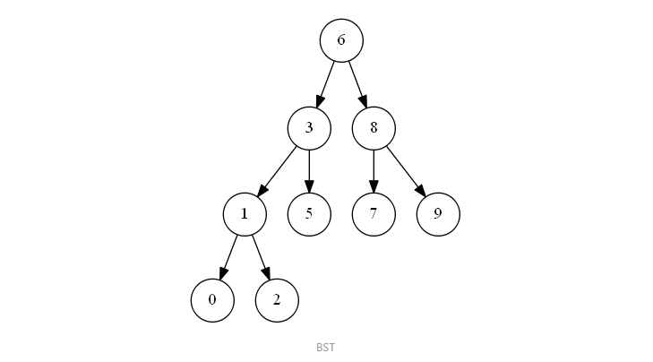
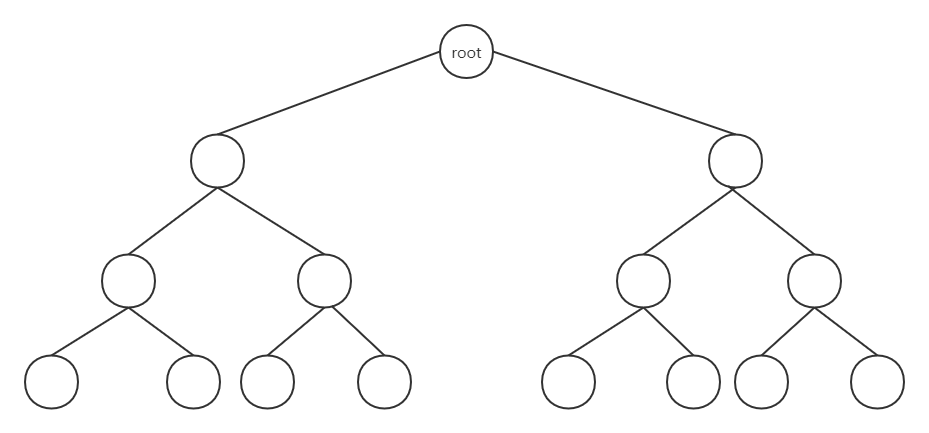
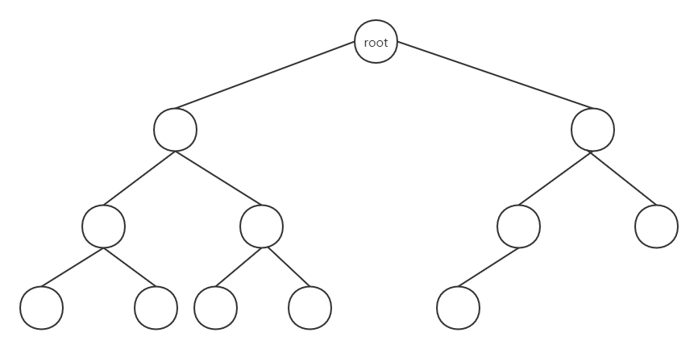
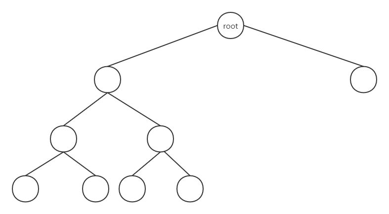
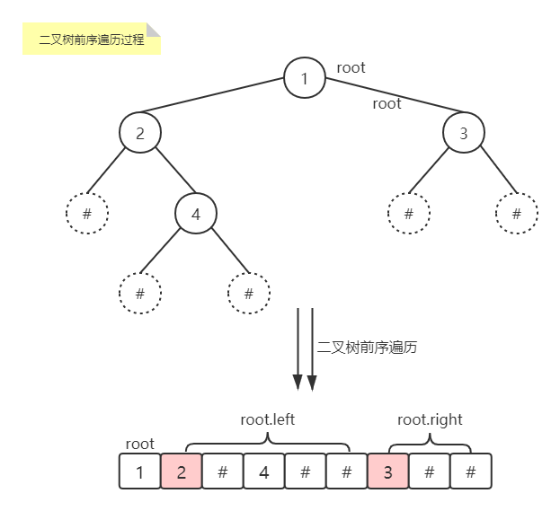
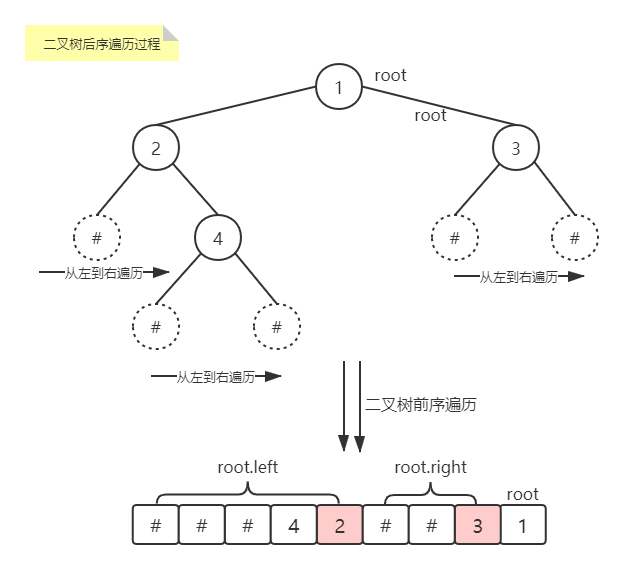
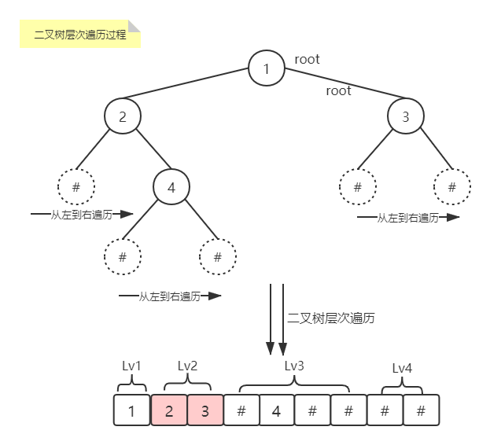
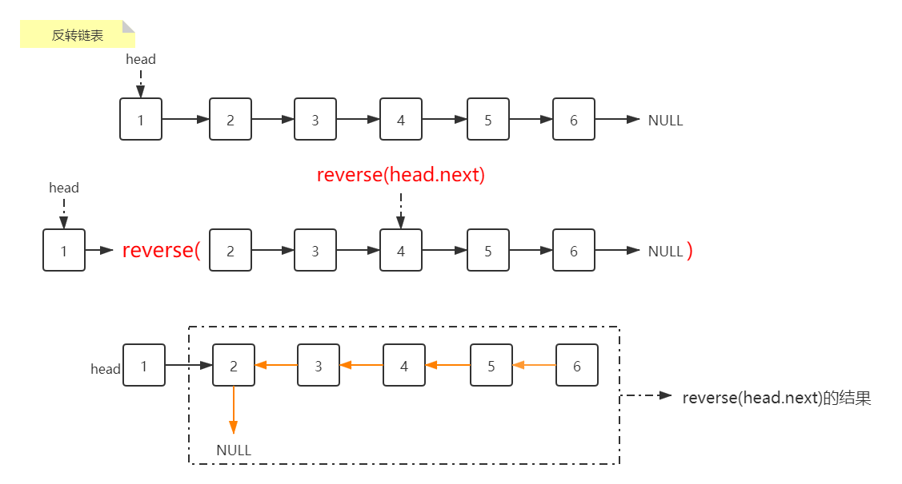
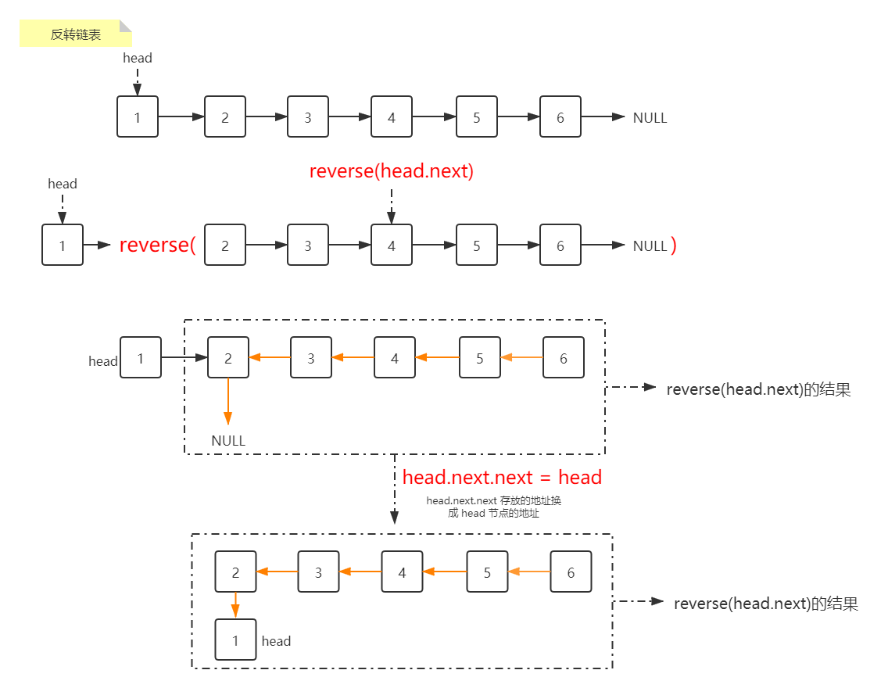
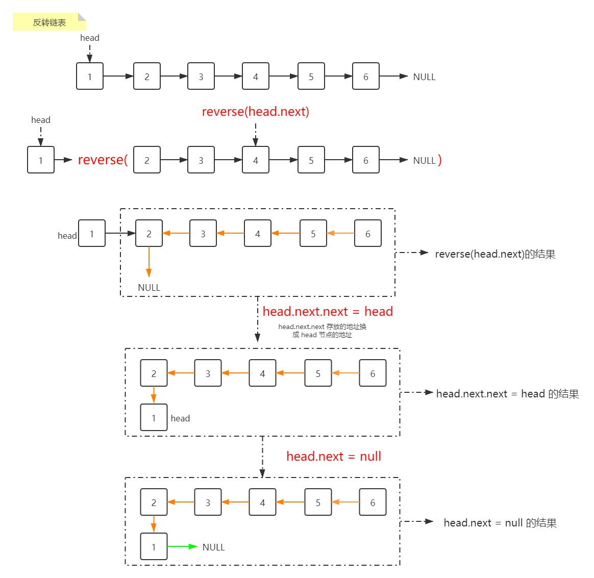

@[TOC](目录)

# 2020.12.14记录

## LRU 缓存淘汰算法

Java 中的内置类型 LinkedHashMap 可以直接实现。LinkedHashMap 继承于HashMap，HashMap 是无序的，当我们希望有顺序地去存储 key-value 时，就需要使用 LinkedHashMap 了。**借助链表的有序性使得链表元素维持插入顺序，同时借助哈希映射的快速访问能力使得我们可以以O(1)的时间复杂度访问链表的任意元素。**

### 概念&原理

LRU(Least Recently Used) 淘汰算法：最近使用过的数据是有用的，很久没有使用过的数据是没用的。比如手机中的后台运行。

LinkedHashMap(哈希链表) 底层原理是用 HashMap + DoubleList(双向链表) 实现的。其中 HashMap 中存放的 key 是双向链表中的key，val 存放的是双向链表的节点 Node ，虽然在 HashMap 中键值对的排序是无序的，但是在双向链表中是有序的，通过 HashMap 将键(key)进行映射，get方法返回的是双向链表中的键值对，即是排序好的。

**链表：** 

+ 一种物理存储单元上非连续、非顺序的存储结构，数据元素的逻辑顺序是通过链表中的指针连接次序实现的。
+ 每一个链表包括多个节点，节点包括两个部分，一个是数据域（存储节点含有的信息），一个是引用域（存储下一个节点或上一个节点的地址信息）。

**链表特点：**

+ 获取数据麻烦，需要遍历，比数组慢；
+ 方便插入和删除。

**链表实现原理：**

+ 创建一个节点类，包括两个部分。一个是数据域，一个引用域；
+ 创建链表类，包含三个属性：头结点、尾节点和大小；方法包含添加、删除和插入等等方法。

### 注意事项

**1. 为什么要用双向链表？**

因为在添加和删除节点的操作中不仅需要得到该节点本身的指针，也需要操作其前驱节点的指针，只有双向链表可以直接支持查找前驱，保证操作的时间复杂度为O(1)。

**2. 为什么 HashMap 中存有 key 还要在 Node 中存 key 和 val ？**

当缓存容量已满的时候，不仅要删除最后一个 Node 节点，还要把 HashMap 中映射到该节点的 key 同时删除，而这个 key 只能由 Node 获得，因此只存储 val 的话就无法知道对应的 key 是什么，就无法删除 map 中的 key，造成错误。

最后应提供 get() 和 put() 方法来获取和添加所需的键值对。其中 put 方法的逻辑如下：

```flow
st=>start: 开始
op1=>operation: put(key, val)
cond1=>condition: key是否存在?
op2=>operation: 修改key对应的val并将key提升为最近使用
op3=>operation: 需要新插入key
cond2=>condition: 容量是否已满、
op4=>operation: 淘汰最久未使用的key
op5=>operation: 插入key和val为最近使用的数据
e=>end: 结束

st->op1->cond1
cond1(yes)->op2
cond1(no)->op3->cond2
cond2(yes)->op4->op5->e
cond2(no)->op5

```

-----

# 2020.12.17记录

## LFU淘汰算法的实现

### 需求分析

1. 调用 **get(key)** 方法时，要返回 key 对应的 val
2. 只要用 get 或者 put 方法访问一次某个 key 时，该 key 的 freq 要加 1
3. 如果在容量满了的时候插入，则需要将 freq 最小的 key 删除，如果最小的 freq 对应多个 key，则要删除其中最旧的那个key

### 思路分析

1. 使用一个 HashMap 存储 key 和 val 的映射，就可以完成快速计算 get(key)

```java
HashMap<Integer, integer> keyToVal;
```

2. 使用一个 HashMap 存储 key 到 freq 映射，就可以快速操作 key 对应的 freq

```java
HashMap<Integer, integer> keyToFreq;
```

3. 需要 freq 到 key 的映射
   + 将 freq 最小的 key 删除，这就需要快速得到当前所有 key 最小的 freq 是多少。要求时间复杂度为 O(1) 的话，肯定不能用遍历的方法，所以就用一个变量 minFreq 来记录当前最小的 freq。
   + 在实际中，一个频率 freq 可能对应多个 key，所以 **freq 与 key 是一对多的关系**，即一个 freq 对应一个 key 的列表。
   + 再者，频率 freq 对应 key 的列表应该是有时序的，存放 key 的列表中 key 的排列顺序应当是按照存放时间先后进行放置的，这样我们删除最旧的 key 时，只需要找到存放 key 的列表中的头元素就好。
   + 希望能快速删除 key 列表中的任何一个 key，因为如果频次为 freq 的某个 key 被访问，则它的频次就从 freq 变成  freq +1，就应该从 freq 对应的 key 的列表中将 key 删除，加到 freq +1 对应的 key 的列表中。

```java
HashMap<Integer, LinkedHashSet<Integer>> freqToKeys;
```

因为普通的 LinkedList 不能快速的访问链表中的某一个节点，所以就无法快速删除 freq 对应 key 列表中的任意一个key。而 LinkedHashSet 是链表和哈希集合的结合，同时兼顾了链表不能快速访问链表节点，但是插入元素具有时序；哈希集合中元素无序，但是可以快速访问的特点。所以它俩结合的 LinkedHashSet 既可以在 O(1) 时间内访问或删除其中的元素，又可以保持插入顺序。

### 代码框架

1. 初始化三个列表：keyToVal、keyToFreq、freqToKeys，并设置 minFreq 和 容量 cap；
2. 创建 get() 方法，快速获取 key 对应的 val， 并使得该 key 对应的 freq +1；
   + 先判断 keyToVal 表中是否含有 key，没有返回 -1，有就返回对应的值
3. 创建 put() 方法， put()方法的逻辑如下：

```flow
st=>start: 开始
op1=>operation: put(key, val)
cond1=>condition: key是否存在?
op2=>operation: 修改key对应的val并将其对应的freq加1
op3=>operation: 需要新插入key
cond2=>condition: 容量是否已满、
op4=>operation: 淘汰freq最小的key，若minFreq
对应多个key，删除最旧的key
op5=>operation: 插入key和val并设置其freq为1
e=>end: 结束

st->op1->cond1
cond1(yes)->op2
cond1(no)->op3->cond2
cond2(yes)->op4->op5->e
cond2(no)->op5
```

### 核心逻辑

1. 编写移除最小 freq 对应 key 的函数：removeMinFreqKey()
   + 先找到 minFreq 对应的 key 的列表，淘汰最旧的 key
   + 更新 FK 和 KV 和 KF 列表

2. 编写增加 freq 的函数：increaseFreq()
   + 找到当前 key 对应的 freq
   + 更新 KF 表，将 key 对应的 freq 加 1 
   + 更新 KF 表，将原 key 从原 freq 对应的 key 的列表中删除；再添加至 freq + 1 对应的 key 的列表中
   + 判断如果被移除的 freq 对应的 key 的列表空了，则删除 freq 和其对应的 key 列表；在此基础上，如果 freq == minFreq，则使得 minFreq++

### 注：

1. put 与 putIfAbsent 的区别：
   + put在放入数据时，如果放入数据的key已经存在与Map中，最后放入的数据会覆盖之前存在的数据；
   + putIfAbsent在放入数据时，如果存在重复的key，那么putIfAbsent不会放入值。

2. HashMap 中 remove 方法：用于删除 HashMap 中指定键 key 对应的键值对 (key-value)
3. LinkedHashSet中先放入的元素会放在第一位，可用迭代器进行迭代。iterator().next() 返回迭代器经过的值 val。

---

## 二叉树算法

### 设计总路线：明确一个节点要做的事，剩下的事情抛给递归框架

```java
void traverse(TreeNode root) {
    // root 需要做什么
    ***
    // 其他的不用 root 操心，抛给递归
    traverse(root.left);
    traverse(root.right);
}
```

比如：让二叉树中各节点 val 加 1，判断两个二叉树是否相等

### 二叉搜索树(Binary Search Tree, BST)

**定义：**一个二叉树中，任意根节点的值要大于等于左子树所有节点的值，且要小于等于右子树的所有节点的值。



### 判断一个二叉搜索树是否合法

#### 思想：

把一棵二叉树分成三个部分，左子树、右子树以及对应的根节点。代码中包含约束，找出树中最小节点和最大节点，左边子树中始终满足约束：

+ 最小节点的值<左孩子节点的值＜子树对应根节点的值

右边子树中始终满足约束：

+ 子树对应根节点的值<左孩子节点的值<最大节点的值

---

## 在BST(二叉搜索树)中查找一个数是否存在

这个问题中如果直接套用根节点判断

```java
if (root.val == target) return true;

return isInBST(root.left, target)
    || isInBST(root.right, target);
```

这样没有考虑到 BST 这个“左小右大”的特性，所以算法可以改进，针对 BST，有以下框架：

```java
void BST(TreeNode root, int target) {
    if (root.val == target) 
        // 找到目标，做点什么
    if (root.val < target)
        return BST(root.right. target);
    if (root.val > target)
        return BST(root.left, target);
}
```

## 在 BST 中插入一个数

对数据结合的操作无非就是**遍历 + 访问**。

+ 遍历就是”找“。
+ 访问就是”改“。

具体到插入一个数，就是先找到插入位置，然后进行插入操作。

上述总结的框架就是”找“的问题，在这个框架上加入”改“的操作即可。**一旦涉及”改“，函数就要返回 `TreeNode`类型，并且对递归调用的返回值进行接收。定义 insertIntoBST() 函数

```java
// 分两种情况进行递归调用
// ① root 的 val 小，则新的 val 应插入到右子树中
if (root.val < val)
	root.right = insertIntoBST(root.right, val);
// ② root 的 val da，则新的 val 应插入到左子树中
if (root.val > val)
    root.left =  insertIntoBST(root.left, val);
return root;
```

----

## 在BST中删除一个数

和插入操作类似，先“找”再“改”，先写出这个框架：

```java
public TreeNode deleteNode(TreeNode root, int target) {
    // 如果找到了一个节点的值 = target，做点什么
    if (root.val == target) {
        // 找到啦，进行删除
    } else if (root.val > target) {
        // 去左子树中找 = target 的节点
        root.left = deleteNode(root.left, target);
    } else if (root.val < target) {
        // 去右子树中找 = target的节点
        root.right = deleteNode(root.right, target);
    }
    return root;
}
```

删除的操作比较复杂一点，考虑三种情况：

1. 假设要删除的节点就是 A 节点，此时 A 节点恰好是末端节点，即它的两个子节点为空，这时候可以直接把这个节点删除。

```java
if (root.val == target) {
    if (root.left == null && root.right == null) return null;
} 
```

2. 假设 A 节点只有一个孩子节点，有

```java
if (root.val == target) {
    if (root.left == null) return root.right;
    if (root.right == null) return root.left;
} 
```

3. 最麻烦的情况是，A 节点有两个孩子节点，此时 A 必须找到自身节点下左子树最大的节点或者右子树最小的节点。注意：如果 A 左子树就剩一个节点，右子树还剩 N 个节点，应去找右子树最小节点。

```java
if (root.val == target) {
	// 定义minTreeNode minNode
    TreeNode minNode = getMin(root.right);
    root.val = minNode.val;
    // 删除 minNode 这个节点
    root.right = deleteNode(root.right, minNode.val);
} 
```

4. 最后套框架，分别递归当 root.val > target 和 root.val < target 的情况，最后返回 root。

---

## 二叉树的节点计算

首先计算普通二叉树的节点，其框架为：

```java
public class NodesOfBinaryTree {
    // ①输入普通二叉树的情况
    public int countNormalBinaryTree(TreeNode root) {
        // 如果根节点为null，返回0
        if (null == root) return 0;
        // 剩下的交给递归完成
        return 1 + countNormalBinaryTree(root.left) + countNormalBinaryTree(root.right);
    }
```

### 满二叉树(Perfect Binary Tree)



是一种特殊的完全二叉树，每层都是满的，像是一个稳定的三角形。节点计算框架为：

```java
// ②如果是一颗满二叉树，节点的总数就和树的高度呈指数关系
public int countPerfectTree(TreeNode root) {
    // 初始化高度为 0
    int h = 0;
    // 计算树的高度
    while(root != null) {
        root = root.left;
        h++;
    }
    // 满二叉树的总的节点数就是 2^h -1
    return (int)Math.pow(2, h) - 1; // 求2的h次方，然后强制转换成int类型 - 1
}
```

完全二叉树的时间复杂度应该是 ==O(logNlogN)==

### 完全二叉树(Complete Binary Tree)

如果对满二叉树的结点进行编号, 约定编号从根结点起, 自上而下, 自左而右。则深度为k的, 有n个结点的二叉树, 当且仅当其每一个结点都与深度为k的满二叉树中编号从1至n的结点一一对应时, 称之为完全二叉树。



每一层都是紧凑靠左进行排列的，并且==完全二叉树的深度 = 满二叉树的深度！==其节点个数框架为：

```java
// ③如果是完全二叉树，它比普通二叉树特殊，但没有满二叉树那么特殊，所以计算它的节点是普通二叉树和完全二叉树的结合版
public int countCompleteTree(TreeNode root) {
    TreeNode l = root, r = root;
    // 记录左、右子树的高度
    int hl = 0, hr = 0;
    while (l != null) {
        l = l.left;
        hl++;
    }
    while (r != null) {
        r = r.right;
        hr++;
    }
    // 如果左右子树的高度相同，说明是一棵满二叉树
    if (hl == hr) {
        return (int)Math.pow(2, hl) - 1;
    }
    //　否则按照普通二叉树来进行计算
    return 1 + countCompleteTree(root.left) + countCompleteTree(root.right);
}
```

### Full Binary Tree



### 复杂度分析

```java
return 1 + countCompleteTree(root.left) + countCompleteTree(root.right);
```

参考完全二叉树求节点个数的代码可以发现，虽然最后是按照普通二叉树的节点个数进行计算的，但是由于完全二叉树的性质：

+ 完全二叉树的深度 = 满二叉树的深度
+ 一颗完全二叉树，其两颗子树中至少有一颗是满二叉树

所以这两个递归，只有一个会真的递归下去，另一个一定会触发 **hl == hr** 而立即返回，不会再从最底部往上回归。

综上：算法的递归深度是树的深度 O(logN)，每次递归所花费的时间就是 while 循环，需要 O(logN)，所以总体的时间复杂度为 O(logNlogN)。所以说，“完全二叉树”还是有它存在的道理的，不仅适用于数组实现二叉堆，而且连计算节点总数这种看起来简单的操作都有高效的算法实现。

---

# 2020.12.25 & 26记录

## 序列化和反序列化二叉树

### 序列化和反序列化的意义

JSON 的运用非常广泛，比如我们经常将编程语言中的结构体序列化成 JSON 字符串，然后存入缓存或者通过网络发送给远端服务，消费者接收 JSON 字符串然后进行反序列化，就可以得到原始数据了。所以其目的是：

==以某种固定格式组织字符串，使得数据可以独立于编程语言。==

二叉树的序列化方法：serialize()，可以把一颗二叉树序列化为字符串

二叉树的反序列化方法：deserialize()，可以把字符串反序列化为二叉树

至于以什么格式序列化和反序列化，这个由自己决定。

==所谓序列化其实就是把结构化的数据”打平“，就是在考察二叉树的遍历方式==

### 前序遍历

**Example：**现有一颗二叉树，如下



相应的，代码框架为：

```java
private String serialize(TreeNode root) {
    if (root == null) {
        // 填充分隔符
        return;
    }
    
    // 前序遍历代码
    
    serialize(root.left, sb);
    serialize(root.right, sb);
}
```

对应完整程序为：

```java
// 二叉树前序遍历
// 代表分隔符的字符
String SEP = ",";
// 代表 null 指针的字符
String NULL = "#";

/*主函数：将二叉树序列化为字符串*/
private String serialize(TreeNode root) {
    StringBuilder sb = new StringBuilder();
    serialize(root, sb);
    return sb.toString();
}

/*辅助函数：将二叉树存入StringBuilder*/
private void serialize(TreeNode root, StringBuilder sb) {
    if (root == null) {
        sb.append(NULL).append(SEP);
        return;
    }

    // 进行前序遍历
    sb.append(root.val).append(SEP);

    serialize(root.left, sb);
    serialize(root.right, sb);
}
```

# 2020.12.27记录

### 反序列化(前序遍历)

单单前序遍历的结果是不能还原二叉树的，因为缺少空指针的信息。所以至少需要前、中、后序遍历的两种才能还原二叉树。但是这里的 node 列表包含空指针的信息，所以只使用 node 列表就可以还原二叉树。之前分析，这里的 node 列表就是一棵”打平“的二叉树。

那么，反序列化的过程也是一样的：==先确定根节点 Root，然后遵循前序遍历的规则，递归生成左右子树==

1. 先将字符串类型的节点转化为一个 List 数组，数组中只有相应的节点信息，供反序列化使用：

```java
/* 主函数：将字符串反序列化为二叉树结构 */
private TreeNode deserialize(String data) {
    // 将字符串转换成列表
    LinkedList<String> nodes = new LinkedList<>();
    for (String s : data.split(SEP)) {
        nodes.addLast(s); // 用于将对象链接到List的末尾
    }
    return deserialize(nodes); // 这里是真正实现反序列化生成二叉树的代码
}
```

2. 将列表中的节点信息反序列化为二叉树

```java
/* 辅助函数：通过 nodes 列表来构造二叉树*/
private TreeNode deserialize(LinkedList<String> nodes) {
    if (nodes.isEmpty()) return null;

    /* 前序遍历 */
    // nodes列表的最左侧就是根节点
    String first = nodes.removeFirst();
    if (first.equals(null)) return null;

    // Integer.parseInt(String)的作用就是将String字符类型数据转换为Integer整型数据。
    TreeNode root = new TreeNode(Integer.parseInt(first));
    /* 分隔线 */

    // 其余节点交给递归
    root.left = deserialize(nodes);
    root.right = deserialize(nodes);

    return root;
}
```

# 2020.12.28记录

### 后序遍历



后序遍历的框架为：

```java
/* 二叉树后续遍历 */
/*主函数：将二叉树序列化为字符串*/
private String postorderSerialize(TreeNode root) {
    StringBuilder sb = new StringBuilder();
    postorderSerialize(root, sb);
    return sb.toString();
}

/* 副函数：将二叉树序列化为字符串 */
private void postorderSerialize(TreeNode root, StringBuilder sb) {
    if (root == null) {
        sb.append(NULL).append(SEP);
        return;
    }

    // 后序遍历是先递归再进行转化为字符串
    postorderSerialize(root.left, sb);
    postorderSerialize(root.right, sb);

    sb.append(root.val).append(SEP);
}
```

### 反序列化(后序遍历)

**思路：**deserialize() 方法首先寻找 root 节点的值，然后递归计算左右子节点。

由上图可见，root 的值时列表最后一个元素。我们应该从后往前取出列表元素，先用最后一个元素构造 root，然后递归调用生成 root 的左右子树。

注意：根据上图，从后往前在 nodes 列表中取元素，==一定要先构造 root.right 子树，后构造 root.left 子树。==

### 中序遍历

中序遍历只要把字符串的拼接操作放在中序遍历的位置就可以了：

```java
/* 二叉树的中序遍历 */
/* 主函数:将二叉树转换成字符串 */
private String inorderSerialize(TreeNode root) {
    StringBuilder sb = new StringBuilder();
    inorderSerialize(root, sb);
    return sb.toString();
}

/* 副函数：将二叉树序列化为字符串 */
private void inorderSerialize(TreeNode root, StringBuilder sb) {
    if (root == null) {
        sb.append(NULL).append(SEP);
        return;
    }

    inorderSerialize(root.left, sb);

    /* 中序遍历的位置 */
    sb.append(root.val).append(SEP);

    inorderSerialize(root.right, sb);
}
```

使用中序遍历==不能==实现反序列化的过程。因为要实现反序列方法，首先要构造 root 节点的位置，前序和后续遍历 root 节点分别在列表的首位和末位，而中序遍历的结果 root 节点在列表的中间，不知道其索引位置，所以我i发找到 root 节点。

### 层次遍历解法



# 2020.12.29记录

### 二叉树的层序遍历

其框架如下：

```java
/* 二叉树的层序遍历 */
/* 将二叉树序列化为字符串 */
private String levelSerialize(TreeNode root) {
    if (root == null) return "";
    StringBuilder sb = new StringBuilder();
    // 初始化队列，将 root 加入队列
    Queue<TreeNode> q = new LinkedList<>();
    q.offer(root);

    while (!q.isEmpty()) {
        TreeNode cur = q.poll(); // 取出并返回队列中的第一个元素

        /* 层级遍历的代码位置 */
        if (cur == null) {
            sb.append(NULL).append(SEP);
            continue;
        }
        sb.append(cur.val).append(SEP);
        /* 层级遍历的代码位置 */

        q.offer(cur.left);
        q.offer(cur.right);
    }

    return sb.toString();
}
```

其中：

offer

添加一个元素并返回true
如果队列已满，则返回false。

poll

将首个元素从队列中弹出（ 移除并返回队列头部的元素 ）（从队列中删除第一个元素）
如果队列是空的，就返回null。

### 反序列化(层序遍历)

由上图可以看到，每一个非空节点都会对应两个子节点，==那么反序列化的思路就是用队列进行层级遍历，同时用索引 **i ** 记录对应子节点的位置。==

```java
/* 反序列化(层序遍历) */
/* 主函数：将字符串反序列化为二叉树 */
private TreeNode deLevelSerialize(String data) {
    if (data.isEmpty()) return null;
    String[] nodes = data.split(SEP);
    // 第一个元素就是 root 的值
    TreeNode root = new TreeNode(Integer.parseInt(nodes[0]));

    // 队列 q 记录父节点，将 root 加入队列
    Queue<TreeNode> q = new LinkedList<>();
    q.offer(root);

    for (int i = 0; i < nodes.length; ) {
        // 队列存的都是父节点
        TreeNode parent = q.poll();
        // 父节点对应左侧节点的值
        String left = nodes[i++];
        if (!left.equals(NULL)) {
            parent.left = new TreeNode(Integer.parseInt(left));
            q.offer(parent.left);
        } else {
            parent.left = null;
        }
        // 父节点对应右侧子节点的值
        String right = nodes[i++];
        if (!right.equals(NULL)) {
            parent.right = new TreeNode(Integer.parseInt(right));
            q.offer(parent.right);
        } else {
            parent.right = null;
        }
    }
    return root;
}
```

## Git原理之二叉树最近公共祖先

使用 Git 的时候，比如

```java
git pull
```

它默认使用的是 `merge` 方式将远端别人的修改拉到本地；如果带上参数：

```java
git pull -r
```

就会使用 `rebase` 的方式将远端修改拉到本地。

`merge` 和 `rebase` 的区别：

+ `merge` 方式合并的分支会有很多“分叉”。
+ `rebase` 方式合并的就是一条直线。

对于多人合作的，`merge` 的方式并不好，一般来说，实际工作中更推荐使用 `rebase` 方式合并代码。

# 2020.12.30记录

### Git 寻找最近公共祖先的思路

首先，找到这两条的最近公共祖先 LCA，然后从 master 节点开始，重演 LCA 到 dev 几个 commit 的修改，如果这些修改和 LCA 到 master 的 commit 有冲突，就会提示你手动解决冲突，最后的结果就是把 dev 的分支完全接到 master 上。

涉及到二叉树肯定涉及到递归的问题，先列出所有二叉树问题的框架：

```java
void traverse(TreeNode root, variable, ...) {
    /* 前序遍历的位置 */
    ...
    /* 前序遍历的位置 */
    
    traverse(root.left, variable, ...);
    
    /* 中序遍历的位置 */
    ...
    /* 中序遍历的位置 */
        
    traverse(root.right, variable, ...)
        
    /* 后序遍历的位置 */
    ...
    /* 后序遍历的位置 */
}
```

所以，只要看到二叉树求其公共祖先的的问题，分析框架中要填的内容，先确定变量。

```java
TreeNode lowestCommonAcestor(TreeNode root, TreeNode p, TreeNode q) {
    TreeNode left = lowestCommonAcestor(root.left, p, q);
    TreeNode right = lowestCommonAcestor(root.right, p, q);
}
```

**面对递归问题的灵魂三问：**

+ **这个函数是干什么的？**

也就是说 `lowestCommonAcestor()` 函数的定义：在函数中输入三个参数 root、p、q，它会返回一个节点。

**情况①：**

如果 p 和 q 都在以 root 为根的数中，函数的返沪即是 p 和 q 的公共祖先节点。

**情况②：**

如果 p 和 q 都不在以 root 为根的数中，那肯定没有它们的公共节点，返回 null。

**情况③：**

如果 p 和 q 只有一个存在于以 root 为根的树中，函数会返回那个节点。

题目说了输入的 p 和 q 一定存在于以 root 为根的树中，但是递归过程中，以上三种情况都有可能发生。这是 `lowestCommonAcestor()`函数的定义，无论发生什么，都不要怀疑这个定义的正确性。

+ **在这个函数的参数中，变量是什么？**

函数参数中的变量是 `root`，因为根据框架， `lowestCommonAcestor(root)`会递归调用 `root.left` 和`root.right`；至于 p 和 q，我们要求他们的公共祖先，他俩肯定是不会变化的。

以`root`为根会逐步转化为以`root.子节点`为根，即逐步缩小问题规模。

+ **得到函数递归的结果，你该干什么，即做什么选择？**

==如果 `left` 和 `right` 不为 null， 说明他们分别是 p 和 q。==

最后得到补充框架后的结果为：

```java
public class LowestCommonAncestor {

    private TreeNode lowestCommonAncestor(TreeNode root, TreeNode p, TreeNode q) {
        // 基本情况
        if (root == null) return null;
        if (root == p || root == q) return root;

        TreeNode left = lowestCommonAncestor(root.left, p, q);
        TreeNode right = lowestCommonAncestor(root.right, p, q);

        // 相当于二叉树的后序遍历
        // 情况1
        if (left != null && right != null) {
            return root;
        }
        // 情况2
        if (left == null && right == null) {
            return null;
        }
        // 情况3
        return left == null ? right : left;
    }
}
```

对于情况①，为什么 `left` 和 `right` 非空，就可以说明 `root` 是他们的最近公共祖先？

因为这里是二叉树后序遍历的过程！！！后序遍历是从下往上，好比从 p 和 q 出发往上走，第一次相交的节点就是这个 `root` 。

# 2021.1.8记录

## Java 中数组与 LinkedList(链表)的相互转换

### 数组转 LinkedList

```java
LinkedList linklist = new LinkedList(Arrays.asList(array));
```

数组转链表是调用了 Array.asList() 方法

```java
static List asList(T ... a) // 返回由指定数组支持的固定大小的链表
```

### LinkedList 转数组

```java
// 方法1
String[] array1 = (String[]) linklist.toArray(new String[0]);
// 此时以正确的顺序(从第一个到最后一个元素)返回一个包含此链表中所有元素的数组

// 方法2
String[] array2 = new String[linklist.size()];
linklist.toArray(array2);
// 以正确的顺组返回一个包含此链表中所有元素的数组，返回的数组的运行时类型是指定数组的运行时类型
```

## 特殊数据结构-单调栈，解决一类寻找 Next Greater Element 的问题

**定义：** 单调栈实际就是栈，使得每次新元素入栈后，栈内的元素都保持单调(单调递增或单调递减)。框架为：

```java
/*
 * 找到下一个更大的元素I
 * 比如输入一个数组 nums = [2, 1, 2, 4, 3]，算法返回 [4, 2, 4, -1, -1]
 * 暴力破解方法：对每个元素后面进行扫描，找到第一个更大的元素就行了。暴力破解的时间复杂度：O(n^2)
 * 算法时间复杂度为：O(n)
 * 从整体上看：因为总共有 n 个元素，每个元素都被 push 入栈了一次，最多也会被 pop 一次，没有任何冗余操作。所以总的计算规模是和元素规模 n 成正比的。
 */
public class MonotonicStack {
    private Vector<Integer> nextGreaterElement(Vector<Integer> nums) {
        int size = nums.size();
        Vector<Integer> ans = new Vector<>(5); // 存放答案的数组
        ans.setSize(size);
        Stack<Integer> s = new Stack<>();
        for (int i = nums.size() - 1; i >= 0; i--) {
            // 倒着往栈里放
            while (!s.isEmpty() && s.peek() <= nums.get(i)) { // 判断个子高矮
                s.pop(); // 矮个子出列，反正也被挡住了
            }
            // 这个元素的身后的第一个高个
            ans.set(i, s.empty() ? -1 : s.peek());
            s.push(nums.get(i)); // 进队，接受之后的身高判断
        }
        return ans;
    }
```

# 2021.1.9记录

## 数据结构的存储方式

数据结构的存储方式只有两种：数组(顺序存储)、链表(链式存储)

我们分析问题，一定要有==递归的思想，自顶向下，从抽象到具体。==散列表、栈、队列、堆、树、图等都属于「上层建筑」，而数组和链表才是「结构基础」。因为那些多样化的数据结构，究其源头，都是在链表或者数组上的特殊操作，API 不同而已。

+ 「队列」、「栈」均可以由链表和数组实现。

  数组实现需要处理扩容缩容问题；

  链表实现没有这个问题，但是需要更多的内存空间存储节点指针

+ 「图」的两种表示方法，邻接表就是链表，邻接矩阵就是二维数组。

  邻接矩阵判断连通性迅速，并可以进行矩阵运算解决一些问题，但是如果图比较稀疏就会很耗费空间；

  邻接表比较节省空间，但是很多操作的效率上肯定比不过邻接矩阵。

+ 「散列表」通过散列函数把键映射到一个大数组里。

  对于解决散列冲突的方法，拉链法需要链表特性，操作简单，但需要额外的空间存储指针；

  线性探查法就需要数组特性，以便连续寻址，不需要指针的存储空间，但操作稍微复杂些。

+ 「树」用数组实现就是「堆」，因为「堆」是一个完全二叉树，用数组存储不需要节点指针，操作也比较简单；

  用链表实现就是很常见的那种「树」，因为不一定是完全二叉树，所以不适合用数组存储。为此，在这种链表「树」结构之上，又衍生出各种巧妙的设计，比如二叉搜索树、AVL 树、红黑树、区间树、B 树等等，以应对不同的问题。

==**数据结构种类很多，但它们存在的目的都是在不同的应用场景，尽可能高效地增删查改**。==

## 如何遍历 + 访问？

各种数据结构的遍历 + 访问无非两种形式：线性的和非线性的。

### 数组遍历框架，典型的线性迭代结构：

数组遍历框架，典型的线性迭代结构：

```java 
void traverse(int[] arr) {
    for (int i = 0; i < arr.length; i++) {
        // 迭代访问 arr[i]
    }
}
```

链表遍历框架，兼具迭代和递归结构：

```java
/* 基本的单链表节点 */
class ListNode {
    int val;
    ListNode next;
}

void traverse(ListNode head) {
    for (ListNode p = head; p != null; p.next) {
        // 迭代访问 p.val
    }
}

void traverse(ListNode head) {
    // 迭代访问 head.val
    traverse(head.next);
}
```

二叉树遍历框架，典型的非线性递归遍历结构：

```java
/* 基本的二叉树节点 */
class TreeNode {
    int val;
    TreeNode left, right;
}

void traverse(TreeNode root) {
    traverse(root.left);
    traverse(root.right);
}
```

二叉树框架可以扩展为 N 叉树的遍历框架：

```java
/* 基本的 N 叉树节点 */
class TreeNode {
    int val;
    TreeNode[] children;
}

void traverse(TreeNode root) {
    for (TreeNode child : root.children)
        traverse(child);
}
```

# 2021.1.10记录

## 92-反转链表II

### 递归反转整个链表

首先整个代码为：

```java
ListNode reverse(ListNode head) {
    if (head == null || head.next == null) return head;
    ListNode last = reverse(head.next);
    head.next.next = head;
    head.next = null;
    return last;
}
```

**对于递归算法，最重要的就是明确递归函数的定义**。具体来说，我们的 `reverse` 函数定义是这样的：

**输入一个节点** **`head`**，将「以 **`head`** **为起点」的链表反转，并返回反转之后的头结点**。


那么输入 `reverse(head)` 后，会在这里进行递归：

```java
ListNode last = reverse(head.next);
```


递归的结果如下：



将第二个节点指向第一个 head 节点

```java
head.next.next = head;
```

执行结果如下



当链表递归反转之后，新的头结点是 `last`，而之前的 `head` 变成了最后一个节点，别忘了链表的末尾要指向 null：

```java
head.next = null;
return last;
```



# 2021.1.11记录