@[TOC](目录)

# 2020.12.14记录

## LRU 缓存淘汰算法(leetcode[146])

Java 中的内置类型 LinkedHashMap 可以直接实现。LinkedHashMap 继承于HashMap，HashMap 是无序的，当我们希望有顺序地去存储 key-value 时，就需要使用 LinkedHashMap 了。**借助链表的有序性使得链表元素维持插入顺序，同时借助哈希映射的快速访问能力使得我们可以以O(1)的时间复杂度访问链表的任意元素。**

### 概念&原理

LRU(Least Recently Used) 淘汰算法：最近使用过的数据是有用的，很久没有使用过的数据是没用的。比如手机中的后台运行。

LinkedHashMap(哈希链表) 底层原理是用 HashMap + DoubleList(双向链表) 实现的。其中 HashMap 中存放的 key 是双向链表中的key，val 存放的是双向链表的节点 Node ，虽然在 HashMap 中键值对的排序是无序的，但是在双向链表中是有序的，通过 HashMap 将键(key)进行映射，get方法返回的是双向链表中的键值对，即是排序好的。

**链表：** 

+ 一种物理存储单元上非连续、非顺序的存储结构，数据元素的逻辑顺序是通过链表中的指针连接次序实现的。
+ 每一个链表包括多个节点，节点包括两个部分，一个是数据域（存储节点含有的信息），一个是引用域（存储下一个节点或上一个节点的地址信息）。

**链表特点：**

+ 获取数据麻烦，需要遍历，比数组慢；
+ 方便插入和删除。

**链表实现原理：**

+ 创建一个节点类，包括两个部分。一个是数据域，一个引用域；
+ 创建链表类，包含三个属性：头结点、尾节点和大小；方法包含添加、删除和插入等等方法。

### 注意事项

**1. 为什么要用双向链表？**

因为在添加和删除节点的操作中不仅需要得到该节点本身的指针，也需要操作其前驱节点的指针，只有双向链表可以直接支持查找前驱，保证操作的时间复杂度为O(1)。

**2. 为什么 HashMap 中存有 key 还要在 Node 中存 key 和 val ？**

当缓存容量已满的时候，不仅要删除最后一个 Node 节点，还要把 HashMap 中映射到该节点的 key 同时删除，而这个 key 只能由 Node 获得，因此只存储 val 的话就无法知道对应的 key 是什么，就无法删除 map 中的 key，造成错误。

最后应提供 get() 和 put() 方法来获取和添加所需的键值对。其中 put 方法的逻辑如下：

```flow
st=>start: 开始
op1=>operation: put(key, val)
cond1=>condition: key是否存在?
op2=>operation: 修改key对应的val并将key提升为最近使用
op3=>operation: 需要新插入key
cond2=>condition: 容量是否已满、
op4=>operation: 淘汰最久未使用的key
op5=>operation: 插入key和val为最近使用的数据
e=>end: 结束

st->op1->cond1
cond1(yes)->op2
cond1(no)->op3->cond2
cond2(yes)->op4->op5->e
cond2(no)->op5

```

### 代码实现：

```java
int cap;
// 选用 LinkedHashMap 可以保证快速地添加和删除节点，时间复杂度为 O(1)
// 并且能够保证快速访问节点，因为 LinkedHashMap 底层是 HashMap + 双向链表
// HashMap 映射保证可以快速访问节点，双向链表保证了快速增加删除节点
LinkedHashMap<Integer, Integer> cache = new LinkedHashMap<>();
public LRUCache(int capacity) {

    this.cap = capacity;
}

// 快速返回 key 对应的节点
public int get(int key) {

    if (!cache.containsKey(key)) {
        return -1;
    }

    // 让被 get 的 key 变成最新的
    makeRencently(key);
    return cache.get(key);
}

public void put(int key, int value) {

    // ①如果存在 key，直接修改 key 对应的 value 值
    if (cache.containsKey(key)) {
        // 修改值
        cache.put(key, value);
        // 将 key 变成最近使用
        makeRencently(key);
        return;
    }

    // 如果此时 cache 容量已经满了，找到最久未使用的 key 删除
    if (cache.size() >= this.cap) {
        // 链表头部就是最久未使用的 key
        int oldestkey = cache.keySet().iterator().next();
        cache.remove(oldestkey); // 删除 key 和对应的 val
    }
    cache.put(key, value);
}

private void makeRencently(int key) {
    int val = cache.get(key);
    // 删除 key，重新插入到队尾
    cache.remove(key);
    cache.put(key, val);
}
```

---

# 2020.12.17记录

## LFU淘汰算法的实(leetcode[460])

### 需求分析

1. 调用 **get(key)** 方法时，要返回 key 对应的 val
2. 只要用 get 或者 put 方法访问一次某个 key 时，该 key 的 freq 要加 1
3. 如果在容量满了的时候插入，则需要将 freq 最小的 key 删除，如果最小的 freq 对应多个 key，则要删除其中最旧的那个key

### 思路分析

1. 使用一个 HashMap 存储 key 和 val 的映射，就可以完成快速计算 get(key)

```java
HashMap<Integer, integer> keyToVal;
```

2. 使用一个 HashMap 存储 key 到 freq 映射，就可以快速操作 key 对应的 freq

```java
HashMap<Integer, integer> keyToFreq;
```

3. 需要 freq 到 key 的映射
   + 将 freq 最小的 key 删除，这就需要快速得到当前所有 key 最小的 freq 是多少。要求时间复杂度为 O(1) 的话，肯定不能用遍历的方法，所以就用一个变量 minFreq 来记录当前最小的 freq。
   + 在实际中，一个频率 freq 可能对应多个 key，所以 **freq 与 key 是一对多的关系**，即一个 freq 对应一个 key 的列表。
   + 再者，频率 freq 对应 key 的列表应该是有时序的，存放 key 的列表中 key 的排列顺序应当是按照存放时间先后进行放置的，这样我们删除最旧的 key 时，只需要找到存放 key 的列表中的头元素就好。
   + 希望能快速删除 key 列表中的任何一个 key，因为如果频次为 freq 的某个 key 被访问，则它的频次就从 freq 变成  freq +1，就应该从 freq 对应的 key 的列表中将 key 删除，加到 freq +1 对应的 key 的列表中。

```java
HashMap<Integer, LinkedHashSet<Integer>> freqToKeys;
```

因为普通的 LinkedList 不能快速的访问链表中的某一个节点，所以就无法快速删除 freq 对应 key 列表中的任意一个key。而 LinkedHashSet 是链表和哈希集合的结合，同时兼顾了链表不能快速访问链表节点，但是插入元素具有时序；哈希集合中元素无序，但是可以快速访问的特点。所以它俩结合的 LinkedHashSet 既可以在 O(1) 时间内访问或删除其中的元素，又可以保持插入顺序。

### 代码框架

1. 初始化三个列表：keyToVal、keyToFreq、freqToKeys，并设置 minFreq 和 容量 cap；
2. 创建 get() 方法，快速获取 key 对应的 val， 并使得该 key 对应的 freq +1；
   + 先判断 keyToVal 表中是否含有 key，没有返回 -1，有就返回对应的值
3. 创建 put() 方法， put()方法的逻辑如下：

```flow
st=>start: 开始
op1=>operation: put(key, val)
cond1=>condition: key是否存在?
op2=>operation: 修改key对应的val并将其对应的freq加1
op3=>operation: 需要新插入key
cond2=>condition: 容量是否已满、
op4=>operation: 淘汰freq最小的key，若minFreq
对应多个key，删除最旧的key
op5=>operation: 插入key和val并设置其freq为1
e=>end: 结束

st->op1->cond1
cond1(yes)->op2
cond1(no)->op3->cond2
cond2(yes)->op4->op5->e
cond2(no)->op5
```

### 核心逻辑

1. 编写移除最小 freq 对应 key 的函数：removeMinFreqKey()
   + 先找到 minFreq 对应的 key 的列表，淘汰最旧的 key
   + 更新 FK 和 KV 和 KF 列表

2. 编写增加 freq 的函数：increaseFreq()
   + 找到当前 key 对应的 freq
   + 更新 KF 表，将 key 对应的 freq 加 1 
   + 更新 KF 表，将原 key 从原 freq 对应的 key 的列表中删除；再添加至 freq + 1 对应的 key 的列表中
   + 判断如果被移除的 freq 对应的 key 的列表空了，则删除 freq 和其对应的 key 列表；在此基础上，如果 freq = minFreq，则使得 minFreq++

### 代码实现：

```java
// 缓存容量
int cap;
// 创建 minFreq
int minFreq;
// 创建 key-val 表，能够快速根据 key 查询到对应的 val 值
HashMap<Integer, Integer> keyToVal;
// 创建 key-freq 表，能够快速查询 key 对应的 freq
HashMap<Integer, Integer> keyToFreq;
// 创建 freq-keys 表，能够快速根据 freq 查询到对应的 keys 列表
HashMap<Integer, LinkedHashSet<Integer>> freqToKeys;

public LFUCache(int capacity) {
    // 初始化各种表和初始值
    keyToVal = new HashMap<>();
    keyToFreq = new HashMap<>();
    freqToKeys = new HashMap<>();
    this.cap = capacity;
    this.minFreq = 0;
}

/* get()：查询缓存中的键 key */
// ①如果不存在 key，返回 -1；
// ②如果存在 key，返回对应的 val，并且使 key 对应的 freq + 1
public int get(int key) {

    if (!keyToVal.containsKey(key)) return -1;

    // 否则存在 key，调用它时会将 key 对应的 freq + 1
    increaseFreq(key);
    return keyToVal.get(key);
}

/* put()：插入或修改缓存 */
// ①如果存在 key：将原始的 key 对应的 val 修改为新值，并将 key 的 freq + 1

// ②如果不存在 key：
// i)缓存容量未满,不存在键 key：插入键值对(key, val)，并将 key 的 freq 设置为 1

// ii)缓存容量已满不存在键 key：此时容量已满，想加入新的 key 必须删除旧的 key
// 要找到 minFreq 对应的 key 列表，如果 minFreq 对应多个 key，找到列表中最靠前的 key 删除
public void put(int key, int value) {
    if (this.cap <= 0) return;

    if (keyToVal.containsKey(key)) {

        keyToVal.put(key, value);
        increaseFreq(key);
        return; // 如果包含，执行到此即结束，剩下的就是不包括 key 的情况
    }

    // 不存在 key && 容量已满
    if (keyToVal.size() >= this.cap) {
        removeMinFreqKey();
    }

    // 此时包括两种情况：
    // ①容量已满并且删除了 minFreq 对应的 key 之后要 put(key, value)
    // ②容量没满自然要 put(key, value)
    keyToVal.put(key, value);

    // 更新另外两张表，因为这个 key 时新增的
    keyToFreq.put(key, 1);
    // putIfAbsent()：如果 1 频次没有对应的 LinkedHashSet，则 new 一个
    // 否则就使用旧的，不 new
    freqToKeys.putIfAbsent(1, new LinkedHashSet<>());
    freqToKeys.get(1).add(key);

    // 此时是新增 key，其对应的频次即为最小频次
    this.minFreq = 1;
}

// 写 util 函数 removeMinFreqKey()
private void removeMinFreqKey() {

    // 先要找到 freqToKeys 表中最小频次对应的 keys 列表
    LinkedHashSet<Integer> keyList = freqToKeys.get(this.minFreq);
    // keyList 中可能存在很多个 key，要找到最旧的那个 key 删除
    int oldestKey = keyList.iterator().next();
    // 更新 freqToKeys 表
    keyList.remove(oldestKey);
    // 如果 minFreq 对应的 keys 列表都空了，就需要删除
    if (keyList.isEmpty()) {
        freqToKeys.remove(this.minFreq);
    }
    // 更新 keyToVal 表
    keyToVal.remove(oldestKey);
    // 更新 keyToFreq 表
    keyToFreq.remove(oldestKey);
}

// 写 util 函数 increaseFreq()
// 这里肯定在 keyToVal.put() 之后，只需要更新另外两个表
private void increaseFreq(int key) {

    // 更新 keyToFreq 表
    // 获取 key 的原始频次
    int freq = keyToFreq.get(key);
    keyToFreq.put(key, freq + 1);
    // 更新 freqToKeys 表
    // 此时 key 的 freq 变了，所以需要把它从原来频次对应的 keys 表中删除
    freqToKeys.get(freq).remove(key);
    // 新建一个 freq + 1 的 keys 表，如果有就不需要建，并把 key 放入
    freqToKeys.putIfAbsent(freq + 1, new LinkedHashSet<>());
    freqToKeys.get(freq + 1).add(key);
    // 考虑 freq 频次对应的 keys 表中元素被全部取出的情况
    if (freqToKeys.get(freq).isEmpty()) {

        // 删除这个频次
        freqToKeys.remove(freq);
        // 如果 freq 为 minFreq, 表示 minFreq 对应的 keys 表元素被全部取出啦
        // 需要让 minFreq++ 作为新的 minFreq
        if (freq == this.minFreq) {
            this.minFreq++;
        }
    }
}
```

### 注：

1. put 与 putIfAbsent 的区别：
   + put在放入数据时，如果放入数据的key已经存在与Map中，最后放入的数据会覆盖之前存在的数据；
   + putIfAbsent在放入数据时，如果存在重复的key，那么putIfAbsent不会放入值。

2. HashMap 中 remove 方法：用于删除 HashMap 中指定键 key 对应的键值对 (key-value)
3. LinkedHashSet中先放入的元素会放在第一位，可用迭代器进行迭代。iterator().next() 返回迭代器经过的值 val。

---

## 二叉树算法

### 设计总路线：明确一个节点要做的事，剩下的事情抛给递归框架

```java
void traverse(TreeNode root) {
    // root 需要做什么
    ***
    // 其他的不用 root 操心，抛给递归
    traverse(root.left);
    traverse(root.right);
}
```

比如：让二叉树中各节点 val 加 1，判断两个二叉树是否相等

### 写递归算法的秘诀

**写递归算法的关键是要明确函数的「定义」是什么，然后相信这个定义，利用这个定义推导最终结果，绝不要跳入递归的细节**。

比如计算一棵二叉树共有几个节点(见二叉树的节点计算一节)。

**写树相关的算法，简单说就是，先搞清楚当前** **`root`** **节点该做什么，然后根据函数定义递归调用子节点**，递归调用会让孩子节点做相同的事情。

### 二叉搜索树(Binary Search Tree, BST)

**定义：**一个二叉树中，任意根节点的值要大于等于左子树所有节点的值，==且要小于等于右子树的所有节点的值。==


**特性：**

1. 对于 BST 的每一个节点`node`，左子树节点的值都比`node`的值要小，右子树节点的值都比`node`的值大。
2. 对于 BST 的每一个节点`node`，它的左侧子树和右侧子树都是 BST。

二叉搜索树并不算复杂，但它它构建起了数据结构领域的半壁江山，直接基于 BST 的数据结构有 AVL 树，红黑树等等，拥有了自平衡性质，可以提供 logN 级别的增删查改效率；还有 B+ 树，线段树等结构都是基于 BST 的思想来设计的。

==**从做算法题的角度来看 BST，除了它的定义，还有一个重要的性质：BST 的中序遍历结果是有序的（升序）**。==

也就是说，如果输入一棵 BST，以下代码可以将 BST 中每个节点的值升序打印出来：(2021.1.15 新增)

```java
void traverse(TreeNode root) {
    if (root == null) return;
    traverse(root.left);
    // 中序遍历代码位置
    print(root.val);
    traverse(root.right);
}
```

### 判断一个二叉搜索树是否合法

#### 思想：

把一棵二叉树分成三个部分，左子树、右子树以及对应的根节点。代码中包含约束，找出树中最小节点和最大节点，左边子树中始终满足约束：

+ 最小节点的值 < 左孩子节点的值 ＜ 子树对应根节点的值

右边子树中始终满足约束：

+ 子树对应根节点的值 < 左孩子节点的值 < 最大节点的值

#### 代码实现：

```java
public boolean isValidBST(TreeNode root) {

    return isValidBST(root, null, null);
}

public boolean isValidBST(TreeNode root, TreeNode min, TreeNode max) {

    // base case
    if (root == null) return true;
    // 判断是否合法 min < root.val < max
    if (min != null && root.val <= min.val) return false;
    if (max != null && root.val >= max.val) return false;

    // ①左子树中：最小节点的值 < 左孩子节点的值 ＜ 子树对应根节点的值
    return isValidBST(root.left, min, root)
        // ②右子树中：子树对应根节点的值 < 右孩子节点的值 ＜ 最大节点的值
        && isValidBST(root.right, root, max);
}
```

**通过使用辅助函数，增加函数参数列表，在参数中携带额外信息，将这种约束传递给子树的所有节点，这也是二叉树算法的一个小技巧**

---

## 在BST(二叉搜索树)中查找一个数是否存在

这个问题中如果直接套用根节点判断

```java
if (root.val == target) return true;

return isInBST(root.left, target)
    || isInBST(root.right, target);
```

这样没有考虑到 BST 这个“左小右大”的特性，所以算法可以改进，针对 BST，有以下框架：

```java
void BST(TreeNode root, int target) {
    if (root.val == target) 
        // 找到目标，做点什么
    if (root.val < target)
        return BST(root.right. target);
    if (root.val > target)
        return BST(root.left, target);
}
```

## 在 BST 中插入一个数

对数据结合的操作无非就是**遍历 + 访问**。

+ 遍历就是”找“。
+ 访问就是”改“。

具体到插入一个数，就是先找到插入位置，然后进行插入操作。

上述总结的框架就是”找“的问题，在这个框架上加入”改“的操作即可。==**一旦涉及”改“，函数就要返回 `TreeNode`类型，并且对递归调用的返回值进行接收。==定义 insertIntoBST() 函数

```java
// base case
if (root == null) return new TreeNode(val);

// 分两种情况进行递归调用
// ① root 的 val 小，则新的 val 应插入到右子树中
if (root.val < val)
	root.right = insertIntoBST(root.right, val);
// ② root 的 val da，则新的 val 应插入到左子树中
if (root.val > val)
    root.left =  insertIntoBST(root.left, val);
return root;
```

----

## 在BST中删除一个数

和插入操作类似，先“找”再“改”，先写出这个框架：

```java
public TreeNode deleteNode(TreeNode root, int target) {
    // 如果找到了一个节点的值 = target，做点什么
    if (root.val == target) {
        // 找到啦，进行删除
    } else if (root.val > target) {
        // 去左子树中找 = target 的节点
        root.left = deleteNode(root.left, target);
    } else if (root.val < target) {
        // 去右子树中找 = target的节点
        root.right = deleteNode(root.right, target);
    }
    return root;
}
```

删除的操作比较复杂一点，考虑三种情况：

1. 假设要删除的节点就是 A 节点，此时 A 节点恰好是末端节点，即它的两个子节点为空，这时候可以直接把这个节点删除。

```java
if (root.val == target) {
    if (root.left == null && root.right == null) return null;
} 
```

2. 假设 A 节点只有一个孩子节点，有

```java
if (root.val == target) {
    if (root.left == null) return root.right;
    if (root.right == null) return root.left;
} 
```

3. 最麻烦的情况是，A 节点有两个孩子节点，此时 A 必须找到自身节点下左子树最大的节点或者右子树最小的节点。注意：如果 A 左子树就剩一个节点，右子树还剩 N 个节点，应去找右子树最小节点。

```java
if (root.val == target) {
	// 定义minTreeNode minNode
    TreeNode minNode = getMin(root.right);
    root.val = minNode.val;
    // 删除 minNode 这个节点
    root.right = deleteNode(root.right, minNode.val);
} 
```

4. 最后套框架，分别递归当 root.val > target 和 root.val < target 的情况，最后返回 root。

注意一下，这个删除操作并不完美，因为我们一般不会通过`root.val = minNode.val`修改节点内部的值来交换节点，而是通过一系列略微复杂的链表操作交换`root`和`minNode`两个节点。

因为具体应用中，`val`域可能会是一个复杂的数据结构，修改起来非常麻烦；而链表操作无非改一改指针，而不会去碰内部数据。

## 几个技巧

1. 如果当前节点会对下面的子节点有整体影响，可以通过辅助函数增长参数列表，借助参数传递信息。
2. 二叉树递归框架之上，扩展出一套 BST 代码框架。其中如果
   + 增：base case 需 return new TreeNode(val); 并且递归返回需要接收
   + 删：分三种情况考虑，并且右子树中的最大节点值就是右子树中最左边的节点
   + 改：找到节点，做相应的修改
   + 查：找到节点，返回 true

---

## 二叉树的节点计算

首先计算普通二叉树的节点，其框架为：

```java
public class NodesOfBinaryTree {
    // ①输入普通二叉树的情况
    public int countNormalBinaryTree(TreeNode root) {
        // 如果根节点为null，返回0
        if (null == root) return 0;
        // 剩下的交给递归完成
        return 1 + countNormalBinaryTree(root.left) + countNormalBinaryTree(root.right);
    }
```

### 满二叉树(Perfect Binary Tree)


是一种特殊的完全二叉树，每层都是满的，像是一个稳定的三角形。节点计算框架为：

```java
// ②如果是一颗满二叉树，节点的总数就和树的高度呈指数关系
public int countPerfectTree(TreeNode root) {
    // 初始化高度为 0
    int h = 0;
    // 计算树的高度
    while(root != null) {
        root = root.left;
        h++;
    }
    // 满二叉树的总的节点数就是 2^h -1
    return (int)Math.pow(2, h) - 1; // 求2的h次方，然后强制转换成int类型 - 1
}
```

完全二叉树的时间复杂度应该是 ==O(logNlogN)==

### 完全二叉树(Complete Binary Tree)(leetcode [222])

如果对满二叉树的结点进行编号, 约定编号从根结点起, 自上而下, 自左而右。则深度为k的, 有n个结点的二叉树, 当且仅当其每一个结点都与深度为k的满二叉树中编号从1至n的结点一一对应时, 称之为完全二叉树。


每一层都是紧凑靠左进行排列的，并且==完全二叉树的深度 = 满二叉树的深度！==其节点个数框架为：

```java
// ③如果是完全二叉树，它比普通二叉树特殊，但没有满二叉树那么特殊，所以计算它的节点是普通二叉树和完全二叉树的结合版
public int countCompleteTree(TreeNode root) {
    TreeNode l = root, r = root;
    // 记录左、右子树的高度
    int hl = 0, hr = 0;
    while (l != null) {
        l = l.left;
        hl++;
    }
    while (r != null) {
        r = r.right;
        hr++;
    }
    // 如果左右子树的高度相同，说明是一棵满二叉树
    if (hl == hr) {
        return (int)Math.pow(2, hl) - 1;
    }
    //　否则按照普通二叉树来进行计算
    return 1 + countCompleteTree(root.left) + countCompleteTree(root.right);
}
```

### Full Binary Tree


### 复杂度分析

```java
return 1 + countCompleteTree(root.left) + countCompleteTree(root.right);
```

参考完全二叉树求节点个数的代码可以发现，虽然最后是按照普通二叉树的节点个数进行计算的，但是由于完全二叉树的性质：

+ 完全二叉树的深度 = 满二叉树的深度
+ 一颗完全二叉树，其两颗子树中至少有一颗是满二叉树

所以这两个递归，只有一个会真的递归下去，另一个一定会触发 **hl == hr** 而立即返回，不会再从最底部往上回归。

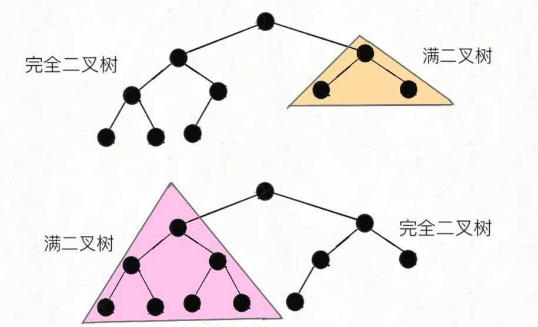

综上：算法的递归深度是树的深度 O(logN)，每次递归所花费的时间就是 while 循环，需要 O(logN)，所以总体的时间复杂度为 O(logNlogN)。所以说，“完全二叉树”还是有它存在的道理的，不仅适用于数组实现二叉堆，而且连计算节点总数这种看起来简单的操作都有高效的算法实现。

---

# 2020.12.25 & 26记录

## 序列化和反序列化二叉树(LeetCode297)

### 序列化和反序列化的意义

JSON 的运用非常广泛，比如我们经常将编程语言中的结构体序列化成 JSON 字符串，然后存入缓存或者通过网络发送给远端服务，消费者接收 JSON 字符串然后进行反序列化，就可以得到原始数据了。所以其目的是：

==以某种固定格式组织字符串，使得数据可以独立于编程语言。==

二叉树的序列化方法：serialize()，可以把一颗二叉树序列化为字符串

二叉树的反序列化方法：deserialize()，可以把字符串反序列化为二叉树

至于以什么格式序列化和反序列化，这个由自己决定。

==所谓序列化其实就是把结构化的数据”打平“，就是在考察二叉树的遍历方式==

### 前序遍历

**Example：**现有一颗二叉树，如下


相应的，代码框架为：

```java
private String serialize(TreeNode root) {
    if (root == null) {
        // 填充分隔符
        return;
    }
    
    // 前序遍历代码
    
    serialize(root.left, sb);
    serialize(root.right, sb);
}
```

对应完整程序为：

```java
// 二叉树前序遍历
// 代表分隔符的字符
String SEP = ",";
// 代表 null 指针的字符
String NULL = "#";

/*主函数：将二叉树序列化为字符串*/
private String serialize(TreeNode root) {
    StringBuilder sb = new StringBuilder();
    serialize(root, sb);
    return sb.toString();
}

/*辅助函数：将二叉树存入StringBuilder*/
private void serialize(TreeNode root, StringBuilder sb) {
    if (root == null) {
        sb.append(NULL).append(SEP);
        return;
    }

    // 进行前序遍历
    sb.append(root.val).append(SEP);

    serialize(root.left, sb);
    serialize(root.right, sb);
}
```

# 2020.12.27记录

### 反序列化(前序遍历)

单单前序遍历的结果是不能还原二叉树的，因为缺少空指针的信息。所以至少需要前、中、后序遍历的两种才能还原二叉树。但是这里的 node 列表包含空指针的信息，所以只使用 node 列表就可以还原二叉树。之前分析，这里的 node 列表就是一棵”打平“的二叉树。

那么，反序列化的过程也是一样的：==先确定根节点 Root，然后遵循前序遍历的规则，递归生成左右子树==

1. 先将字符串类型的节点转化为一个 List 数组，数组中只有相应的节点信息，供反序列化使用：

```java
/* 主函数：将字符串反序列化为二叉树结构 */
private TreeNode deserialize(String data) {
    // 将字符串转换成列表
    LinkedList<String> nodes = new LinkedList<>();
    for (String s : data.split(SEP)) {
        nodes.addLast(s); // 用于将对象链接到List的末尾
    }
    return deserialize(nodes); // 这里是真正实现反序列化生成二叉树的代码
}
```

2. 将列表中的节点信息反序列化为二叉树

```java
/* 辅助函数：通过 nodes 列表来构造二叉树*/
private TreeNode deserialize(LinkedList<String> nodes) {
    if (nodes.isEmpty()) return null;

    /* 前序遍历 */
    // nodes列表的最左侧就是根节点
    String first = nodes.removeFirst();
    if (first.equals(null)) return null;

    // Integer.parseInt(String)的作用就是将String字符类型数据转换为Integer整型数据。
    TreeNode root = new TreeNode(Integer.parseInt(first));
    /* 分隔线 */

    // 其余节点交给递归
    root.left = deserialize(nodes);
    root.right = deserialize(nodes);

    return root;
}
```

# 2020.12.28记录

### 后序遍历


后序遍历的框架为：

```java
/* 二叉树后续遍历 */
/*主函数：将二叉树序列化为字符串*/
private String postorderSerialize(TreeNode root) {
    StringBuilder sb = new StringBuilder();
    postorderSerialize(root, sb);
    return sb.toString();
}

/* 副函数：将二叉树序列化为字符串 */
private void postorderSerialize(TreeNode root, StringBuilder sb) {
    if (root == null) {
        sb.append(NULL).append(SEP);
        return;
    }

    // 后序遍历是先递归再进行转化为字符串
    postorderSerialize(root.left, sb);
    postorderSerialize(root.right, sb);

    sb.append(root.val).append(SEP);
}
```

### 反序列化(后序遍历)

**思路：**deserialize() 方法首先寻找 root 节点的值，然后递归计算左右子节点。

由上图可见，root 的值时列表最后一个元素。我们应该从后往前取出列表元素，先用最后一个元素构造 root，然后递归调用生成 root 的左右子树。

```java
/* 主函数，将字符串反序列化为二叉树结构 */
TreeNode deserialize(String data) {
    LinkedList<String> nodes = new LinkedList<>();
    for (String s : data.split(SEP)) {
        nodes.addLast(s);
    }
    return deserialize(nodes);
}

/* 辅助函数，通过 nodes 列表构造二叉树 */
TreeNode deserialize(LinkedList<String> nodes) {
    if (nodes.isEmpty()) return null;
    // 从后往前取出元素
    String last = nodes.removeLast();
    if (last.equals(NULL)) return null;
    TreeNode root = new TreeNode(Integer.parseInt(last));
    // 限构造右子树，后构造左子树
    root.right = deserialize(nodes);
    root.left = deserialize(nodes);

    return root;
}
```

**注意，根据上图，从后往前在 `nodes` 列表中取元素，一定要先构造 `root.right` 子树，后构造 `root.left` 子树**。

### 中序遍历

中序遍历只要把字符串的拼接操作放在中序遍历的位置就可以了：

```java
/* 二叉树的中序遍历 */
/* 主函数:将二叉树转换成字符串 */
private String inorderSerialize(TreeNode root) {
    StringBuilder sb = new StringBuilder();
    inorderSerialize(root, sb);
    return sb.toString();
}

/* 副函数：将二叉树序列化为字符串 */
private void inorderSerialize(TreeNode root, StringBuilder sb) {
    if (root == null) {
        sb.append(NULL).append(SEP);
        return;
    }

    inorderSerialize(root.left, sb);

    /* 中序遍历的位置 */
    sb.append(root.val).append(SEP);

    inorderSerialize(root.right, sb);
}
```

使用中序遍历==不能==实现反序列化的过程。因为要实现反序列方法，首先要构造 root 节点的位置，前序和后续遍历 root 节点分别在列表的首位和末位，而中序遍历的结果 root 节点在列表的中间，不知道其索引位置，所以我i发找到 root 节点。

### 层次遍历解法


# 2020.12.29记录

### 二叉树的层序遍历

其框架如下：

```java
/* 二叉树的层序遍历 */
/* 将二叉树序列化为字符串 */
private String levelSerialize(TreeNode root) {
    if (root == null) return "";
    StringBuilder sb = new StringBuilder();
    // 初始化队列，将 root 加入队列
    Queue<TreeNode> q = new LinkedList<>();
    q.offer(root);

    while (!q.isEmpty()) {
        TreeNode cur = q.poll(); // 取出并返回队列中的第一个元素

        /* 层级遍历的代码位置 */
        if (cur == null) {
            sb.append(NULL).append(SEP);
            continue;
        }
        sb.append(cur.val).append(SEP);
        /* 层级遍历的代码位置 */

        q.offer(cur.left);
        q.offer(cur.right);
    }

    return sb.toString();
}
```

其中：

offer

添加一个元素并返回true
如果队列已满，则返回false。

poll

将首个元素从队列中弹出（ 移除并返回队列头部的元素 ）（从队列中删除第一个元素）
如果队列是空的，就返回null。

### 反序列化(层序遍历)

由上图可以看到，每一个非空节点都会对应两个子节点，==那么反序列化的思路就是用队列进行层级遍历，同时用索引 **i ** 记录对应子节点的位置。==

```java
/* 反序列化(层序遍历) */
/* 主函数：将字符串反序列化为二叉树 */
private TreeNode deLevelSerialize(String data) {
    if (data.isEmpty()) return null;
    String[] nodes = data.split(SEP);
    // 第一个元素就是 root 的值
    TreeNode root = new TreeNode(Integer.parseInt(nodes[0]));

    // 队列 q 记录父节点，将 root 加入队列
    Queue<TreeNode> q = new LinkedList<>();
    q.offer(root);

    for (int i = 0; i < nodes.length; ) {
        // 队列存的都是父节点
        TreeNode parent = q.poll();
        // 父节点对应左侧节点的值
        String left = nodes[i++];
        if (!left.equals(NULL)) {
            parent.left = new TreeNode(Integer.parseInt(left));
            q.offer(parent.left);
        } else {
            parent.left = null;
        }
        // 父节点对应右侧子节点的值
        String right = nodes[i++];
        if (!right.equals(NULL)) {
            parent.right = new TreeNode(Integer.parseInt(right));
            q.offer(parent.right);
        } else {
            parent.right = null;
        }
    }
    return root;
}
```

## Git原理之二叉树最近公共祖先(leetcode [236])

使用 Git 的时候，比如

```java
git pull
```

它默认使用的是 `merge` 方式将远端别人的修改拉到本地；如果带上参数：

```java
git pull -r
```

就会使用 `rebase` 的方式将远端修改拉到本地。

`merge` 和 `rebase` 的区别：

+ `merge` 方式合并的分支会有很多“分叉”。
+ `rebase` 方式合并的就是一条直线。

对于多人合作的，`merge` 的方式并不好，一般来说，实际工作中更推荐使用 `rebase` 方式合并代码。

# 2020.12.30记录

### Git 寻找最近公共祖先的思路

首先，找到这两条的最近公共祖先 LCA，然后从 master 节点开始，重演 LCA 到 dev 几个 commit 的修改，如果这些修改和 LCA 到 master 的 commit 有冲突，就会提示你手动解决冲突，最后的结果就是把 dev 的分支完全接到 master 上。

涉及到二叉树肯定涉及到递归的问题，先列出所有二叉树问题的框架：

```java
void traverse(TreeNode root, variable, ...) {
    /* 前序遍历的位置 */
    ...
    /* 前序遍历的位置 */
    
    traverse(root.left, variable, ...);
    
    /* 中序遍历的位置 */
    ...
    /* 中序遍历的位置 */
        
    traverse(root.right, variable, ...)
        
    /* 后序遍历的位置 */
    ...
    /* 后序遍历的位置 */
}
```

所以，只要看到二叉树求其公共祖先的的问题，分析框架中要填的内容，先确定变量。

```java
TreeNode lowestCommonAcestor(TreeNode root, TreeNode p, TreeNode q) {
    TreeNode left = lowestCommonAcestor(root.left, p, q);
    TreeNode right = lowestCommonAcestor(root.right, p, q);
}
```

**面对递归问题的灵魂三问：**

+ **这个函数是干什么的？**

也就是说 `lowestCommonAcestor()` 函数的定义：在函数中输入三个参数 root、p、q，它会返回一个节点。

**情况①：**

如果 p 和 q 都在以 root 为根的数中，函数的返回即是 p 和 q 的公共祖先节点。

**情况②：**

如果 p 和 q 都不在以 root 为根的数中，那肯定没有它们的公共节点，返回 null。

**情况③：**

如果 p 和 q 只有一个存在于以 root 为根的树中，函数会返回那个节点。(**这个意思是输入的 p 和 q 中只有一个节点在树中，另一个是瞎写的不在树中，返回的是在树中的那个节点**)

题目说了输入的 p 和 q 一定存在于以 root 为根的树中，但是递归过程中，以上三种情况都有可能发生。这是 `lowestCommonAcestor()`函数的定义，无论发生什么，都不要怀疑这个定义的正确性。

+ **在这个函数的参数中，变量是什么？**

函数参数中的变量是 `root`，因为根据框架， `lowestCommonAcestor(root)`会递归调用 `root.left` 和`root.right`；至于 p 和 q，我们要求他们的公共祖先，他俩肯定是不会变化的。

以`root`为根会逐步转化为以`root.子节点`为根，即逐步缩小问题规模。

+ **得到函数递归的结果，你该干什么，即做什么选择？**

==如果 `left` 和 `right` 不为 null， 说明他们分别是 p 和 q。==

 **base case:**

1. 如果`root`为空，肯定得返回`null`。
2. 如果`root`本身就是`p`或者`q`，比如说`root`就是`p`节点吧，如果`q`存在于以`root`为根的树中，显然`root`就是最近公共祖先；
3. 即使`q`不存在于以`root`为根的树中，按照情况 3 的定义，也应该返回`root`节点。

**递归调用的结果`left`和`right`：**

情况 1，如果`p`和`q`都在以`root`为根的树中，那么`left`和`right`一定分别是`p`和`q`（从 base case 看出来的）。

情况 2，如果`p`和`q`都不在以`root`为根的树中，直接返回`null`。

情况 3，如果`p`和`q`只有一个存在于`root`为根的树中，函数返回该节点。

最后得到补充框架后的结果为：

```java
public class LowestCommonAncestor {

    private TreeNode lowestCommonAncestor(TreeNode root, TreeNode p, TreeNode q) {
        // 基本情况
        if (root == null) return null;
        if (root == p || root == q) return root;

        TreeNode left = lowestCommonAncestor(root.left, p, q);
        TreeNode right = lowestCommonAncestor(root.right, p, q);

        // 相当于二叉树的后序遍历
        // 情况1
        if (left != null && right != null) {
            return root;
        }
        // 情况2
        if (left == null && right == null) {
            return null;
        }
        // 情况3
        return left == null ? right : left;
    }
}
```

对于情况①，为什么 `left` 和 `right` 非空，就可以说明 `root` 是他们的最近公共祖先？

因为这里是二叉树后序遍历的过程！！！后序遍历是从下往上，好比从 p 和 q 出发往上走，第一次相交的节点就是这个 `root` 。

# 2021.1.8记录

## Java 中数组与 LinkedList(链表)的相互转换

### 数组转 LinkedList

```java
LinkedList linklist = new LinkedList(Arrays.asList(array));
```

数组转链表是调用了 Array.asList() 方法

```java
static List asList(T ... a) // 返回由指定数组支持的固定大小的链表
```

### LinkedList 转数组

```java
// 方法1
String[] array1 = (String[]) linklist.toArray(new String[0]);
// 此时以正确的顺序(从第一个到最后一个元素)返回一个包含此链表中所有元素的数组

// 方法2
String[] array2 = new String[linklist.size()];
linklist.toArray(array2);
// 以正确的顺组返回一个包含此链表中所有元素的数组，返回的数组的运行时类型是指定数组的运行时类型
```

## 特殊数据结构-单调栈，解决一类寻找 Next Greater Element 的问题

### 下一个更大元素 I(LeetCode[496])

### 题目描述

比如说，输入一个数组`nums = [2,1,2,4,3]`，你返回数组`[4,2,4,-1,-1]`。

解释：第一个 2 后面比 2 大的数是 4; 1 后面比 1 大的数是 2；第二个 2 后面比 2 大的数是 4; 4 后面没有比 4 大的数，填 -1；3 后面没有比 3 大的数，填 -1。

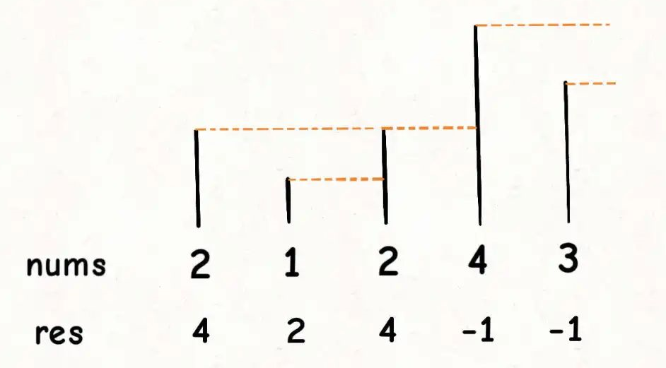

**定义：** 单调栈实际就是栈，使得每次新元素入栈后，栈内的元素都保持单调(单调递增或单调递减)。框架为：

```java
/*
 * 找到下一个更大的元素I
 * 比如输入一个数组 nums = [2, 1, 2, 4, 3]，算法返回 [4, 2, 4, -1, -1]
 * 暴力破解方法：对每个元素后面进行扫描，找到第一个更大的元素就行了。暴力破解的时间复杂度：O(n^2)
 * 算法时间复杂度为：O(n)
 */
// 核心思想：数组中的元素想象成一组不同身高的人，矮的人会被高的人遮住，所以只有越来越高才能被看见
// 即下一个更大的元素，输出没被“遮住”的元素
public int[] nextGreaterElement(int[] nums1, int[] nums2) {

    HashMap<Integer, Integer> map = new HashMap<>();
    int [] res = new int[nums1.length];
    // 栈中用来存放“更大的数”并不断更新
    Stack<Integer> s = new Stack<>();
    // 将 nums 数组的元素倒着放入栈中
    for (int i = nums2.length - 1; i >= 0; i--) {

        // 如果栈中元素不为空，说明至少两个以上的元素进行比较得出了一个更大的数，否则 s 会一直为空、
        while (!s.isEmpty() && nums2[i] >= s.peek()) {
            // 如果新输入的树比原来 s 中存的最大数还要大，那 s 的栈顶元素可以换了
            s.pop();
        }

        map.put(nums2[i], s.isEmpty() ? -1 : s.peek());

        s.push(nums2[i]);
    }

    for (int i = 0; i < nums1.length; i++) {
        res[i] = map.get(nums1[i]);
    }
    return res;
}
```

for 循环要从后往前扫描元素，因为我们借助的是栈的结构，倒着入栈，其实是正着出栈。while 循环是把两个「个子高」元素之间的元素排除，因为他们的存在没有意义，前面挡着个「更高」的元素，所以他们不可能被作为后续进来的元素的 Next Great Number 了。

### 时间复杂度

分析它的时间复杂度，要从整体来看：总共有`n`个元素，每个元素都被`push`入栈了一次，而最多会被`pop`一次，没有任何冗余操作。所以总的计算规模是和元素规模`n`成正比的，也就是`O(n)`的复杂度。

### 下一个更大元素 I(循环数组，LeetCode[496])

#### 题目描述

比如输入一个数组`[2,1,2,4,3]`，你返回数组`[4,2,4,-1,4]`。拥有了环形属性，**最后一个元素 3 绕了一圈后找到了比自己大的元素 4**。

#### 思路

**对于这种需求，常用套路就是将数组长度翻倍**：

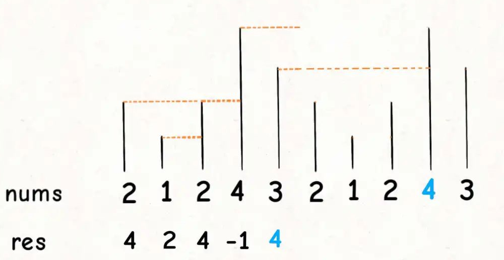

最简单的实现方式当然可以把这个双倍长度的数组构造出来，然后套用算法模板。但是，**我们可以不用构造新数组，而是利用循环数组的技巧来模拟数组长度翻倍的效果**。

#### 代码实现

```java
/* 寻找下一个更大的元素(循环数组) */
public int[] nextGreaterElements(int[] nums) {

    // nums 数组的大小
    int size = nums.length;

    // 装结果
    int[] res = new int[size];
    // 装比较的结果，即不断更新的"更大的数"
    Stack<Integer> stack = new Stack<>();

    // 倒着将 nums 数组中的元素放到栈中
    // 利用取模的方法可以使数组在不扩容的情况下实现增倍
    // 假装已经扩容了一倍
    for (int i = 2 * size - 1; i >= 0; i--) {

        // ②通过循环比较元素，更新栈中的“更大的元素”
        while (!stack.isEmpty() && nums[i % size] >= stack.peek()) {

            // 找到了更大的元素，栈中较小的元素就可以舍去
            stack.pop();
        }

        // ③找到了当前元素后第一个比它大的数，更新 res
        res[i % size] = stack.isEmpty() ? -1 : stack.peek();

        // ①放入数组元素
        stack.push(nums[i % size]);
    }
    return res;
}
```

### 每日温度(LeetCode[739])

#### 题目描述

给你一个数组`T`，这个数组存放的是近几天的天气气温，你返回一个等长的数组，计算：**对于每一天，你还要至少等多少天才能等到一个更暖和的气温；如果等不到那一天，填 0**。

比如说给你输入`T = [73,74,75,71,69,76]`，你返回`[1,1,3,2,1,0]`。

解释：第一天 73 华氏度，第二天 74 华氏度，比 73 大，所以对于第一天，只要等一天就能等到一个更暖和的气温，后面的同理。

#### 思路

这个问题本质上也是找 Next Greater Number，只不过现在不是问你 Next Greater Number 是多少，而是问你当前距离 Next Greater Number 的距离而已。

#### 代码实现

```java
/* 寻找下一个更大的温度 */
public int[] dailyTemperatures(int[] T) {

    // 装结果
    int[] res = new int[T.length];
    // 装索引
    Stack<Integer> stack = new Stack<>();

    // 将数组 T 中元素索引倒着入栈
    for (int i = T.length - 1; i >= 0; i--) {

        // ②循环进行元素大小比较
        // 如果栈中元素不为空，说明此时有比当前元素大的值
        // 如果战争没有元素，说明该元素后面没有比他大的
        while (!stack.isEmpty() && T[i] >= T[stack.peek()]) {

            // 如果栈中索引对应的值没有当前 T 数组中的元素大，那栈中索引对应的值可以“走了”
            stack.pop();
        }

        // ③将比较结果放入 res
        res[i] = stack.isEmpty() ? 0 : stack.peek() - i;

        // ①元素索引入栈
        stack.push(i);
    }
    return res;
}
```

# 2021.1.9记录

## 数据结构的存储方式

数据结构的存储方式只有两种：数组(顺序存储)、链表(链式存储)

我们分析问题，一定要有==递归的思想，自顶向下，从抽象到具体。==散列表、栈、队列、堆、树、图等都属于「上层建筑」，而数组和链表才是「结构基础」。因为那些多样化的数据结构，究其源头，都是在链表或者数组上的特殊操作，API 不同而已。

+ 「队列」、「栈」均可以由链表和数组实现。

  数组实现需要处理扩容缩容问题；

  链表实现没有这个问题，但是需要更多的内存空间存储节点指针

+ 「图」的两种表示方法，邻接表就是链表，邻接矩阵就是二维数组。

  邻接矩阵判断连通性迅速，并可以进行矩阵运算解决一些问题，但是如果图比较稀疏就会很耗费空间；

  邻接表比较节省空间，但是很多操作的效率上肯定比不过邻接矩阵。

+ 「散列表」通过散列函数把键映射到一个大数组里。

  对于解决散列冲突的方法，拉链法需要链表特性，操作简单，但需要额外的空间存储指针；

  线性探查法就需要数组特性，以便连续寻址，不需要指针的存储空间，但操作稍微复杂些。

+ 「树」用数组实现就是「堆」，因为「堆」是一个完全二叉树，用数组存储不需要节点指针，操作也比较简单；

  用链表实现就是很常见的那种「树」，因为不一定是完全二叉树，所以不适合用数组存储。为此，在这种链表「树」结构之上，又衍生出各种巧妙的设计，比如二叉搜索树、AVL 树、红黑树、区间树、B 树等等，以应对不同的问题。

==**数据结构种类很多，但它们存在的目的都是在不同的应用场景，尽可能高效地增删查改**。==

## 如何遍历 + 访问？

各种数据结构的遍历 + 访问无非两种形式：线性的和非线性的。

### 数组遍历框架，典型的线性迭代结构：

数组遍历框架，典型的线性迭代结构：

```java 
void traverse(int[] arr) {
    for (int i = 0; i < arr.length; i++) {
        // 迭代访问 arr[i]
    }
}
```

链表遍历框架，兼具迭代和递归结构：

```java
/* 基本的单链表节点 */
class ListNode {
    int val;
    ListNode next;
}

void traverse(ListNode head) {
    for (ListNode p = head; p != null; p.next) {
        // 迭代访问 p.val
    }
}

void traverse(ListNode head) {
    // 迭代访问 head.val
    traverse(head.next);
}
```

二叉树遍历框架，典型的非线性递归遍历结构：

```java
/* 基本的二叉树节点 */
class TreeNode {
    int val;
    TreeNode left, right;
}

void traverse(TreeNode root) {
    traverse(root.left);
    traverse(root.right);
}
```

二叉树框架可以扩展为 N 叉树的遍历框架：

```java
/* 基本的 N 叉树节点 */
class TreeNode {
    int val;
    TreeNode[] children;
}

void traverse(TreeNode root) {
    for (TreeNode child : root.children)
        traverse(child);
}
```

# 2021.1.10记录

## 92-反转链表II

### 递归反转整个链表

首先整个代码为：

```java
ListNode reverse(ListNode head) {
    if (head == null || head.next == null) return head;
    ListNode last = reverse(head.next);
    head.next.next = head;
    head.next = null;
    return last;
}
```

**对于递归算法，最重要的就是明确递归函数的定义**。具体来说，我们的 `reverse` 函数定义是这样的：

**输入一个节点** **`head`**，将「以 **`head`** **为起点」的链表反转，并返回反转之后的头结点**。


那么输入 `reverse(head)` 后，会在这里进行递归：

```java
ListNode last = reverse(head.next);
```


递归的结果如下：


将第二个节点指向第一个 head 节点

```java
head.next.next = head;
```

执行结果如下


当链表递归反转之后，新的头结点是 `last`，而之前的 `head` 变成了最后一个节点，别忘了链表的末尾要指向 null：

```java
head.next = null;
return last;
```


# 2021.1.11记录

### 反转链表前N个节点
首先我们要实现这样一个函数

```java
ListNode successor = null; // 后驱节点

// 反转以 head 为起点的 n 个节点，返回新的头结点
ListNode reverseN(ListNode head, int n) {
    if (n == 1) { 
        // 记录第 n + 1 个节点
        successor = head.next;
        return head;
    }
    // 以 head.next 为起点，需要反转前 n - 1 个节点
    ListNode last = reverseN(head.next, n - 1);

    head.next.next = head;
    // 让反转之后的 head 节点和后面的节点连起来
    head.next = successor;
    return last;
}
```

这个函数实现的效果如下：

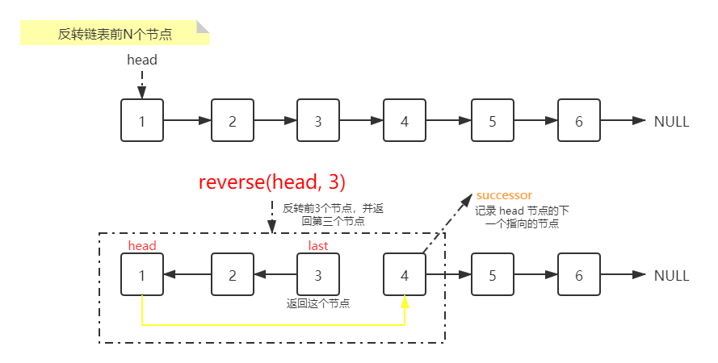

具体的区别：

1. base case 变为 n == 1，反转一个元素，就是它本身，同时要记录后驱节点
2. 刚才我们直接把 head.next 设置为 null，因为整个链表反转后原来的 head 变成了整个链表的最后一个节点。但现在 head 节点在递归反转之后不一定是最后一个节点了，所以要记录后驱 successor（第 n + 1 个节点），反转之后将 head 连接上。
3. base case 中 return head; ==是因为 last = 3，在反转之后就变成了头节点 head。==

### 反转链表的一部分
给一个索引区间 [m,n]（索引从 1 开始），仅仅反转区间中的链表元素。

```java
ListNode reverseBetween(ListNode head, int m, int n)
```

首先，如果 m == 1，就相当于反转链表开头的 n 个元素嘛，也就是我们刚才实现的功能：

```java
ListNode reverseBetween(ListNode head, int m, int n) {
    // base case
    if (m == 1) {
        // 相当于反转前 n 个元素
        return reverseN(head, n);
    }
    // ...
}
```

如果 m != 1 怎么办？如果我们把 head 的索引视为 1，那么我们是想从第 m 个元素开始反转对吧；
如果把 head.next 的索引视为 1 呢？==那么相对于 head.next，反转的区间应该是从第 m - 1 个元素开始的；==
那么对于 head.next.next 呢……


所以总的代码为：

```java
public ListNode reverseBetween(ListNode head, int m, int n) {
    if (m == 1) {
        // 相当于反转前 N 个元素
        return reverseN(head, n);
    }

    head.next = reverseBetween(head.next, m - 1, n - 1);
    return head;
}

ListNode successor = null;
public ListNode reverseN(ListNode head, int n) {
    // base case
    if (n == 1) {
        successor = head.next;
        return head;
    }

    ListNode last = reverseN(head.next, n - 1);
    head.next.next = head;
    head.next = successor;
    return last;
}
```

# 2021.1.12记录

## 如何 K 个一组反转链表？

### 思路分解的过程

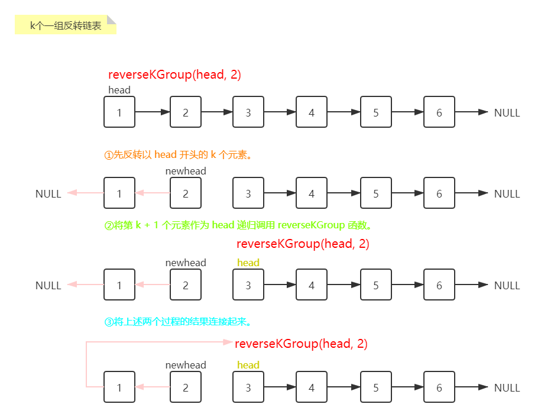

### 代码实现

首先，我们要实现一个 `reverse` 函数反转一个区间之内的元素。在此之前我们再简化一下，给定链表头结点，如何反转整个链表？

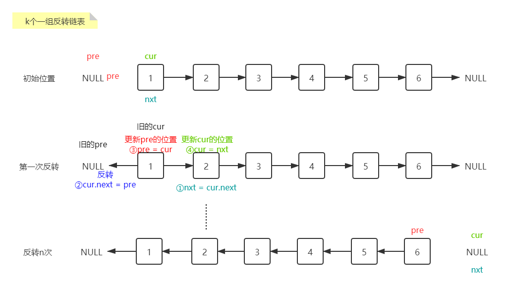

```java
// 反转以 a 为头结点的链表
ListNode reverse(ListNode a) {
    ListNode pre, cur, nxt;
    pre = null; cur = a; nxt = a;
    while (cur != null) {
        // 先将 nxt 移到 cur 的下一个节点
        nxt = cur.next;
        // 逐个结点反转
        cur.next = pre;
        // 更新指针位置
        pre = cur;
        cur = nxt;
    }
    // 返回反转后的头结点
    return pre;
}
```

「反转以 `a` 为头结点的链表」其实就是「反转 `a` 到 null 之间的结点」，那么如果让你「反转 `a` 到 `b` 之间的结点」，你会不会？

只要更改函数签名，==并把上面的代码中 `null` 改成 `b`== 即可：

```java
/** 反转区间 [a, b) 的元素，注意是左闭右开 */
ListNode reverse(ListNode a, ListNode b) {
    ListNode pre, cur, nxt;
    pre = null; cur = a; nxt = a;
    // while 终止的条件改一下就行了
    while (cur != b) {
        nxt = cur.next;
        cur.next = pre;
        pre = cur;
        cur = nxt;
    }
    // 返回反转后的头结点
    return pre;
}
```

总体解题的思路为：

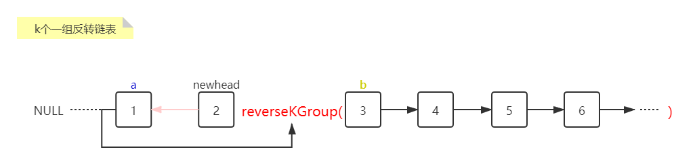

```java
// K 个一组反转链表
public ListNode reverseKGroup(ListNode head, int k) {
    if (head == null) return null;
    ListNode a, b;
    a = b = head;
    // base case: 当链表节点不满 K 个的时候，直接返回 head，不需要反转
    for (int i = 0; i < k; i++) {
        if (b == null) return head; // 先进行判断，在让 b = b.next 用以判断节点不满足 K 时不反转的功能
        b = b.next;
        // example：当节点数为 2，K = 2 时，i 取值 0 ~ 1。
        // 第一次：i = 0, b = head，不满足 if 中条件，执行 b = b.next;
        // 第二次: i = 1, b = head.next, 不满足 if 中条件，执行 b = b.next; 虽然此时 b = head.next.next == null, 但是此时 i 会递增为 2，不会在进行 for 循环了。
        // 以此判断节点数够不够 K 个
    }

    // 更新得到一个新的 head 节点，命名 newHead
    ListNode newHead = reverse(a, b);
    // 连接后续递归反转的链表
    head.next = reverseKGroup(b, k);
    return newHead;
}
```

# 2021.1.13记录

## 如何求最大回文串？(leetcode [5])

寻找回文串的核心思想是**从中心向两端扩展：**

```java
public String longestPalindrome(String s) {

    // base case
    if (s == null || s.length() == 0) {
        return "";
    }
    // 用数组定义返回字符串的上下标索引
    int[] range = new int[2];
    // 将输入的字符串 s 进行遍历，依次查找以每个元素开始的最长子回文串
    // 回文串：中间部分元素相同，两端元素对称相等
    char[] str = s.toCharArray();

    for (int i = 0; i < s.length(); i++) {

        // 定义函数 findLongest() 如果是偶数回文串返回 high + 1; 否则返回 high;
        // 在函数内部持续更新 range[0] 和 range[1] 的值
        i = findLongest(str, i, range);
    }
    return s.substring(range[0], range[1] + 1); // 左闭右开
}

public static int findLongest(char[] str, int low, int[] range) {

    // ①当 high < str.length - 1 时(因为如果 high == str.length，即 str 最后一个元素，不可能组成回文串)
    // 根据 low(字符串最左边元素的索引)，检查是否有中间元素相同的情况。若有，high ++;
    int high = low;
    while (high < str.length - 1 && str[low] == str[high + 1]) {
        high++;
    }

    // ②定位中间元素最后一位，下次即跳过这个索引开始查找回文串
    int ans = high;

    // ③以 low 和 high 为中心元素向两端查找，如果两端元素相同，则更新 range
    while (low > 0 && high < str.length - 1
           && str[low -1] == str[high + 1]) {
        low--;
        high++;
    }

    // ④判断 high - low ?> range[1] - range[0]
    // 是：有新的更长的回文串，更新range
    // 否：不更新
    if (high - low > range[1] - range[0]) {
        range[0] = low;
        range[1] = high;
    }
    return ans;
}
```

## 如何判断一个字符串是否是回文串(leetcode [125])

而判断一个字符串是不是回文串就简单很多，不需要考虑奇偶情况，只需要「双指针技巧」，**从两端向中间逼近即可：**

```java
// 核心思想：判断是不是回文串，只需从两端的元素进行比较，只要有一个不同，则返回 false，否则返回 true。
public boolean isPalindrome(String s) {
    // 先将字符串统一变成小写
    String str = s.toLowerCase();
    int left = 0;
    int right = s.length() - 1;

    // base case
    if (s == null || s.length() == 0) return true;

    // 注意循环条件
    while (left < right) {
        // 假如字符串中左边存在除了字母和数字以外的符号，让 left++;
        while (left < right && !Character.isLetterOrDigit(str.charAt(left))) {
            left++;
        }

        // 假如字符串中右边存在除了字母和数字以外的符号，让 right--;
        while (left < right && !Character.isLetterOrDigit(str.charAt(right))) {
            right--;
        }

        if (str.charAt(left) != str.charAt(right)) return false;
        left++; right--;
    }
    return true;
}
```

**因为回文串是对称的，所以正着读和倒着读应该是一样的，这一特点是解决回文串问题的关键**。

## 如何判断一个「单链表」是不是回文？(leetcode [234]）

输入一个单链表的头结点，判断这个链表中的数字是不是回文：

```java
/**
 * 单链表节点的定义：
 * public class ListNode {
 *     int val;
 *     ListNode next;
 * }
 */

boolean isPalindrome(ListNode head);

输入: 1->2->null
输出: false

输入: 1->2->2->1->null
输出: true
```

这道题的关键在于，单链表无法倒着遍历，无法使用双指针技巧。那么最简单的办法就是，把原始链表反转存入一条新的链表，然后比较这两条链表是否相同。

或者将单链表进行后序遍历存入 StringBuilder 中，再进行节点值的比对。

```java
public boolean isPalindrome(ListNode head) {
    StringBuilder sb1 = new StringBuilder();
    StringBuilder sb2 = new StringBuilder();

    preTraverse(head, sb1);
    postTraverse(head, sb2);

    // 判断
    for (int i = 0; i < sb1.length(); i++) {
        if (sb1.charAt(i) != sb2.charAt(i)) return false;
    }
    return true;
}

// 前序遍历链表
public static void preTraverse(ListNode head, StringBuilder sb) {
    if (head == null) return;

    // 前序遍历代码
    sb.append(head.val);

    preTraverse(head.next, sb);
}

// 后序遍历链表
public static void postTraverse(ListNode head, StringBuilder sb) {
    if (head == null) return;

    postTraverse(head.next, sb);

    // 后序遍历代码
    sb.append(head.val);
}
```

其中，在「学习数据结构的框架思维」中说过，链表兼具递归结构，树结构不过是链表的衍生。那么，**链表其实也可以有前序遍历和后序遍历**：

```java
void traverse(ListNode head) {
    // 前序遍历代码
    traverse(head.next);
    // 后序遍历代码
}
```

无论造一条反转链表还是利用后续遍历，算法的时间和空间复杂度都是 O(N)。

# 2021.1.14记录

## 进阶：优化空间复杂度

**1、先通过「双指针技巧」中的快慢指针来找到链表的中点**：

```java
ListNode slow, fast;
slow = fast = head;
while (fast != null && fast.next != null) {
    slow = slow.next;
    fast = fast.next.next;
}
// slow 指针现在指向链表中点
```

**2、如果**`fast`**指针没有指向**`null`**，说明链表长度为奇数，**`slow`**还要再前进一步**：

```
if (fast != null)
    slow = slow.next;
```

**3、从**`slow`**开始反转后面的链表，现在就可以开始比较回文串了**：

```java
ListNode left = head;
ListNode right = reverse(slow);

while (right != null) {
    if (left.val != right.val)
        return false;
    left = left.next;
    right = right.next;
}
return true;
```

总的流程图如下：

.png)

算法总体的时间复杂度 O(N)，空间复杂度 O(1)，已经是最优的了。

这种解法虽然高效，但破坏了输入链表的原始结构，能不能避免这个瑕疵呢？

其实这个问题很好解决，关键在于得到`p, q`这两个指针位置：


这样，只要在函数 return 之前加一段代码即可恢复原先链表顺序：

```java
p.next = reverse(q);
```

**总结：**首先，寻找回文串是从中间向两端扩展，判断回文串是从两端向中间收缩。对于单链表，无法直接倒序遍历，可以造一条新的反转链表，可以利用链表的后序遍历，也可以用栈结构倒序处理单链表。

具体到回文链表的判断问题，由于回文的特殊性，可以不完全反转链表，而是仅仅反转部分链表，将空间复杂度降到 O(1)。

### 反转二叉树(leetcode [226])

输入一个二叉树根节点 `root`，让你把整棵树镜像翻转，比如输入的二叉树如下：

```java
     4
   /   \
  2     7
 / \   / \
1   3 6   9
```

算法原地翻转二叉树，使得以 `root` 为根的树变成：

```java
     4
   /   \
  7     2
 / \   / \
9   6 3   1
```

**我们发现只要把二叉树上的每一个节点的左右子节点进行交换，最后的结果就是完全翻转之后的二叉树**。

```java
// 反转二叉树的关键思路：只需要将二叉树上的每个节点的左右子节点互换即可
public TreeNode invertTree(TreeNode root) {

    // base case
    if (root == null) return null;

    // 前序遍历的位置
    TreeNode tmp = root.left;
    root.left = root.right;
    root.right = tmp;    // base case + 前序遍历代码都是 root 节点要完成的事，剩下的交给递归

    invertTree(root.left);
    invertTree(root.right);

    return root;
}
```

**二叉树题目的一个难点就是，如何把题目的要求细化成每个节点需要做的事情**。

### 填充每个节点的下一个右侧节点指针(leetcode [116])

题目的意思就是把二叉树的每一层节点都用 `next` 指针连接起来：


题目说了，输入是一棵「完美二叉树」，形象地说整棵二叉树是一个正三角形，除了最右侧的节点 `next` 指针会指向 `null`，其他节点的右侧一定有相邻的节点。

**思考：**

把每一层的节点穿起来，是不是只要把每个节点的左右子节点都穿起来就行了？

这样做的话，节点 5 和节点 6 不属于同一个父节点，那么按照这个逻辑，它俩就没办法被穿起来，这是不符合题意的。

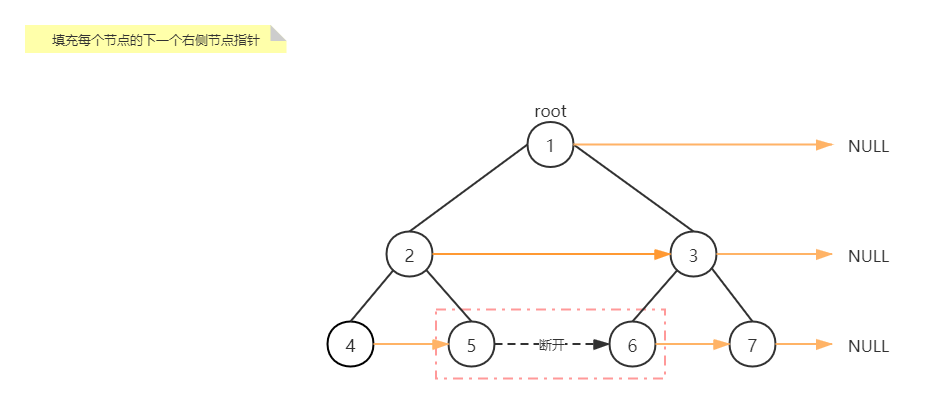

**二叉树的问题难点在于，如何把题目的要求细化成每个节点需要做的事情**，但是如果只依赖一个节点的话，肯定是没办法连接「跨父节点」的两个相邻节点的。

那么，我们的做法就是增加函数参数，一个节点做不到，我们就给他安排两个节点，「将每一层二叉树节点连接起来」可以细化成「将每两个相邻节点都连接起来」：

```java
// 因为仅仅连接父节点下的左右孩子节点会导致不在同一个父节点下的两个节点无法连接
// 所以再细化一下问题：输入两个节点，要求这两个节点之间进行连接操作
public Node connect(Node root) {

    if (root == null) return null; // root 都为 null 了，还往下写个啥呢？

    // 定义函数 connectTwoNode()，输入两个节点进行连接
    connectTwoNode(root.left, root.right);

    return root;
}

// 定义函数 connectTwoNode()
public void connectTwoNode(Node node1, Node node2) {

    // base case
    if (node1 == null || node2 == null) return;

    /**** 前序遍历位置 ****/
    // 将传入的两个节点连接
    node1.next = node2;

    // 连接相同父节点的两个孩子节点
    connectTwoNode(node1.left, node1.right);
    connectTwoNode(node2.left, node2.right);

    // 链接不同父节点之间的两个相邻节点，肯定是 node1.right-->node2.left
    connectTwoNode(node1.right, node2.left);
}
```

### 将二叉树展开为链表(leetcode [114])

函数签名如下：

```java
void flatten(TreeNode root);
```

**定义：**

**给** **`flatten`** **函数输入一个节点** **`root`****，那么以** **`root`** **为根的二叉树就会被拉平为一条链表**。

我们再梳理一下，如何按题目要求把一棵树拉平成一条链表？很简单，以下流程：

1. 将 `root` 的左子树和右子树拉平。

2. 将 `root` 的右子树接到左子树下方，然后将整个左子树作为右子树。


上面三步看起来最难的应该是第一步对吧，如何把 `root` 的左右子树拉平？

其实很简单，按照 `flatten` 函数的定义，对 `root` 的左右子树递归调用 `flatten` 函数即可：

```java
public void flatten(TreeNode root) {

    // base case
    if (root == null) return;

    // 后序遍历
    // 不需要管怎么才能把二叉树的左右子树拉直成一个链表，只需要递归调用这个函数即可
    flatten(root.left);
    flatten(root.right);

    // 执行完上述递归代码后，我们只需要知道此时二叉树的左右子树已经被拉直了
    // 考虑如何将 root 先拼接左子树，再在其基础上拼接右子树
    // 新定义两个 TreeNode 分别存放左子树和右子树
    TreeNode left = root.left;
    TreeNode right = root.right;

    // 清零 root 原先的左子树
    root.left = null;
    // 让 root 的下一个节点指向左子树的头节点
    root.right = left;

    // 将右子树拼接到上述的结果中
    // 在此之前需要获得拼接完左子树后的 root 的最后一个节点
    // 定义一个 p 复制 root，用它来计算最后一个节点
    TreeNode p = root;
    while (p.right != null) {
        p = p.right;
    }

    // 再让 p 的指向右子树的头节点即可
    p.right = right;
}
```

这就是递归的魅力，你说 `flatten` 函数是怎么把左右子树拉平的？说不清楚，但是只要知道 `flatten` 的定义如此，相信这个定义，让 `root` 做它该做的事情，然后 `flatten` 函数就会按照定义工作。另外注意递归框架是后序遍历，因为我们要**先拉平左右子树**才能进行后续操作。

# 2021.1.15记录

## 构造最大二叉树(leetcode [654])


**对于构造二叉树的问题，根节点要做的就是把想办法把自己构造出来**。

**对于每个根节点，只需要找到当前** **`nums`** **中的最大值和对应的索引，然后递归调用左右数组构造左右子树即可**。

```java
public TreeNode constructMaximumBinaryTree(int[] nums) {
    return build(nums, 0, nums.length - 1);
}

public TreeNode build(int[] nums, int low, int high) {
    // base case：如果数组 nums 为空，则返回 null
    if (high < low) return null;

    // 找到数组中最大的元素当作根节点
    // 在JDK中，整形类型是有范围的，最大值为Integer.MAX_VALUE，即2147483647，最小值为Integer.MIN_VALUE -2147483648。
    int index = -1,  maxVal = Integer.MIN_VALUE;
    for (int i = low; i <= high; i++) {
        if (nums[i] > maxVal) {
            index = i;
            maxVal = nums[i];
        }
    }

    // 最大值找到后，以其作为根节点
    TreeNode root = new TreeNode(maxVal);

    // 递归找子区间的最大值构造根节点，以此类推
    root.left = build(nums, low, index - 1);
    root.right = build(nums, index + 1, high);

    return root;
}
```

## 通过前序和中序遍历结果构造二叉树(leetcode [105])

**要求：**

给出二叉树前序和中序遍历的结果，根据这两个结果重构原二叉树。

### 二叉树的前序和中序遍历结果

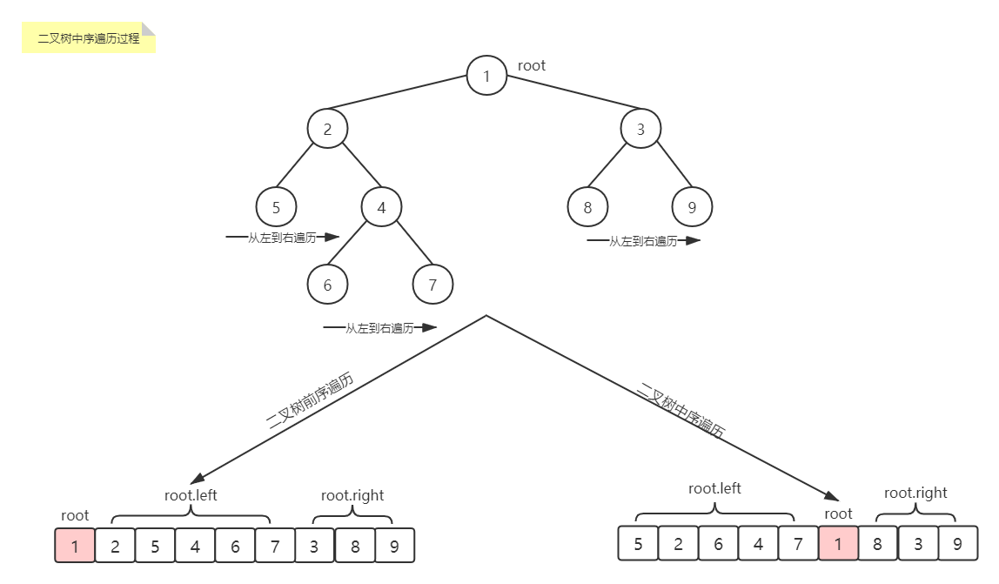

函数签名：

```java
TreeNode buildTree(int[] preorder, int[] inorder);
```


### 思路

**想办法确定根节点的值，把根节点做出来，然后递归构造左右子树即可**。

并且要明确我们定义的函数 **build**(**int**[] preorder, **int** preStart, **int** preEnd, **int**[] inorder, **int** inStart, **int** inEnd) 的功能：就是帮我们根据前序遍历和中序遍历的结果中左子树和右子树的索引返回重构出原左子树和原右子树。我们不要纠结这是怎么恢复的，只需要清楚这个函数的定义即可。

1. 根据前序遍历的结果，很容易得知原二叉树的根节点的值为前序遍历结果数组的第一个元素：preorder[0]
2. 根据找出的根节点的值，再 inorder[] 数组中找到对应的索引值
3. 明确左右子树在 inorder[] 中的索引范围：
   + 左子树：inStart ~ index - 1
   + 右子树：index + 1 ~ inEnd

4. 明确左右子树在 preorder[] 中的索引范围：

   假设左子树的元素个数为 leftSize，根据前序遍历的结果，可知左子树的范围：

   + 左子树：preStart + 1 ~ preStart + leftSize
   + 右子树：preStart + leftSize + 1 ~ preEnd

5. 求 leftSize 的值：

   因为在 inorder[] 中我们求得了 root 节点的索引值，在 root 之前的元素都是左子树的元素，所以

   leftSize = index - inStart

   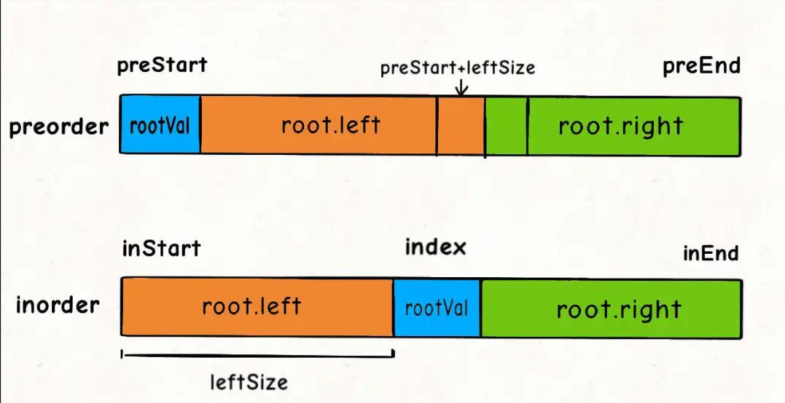

### 程序实现

```java
public TreeNode buildTree(int[] preorder, int[] inorder) {

    return build(preorder, 0, preorder.length - 1,
                 inorder, 0, inorder.length - 1);
}

// 定义函数 build()：根据前序遍历和中序遍历的结果中的左子树和右子树的索引范围重构二叉树
public TreeNode build(int[] preorder, int preStart, int preEnd,
                      int[] inorder, int inStart, int inEnd) {

    // base case
    if (preEnd < preStart) return null;

    // ①根据前序遍历的结果可以得出原二叉树的 root 节点的值
    int rootVal = preorder[preStart];

    // ②根据 root 节点的值找到其在 inorder[] 数组中的索引
    int index = 0;
    for (int i = 0; i <= inEnd; i++) {
        if (inorder[i] == rootVal) {
            index = i;
        }
    }

    // ③构造树
    TreeNode root = new TreeNode(rootVal);

    // ④计算leftSize(左子树元素个数)
    int leftSize = index - inStart;
    root.left = build(preorder, preStart + 1, preStart + leftSize,
                      inorder, inStart, index - 1);
    root.right = build(preorder, preStart + leftSize + 1, preEnd,
                       inorder, index + 1, inEnd);

    return root;
}
```

## 通过中序和后序遍历结果构造二叉树(leetcode [106])

### 二叉树的后序和中序遍历结果

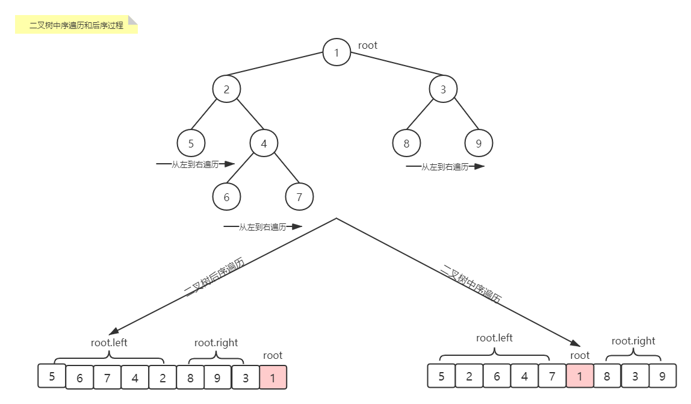

### 思路

**想办法确定根节点的值，把根节点做出来，然后递归构造左右子树即可**。

与上面思路完全相同只是现在求根据 index 求  rightSize，然后得到相应的左子树和右子树分别在后序遍历和中序遍历结果数组中的索引范围。

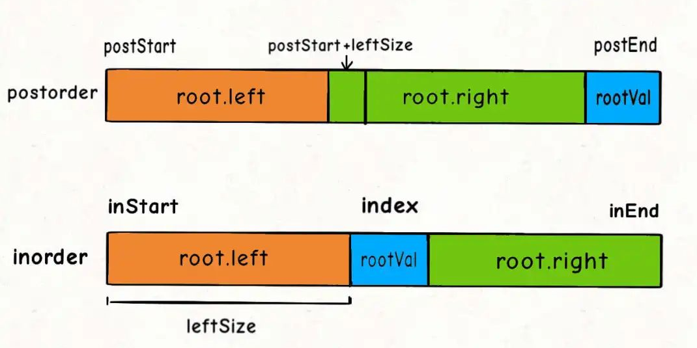

### 实现代码

```java
public TreeNode buildTree(int[] inorder, int[] postorder)  {

    return build(inorder, 0, inorder.length - 1,
                 postorder, 0, postorder.length - 1);
}

// 定义函数 build()：根据前序遍历和中序遍历的结果中的左子树和右子树的索引范围重构二叉树
public TreeNode build(int[] inorder, int inStart, int inEnd,
                      int[] postorder, int postStart, int postEnd) {

    // base case
    if (inEnd < inStart) return null;

    // ①根据前序遍历的结果可以得出原二叉树的 root 节点的值
    int rootVal = postorder[postEnd];

    // ②根据 root 节点的值找到其在 inorder[] 数组中的索引
    int index = 0;
    for (int i = 0; i <= inEnd; i++) {
        if (inorder[i] == rootVal) {
            index = i;
            break;
        }
    }

    // ③构造树
    TreeNode root = new TreeNode(rootVal);

    // ④计算leftSize(左子树元素个数)
    //        int leftSize = index - inStart;

    // 用右子树元素个数试试
    int rightSize = inEnd - index;

    //        root.left = build(inorder, inStart, index - 1,
    //                postorder, postStart,postStart + leftSize - 1);
    //        root.right = build(inorder, index + 1, inEnd,
    //                postorder, postStart + leftSize,postEnd - 1);

    root.left = build(inorder, inStart, index - 1,
                      postorder, postStart,postEnd - rightSize - 1);
    root.right = build(inorder, index + 1, inEnd,
                       postorder, postEnd - rightSize,postEnd - 1);

    return root;
}
```

## 寻找重复子树(leetcode [652])

### 题目描述

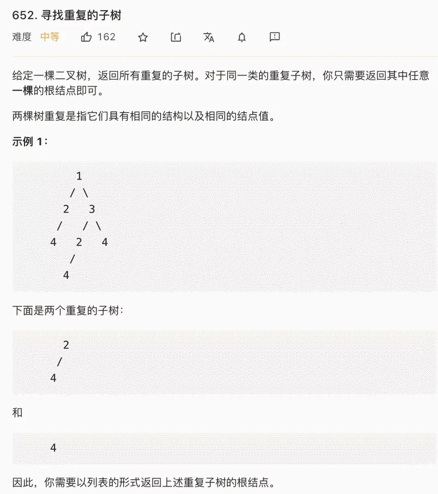

首先，**节点 4 本身可以作为一棵子树**，且二叉树中有多个节点 **4**

类似的，还存在两棵以 2 为根的重复子树。

那么，我们返回的`List`中就应该有两个`TreeNode`，值分别为 4 和 2（具体是哪个节点都无所谓）。

**函数签名：**

```java
List<TreeNode> findDuplicateSubtrees(TreeNode root);
```

### 思路

**老套路，先思考，对于某一个节点，它应该做什么**。

比如说，你站在图中这个节点 2 上：

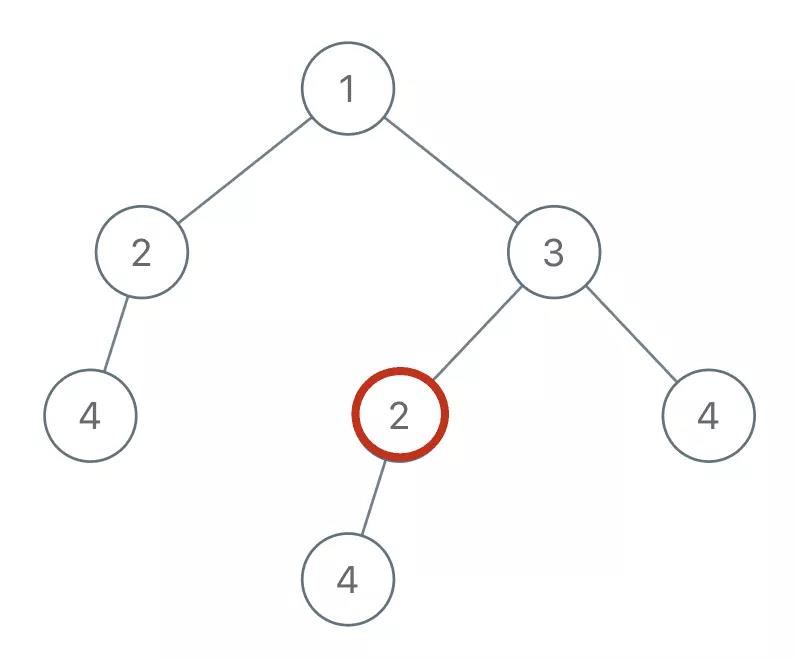

如果你想知道以自己为根的子树是不是重复的，是否应该被加入结果列表中，你需要知道两点：

1. **以我为根的这棵二叉树（子树）长啥样**？

2. **以其他节点为根的子树都长啥样**？

我得知道自己长啥样，还得知道别人长啥样，然后才能知道有没有人跟我重复，对不对？

#### **如何才能知道以自己为根的二叉树长啥样**？

这里就可以判断是使用什么遍历方式：

我要知道以自己为根的子树长啥样，是不是得先知道我的左右子树长啥样，再加上自己，就构成了整棵子树的样子？

比如：计算一棵二叉树有多少个节点。

```java
int count(TreeNode root) {
    if (root == null) {
        return 0;
    }
    // 先算出左右子树有多少节点
    int left = count(root.left);
    int right = count(root.right);
    /* 后序遍历代码位置 */
    // 加上自己，就是整棵二叉树的节点数
    int res = left + right + 1;
    return res;
}
```

这不就是标准的后序遍历框架嘛，和我们本题在思路上没啥区别对吧。

现在，明确了要用后序遍历，那应该怎么描述一棵二叉树的模样呢？二叉树的前序/中序/后序遍历结果可以描述二叉树的结构。

所以，我们可以通过拼接字符串的方式把二叉树序列化，看下代码：

```java
String traverse(TreeNode root) {
    // 对于空节点，可以用一个特殊字符表示
    if (root == null) {
        return "#";
    }
    // 将左右子树序列化成字符串
    String left = traverse(root.left);
    String right = traverse(root.right);
    /* 后序遍历代码位置 */
    // 左右子树加上自己，就是以自己为根的二叉树序列化结果
    String subTree = left + "," + right + "," + root.val;
    return subTree;
}
```

我们用非数字的特殊符`#`表示空指针，并且用字符`,`分隔每个二叉树节点值。

注意我们`subTree`是按照左子树、右子树、根节点这样的顺序拼接字符串，也就是后序遍历顺序。你完全可以按照前序或者中序的顺序拼接字符串，因为这里只是为了描述一棵二叉树的样子，什么顺序不重要。

**这样，我们第一个问题就解决了，对于每个节点，递归函数中的`subTree`变量就可以描述以该节点为根的二叉树**。

#### **我知道了自己长啥样，怎么知道别人长啥样**？

我们借助一个外部数据结构，让每个节点把自己子树的序列化结果存进去，这样，对于每个节点，不就可以知道有没有其他节点的子树和自己重复了么？

这里可以借助 HashSet 记录子树:

```java
// 记录所有子树
HashSet<String> memo = new HashSet<>();
// 记录重复的子树根节点
LinkedList<TreeNode> res = new LinkedList<>();

String traverse(TreeNode root) {
    if (root == null) {
        return "#";
    }

    String left = traverse(root.left);
    String right = traverse(root.right);

    String subTree = left + "," + right+ "," + root.val;

    if (memo.contains(subTree)) {
        // 有人和我重复，把自己加入结果列表
        res.add(root);
    } else {
        // 暂时没人跟我重复，把自己加入集合
        memo.add(subTree);
    }
    return subTree;
}
```

但是这样如果出现多棵重复的子树，结果集`res`中必然出现重复，而题目要求不希望出现重复。

所以将 HashSet 升级为 HashMap 记录每个子树出现的频次，即可解决：

```java
// 创建一个 HashMap 记录每个子树及其出现的频次
HashMap<String, Integer> memo = new HashMap<>();
// 创建一个 LinkedList 记录每一个重复的子树
LinkedList<TreeNode> res = new LinkedList<>();

public List<TreeNode> findDuplicateSubtrees(TreeNode root) {

    trverse(root); // 遍历二叉树
    return res;
}

public String trverse(TreeNode root) {

    //        StringBuilder s = new StringBuilder("#");
    // base case
    if (root == null) return "#";

    // 后序遍历的位置
    String left = trverse(root.left);
    String right = trverse(root.right);

    //        StringBuilder subTree = new StringBuilder();
    // 得到每一次递归的时候，每一个节点以自己为根节点时构成的子树 subTree
    String subTree = left + "," + right + "," + root.val;

    // 获取每一个子树出现的频次
    // 当Map集合中有这个key时，就使用这个key对应的value值，如果没有就使用默认值defaultValue
    // 相当于每次递归都会生成一个 subTree，每次都会判断 memo 中该子树的频次
    int freq = memo.getOrDefault(subTree, 0);
    memo.put(subTree, freq + 1);

    // 将前节点构成的子树与其他节点构成的子树进行对比
    if (freq == 1) {
        res.add(root);
    }

    return subTree; // 返回最终递归完成的 subTree，即序列化完成的结果
}
```

## 寻找第 K 小的元素(leetcode [230])

直接的思路就是升序排序，然后找第`k`个元素呗。BST 的中序遍历其实就是升序排序的结果：

```java
public int kthSmallest(TreeNode root, int k) {

    traverse(root, k);
    return res;
}

// 记录结果
int res = 0;
// 创建变量存放当前元素的排名
int rank = 0;

public void traverse(TreeNode root, int k) {

    // base case
    if (root == null) return;

    // 中序遍历
    traverse(root.left, k);

    /* 需要的操作 */
    // 因为时 BST 的中序遍历，所得的结果即是升序的结果
    // 所以每次递归，rank + 1
    rank ++;
    // 当 rank = K 时，即进行了 K 次递归，返回第 K 大的元素
    if (rank == k) {
        res = root.val;
        return;
    }

    traverse(root.right, k);

    return;
}
```

如果按照我们刚才说的方法，利用「BST 中序遍历就是升序排序结果」这个性质，每次寻找第`k`小的元素都要中序遍历一次，最坏的时间复杂度是`O(N)`，`N`是 BST 的节点个数。

要知道 BST 性质是非常牛逼的，像红黑树这种改良的自平衡 BST，增删查改都是`O(logN)`的复杂度，让你算一个第`k`小元素，时间复杂度竟然要`O(N)`，有点低效了。

**BST 的操作高效的原因：**

就拿搜索某一个元素来说，BST 能够在对数时间找到该元素的根本原因还是在 BST 的定义里，左子树小右子树大，所以每个节点都可以通过对比自身的值判断去左子树还是右子树搜索目标值，从而避免了全树遍历，达到对数级复杂度。

想找到第`k`小的元素，或者说找到排名为`k`的元素，如果想达到对数级复杂度，关键也在于每个节点得知道他自己排第几。

比如说你让我查找排名为`k`的元素，当前节点知道自己排名第`m`，那么我可以比较`m`和`k`的大小：

1. 如果`m == k`，显然就是找到了第`k`个元素，返回当前节点就行了。

2. 如果`k < m`，那说明排名第`k`的元素在左子树，所以可以去左子树搜索第`k`个元素。

3. 如果`k > m`，那说明排名第`k`的元素在右子树，所以可以去右子树搜索第`k - m - 1`个元素。

但这需要在二叉树节点中维护额外信息。**每个节点需要记录，以自己为根的这棵二叉树有多少个节点**。需要在 TreeNode 加一个字段

```java
class TreeNode {
    int val;
    // 以该节点为根的树的节点总数
    int size;
    TreeNode left;
    TreeNode right;
}
```

有了`size`字段，外加 BST 节点左小右大的性质，对于每个节点`node`就可以通过`node.left`推导出`node`的排名，从而做到我们刚才说到的对数级算法。

# 2021.1.16记录

## BST 转化累加树(leetcode [538 & 1038])

### 题目描述

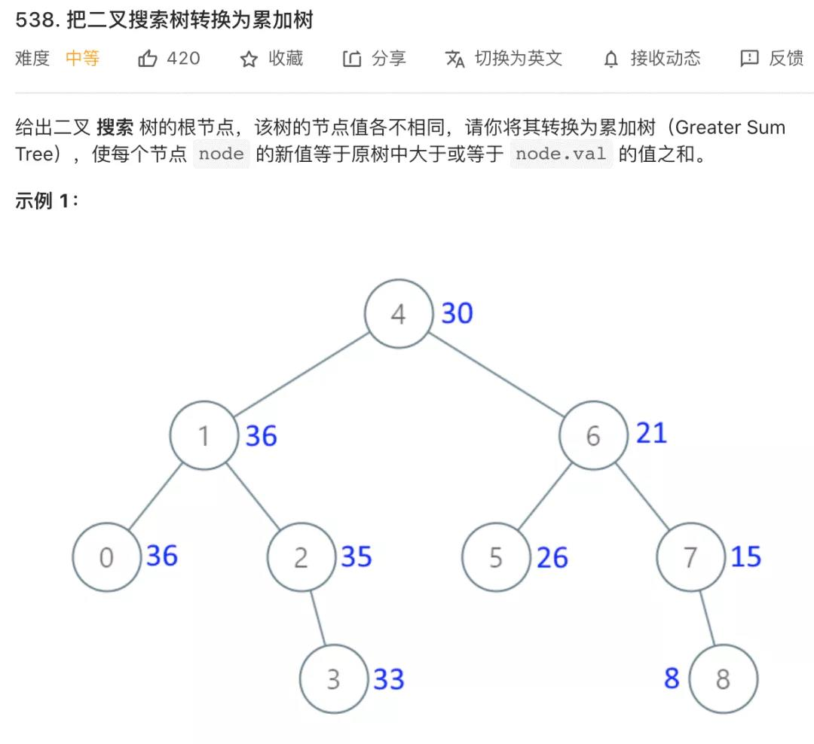

比如图中的节点 5，转化成累加树的话，比 5 大的节点有 6，7，8，加上 5 本身，所以累加树上这个节点的值应该是 5+6+7+8=26。

### 思路

**利用 BST 的中序遍历特性**。

BST 的中序遍历代码可以**升序**打印节点的值：

```java
void traverse(TreeNode root) {
    if (root == null) return;
    traverse(root.left);
    // 中序遍历代码位置
    print(root.val);
    traverse(root.right);
}
```

**降序**打印节点的值，修改代码：

```java
void traverse(TreeNode root) {
    if (root == null) return;
    // 先递归遍历右子树
    traverse(root.right);
    // 中序遍历代码位置
    print(root.val);
    // 后递归遍历左子树
    traverse(root.left);
}
```

**这段代码可以从大到小降序打印 BST 节点的值，如果维护一个外部累加变量`sum`，然后把`sum`赋值给 BST 中的每一个节点，不就将 BST 转化成累加树了吗**？

### 代码实现

```java
public TreeNode convertBST(TreeNode root) {

// traverse() 返回 root
return traverse(root);
}

// 定义一个 sum 记录每次遍历后降序求和的结果
// 比如：第一个 sum 就是最大节点的值，第二个 sum 是最大和第二大节点值的和，以此类推...
// 每一个 sum 赋值给当前 root 节点
int sum = 0;

public TreeNode traverse(TreeNode root) {

// base case
if (root == null) return null;

// 二叉搜索树的中序遍历
// 正常情况：从小到大，升序
// 先递归右子树：从大到小，降序
traverse(root.right);

sum += root.val;
root.val = sum;

traverse(root.left);

return root;
}
```

# 2021.1.17记录

## 扁平化嵌套列表迭代器(leetcode [341])

### 题目描述

首先，现在有一种数据结构`NestedInteger`，**这个结构中存的数据可能是一个`Integer`整数，也可能是一个`NestedInteger`列表**。注意，这个列表里面装着的是`NestedInteger`，也就是说这个列表中的每一个元素可能是个整数，可能又是个列表，这样无限递归嵌套下去……

`NestedInteger`有如下 API：

```java
public class NestedInteger {
    // 如果其中存的是一个整数，则返回 true，否则返回 false
    public boolean isInteger();

    // 如果其中存的是一个整数，则返回这个整数，否则返回 null
    public Integer getInteger();

    // 如果其中存的是一个列表，则返回这个列表，否则返回 null
    public List<NestedInteger> getList();
}
```

我们的算法会被输入一个`NestedInteger`列表，我们需要做的就是写一个迭代器类，将这个带有嵌套结构`NestedInteger`的列表「拍平」：

```java
public class NestedIterator implements Iterator<Integer> {
    // 构造器输入一个 NestedInteger 列表
    public NestedIterator(List<NestedInteger> nestedList) {}

    // 返回下一个整数
    public Integer next() {}

    // 是否还有下一个整数？
    public boolean hasNext() {}
}
```

我们写的这个类会被这样调用，**先调用`hasNext`方法，后调用`next`方法**：

```java
NestedIterator i = new NestedIterator(nestedList);
while (i.hasNext())
    print(i.next());
```


**迭代器是设计模式的一种**，目的就是为调用者屏蔽底层数据结构的细节，简单地通过`hasNext`和`next`方法有序地进行遍历。

### `NestedInteger`结构：

```java
public class NestedInteger {
    private Integer val;
    private List<NestedInteger> list;

    public NestedInteger(Integer val) {
        this.val = val;
        this.list = null;
    }
    public NestedInteger(List<NestedInteger> list) {
        this.list = list;
        this.val = null;
    }

    // 如果其中存的是一个整数，则返回 true，否则返回 false
    public boolean isInteger() {
        return val != null;
    }

    // 如果其中存的是一个整数，则返回这个整数，否则返回 null
    public Integer getInteger() {
        return this.val;
    }

    // 如果其中存的是一个列表，则返回这个列表，否则返回 null
    public List<NestedInteger> getList() {
        return this.list;
    }
}
```

### 和 N 叉树的关系：

```java
class NestedInteger {
    Integer val;
    List<NestedInteger> list;
}

/* 基本的 N 叉树节点 */
class TreeNode {
    int val;
    TreeNode[] children;
}
```

**这不就是棵 N 叉树吗？叶子节点是`Integer`类型，其`val`字段非空；其他节点都是`List<NestedInteger>`类型，其`val`字段为空，但是`list`字段非空，装着孩子节点**。

比如说输入是`[[1,1],2,[1,1]]`，其实就是如下树状结构：

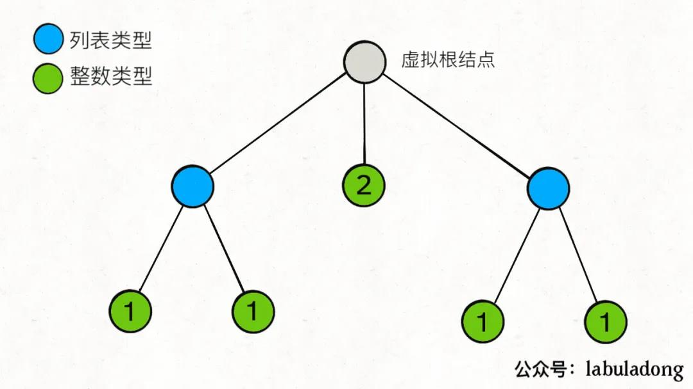

把一个`NestedInteger`扁平化对吧？**这不就等价于遍历一棵 N 叉树的所有「叶子节点」吗**？我把所有叶子节点都拿出来，不就可以作为迭代器进行遍历了吗？

### N 叉树的遍历框架

```java
void traverse(TreeNode root) {
    for (TreeNode child : root.children)
        traverse(child);
```

这个框架可以遍历所有节点，而我们只对整数型的`NestedInteger`感兴趣，也就是我们只想要「叶子节点」，所以`traverse`函数只要在到达叶子节点的时候把`val`加入结果列表即可。

### 代码实现：

```java
private Iterator<Integer> it;
// List<NestedInteger> 是一个包含 NestedInteger 整数和 NestedInteger 类型列表的一个无线嵌套的结果
// [1, 2, [1, 2], [1, [1, 2]], 3, [1, [12, 2, [1, 3, 4]]]]
public NestedIterator(List<NestedInteger> nestedList) {
    // 创建一个 result 列表存放将 List<NestedInteger> ”打平“之后的结果
    List<Integer> result = new LinkedList<>();
    for (NestedInteger node : nestedList) {

        // 以每个节点为根节点进行遍历，遍历函数：traverse()
        traverse(node, result);
    }
    // 得到 result 列表的迭代器
    this.it = result.iterator();
}

@Override
// 迭代器不是静止不动的，它是随着 next()方法而移动的
// 一开始迭代器在所有元素的左边，调用next()之后，迭代器移到第一个和第二个元素之间，next()方法返回迭代器刚刚经过的元素。
// hasNext()若返回True，则表明接下来还有元素，迭代器不在尾部。
// remove()方法必须和next方法一起使用，功能是去除刚刚next方法返回的元素。
public Integer next() {

    return it.next();
}

@Override
public boolean hasNext() {

    return it.hasNext();
}

public void traverse(NestedInteger root, List<Integer> result) {

    // base case：如果 root.isInteger() 返回 true, 说明此时的 root 是叶子节点
    if (root.isInteger()) {

        result.add(root.getInteger());
        return;
    }

    // 如果不是叶子节点，root.getList() 返回 List<NestedInteger> 列表
    // 再对这个列表里的 child 节点进行遍历判断：
    // 如果 child.getInteger() 为 true，就把这个节点装入 result
    // 否则继续遍历，以此输出所有的叶子节点的值装入 result 列表
    // N 叉树递归遍历过程
    for (NestedInteger child : root.getList()) {

        traverse(child, result);
    }
}
```

### 缺点及改进方案

我们的解法中，一次性算出了所有叶子节点的值，全部装到`result`列表，也就是内存中，`next`和`hasNext`方法只是在对`result`列表做迭代。如果输入的规模非常大，构造函数中的计算就会很慢，而且很占用内存。

一般的迭代器求值应该是「惰性的」，也就是说，如果你要一个结果，我就算一个（或是一小部分）结果出来，而不是一次把所有结果都算出来。

**改进思路：**

**调用`hasNext`时，如果`nestedList`的第一个元素是列表类型，则不断展开这个元素，直到第一个元素是整数类型**。

由于调用`next`方法之前一定会调用`hasNext`方法，这就可以保证每次调用`next`方法的时候第一个元素是整数型，直接返回并删除第一个元素即可。

```java
// 循环求拆解 NestedInteger 列表解法
private LinkedList<NestedInteger> list;
// List<NestedInteger> 是一个包含 NestedInteger 整数和 NestedInteger 类型列表的一个无线嵌套的结果
// [1, 2, [1, 2], [1, [1, 2]], 3, [1, [12, 2, [1, 3, 4]]]]
public NestedIterator(List<NestedInteger> nestedList) {

    // 不直接用 nestedList 的引用，是因为不能确定它的底层实现
    // 必须保证是 LinkedList，否则下面的 addFirst 会很低效
    list = new LinkedList<>(nestedList);
}

@Override
// 迭代器不是静止不动的，它是随着 next()方法而移动的
// 一开始迭代器在所有元素的左边，调用next()之后，迭代器移到第一个和第二个元素之间，next()方法返回迭代器刚刚经过的元素。
// hasNext()若返回True，则表明接下来还有元素，迭代器不在尾部。
// remove()方法必须和next方法一起使用，功能是去除刚刚next方法返回的元素。
// 因为 hasNext() 方法保证了将 NestedInteger 列表的第一个元素为“打平”之后的整数
public Integer next() {

    // 返回列表中的整数
    return list.remove(0).getInteger();
}

@Override
public boolean hasNext() {

    // 当 list 列表中第一个元素是一个被嵌套的列表时，将其展开
    while (!list.isEmpty() && !list.get(0).isInteger()) {

        // 取出 list 列表中的第一个元素并删除,这样下一个列表中的元素才能到第一个位置
        List<NestedInteger> first = list.remove(0).getList();

        // 将 first 列表中的元素“打平”
        // 即使 first 列表中还有 NestedInteger 类型的列表嵌套，只要 list 的第一个元素不是整数，一直在 while 循环
        for (int i = first.size() - 1; i >= 0; i--) {

            list.addFirst(first.get(i));
        }
    }

    return !list.isEmpty();
}
```

# 2021.1.19记录

## 数据流的中位数(LeetCode[295])

### 题目描述

如果输入一个数组，求中位数：排序

+ 如果数组长度是奇数，最中间的一个元素就是中位数；

+ 如果数组长度是偶数，最中间两个元素的平均数作为中位数。

如果数据规模非常巨大，排序是不太现实的。

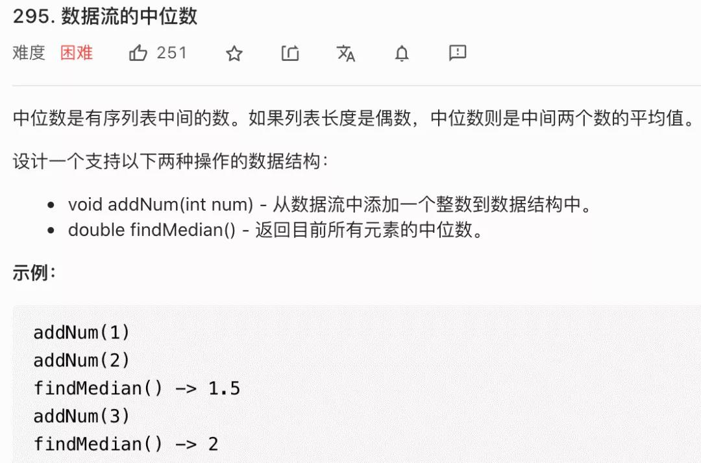

一个直接的解法可以用一个数组记录所有`addNum`添加进来的数字，通过插入排序的逻辑保证数组中的元素有序，当调用`findMedian`方法时，可以通过数组索引直接计算中位数。

但是用数组作为底层容器的问题也很明显，`addNum`搜索插入位置的时候可以用二分搜索算法，但是插入操作需要搬移数据，所以最坏时间复杂度为 O(N)。那换链表？链表插入元素很快，但是查找插入位置的时候只能线性遍历，最坏时间复杂度还是 O(N)。

### 思路

**我们必然需要有序数据结构，本题的核心思路是使用两个优先级队列**。

#### Java 中优先级队列介绍

Java中PriorityQueue通过二叉小顶堆实现，可以用一棵完全二叉树表示。它可以对插入的元素**自动排序**。乱序的元素插入其中就被放到了正确的位置，可以按照从小到大（或从大到小）有序地取出元素。

+ add()和offer()

  `add(E e)`和`offer(E e)`的语义相同，都是向优先队列中插入元素，只是`Queue`接口规定二者对插入失败时的处理不同，前者在插入失败时抛出异常，后则则会返回`false`。

+ `element()`和`peek()`的语义完全相同，都是获取但不删除队首元素，也就是队列中权值最小的那个元素，二者唯一的区别是当方法失败时前者抛出异常，后者返回`null`。根据小顶堆的性质，堆顶那个元素就是全局最小的那个；

+ `remove()`和`poll()`方法的语义也完全相同，都是获取并删除队首元素，区别是当方法失败时前者抛出异常，后者返回`null`。

+ `remove(Object o)`方法用于删除队列中跟`o`相等的某一个元素（如果有多个相等，只删除一个），该方法不是*Queue*接口内的方法，而是*Collection*接口的方法。

中位数是有序数组最中间的元素算出来的对吧，我们可以把「有序数组」抽象成一个倒三角形(**从小到大的队列，顶部是最大元素**)，宽度可以视为元素的大小，那么这个倒三角的中部就是计算中位数的元素。

这个大的倒三角形从正中间切成两半，变成一个小倒三角和一个梯形，这个小倒三角形相当于一个**从小到大的有序数组**，这个梯形相当于一个**从大到小的有序数组**。(从底部往上看的)

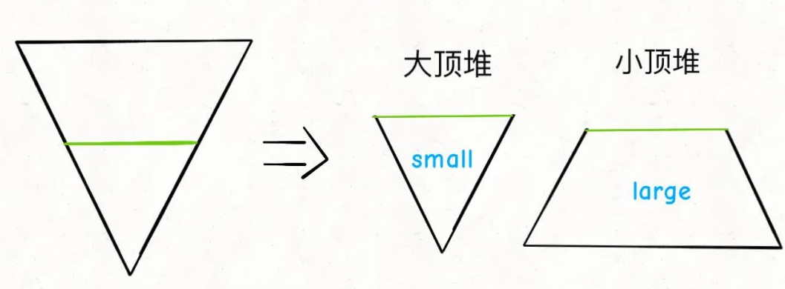

梯形虽然是小顶堆，但其中的元素是较大的，我们称其为`large`，倒三角虽然是大顶堆，但是其中元素较小，我们称其为`small`。(因为本身就是由一个大顶堆分开而成的)

==要想求出中位数，**两个堆中的元素之差不能超过 1**。==

**`findMedian`函数思路**，假设元素总数是`n`：

+ 如果`n`是偶数，我们希望两个堆的元素个数是一样的，这样把两个堆的堆顶元素拿出来求个平均数就是中位数；
+ 如果`n`是奇数，那么我们希望两个堆的元素个数分别是`n/2 + 1`和`n/2`，这样元素多的那个堆的堆顶元素就是中位数。

现在的问题是，如何实现`addNum`方法，维护「两个堆中的元素之差不能超过 1」这个条件呢？

==**不仅要维护`large`和`small`的元素个数之差不超过 1，还要维护`large`堆的堆顶元素要大于等于`small`堆的堆顶元素**。==

**简单说，想要往`large`里添加元素，不能直接添加，而是要先往`small`里添加，然后再把`small`的堆顶元素加到`large`中；向`small`中添加元素同理**。

假设我们准备向`large`中插入元素：

+ 如果插入的`num`小于`small`的堆顶元素，那么`num`就会留在`small`堆里，为了保证两个堆的元素数量之差不大于 1，作为交换，把`small`堆顶部的元素再插到`large`堆里。
+ 如果插入的`num`大于`small`的堆顶元素，那么`num`就会成为`samll`的堆顶元素，最后还是会被插入`large`堆中。
+ 反之，向`small`中插入元素是一个道理，这样就巧妙地保证了`large`堆整体大于`small`堆，且两个堆的元素之差不超过 1，那么中位数就可以通过两个堆的堆顶元素快速计算了。

### 时间复杂度

`addNum`方法时间复杂度 O(logN)，`findMedian`方法时间复杂度 O(1)。

### 代码实现

```java
/** initialize your data structure here. */
// 求中位数可以将元素进行排序求中间元素(分奇偶讨论)
// 可以把排序好的数看成一个大顶堆(倒三角)，从中间一分为二
// 第一部分：仍是倒三角，即大顶堆
// 第二部分：成了一个梯形，即小顶堆
// 大顶堆顶部元素 < 小顶堆顶部元素
// ①当输入数据为奇数时，中位数就是元素多的那个堆的顶部元素
// ②当输入数据为偶数时，中位数就是两个堆的顶部元素之和/2
private PriorityQueue<Integer> small;
private PriorityQueue<Integer> large;
public MedianFinder() {
    // 初始化小顶堆
    small = new PriorityQueue<>();
    // 初始化大顶堆
    large = new PriorityQueue<>((a, b) -> {
        return b - a;
    });
}

/* 向堆中添加元素 */
// 核心思想：保持两堆元素个数只差不超过1，并且始终保持大顶堆堆顶元素小于小顶堆堆顶元素
public void addNum(int num) {

    if (small.size() >= large.size()) {
        // 按道理说此时新加元素要加到大顶堆中
        // 但先把要添加的元素加到小顶堆中进行排序后
        // 将排序好的堆顶元素(大顶堆中的最大元素)加到小顶堆中
        // 保持大顶堆顶部元素 < 小顶堆顶部元素
        small.offer(num);
        large.offer(small.poll());
    } else {
        large.offer(num);
        small.offer(large.poll());
    }
}

/* 寻找中位数 */
// 核心思想：使大顶堆和小顶堆元素个数相差不超过 1
public double findMedian() {

    // 如果两个堆元素不相同，则元素多的堆的顶部元素必是中位数
    if (small.size() > large.size()) {
        return small.peek();
    } else if (small.size() < large.size()){
        return large.peek();
    }

    // 两个堆元素相等
    return (small.peek() + large.peek()) / 2.0;
}
```

# 2021.1.20记录

## list<Integer> 与 int[] 互转

### int[] 转 List<Integer>

```java
// int[] 转 List<Integer>
List<Integer> list1 = Arrays.stream(data).boxed().collect(Collectors.toList());
// Arrays.stream(arr) 可以替换成IntStream.of(arr)。
// 1.使用Arrays.stream将int[]转换成IntStream。
// 2.使用IntStream中的boxed()装箱。将IntStream转换成Stream<Integer>。
// 3.使用Stream的collect()，将Stream<T>转换成List<T>，因此正是List<Integer>。
```

### List<Integer> 转 int[]

```java
// List<Integer> 转 int[]
int[] arr1 = list1.stream().mapToInt(Integer::valueOf).toArray();
// 想要转换成int[]类型，就得先转成IntStream。
// 这里就通过mapToInt()把Stream<Integer>调用Integer::valueOf来转成IntStream
// 而IntStream中默认toArray()转成int[]。

// 将 ArrayList res 转换成 int[] 类型返回
int[] arr = new int[res.size()];
for (int i = 0; i < res.size(); i++) {
    arr[i] = res.get(i);
}
```

### int[] 转 Integer[]

```java
// int[] 转 Integer[]
Integer[] integers1 = Arrays.stream(data).boxed().toArray(Integer[]::new);
// 前两步同上，此时是Stream<Integer>。
// 然后使用Stream的toArray，传入IntFunction<A[]> generator。
// 这样就可以返回Integer数组。
// 不然默认是Object[]。
```

###  Integer[] 转 int[]

```java
// Integer[] 转 int[]
int[] arr2 = Arrays.stream(integers1).mapToInt(Integer::valueOf).toArray();
// 思路同上。先将Integer[]转成Stream<Integer>，再转成IntStream。
```

### List<Integer> 转 Integer[]

```java
// List<Integer> 转 Integer[]
Integer[] integers2 = list1.toArray(new Integer[0]);
// 调用toArray。传入参数T[] a。这种用法是目前推荐的。
// List<String>转String[]也同理。
```

### Integer[] 转 List<Integer>

```java
// Integer[] 转 List<Integer>
List<Integer> list2 = Arrays.asList(integers1);
// 最简单的方式。String[]转List<String>也同理。
```

## 滑动窗口最大值(Leetcode[239])

### 题目描述

输入一个数组`nums`和一个正整数`k`，有一个大小为`k`的窗口在`nums`上从左至右滑动，请你输出每次窗口中`k`个元素的最大值。

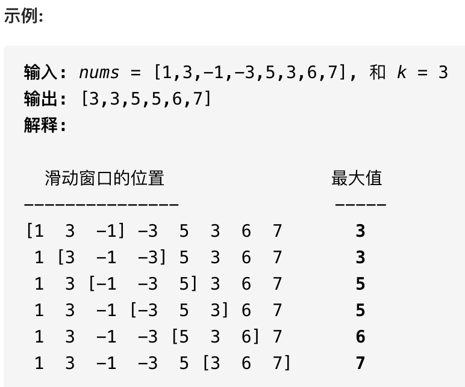

### 解题思路

本题难点在于如何在`O(1)`时间算出每个「窗口」中的最大值，使得整个算法在线性时间完成。这种问题的特殊点在于，「窗口」是不断滑动的，也就是你得**动态地**计算窗口中的最大值。

**在一堆数字中，已知最值为`A`，如果给这堆数添加一个数`B`，那么比较一下`A`和`B`就可以立即算出新的最值；但如果减少一个数，就不能直接得到最值了，因为如果减少的这个数恰好是`A`，就需要遍历所有数重新找新的最值**。

这道题的场景，每个窗口前进的时候，要添加一个数同时减少一个数，所以想在 O(1) 的时间得出新的最值，不是那么容易的，需要「单调队列」这种特殊的数据结构来辅助。

「单调队列」就是一个「队列」，只是使用了一点巧妙的方法，使得**队列中的元素全都是单调递增（或递减）的**。

一个普通的队列一定有这两个操作：

> ```java
> class Queue {
>     // enqueue 操作，在队尾加入元素 n
>     void push(int n);
>     // dequeue 操作，删除队头元素
>     void pop();
> }
> ```

一个「单调队列」的操作也差不多：

```java
class MonotonicQueue {
    // 在队尾添加元素 n
    void push(int n);
    // 返回当前队列中的最大值
    int max();
    // 队头元素如果是 n，删除它
    void pop(int n);
}
```

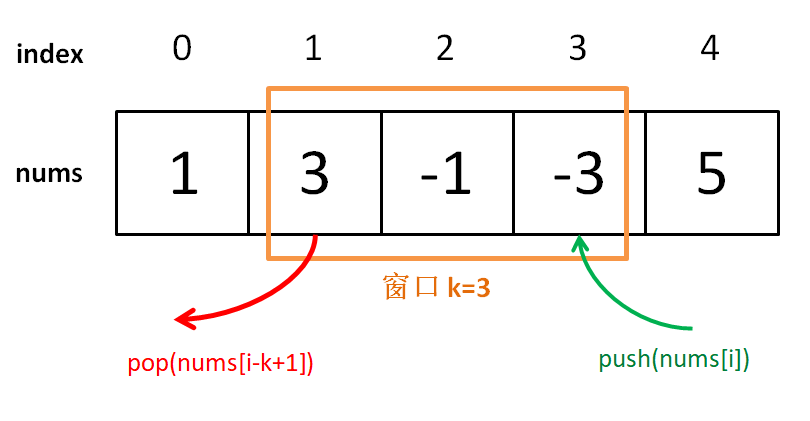

### 单调队列数据结构的实现

观察滑动窗口的过程就能发现，实现「单调队列」必须使用一种数据结构支持在头部和尾部进行插入和删除，很明显**双链表**是满足这个条件的。

「单调队列」的核心思路和「单调栈」类似，`push`方法依然在队尾添加元素，**但是要把前面比自己小的元素都删掉。**

可以想象，加入数字的大小代表人的体重，把前面体重不足的都压扁了，直到遇到更大的量级才停住。

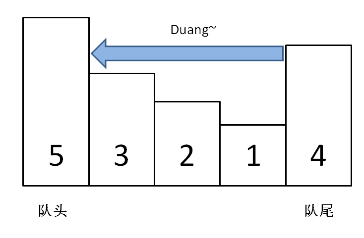

如果每个元素被加入时都这样操作，最终单调队列中的元素大小就会保持一个**单调递减**的顺序。

队头元素`n`也可能已经被「压扁」了，可能已经不存在了。

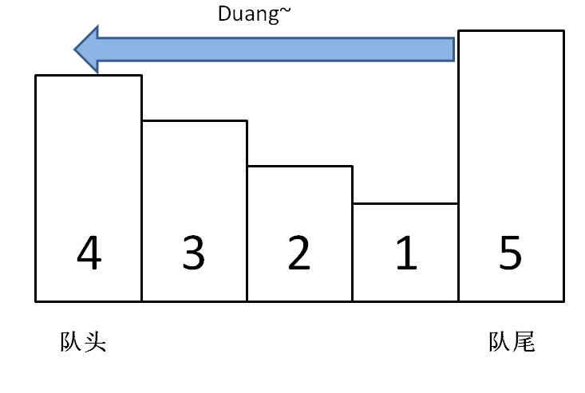

### 代码实现

```java
public class MonotonicQueue {

    // 底层用双向链表实现, 有三个 api
    LinkedList<Integer> q = new LinkedList<>();

    // ①push() 成员方法的实现
    public void push(int n) {

        // 加入元素之前会把 q 中小于该元素的其他元素删除，保持单调递减性
        while (!q.isEmpty() && q.getLast() < n) { // 相等的情况不能删
            q.pollLast();
        }
        // 然后在加入元素 n
        q.addLast(n);
    }

    // ②max() 方法
    public int max() {

        // 因为新加的元素只有当它之前有元素比它大时才会加入
        // 所以链表的头部元素就是最大的
        return q.getFirst();
    }

    // ③pop() 方法
    public void pop(int n) {

        // 因为会出现 q 头部的元素比后来添加的元素小的情况
        // 所以很有可能还没调用 pop() 方法，就被 push() 方法删除了
        if (n == q.getFirst()) {
            q.pollFirst();
        }
    }
}

public int[] maxSlidingWindow(int[] nums, int k) {

    MonotonicQueue window = new MonotonicQueue();
    // 使用数组存放结果方便根据索引查询
    ArrayList<Integer> res = new ArrayList<>();

    for (int i = 0; i < nums.length; i++) {

        // 先把窗口的前 k - 1 个元素填满
        if (i < k - 1) {

            window.push(nums[i]);
        } else { // 填充第三个元素的时候要同时计算窗口中的最大值

            // 队尾填充新元素
            window.push(nums[i]);
            // 将窗口中的最大值装入 res
            res.add(window.max());
            // 删除窗口队头的元素，为下一次填充元素求最大值做准备
            window.pop(nums[i - k + 1]);
        }
    }
    // 将 ArrayList res 转换成 int[] 类型返回
    int[] arr = new int[res.size()];
    for (int i = 0; i < res.size(); i++) {
        arr[i] = res.get(i);
    }
    return arr;
    //        return res.stream().mapToInt(Integer::valueOf).toArray();
}
```

### 算法复杂度分析

在实现`MonotonicQueue`时，我们使用了 Java 的`LinkedList`，因为链表结构支持在头部和尾部快速增删元素；而在解法代码中的`res`则使用的`ArrayList`结构，因为后续会按照索引取元素，所以数组结构更合适。

`push`操作中含有 while 循环，时间复杂度应该不是`O(1)`呀，那么本算法的时间复杂度应该不是线性时间吧？

单独看`push`操作的复杂度确实不是`O(1)`，但是算法整体的复杂度依然是`O(N)`线性时间。要这样想，`nums`中的每个元素最多被`push_back`和`pop_back`一次，没有任何多余操作，所以整体的复杂度还是`O(N)`。

空间复杂度就很简单了，就是窗口的大小`O(k)`。

## Java LinkedList 的方法

+ **int size（）：它返回此列表中元素的数量。**
+ void clear（）：它删除列表中的所有元素。
+ Object clone（）：它用于制作现有链接列表的副本。
+ **Object set（int index，Object element）：它用于用新元素替换列表中的现有元素。**
+ **boolean contains（Object element）：如果元素存在于列表中，则返回true。**
+ boolean add（Object element）：它将元素附加到列表的末尾。
+ **void addLast（Object element）：它将元素附加在列表的末尾**
+ **void add（int index，Object element）：它将元素插入列表中'index'位置。**
+ boolean addAll（Collection C）：它将一个集合追加到链接列表。
+ **Object get（int index）：它返回列表中位置'index'处的元素。如果索引超出了列表的范围，它会抛出'IndexOutOfBoundsException'。**
+ **Object getFirst（）：它返回链表的第一个元素。**
+ **Object getLast（）：它返回链接列表的最后一个元素。**
+ int indexOf（Object element）：如果找到元素，它将返回元素第一次出现的索引。否则，它返回-1。
+ int lastIndexOf（Object element）：如果找到元素，它将返回元素最后一次出现的索引。否则，它返回-1
+ **Object remove（）：它用于从列表头部删除并返回元素。**
+ **Object remove（int index）：它删除此列表中位置'index'处的元素。如果列表为空，它会抛出'NoSuchElementException'。**
+ boolean remove（Object O）：它用于从链表中移除一个特定的元素并返回一个布尔值。
+ **Object removeLast（）：它用于删除并返回链接列表的最后一个元素。**
+ **Object pollLast() : 此方法用于检索链表的最后一个元素或结尾元素，最后从列表中删除最后一个元素。如果列表为空，则它将返回null。**与 remove() 的区别是当没有特定元素的时候返回不一样，remove() 报异常，pollLast() 返回 null。

## 用栈实现队列(Leetcode[232])

队列是一种**先进先出**的数据结构，栈是一种**先进后出**的数据结构，形象一点就是这样：

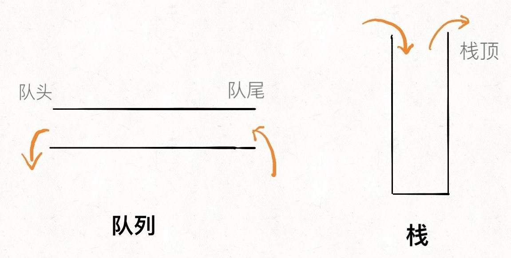

这两种数据结构底层其实都是数组或者链表实现的，只是 API 限定了它们的特性。

**队列的 API**

```java
class MyQueue {

    /** 添加元素到队尾 */
    public void push(int x);

    /** 删除队头的元素并返回 */
    public int pop();

    /** 返回队头元素 */
    public int peek();

    /** 判断队列是否为空 */
    public boolean empty();
}
```

### 思路

我们使用两个栈`s1, s2`就能实现一个队列的功能（这样放置栈可能更容易理解）：

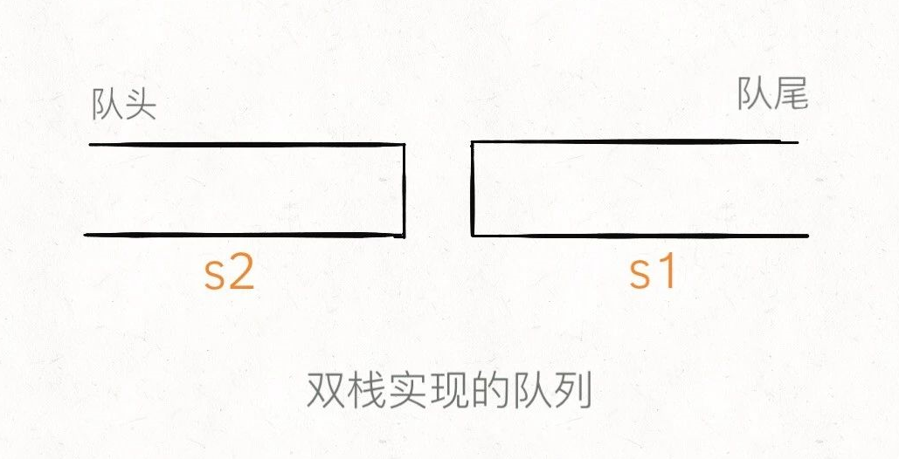

当调用`push`让元素入队时，只要把元素压入`s1`即可，比如说`push`进 3 个元素分别是 1,2,3，那么底层结构就是这样：

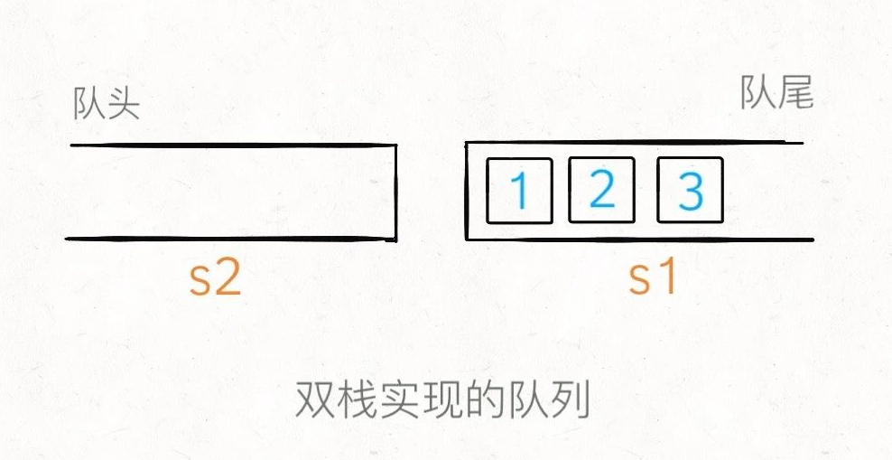

如果这时候使用`peek`查看队头的元素怎么办呢？按道理队头元素应该是 1，但是在`s1`中 1 被压在栈底，现在就要轮到`s2`起到一个中转的作用了：

**当`s2`为空时，可以把`s1`的所有元素取出再添加进`s2`，这时候`s2`中元素就是先进先出顺序了**。

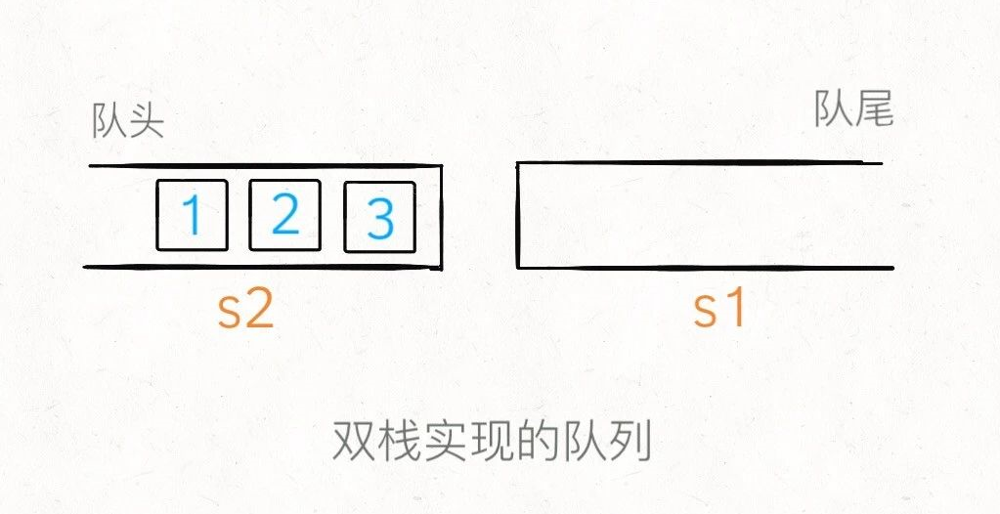

### 代码实现

```java

```


### 算法复杂度分析

其他操作都是 O(1)，有点意思的是`peek`操作，调用它时可能触发`while`循环，这样的话时间复杂度是 O(N)，但是大部分情况下`while`循环不会被触发，时间复杂度是 O(1)。由于`pop`操作调用了`peek`，它的时间复杂度和`peek`相同。

像这种情况，可以说它们的**最坏时间复杂度**是 O(N)，因为包含`while`循环，**可能**需要从`s1`往`s2`搬移元素。

但是它们的**均摊时间复杂度**是 O(1)，这个要这么理解：对于一个元素，最多只可能被搬运一次，也就是说`peek`操作平均到每个元素的时间复杂度是 O(1)。

## 用队列实现栈(Leetcode[225])

### 思路

+ 先说`push`API，直接将元素加入队列，同时记录队尾元素，因为**队尾元素相当于栈顶元素**，如果要`top`查看栈顶元素的话可以直接返回。
+ 底层数据结构是先进先出的队列，每次`pop`**只能从队头取元素**；但是栈是后进先出，也就是说`pop`API 要从队尾取元素。

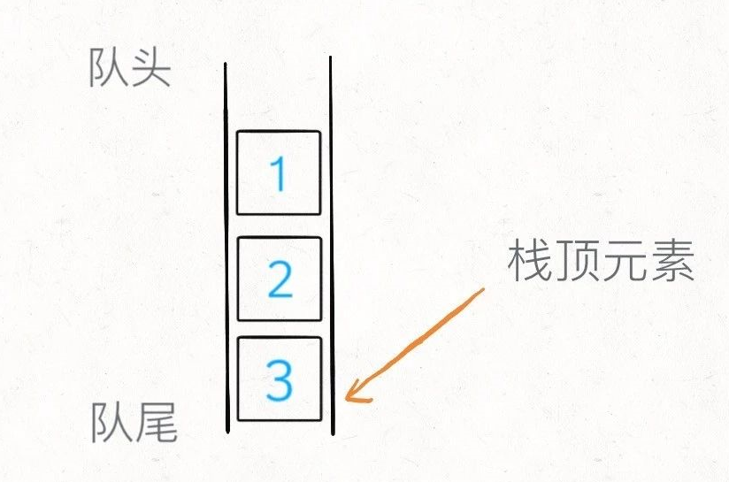

​	

​	解决方法简单粗暴，把队列前面的都取出来再加入队尾，让	之前的队尾元素排到队头，这样就可以取出了。

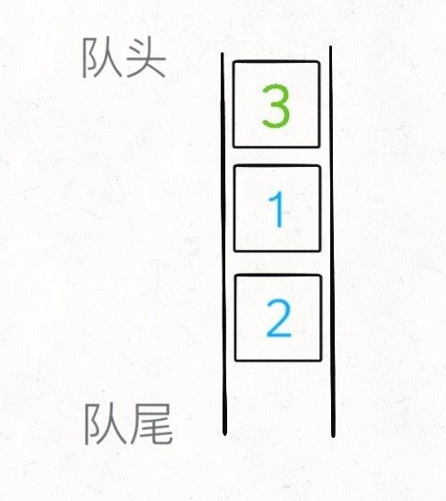

​	这样实现还有一点小问题就是，原来的队尾元素被提到队头	并删除了，但是`top_elem`变量没有更新。

+ 最后，API`empty`就很容易实现了，只要看底层的队列是否为空即可

### 代码实现

```java
Queue<Integer> q;
int top_elem;
/** Initialize your data structure here. */
public MyStack() {

    q = new LinkedList<>();
    this.top_elem = 0;
}

/** Push element x onto stack. */
public void push(int x) {

    // 因为底层是队列，先进先出(尾部加入，头部取出)
    // 用于实现栈，则新加入队列的元素(队列尾部)为栈顶元素
    q.offer(x);
    top_elem = x;
}

/** Removes the element on top of the stack and returns that element. */
public int pop() {

    // 获取栈顶(队列尾部)元素好获取，因为在每次 push() 的时候可以用一个变量记录
    // 但是 remove 的时候，队列仅提供队列头部元素的 remove 方法
    // 将队头的元素取出来重新添加到队尾，这样队尾的元素就被提到队头了
    int size = q.size();
    // 暂时保存队尾的两个元素
    while (size > 2) {

        // 循环将队列头部的元素加到队尾
        q.offer(q.poll());
        size--;
    }

    // 此时原队列尾部的两个元素被移到头部了
    // 更新 top_elem：即为即将要放到队尾的元素
    top_elem = q.peek();
    // 再把这个元素移到队尾
    q.offer(q.poll());
    // 此时原来在队尾的元素被真正移到队头了，返回即可
    return q.poll();
}

/** Get the top element. */
public int top() {

    // 返回栈顶元素，即 push() 后的元素 top_elem
    return top_elem;
}

/** Returns whether the stack is empty. */
public boolean empty() {

    return q.isEmpty();
}
```

### 复杂度分析

很明显，用队列实现栈的话，pop 操作时间复杂度是 O(N)，其他操作都是 O(1)。

# 2021.1.21记录

## 队列 java.util.Queue 方法

+ **add**    增加一个元索           如果队列已满，则抛出一个IIIegaISlabEepeplian异常
+ **remove**  移除并返回队列头部的元素  如果队列为空，则抛出一个NoSuchElementException异常
+ **element** 返回队列头部的元素       如果队列为空，则抛出一个NoSuchElementException异常
+ **peek**    返回队列头部的元素       如果队列为空，则返回null
+ **offer**    添加一个元素并返回true    如果队列已满，则返回false
+ **poll**     移除并返问队列头部的元素  如果队列为空，则返回null
+ **put**     添加一个元素           如果队列满，则阻塞
+ **take**    移除并返回队列头部的元素   如果队列为空，则阻塞

## 二分查找算法详解

总的模板：

```java
int binarySearch(int[] nums, int target) {
    int left = 0, right = ...;
    
    while(...) {
        int mid = (right + left) / 2;
        if (nums[mid] == target) {
            ...
        } else if (nums[mid] < target) {
            // 在 mid 的右边区间继续查找
            left = ...;
        } else if (nums[mid] > target) {
            // 在 mid 的左边区间继续查找
            right = ...;
        }
    }
    return ...;
}
```

**分析二分查找的一个技巧是：不要出现 else，而是把所有情况用 else if 写清楚，这样可以清楚地展现所有细节**。其中...标记的部分，就是可能出现细节问题的地方，当你见到一个二分查找的代码时，首先注意这几个地方。

### 寻找一个数(基本的二分搜索)

**应用场景：**搜索一个数，如果存在，返回其索引，否则返回 -1

#### 代码框架

```java
int binarySearch(int[] nums, int target) {
    int left = 0;
    int right = nums.length - 1; // 注意
    
    while(left <= right) { // 注意
        int mid = (right + left) / 2;
        if (nums[mid] == target) {
            return mid;
        } else if (nums[mid] < target) {
            left = mid - 1; // 注意
        } else if (nums[mid] >  target) {
            right = mid + 1; // 注意
        }
    }
    return -1;
}
```

>  *1*. 为什么 while 循环的条件中是 <=，而不是 < ？

答：因为元素索引从 0 开始，初始化 right 的赋值是 nums.length - 1，即最后一个元素的索引，而不是 nums.length。

这二者可能出现在不同功能的二分查找中，区别是：前者相当于两端都闭区间 [left, right]，后者相当于左闭右开区间 [left, right)，因为索引大小为 nums.length 是越界的。

我们这个算法中使用的是 [left, right] 两端都闭的区间。**这个区间就是每次进行搜索的区间，我们不妨称为「搜索区间」**。

> *2*. 什么时候应该停止搜索呢？

答：如果没找到，就需要 while 循环终止，然后返回 -1。那 while 循环什么时候应该终止？**搜索区间为空的时候应该终止**，意味着你没得找了，就等于没找到嘛。

+ while(left <= right)的终止条件是 left == right + 1，写成区间的形式就是 [right + 1, right]，或者带个具体的数字进去 [3, 2]，可见**这时候搜索区间为空**，因为没有数字既大于等于 3 又小于等于 2 的吧。所以这时候 while 循环终止是正确的，直接返回 -1 即可。
+ while(left < right)的终止条件是 left == right，写成区间的形式就是 [right, right]，或者带个具体的数字进去 [2, 2]，**这时候搜索区间非空**，还有一个数 2，但此时 while 循环终止了。也就是说这区间 [2, 2] 被漏掉了，索引 2 没有被搜索，如果这时候直接返回 -1 就可能出现错误。

> *3.*为什么 left = mid + 1，right = mid - 1？

我看有的代码是 right = mid 或者 left = mid，没有这些加加减减，到底怎么回事，怎么判断？

答：刚才明确了「搜索区间」这个概念，而且本算法的搜索区间是两端都闭的，即 [left, right]。那么当我们发现索引 mid 不是要找的 target 时，如何确定下一步的搜索区间呢？

当然是去搜索 [left, mid - 1] 或者 [mid + 1, right] 对不对？因为 mid 已经搜索过，应该从搜索区间中去除。

> *4.*此算法有什么缺陷？

比如说给你有序数组 nums = [1,2,2,2,3]，target = 2，此算法返回的索引是 2，没错。但是如果我想得到 target 的左侧边界，即索引 1，或者我想得到 target 的右侧边界，即索引 3，这样的话此算法是无法处理的。

这样的需求很常见。你也许会说，找到一个 target 索引，然后向左或向右线性搜索不行吗？可以，但是不好，因为这样难以保证二分查找对数级的复杂度了。

### 寻找左侧边界的二分搜索

**代码框架：**

```java
int left_bound(int[] nums, int target) {
    if (nums.length == 0) return -1;
    int left = 0;
    int right = nums.length; // 注意

    while (left < right) { // 注意
        int mid = (left + right) / 2;
        if (nums[mid] == target) {
            // 此时把搜索区间分成[left, mid)
            // 然后再在这个区间内寻找
            right = mid; // 注意
        } else if (nums[mid] < target) {
            left = mid + 1;
        } else if (nums[mid] > target) {
            right = mid; // 注意
        }
    }
    // ①当数组中存在 target时， right = mid，[left, mid) 左闭右开，只有当 left = right = mid 时才会停止搜索，即 return left <==> return right <==> return mid;
    // ②当数组中不存在 target 时，「左侧边界」的含义就是在数组中寻找比 target 元素小的元素个数
    return left;
}
```

> *1.*为什么没有返回 -1 的操作？如果 nums 中不存在 target 这个值，怎么办？

答：先理解一下这个「左侧边界」有什么特殊含义：

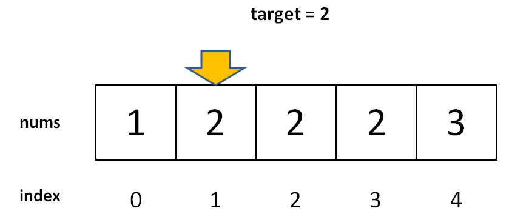

对于这个数组，算法会返回 1。这个 1 的含义可以这样解读：nums 中小于 2 的元素有 1 个。如果 target = 4，则会返回 5，表示 nums 中小于 4 的元素有五个。

综上可以看出，函数的返回值（即 left 变量的值）取值区间是闭区间 [0, nums.length]，所以我们简单添加两行代码就能在正确的时候 return -1：

```java
while (left < right) {
    //...
}
// 如果 target 比数组中所有数都大，所以此时 left 会逐步逼近 right，并最终成为 righ = nums.length
// 此时就表示没有匹配项
if (left == num.length) return -1;
// 如果 left 还在搜索区间[left, right)内,如果找到匹配的元素，则返回该元素的索引，否则返回 -1
return nums[left] == target ? left : -1;
```

> *2.* 为什么 left = mid + 1，right = mid ？和之前的算法不一样？

答：这个很好解释，因为我们的「搜索区间」是 [left, right) 左闭右开，所以当 nums[mid] 被检测之后，下一步的搜索区间应该去掉 mid 分割成两个区间，即 [left, mid) 或 [mid + 1, right)。

> *3.*为什么该算法能够搜索左侧边界？

答：关键在于对于 nums[mid] == target 这种情况的处理：

```java
    if (nums[mid] == target)
        right = mid;
```

可见，找到 target 时不要立即返回，而是缩小「搜索区间」的上界 right，在区间 [left, mid) 中继续搜索，即不断向左收缩，达到锁定左侧边界的目的。

> *4.* 为什么返回 left 而不是 right？

答：都是一样的，因为 while 终止的条件是 left == right。

### 寻找右侧边界的二分查找

**代码框架：**

```java
int right_bound(int[] nums, int target) {
    if (nums.length == 0) return -1;
    int left = 0, right = nums.length;

    while (left < right) {
        int mid = (left + right) / 2;
        if (nums[mid] == target) {
            left = mid + 1; // 注意
        } else if (nums[mid] < target) {
            left = mid + 1;
        } else if (nums[mid] > target) {
            right = mid;
        }
    }
    return left - 1; // 注意
}
```

>*1.*为什么这个算法能够找到右侧边界？

答：类似地，关键点还是这里：

```java
    if (nums[mid] == target) {
        left = mid + 1;
```

当 nums[mid] == target 时，不要立即返回，而是增大「搜索区间」的下界 left，使得区间不断向右收缩，达到锁定右侧边界的目的。

>*2.*为什么最后返回 left - 1 而不像左侧边界的函数，返回 left？而且我觉得这里既然是搜索右侧边界，应该返回 right 才对。

答：首先，while 循环的终止条件是 left == right，所以 left 和 right 是一样的，你非要体现右侧的特点，返回 right - 1 好了。

至于为什么要减一，这是搜索右侧边界的一个特殊点，关键在这个条件判断：

```java
    if (nums[mid] == target) {
        left = mid + 1;
        // 这样想: mid = left - 1
```

因为我们对 left 的更新必须是 left = mid + 1，就是说 while 循环结束时，nums[left] 一定不等于 target 了，而 nums[left - 1] 可能是 target。

> *3.* 为什么没有返回 -1 的操作？如果 nums 中不存在 target 这个值，怎么办？

答：类似之前的左侧边界搜索，因为 while 的终止条件是 left == right，就是说 left 的取值范围是 [0, nums.length]，所以可以添加两行代码，正确地返回 -1：

```java
while (left < right) {
    // ...
}
if (left == 0) return -1;
return nums[left-1] == target ? (left-1) : -1;
```

### 总结

+ 最基本的二分查找算法：

```
因为我们初始化 right = nums.length - 1
所以决定了我们的「搜索区间」是 [left, right]
所以决定了 while (left <= right)
同时也决定了 left = mid+1 和 right = mid-1

因为我们只需找到一个 target 的索引即可
所以当 nums[mid] == target 时可以立即返回
```

+ 寻找左侧边界的二分查找：

```
因为我们初始化 right = nums.length
所以决定了我们的「搜索区间」是 [left, right)
所以决定了 while (left < right)
同时也决定了 left = mid+1 和 right = mid

因为我们需找到 target 的最左侧索引
所以当 nums[mid] == target 时不要立即返回
而要收紧右侧边界以锁定左侧边界
```

+ 寻找右侧边界的二分查找：

```
因为我们初始化 right = nums.length
所以决定了我们的「搜索区间」是 [left, right)
所以决定了 while (left < right)
同时也决定了 left = mid+1 和 right = mid

因为我们需找到 target 的最右侧索引
所以当 nums[mid] == target 时不要立即返回
而要收紧左侧边界以锁定右侧边界

又因为收紧左侧边界时必须 left = mid + 1
所以最后无论返回 left 还是 right，必须减一
```

### 经验

+ 分析二分查找代码时，不要出现 else，全部展开成 else if 方便理解。
+ 注意「搜索区间」和 while 的终止条件，如果存在漏掉的元素，记得在最后检查。
+ 如需要搜索左右边界，只要在 nums[mid] == target 时做修改即可。搜索右侧时需要减一。

## 爱吃香蕉的珂珂(LeetCode[875])

### 题目描述

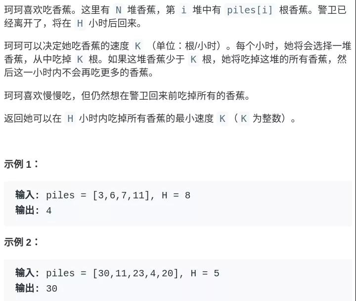

Koko 每小时最多吃一堆香蕉，如果吃不下的话留到下一小时再吃；如果吃完了这一堆还有胃口，也只会等到下一小时才会吃下一堆。在这个条件下，让我们确定 Koko 吃香蕉的**最小速度**（根/小时）。

先抛开二分查找技巧，**想想如何暴力解决这个问题呢？**

算法要求的是「`H`小时内吃完香蕉的最小速度」，我们不妨称为`speed`，**请问`speed`最大可能为多少，最少可能为多少呢？**

显然最少为 1，最大为`max(piles)`，因为一小时最多只能吃一堆香蕉。那么暴力解法就很简单了，只要从 1 开始穷举到`max(piles)`，一旦发现发现某个值可以在`H`小时内吃完所有香蕉，这个值就是最小速度：

```java
int minEatingSpeed(int[] piles, int H) {
    /* 暴力解法(不通过) */
    // 求 piles 数组最大值
    int max = getMax(piles);
    // 对速度由 1 根每小时遍历到 max 根每小时
    // 只要找到满足在 H 小时内吃掉所有香蕉的最小速度，即停止遍历并返回
    for(int speed = 1; speed < max; speed++) {
        if (canFinish(piles, speed, H)) {
            return speed;
        }
    }
    // 否则每小时必要吃掉这堆香蕉中最大的一堆
    return max;
}
```

### 思路

注意这个 for 循环，就是在**连续的空间线性搜索，这就是二分查找可以发挥作用的标志**。

由于我们要求的是最小速度，所以可以用一个**搜索左侧边界的二分查找**来代替线性搜索，提升效率

### 代码实现

```java
public int minEatingSpeed(int[] piles, int H) {
    /* 二分查找(因为寻找最小值，所以使用左侧边界框架) */
    // 求 piles 数组最大值
    int max = getMax(piles);
    // 因为暴力解法：for(int speed = 1; speed < max; speed++) speed 从 1 开始
    // 搜索空间：[left, right) = [1, max + 1)，并不包括 max + 1
    int left = 1, right = max + 1;

    while (left < right) {
        // 计算 mid，在本题相当于 speed
        int speed = (left + right) / 2;
        if (canFinish(piles, speed, H)) { // 这里包括 time <= H 的情况
            right = speed;
        } else { // time > H，加大吃香蕉速度
            left = speed + 1;
        }
    }
    return left;
}

private boolean canFinish(int[] piles, int speed, int H) {

    // 定义以 speed 根每小时吃完香蕉所需要的时间
    int time = 0;
    // 计算吃完所有堆香蕉花费的总时间
    for (int n : piles) {
        time += timeOf(n, speed); // 吃完一堆要花费的时间
    }
    // 如果 time <= H，返回 true，否则 false
    return time <= H;
}

private int timeOf(int n, int speed) {

    // n / speed：整数部分小时，如果有余数，再计算
    // n % speed：小数部分，如果大于 0，表示有余数，还需花 1h 吃完，如果等于 0，就刚好
    return (n / speed) + ((n % speed) > 0 ? 1 : 0);
}

private int getMax(int[] piles) {
    int max = 0;
    for (int p : piles) {
        max = Math.max(p, max);
    }
    return max;
}
```

## 在 D 天内送达包裹的能力(LeetCode[1011])

### 思路

与 H 天吃香蕉问题类似，不同的是 left 是 weights 数组中的最大数，因为货物不能拆分每次必须保证能至少运送一件货物；right 为 weights 数组的货物重量之和。

### 代码实现

```java
public int shipWithinDays(int[] weights, int D) {

    // 最小的载重，因为货物不能被分割，所以最小载重就是 weight 矩阵中的最大值
    int left = getMax(weights);
    // 最大的载重就是货物重量之和，因为是搜索左侧边界，所以 + 1
    int right = getSum(weights) + 1;
    while (left < right) {
        int mid = left + (right - left) / 2; // 等价于 (left + right) / 2
        if (canFinish(weights, mid, D)) {
            right = mid;
        } else {
            left = mid + 1;
        }
    }
    return left;
}

// 判断 D 天内能否以 cap 吨/天 的速度运完
private boolean canFinish(int[] weights, int cap, int D) {
    // 记录运送了多少件货物
    int i = 0;
    // 计算 D 天内运送了 i 件货物
    for (int day = 0; day < D; day++) {
        int maxCap = cap;
        while ((maxCap -= weights[i]) >= 0) {
            i++;
            // 假设计算了 D 天，若 i = weights.length
            if (i == weights.length) return true;
        }
    }
    return false;
}

private int getMax(int[] weights) {
    int max = 0;
    for (int w : weights) {
        max = Math.max(w, max);
    }
    return max;
}

private int getSum(int[] weights) {
    int sum = 0;
    for (int w : weights) {
        sum += w;
    }
    return sum;
}
```

首先思考使用 for 循环暴力解决问题，观察代码是否如下形式：

```java
for (int i = 0; i < n; i++)
    if (isOK(i))
        return answer;
```

如果是，那么就可以使用二分搜索优化搜索空间：如果要求最小值就是搜索左侧边界的二分，如果要求最大值就用搜索右侧边界的二分。

## 双指针技巧汇总

双指针技巧还可以分为两类，一类是「快慢指针」，一类是「左右指针」。前者解决主要解决链表中的问题，比如典型的判定链表中是否包含环；后者主要解决数组（或者字符串）中的问题，比如二分查找。

### 环形链表I(判断链表中是否有环LeetCode[141])

单链表的特点是每个节点只知道下一个节点，所以一个指针的话无法判断链表中是否含有环的。

如果链表中不含环，那么这个指针最终会遇到空指针 null 表示链表到头了，这还好说，可以判断该链表不含环。

```java
boolean hasCycle(ListNode head) {
    while (head != null)
        head = head.next;
    return false;
}
```

但是如果链表中含有环，那么这个指针就会陷入死循环，因为环形数组中没有 null 指针作为尾部节点。

经典解法就是用两个指针，一个每次前进两步，一个每次前进一步。如果不含有环，跑得快的那个指针最终会遇到 null，说明链表不含环；如果含有环，快指针最终会超慢指针一圈，和慢指针相遇，说明链表含有环。

```java
public boolean hasCycle(ListNode head) {

    // 定义快慢指针
    ListNode slow, faster;
    slow = faster = head;
    // 如果该链表不为环形链表，faster 必比 slow 先到末尾 null 的位置
    // slow 步进 1，faster 步进 2
    // 如果没有环，他们永远不会相遇，有环肯定会相遇的
    while (faster != null && faster.next != null) { // 快指针会先到末尾
        faster = faster.next.next;
        slow = slow.next;

        if (slow == faster) return true;
    }
    return false;
}
```

### 环形链表II(已知链表中含有环，返回这个环的起始位置LeetCode[142])

#### 题目描述

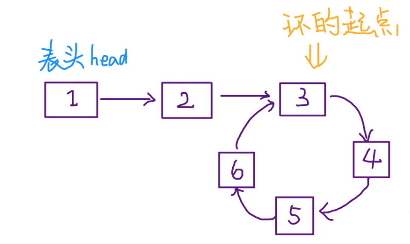

#### 思路

**核心思想：**当快慢指针第一次相遇的时候，让其中任意一个指针重新指向头结点，然后让它俩以**相同**的速度前进，再次相遇时 slow/fast 所在的节点就是环开始的起始位置。

**解释：**

第一次相遇时，假设慢指针 slow 走了 k 步，那么快指针 fast 一定走了 2k 步，也就是说比 slow 多走了 k 步（也就是环的长度）。**这一步是检测链表中是否有环**

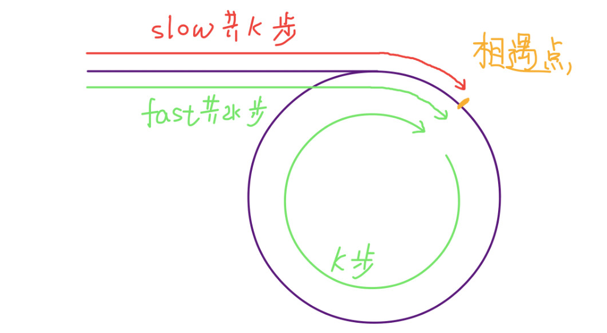

但是**不能保证**第一次相遇时 相遇点 = 环起始点！

设相遇点距环的起点的距离为 m，那么环的起点距头结点 head 的距离为 k - m，也就是说如果从 head 前进 k - m 步就能到达环起点。

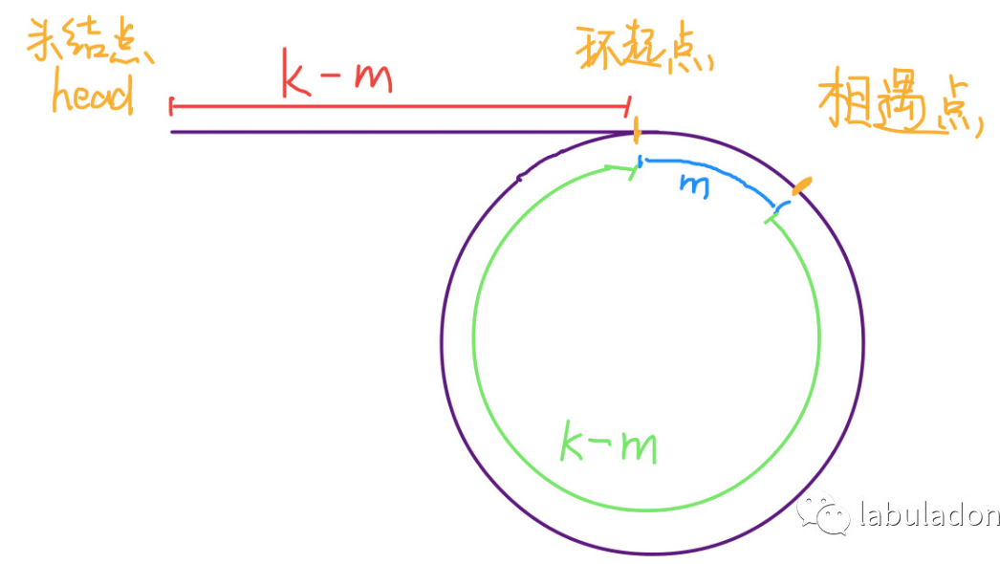

如果从相遇点继续前进 k - m 步，也恰好到达环起点。

所以，只要我们把快慢指针中的任一个重新指向 head，然后两个指针同速前进，k - m 步后就会相遇，相遇之处就是环的起点了。

#### 代码实现

```java
public ListNode detectCycle(ListNode head) {

    ListNode slow, fast;
    slow = fast = head;
    // 步进 2，所以必须保证 fast 和 fast.next != null
    //        while (fast != null && fast.next != null) {
    while (true) {
        if (fast == null || fast.next == null) return null;
        fast = fast.next.next;
        slow = slow.next;
        if (slow == fast) break;
    }
    slow = head;
    while (slow != fast) {
        slow = slow.next;
        fast = fast.next;
    }
    return slow;
}
```

### 链表的中间结点(LeetCode[876])

#### 题目描述

找到一个非环形链表的中间节点并返回，如果链表元素个数为偶数，返回链表中间节点的第二个节点。

#### 思路

可以让快指针一次前进两步，慢指针一次前进一步，当快指针到达链表尽头时，慢指针就处于链表的中间位置。

当链表的长度是奇数时，slow 恰巧停在中点位置；如果长度是偶数，slow 最终的位置是中间偏右：

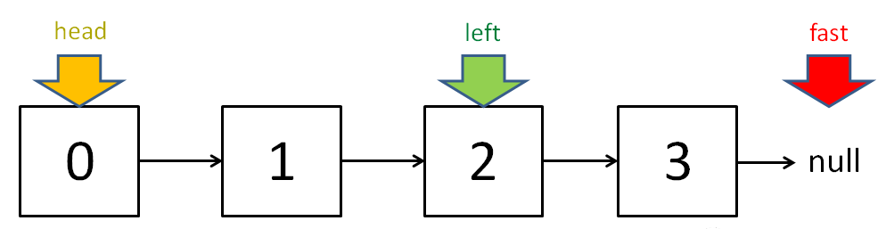

**寻找链表中点的一个重要作用是对链表进行归并排序。**

数组的归并排序：求中点索引递归地把数组二分，最后合并两个有序数组。对于链表，合并两个有序链表是很简单的，难点就在于二分。

#### 代码实现

```java
public ListNode middleNode(ListNode head) {

    // 定义快慢指针
    ListNode slow, fast;
    slow = fast = head;
    // 因为 fast 步进 2，所以当奇数时 fast 最终会在最后一个节点，没指向 null
    // 偶数时，fast 指向 null
    // 所以当 fast == null || fast.next == null，循环结束
    // 否命题就是 fast != null && fast.next != null
    // a || b --> 否 a && 否 b
    // a && b --> 否 a || 否 b
    while (fast != null && fast.next != null) {
        slow =slow.next;
        fast = fast.next.next;
    }
    return slow;
}
```

### [剑指 Offer 22]链表中倒数第k个节点

#### 题目描述

输入一个链表，输出该链表中倒数第k个节点。为了符合大多数人的习惯，本题从1开始计数，即链表的尾节点是倒数第1个节点。例如，一个链表有6个节点，从头节点开始，它们的值依次是1、2、3、4、5、6。这个链表的倒数第3个节点是值为4的节点。

#### 思路

思路还是使用快慢指针，让快指针先走 k 步，然后快慢指针开始同速前进。这样当快指针走到链表末尾 null 时，慢指针所在的位置就是倒数第 k 个链表节点（为了简化，假设 k 不会超过链表长度）

#### 代码实现

```java
public ListNode getKthFromEnd(ListNode head, int k) {

    ListNode slow, fast;
    slow = fast = head;

    // 先让 fast 先走 k 步
    while (k > 0) {
        fast = fast.next;
        k--;
    }
    while (fast != null) {
        fast = fast.next;
        slow = slow.next;
    }
    return slow;
}
```

# 2021.1.22记录

## 左右指针的常用算法

### 二分查找

见上面二分查找算法详解

### 两数之和

#### 题目描述

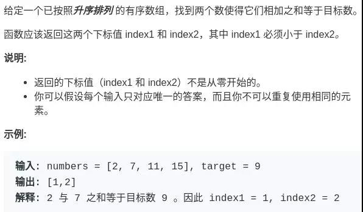

#### 思路

只要数组有序，就应该想到双指针技巧。这道题的解法有点类似二分查找，通过调节 left 和 right 可以调整 sum 的大小。

#### Java 自带排序方法

+ 快速排序：首先是最简单的Array.sort，直接进行排序：

```java
int[] arr = {4,3,5,1,7,9,3};
Arrays.sort(arr);
```

+ 部分排序法：使用Array.sort还可进行选择想要排序的部分数字，如将下角标编号为1~4的数字进行排序，其他数字顺序不变。

```java
int[] arr = {4,3,5,1,2,9,3,0};
Arrays.sort(arr,1,4);
```

#### Java 中复制数组的方法

```java
// nums：原数组
// 0：起始位置
// nums.length：新数组的长度
int[] arr = Arrays.copyOfRange(nums, 0, nums.length);
```

根据 sort() 方法可以很方便的计算数组最大值

#### 代码实现

```java
// 有序数组就要想到左右指针的方法
public int[] twoSum(int[] nums, int target) {
    int left = 0; // 左侧最小索引
    int right = nums.length - 1; // 搜索空间：[left, right]
    int[] arr = Arrays.copyOfRange(nums, 0, nums.length);
    Arrays.sort(arr);
    while (left <= right) {
        int sum = arr[left] + arr[right];
        if (sum == target) {
            int a = findIndex(left, arr, nums);
            int b = findIndex(right, arr, nums);
            if (a == b) {
                // 找到一个不在 nums 数组中的数
                // 此时 arr 为有序数组，arr[arr.length - 1] 表示 arr 和 nums 数组的最大值
                // arr[arr.length - 1] + 1 在 nums 中一定不存在
                nums[b] = arr[arr.length - 1] + 1;
                b = findIndex(right, arr, nums);
            }
            return new int[]{a, b};
        } else if (sum < target) {
            left++; // 让 left 大一点再搜索
        } else if (sum > target) {
            right--; // right 小一点再搜索
        }
    }
    return new int[]{-1, -1};
}

// 找到 left 和 right 在 nums 数组中的索引
private int findIndex(int afterIndex, int[] arr, int[] nums) {
    int orignalIndex = 0, i = 0;
    while (i < nums.length) {
        if (arr[afterIndex] == nums[i]) {
            orignalIndex = i;
            break;
        }
        i++;
    }
    return orignalIndex;
}
```

### 反转数组

#### 思路

利用左右指针分别指向数组的最左边和最右边，先交换这两个值，依次对左右指针--，遍历数组元素即可完成反转。

#### 代码实现

```java
public void traverse(int[] nums) {
    int left = 0;
    int right = nums.length - 1;
    while(left < right) { // 排除奇数元素个数的情况
        int tmp = nums[left];
        nums[left] = nums[right];
        nums[right] = tmp;
        left--;
        right--;
    }
}
```

### 滑动窗口算法

这也许是双指针技巧的最高境界了，如果掌握了此算法，可以解决一大类子字符串匹配的问题，不过「滑动窗口」算法比上述的这些算法稍微复杂些。

# 2021.1.22记录

#### 晃动窗口顺口溜

```markdown
链表字串数组题，double指针快下笔
双指针家三兄弟，各个都是万人迷

快慢指针最神奇，链表操作无压力
归并排序找中点，链表成环做判定

左右指针最常见，两端分别向中间
反转数组简单写，二分搜索信手拈

滑动窗口无敌哥，字串问题别得瑟
左右指针滑窗口，齐头并进分前后
```

#### Java 中遍历字符串字符的方法

```java
String str = "asdfghjkl";
// 方法一
for(int i=0; i<str.length(); i++){
	char ch = str.charAt(i);
}
// 方法二
char[] c=s.toCharArray();
for(char cc:c){
...//cc直接用了
} 
// 方法三
for(int i=0;i<str.length();i++){
	String subStr = str.substring(i, i+1);
}
```

### 最小覆盖字串(LeetCode[76])

#### 问题描述

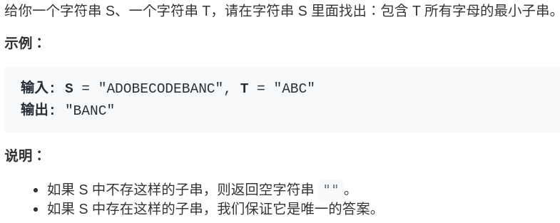

就是说要在`S`(source) 中找到包含`T`(target) 中全部字母的一个子串，且这个子串一定是所有可能子串中最短的。

#### 滑动窗口思路

***1、***我们在字符串`S`中使用双指针中的左右指针技巧，初始化`left = right = 0`，**把索引左闭右开区间`[left, right)`称为一个「窗口」**。

***2、***我们先不断地增加`right`指针扩大窗口`[left, right)`，直到窗口中的字符串符合要求（包含了`T`中的所有字符）。**可行解**

***3、***此时，我们停止增加`right`，转而不断增加`left`指针缩小窗口`[left, right)`，直到窗口中的字符串不再符合要求（不包含`T`中的所有字符了）。同时，每次增加`left`，我们都要更新一轮结果。**寻找最优解**

***4、***重复第 2 和第 3 步，直到`right`到达字符串`S`的尽头。

**第 2 步相当于在寻找一个「可行解」，然后第 3 步在优化这个「可行解」，最终找到最优解，**也就是最短的覆盖子串。

画图理解一下，`needs`和`window`相当于计数器，分别记录`T`中字符出现次数和「窗口」中的相应字符的出现次数。

初始状态：

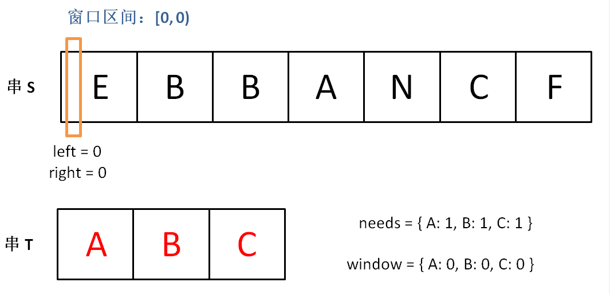

增加`right`，直到窗口`[left, right)`包含了`T`中所有字符：

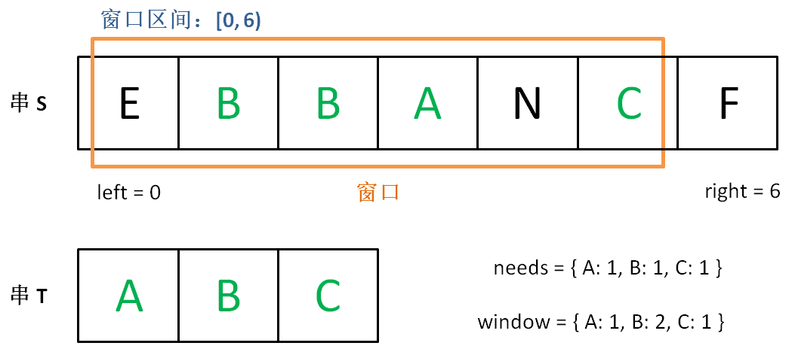

现在开始增加`left`，缩小窗口`[left, right)`。

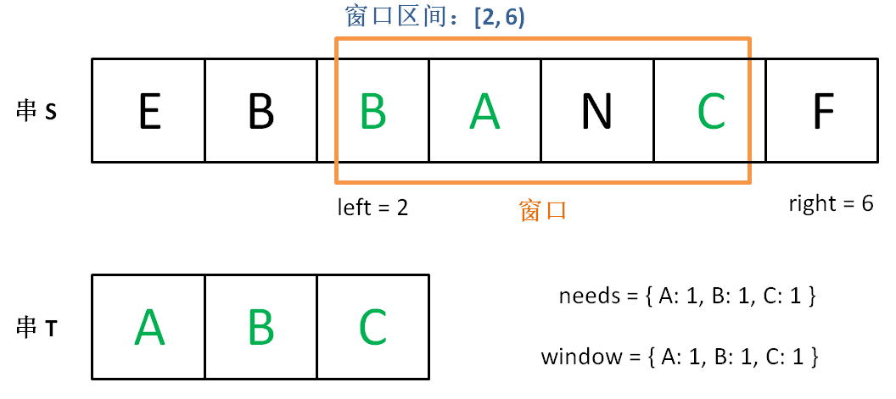

直到窗口中的字符串不再符合要求，`left`不再继续移动。**虽然 left = 3 不满足最小字串条件，但是在缩小窗口之前由变量 start = left 记录了最小字串的左边界**  

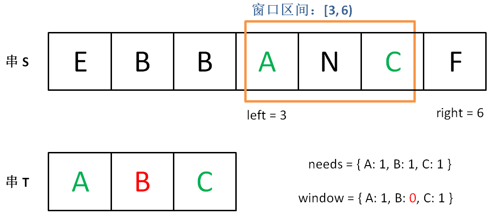

之后重复上述过程，先移动`right`，再移动`left`…… 直到`right`指针到达字符串`S`的末端，算法结束。

#### 代码实现

```java
public String minWindow(String s, String t) {
    HashMap<Character, Integer> need = new HashMap<>();
    HashMap<Character, Integer> window = new HashMap<>();
    // 将 t 字串的每个字符放入 need 和 window，初始化各个字符的次数都为 0
    char[] s_arr = s.toCharArray();
    char[] t_arr = t.toCharArray();
    for (char c : t_arr) need.put(c, need.getOrDefault(c, 0) + 1);
    // 初始化左右指针，初始位置：[left, right) = [0, 0)
    int left = 0, right = 0;
    // 用 valid 变量表示窗口中满足 need 条件的字符个数
    int valid = 0;
    // 记录覆盖最小字串的起始坐标和长度
    int start = 0, len = Integer.MAX_VALUE;
    // 循环遍历整个字符转 s
    while (right < s_arr.length) {
        // 先 left 不动，移动 right，直到找到一个可行解
        char c = s_arr[right];
        // 右移扩大窗口
        right++;
        // 更新窗口内的数据
        if (need.containsKey(c)) {
            // 如果 c 就是我们要找的字符之一，让 window 中对应的 key 的值 + 1
            // window.getOrDefault(c, 0)：如果 window 中没有 c，自动创建并设置默认值为 0
            window.put(c, window.getOrDefault(c, 0) + 1);
            // 如果两个 map 中 c 对应的次数一致，即找到一个想要的字符
            if (window.get(c).equals(need.get(c))) {
                valid++;
            }
        }

        // 如果在扩大 right 的过程中找到了一个可行解，判断是否需要缩小 left 以获得最优解
        // 此 while 在上一个 while 中
        while (valid == need.size()) {
            // 更新最小覆盖字串
            // 初次比较肯定小于 len
            if (right - left < len) {
                // 记录原始 left
                start = left;
                len = right - left;
            }
            // 逐步将窗口左边的元素移除窗口，看 valid == need.size() 还成立不？
            char d = s_arr[left];
            // 移动左边的窗口
            left++;
            // 更新窗口中的数据，如果 d 有用
            if (need.containsKey(d)) {
                // 如果 d 在 need 和 window 中出现的次数相同，即为 1
                if (window.get(d).equals(need.get(d))) {
                    valid--;
                }
                window.put(d, window.getOrDefault(d, 0) - 1);
            }
        }
    }
    return len == Integer.MAX_VALUE ? "" : s.substring(start, start + len);
}
```

需要注意的是，当我们发现某个字符在`window`的数量满足了`need`的需要，就要更新`valid`，表示有一个字符已经满足要求。而且，你能发现，两次对窗口内数据的更新操作是完全对称的。

**当`valid == need.size()`时，说明`T`中所有字符已经被覆盖，已经得到一个可行的覆盖子串**，现在应该开始收缩窗口了，以便得到「最小覆盖子串」。

移动`left`收缩窗口时，窗口内的字符都是可行解，所以应该在收缩窗口的阶段进行最小覆盖子串的更新，以便从可行解中找到长度最短的最终结果。

### 字符串的排列(Leetcode[567])

#### 题目描述

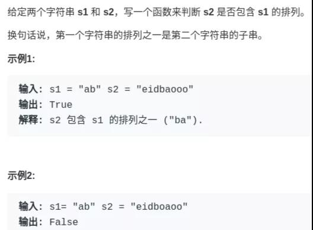

#### 思路

注意，输入的`s1`是可以包含重复字符的。这种题目，是明显的滑动窗口算法，**相当给你一个`S`和一个`T`，请问你`S`中是否存在一个子串，包含`T`中所有字符且不包含其他字符**？

#### 代码实现

```java
/* 找出 s2 中是否存在一个字串，包含 s1 中所有字符而不包括其他字符 */
// 滑动窗口无敌哥，字串问题别得瑟
// 左右指针滑窗口，齐头并进分前后
public boolean checkInclusion(String s1, String s2) {
    HashMap<Character, Integer> need = new HashMap<>();
    HashMap<Character, Integer> window = new HashMap<>();
    // String to char[]
    char[] s1_arr = s1.toCharArray();
    char[] s2_arr = s2.toCharArray();
    // 将所要找的元素和其出现的次数放入 need 中
    for (char c : s1_arr) {
        need.put(c, need.getOrDefault(c, 0) + 1);
    }
    int left = 0, right = 0;
    // 记录 window 中元素的个数
    int valid = 0;
    // 滑动 right
    while (right < s2_arr.length) {
        // c 是滑动的元素
        char c = s2_arr[right];
        right ++;
        // 更新 window 中的数据
        if (need.containsKey(c)) {
            window.put(c, window.getOrDefault(c, 0) + 1);
            // 如果 need 和 window 中 c 对应的 val 相同，说明完成了一个字符
            if (need.get(c).equals(window.get(c))) {
                valid++;
            }
        }

        // 再往右滑的过程中，如果找到一个可行解，判断要不要收缩
        // 只要大于等于字串的长度就应该移动，保证字串的长度就是窗口的长度
        while (right - left >= s1_arr.length) {
            if (valid == need.size()) {
                return true;
            }
            // d 是 left 向右滑动要去掉的元素
            char d = s2_arr[left];
            left++;
            // 更新 window 中的数据
            if (need.containsKey(d)) {
                if (need.get(d).equals(window.get(d))) {
                    valid--;
                }
                window.put(d, window.getOrDefault(d, 0) - 1);
            }
        }
    }
    return false;
}
```

对于这道题的解法代码，基本上和最小覆盖子串一模一样，只需要改变两个地方：

**1、**本题移动`left`缩小窗口的时机是窗口大小大于`t.size()`时，因为排列嘛，显然长度应该是一样的。

**2、**当发现`valid == need.size()`时，就说明窗口中就是一个合法的排列，所以立即返回`true`。

至于如何处理窗口的扩大和缩小，和最小覆盖子串完全相同。

### 找所有字母异位词(LeetCode[438])

#### 题目描述

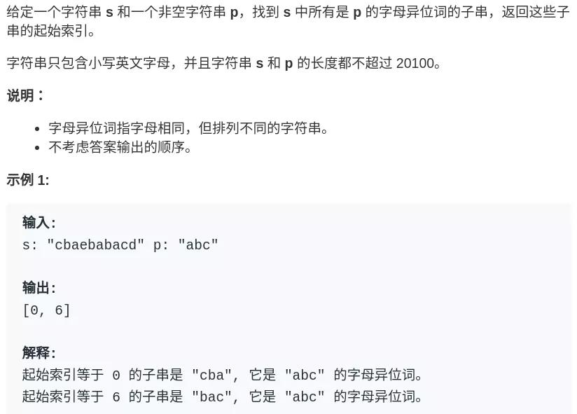

#### 思路

 这个所谓的字母异位词，不就是排列吗？

**相当于，输入一个串`S`，一个串`T`，找到`S`中所有`T`的排列，返回它们的起始索引**。

#### 实现代码

```java
public List<Integer> findAnagrams(String s, String p) {
    HashMap<Character, Integer> need = new HashMap<>();
    HashMap<Character, Integer> window = new HashMap<>();
    List<Integer> res = new ArrayList<>();
    // 将 t 字串的每个字符放入 need 和 window，初始化各个字符的次数都为 0
    char[] s_arr = s.toCharArray();
    char[] p_arr = p.toCharArray();
    for (char c : p_arr) need.put(c, need.getOrDefault(c, 0) + 1);
    // 初始化左右指针，初始位置：[left, right) = [0, 0)
    int left = 0, right = 0;
    // 用 valid 变量表示窗口中满足 need 条件的字符个数
    int valid = 0;
    // 循环遍历整个字符转 s
    while (right < s_arr.length) {
        // 先 left 不动，移动 right，直到找到一个可行解
        char c = s_arr[right];
        // 右移扩大窗口
        right++;
        // 更新窗口内的数据
        if (need.containsKey(c)) {
            // 如果 c 就是我们要找的字符之一，让 window 中对应的 key 的值 + 1
            // window.getOrDefault(c, 0)：如果 window 中没有 c，自动创建并设置默认值为 0
            window.put(c, window.getOrDefault(c, 0) + 1);
            // 如果两个 map 中 c 对应的次数一致，即找到一个想要的字符
            if (window.get(c).equals(need.get(c))) {
                valid++;
            }
        }

        // 如果在扩大 right 的过程中找到了一个可行解，判断是否需要缩小 left 以获得最优解
        // 此 while 在上一个 while 中
        while (right - left >= p_arr.length) {
            if (valid == need.size()) {
                res.add(left);
            }
            // 逐步将窗口左边的元素移除窗口，看 valid == need.size() 还成立不？
            char d = s_arr[left];
            // 移动左边的窗口
            left++;
            // 更新窗口中的数据，如果 d 有用
            if (need.containsKey(d)) {
                // 如果 d 在 need 和 window 中出现的次数相同，即为 1
                if (window.get(d).equals(need.get(d))) {
                    valid--;
                }
                window.put(d, window.getOrDefault(d, 0) - 1);
            }
        }
    }
    return res;
}
```

跟寻找字符串的排列一样，只是找到一个合法异位词（排列）之后将起始索引加入`res`即可。

### 最长无重复字串(LeetCode[3])

#### 问题描述


#### 思路

`need`和`valid`都不需要，而且更新窗口内数据也只需要简单的更新计数器`window`即可，当`window[c]`值大于 1 时，说明窗口中存在重复字符，不符合条件，就该移动`left`缩小窗口了。

#### 代码实现

```java
public int lengthOfLongestSubstring(String s) {
    HashMap<Character, Integer> window = new HashMap<>();
    int res = 0;
    int left = 0, right = 0;
    char[] s_arr = s.toCharArray();
    while (right < s_arr.length) {
        char c = s_arr[right];
        right++;
        window.put(c, window.getOrDefault(c, 0) + 1);

        // 收缩窗口
        while (window.get(c) > 1) { // 此时有重复元素了
            char d = s_arr[left];
            left++;
            window.put(d, window.getOrDefault(d, 0) - 1);
        }
        res = Math.max(res, right - left);
    }
    return res;
}
```

唯一需要注意的是，在哪里更新结果`res`呢？我们要的是最长无重复子串，哪一个阶段可以保证窗口中的字符串是没有重复的呢？

这里和之前不一样，**要在收缩窗口完成后更新`res`**，因为窗口收缩的 while 条件是存在重复元素，换句话说收缩完成后一定保证窗口中没有重复。

# 2021.1.24记录

