@[TOC](目录)

# 2020.12.14记录

## LRU 缓存淘汰算法(leetcode[146])

Java 中的内置类型 LinkedHashMap 可以直接实现。LinkedHashMap 继承于HashMap，HashMap 是无序的，当我们希望有顺序地去存储 key-value 时，就需要使用 LinkedHashMap 了。**借助链表的有序性使得链表元素维持插入顺序，同时借助哈希映射的快速访问能力使得我们可以以O(1)的时间复杂度访问链表的任意元素。**

### 概念&原理

LRU(Least Recently Used) 淘汰算法：最近使用过的数据是有用的，很久没有使用过的数据是没用的。比如手机中的后台运行。

LinkedHashMap(哈希链表) 底层原理是用 HashMap + DoubleList(双向链表) 实现的。其中 HashMap 中存放的 key 是双向链表中的key，val 存放的是双向链表的节点 Node ，虽然在 HashMap 中键值对的排序是无序的，但是在双向链表中是有序的，通过 HashMap 将键(key)进行映射，get方法返回的是双向链表中的键值对，即是排序好的。

**链表：** 

+ 一种物理存储单元上非连续、非顺序的存储结构，数据元素的逻辑顺序是通过链表中的指针连接次序实现的。
+ 每一个链表包括多个节点，节点包括两个部分，一个是数据域（存储节点含有的信息），一个是引用域（存储下一个节点或上一个节点的地址信息）。

**链表特点：**

+ 获取数据麻烦，需要遍历，比数组慢；
+ 方便插入和删除。

**链表实现原理：**

+ 创建一个节点类，包括两个部分。一个是数据域，一个引用域；
+ 创建链表类，包含三个属性：头结点、尾节点和大小；方法包含添加、删除和插入等等方法。

### 注意事项

**1. 为什么要用双向链表？**

因为在添加和删除节点的操作中不仅需要得到该节点本身的指针，也需要操作其前驱节点的指针，只有双向链表可以直接支持查找前驱，保证操作的时间复杂度为O(1)。

**2. 为什么 HashMap 中存有 key 还要在 Node 中存 key 和 val ？**

当缓存容量已满的时候，不仅要删除最后一个 Node 节点，还要把 HashMap 中映射到该节点的 key 同时删除，而这个 key 只能由 Node 获得，因此只存储 val 的话就无法知道对应的 key 是什么，就无法删除 map 中的 key，造成错误。

最后应提供 get() 和 put() 方法来获取和添加所需的键值对。其中 put 方法的逻辑如下：

```flow
st=>start: 开始
op1=>operation: put(key, val)
cond1=>condition: key是否存在?
op2=>operation: 修改key对应的val并将key提升为最近使用
op3=>operation: 需要新插入key
cond2=>condition: 容量是否已满、
op4=>operation: 淘汰最久未使用的key
op5=>operation: 插入key和val为最近使用的数据
e=>end: 结束

st->op1->cond1
cond1(yes)->op2
cond1(no)->op3->cond2
cond2(yes)->op4->op5->e
cond2(no)->op5

```

### 代码实现：

```java
int cap;
// 选用 LinkedHashMap 可以保证快速地添加和删除节点，时间复杂度为 O(1)
// 并且能够保证快速访问节点，因为 LinkedHashMap 底层是 HashMap + 双向链表
// HashMap 映射保证可以快速访问节点，双向链表保证了快速增加删除节点
LinkedHashMap<Integer, Integer> cache = new LinkedHashMap<>();
public LRUCache(int capacity) {

    this.cap = capacity;
}

// 快速返回 key 对应的节点
public int get(int key) {

    if (!cache.containsKey(key)) {
        return -1;
    }

    // 让被 get 的 key 变成最新的
    makeRencently(key);
    return cache.get(key);
}

public void put(int key, int value) {

    // ①如果存在 key，直接修改 key 对应的 value 值
    if (cache.containsKey(key)) {
        // 修改值
        cache.put(key, value);
        // 将 key 变成最近使用
        makeRencently(key);
        return;
    }

    // 如果此时 cache 容量已经满了，找到最久未使用的 key 删除
    if (cache.size() >= this.cap) {
        // 链表头部就是最久未使用的 key
        int oldestkey = cache.keySet().iterator().next();
        cache.remove(oldestkey); // 删除 key 和对应的 val
    }
    cache.put(key, value);
}

private void makeRencently(int key) {
    int val = cache.get(key);
    // 删除 key，重新插入到队尾
    cache.remove(key);
    cache.put(key, val);
}
```

---

# 2020.12.17记录

## LFU淘汰算法的实(leetcode[460])

### 需求分析

1. 调用 **get(key)** 方法时，要返回 key 对应的 val
2. 只要用 get 或者 put 方法访问一次某个 key 时，该 key 的 freq 要加 1
3. 如果在容量满了的时候插入，则需要将 freq 最小的 key 删除，如果最小的 freq 对应多个 key，则要删除其中最旧的那个key

### 思路分析

1. 使用一个 HashMap 存储 key 和 val 的映射，就可以完成快速计算 get(key)

```java
HashMap<Integer, integer> keyToVal;
```

2. 使用一个 HashMap 存储 key 到 freq 映射，就可以快速操作 key 对应的 freq

```java
HashMap<Integer, integer> keyToFreq;
```

3. 需要 freq 到 key 的映射
   + 将 freq 最小的 key 删除，这就需要快速得到当前所有 key 最小的 freq 是多少。要求时间复杂度为 O(1) 的话，肯定不能用遍历的方法，所以就用一个变量 minFreq 来记录当前最小的 freq。
   + 在实际中，一个频率 freq 可能对应多个 key，所以 **freq 与 key 是一对多的关系**，即一个 freq 对应一个 key 的列表。
   + 再者，频率 freq 对应 key 的列表应该是有时序的，存放 key 的列表中 key 的排列顺序应当是按照存放时间先后进行放置的，这样我们删除最旧的 key 时，只需要找到存放 key 的列表中的头元素就好。
   + 希望能快速删除 key 列表中的任何一个 key，因为如果频次为 freq 的某个 key 被访问，则它的频次就从 freq 变成  freq +1，就应该从 freq 对应的 key 的列表中将 key 删除，加到 freq +1 对应的 key 的列表中。

```java
HashMap<Integer, LinkedHashSet<Integer>> freqToKeys;
```

因为普通的 LinkedList 不能快速的访问链表中的某一个节点，所以就无法快速删除 freq 对应 key 列表中的任意一个key。而 LinkedHashSet 是链表和哈希集合的结合，同时兼顾了链表不能快速访问链表节点，但是插入元素具有时序；哈希集合中元素无序，但是可以快速访问的特点。所以它俩结合的 LinkedHashSet 既可以在 O(1) 时间内访问或删除其中的元素，又可以保持插入顺序。

### 代码框架

1. 初始化三个列表：keyToVal、keyToFreq、freqToKeys，并设置 minFreq 和 容量 cap；
2. 创建 get() 方法，快速获取 key 对应的 val， 并使得该 key 对应的 freq +1；
   + 先判断 keyToVal 表中是否含有 key，没有返回 -1，有就返回对应的值
3. 创建 put() 方法， put()方法的逻辑如下：

```flow
st=>start: 开始
op1=>operation: put(key, val)
cond1=>condition: key是否存在?
op2=>operation: 修改key对应的val并将其对应的freq加1
op3=>operation: 需要新插入key
cond2=>condition: 容量是否已满、
op4=>operation: 淘汰freq最小的key，若minFreq
对应多个key，删除最旧的key
op5=>operation: 插入key和val并设置其freq为1
e=>end: 结束

st->op1->cond1
cond1(yes)->op2
cond1(no)->op3->cond2
cond2(yes)->op4->op5->e
cond2(no)->op5
```

### 核心逻辑

1. 编写移除最小 freq 对应 key 的函数：removeMinFreqKey()
   + 先找到 minFreq 对应的 key 的列表，淘汰最旧的 key
   + 更新 FK 和 KV 和 KF 列表

2. 编写增加 freq 的函数：increaseFreq()
   + 找到当前 key 对应的 freq
   + 更新 KF 表，将 key 对应的 freq 加 1 
   + 更新 KF 表，将原 key 从原 freq 对应的 key 的列表中删除；再添加至 freq + 1 对应的 key 的列表中
   + 判断如果被移除的 freq 对应的 key 的列表空了，则删除 freq 和其对应的 key 列表；在此基础上，如果 freq = minFreq，则使得 minFreq++

### 代码实现：

```java
// 缓存容量
int cap;
// 创建 minFreq
int minFreq;
// 创建 key-val 表，能够快速根据 key 查询到对应的 val 值
HashMap<Integer, Integer> keyToVal;
// 创建 key-freq 表，能够快速查询 key 对应的 freq
HashMap<Integer, Integer> keyToFreq;
// 创建 freq-keys 表，能够快速根据 freq 查询到对应的 keys 列表
HashMap<Integer, LinkedHashSet<Integer>> freqToKeys;

public LFUCache(int capacity) {
    // 初始化各种表和初始值
    keyToVal = new HashMap<>();
    keyToFreq = new HashMap<>();
    freqToKeys = new HashMap<>();
    this.cap = capacity;
    this.minFreq = 0;
}

/* get()：查询缓存中的键 key */
// ①如果不存在 key，返回 -1；
// ②如果存在 key，返回对应的 val，并且使 key 对应的 freq + 1
public int get(int key) {

    if (!keyToVal.containsKey(key)) return -1;

    // 否则存在 key，调用它时会将 key 对应的 freq + 1
    increaseFreq(key);
    return keyToVal.get(key);
}

/* put()：插入或修改缓存 */
// ①如果存在 key：将原始的 key 对应的 val 修改为新值，并将 key 的 freq + 1

// ②如果不存在 key：
// i)缓存容量未满,不存在键 key：插入键值对(key, val)，并将 key 的 freq 设置为 1

// ii)缓存容量已满不存在键 key：此时容量已满，想加入新的 key 必须删除旧的 key
// 要找到 minFreq 对应的 key 列表，如果 minFreq 对应多个 key，找到列表中最靠前的 key 删除
public void put(int key, int value) {
    if (this.cap <= 0) return;

    if (keyToVal.containsKey(key)) {

        keyToVal.put(key, value);
        increaseFreq(key);
        return; // 如果包含，执行到此即结束，剩下的就是不包括 key 的情况
    }

    // 不存在 key && 容量已满
    if (keyToVal.size() >= this.cap) {
        removeMinFreqKey();
    }

    // 此时包括两种情况：
    // ①容量已满并且删除了 minFreq 对应的 key 之后要 put(key, value)
    // ②容量没满自然要 put(key, value)
    keyToVal.put(key, value);

    // 更新另外两张表，因为这个 key 时新增的
    keyToFreq.put(key, 1);
    // putIfAbsent()：如果 1 频次没有对应的 LinkedHashSet，则 new 一个
    // 否则就使用旧的，不 new
    freqToKeys.putIfAbsent(1, new LinkedHashSet<>());
    freqToKeys.get(1).add(key);

    // 此时是新增 key，其对应的频次即为最小频次
    this.minFreq = 1;
}

// 写 util 函数 removeMinFreqKey()
private void removeMinFreqKey() {

    // 先要找到 freqToKeys 表中最小频次对应的 keys 列表
    LinkedHashSet<Integer> keyList = freqToKeys.get(this.minFreq);
    // keyList 中可能存在很多个 key，要找到最旧的那个 key 删除
    int oldestKey = keyList.iterator().next();
    // 更新 freqToKeys 表
    keyList.remove(oldestKey);
    // 如果 minFreq 对应的 keys 列表都空了，就需要删除
    if (keyList.isEmpty()) {
        freqToKeys.remove(this.minFreq);
    }
    // 更新 keyToVal 表
    keyToVal.remove(oldestKey);
    // 更新 keyToFreq 表
    keyToFreq.remove(oldestKey);
}

// 写 util 函数 increaseFreq()
// 这里肯定在 keyToVal.put() 之后，只需要更新另外两个表
private void increaseFreq(int key) {

    // 更新 keyToFreq 表
    // 获取 key 的原始频次
    int freq = keyToFreq.get(key);
    keyToFreq.put(key, freq + 1);
    // 更新 freqToKeys 表
    // 此时 key 的 freq 变了，所以需要把它从原来频次对应的 keys 表中删除
    freqToKeys.get(freq).remove(key);
    // 新建一个 freq + 1 的 keys 表，如果有就不需要建，并把 key 放入
    freqToKeys.putIfAbsent(freq + 1, new LinkedHashSet<>());
    freqToKeys.get(freq + 1).add(key);
    // 考虑 freq 频次对应的 keys 表中元素被全部取出的情况
    if (freqToKeys.get(freq).isEmpty()) {

        // 删除这个频次
        freqToKeys.remove(freq);
        // 如果 freq 为 minFreq, 表示 minFreq 对应的 keys 表元素被全部取出啦
        // 需要让 minFreq++ 作为新的 minFreq
        if (freq == this.minFreq) {
            this.minFreq++;
        }
    }
}
```

### 注：

1. put 与 putIfAbsent 的区别：
   + put在放入数据时，如果放入数据的key已经存在与Map中，最后放入的数据会覆盖之前存在的数据；
   + putIfAbsent在放入数据时，如果存在重复的key，那么putIfAbsent不会放入值。

2. HashMap 中 remove 方法：用于删除 HashMap 中指定键 key 对应的键值对 (key-value)
3. LinkedHashSet中先放入的元素会放在第一位，可用迭代器进行迭代。iterator().next() 返回迭代器经过的值 val。

---

## 二叉树算法

### 设计总路线：明确一个节点要做的事，剩下的事情抛给递归框架

```java
void traverse(TreeNode root) {
    // root 需要做什么
    ***
    // 其他的不用 root 操心，抛给递归
    traverse(root.left);
    traverse(root.right);
}
```

比如：让二叉树中各节点 val 加 1，判断两个二叉树是否相等

### 写递归算法的秘诀

**写递归算法的关键是要明确函数的「定义」是什么，然后相信这个定义，利用这个定义推导最终结果，绝不要跳入递归的细节**。

比如计算一棵二叉树共有几个节点(见二叉树的节点计算一节)。

**写树相关的算法，简单说就是，先搞清楚当前** **`root`** **节点该做什么，然后根据函数定义递归调用子节点**，递归调用会让孩子节点做相同的事情。

### 二叉搜索树(Binary Search Tree, BST)

**定义：**一个二叉树中，任意根节点的值要大于等于左子树所有节点的值，==且要小于等于右子树的所有节点的值。==

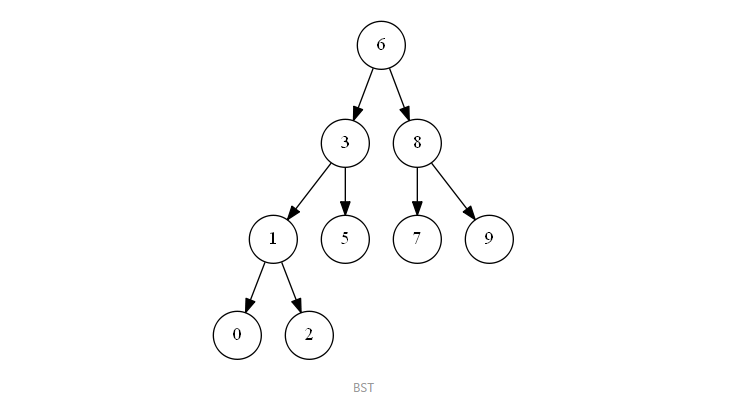

**特性：**

1. 对于 BST 的每一个节点`node`，左子树节点的值都比`node`的值要小，右子树节点的值都比`node`的值大。
2. 对于 BST 的每一个节点`node`，它的左侧子树和右侧子树都是 BST。

二叉搜索树并不算复杂，但它它构建起了数据结构领域的半壁江山，直接基于 BST 的数据结构有 AVL 树，红黑树等等，拥有了自平衡性质，可以提供 logN 级别的增删查改效率；还有 B+ 树，线段树等结构都是基于 BST 的思想来设计的。

==**从做算法题的角度来看 BST，除了它的定义，还有一个重要的性质：BST 的中序遍历结果是有序的（升序）**。==

也就是说，如果输入一棵 BST，以下代码可以将 BST 中每个节点的值升序打印出来：(2021.1.15 新增)

```java
void traverse(TreeNode root) {
    if (root == null) return;
    traverse(root.left);
    // 中序遍历代码位置
    print(root.val);
    traverse(root.right);
}
```

### 判断一个二叉搜索树是否合法

#### 思想：

把一棵二叉树分成三个部分，左子树、右子树以及对应的根节点。代码中包含约束，找出树中最小节点和最大节点，左边子树中始终满足约束：

+ 最小节点的值 < 左孩子节点的值 ＜ 子树对应根节点的值

右边子树中始终满足约束：

+ 子树对应根节点的值 < 左孩子节点的值 < 最大节点的值

#### 代码实现：

```java
public boolean isValidBST(TreeNode root) {

    return isValidBST(root, null, null);
}

public boolean isValidBST(TreeNode root, TreeNode min, TreeNode max) {

    // base case
    if (root == null) return true;
    // 判断是否合法 min < root.val < max
    if (min != null && root.val <= min.val) return false;
    if (max != null && root.val >= max.val) return false;

    // ①左子树中：最小节点的值 < 左孩子节点的值 ＜ 子树对应根节点的值
    return isValidBST(root.left, min, root)
        // ②右子树中：子树对应根节点的值 < 右孩子节点的值 ＜ 最大节点的值
        && isValidBST(root.right, root, max);
}
```

**通过使用辅助函数，增加函数参数列表，在参数中携带额外信息，将这种约束传递给子树的所有节点，这也是二叉树算法的一个小技巧**

---

## 在BST(二叉搜索树)中查找一个数是否存在

这个问题中如果直接套用根节点判断

```java
if (root.val == target) return true;

return isInBST(root.left, target)
    || isInBST(root.right, target);
```

这样没有考虑到 BST 这个“左小右大”的特性，所以算法可以改进，针对 BST，有以下框架：

```java
void BST(TreeNode root, int target) {
    if (root.val == target) 
        // 找到目标，做点什么
    if (root.val < target)
        return BST(root.right. target);
    if (root.val > target)
        return BST(root.left, target);
}
```

## 在 BST 中插入一个数

对数据结合的操作无非就是**遍历 + 访问**。

+ 遍历就是”找“。
+ 访问就是”改“。

具体到插入一个数，就是先找到插入位置，然后进行插入操作。

上述总结的框架就是”找“的问题，在这个框架上加入”改“的操作即可。==**一旦涉及”改“，函数就要返回 `TreeNode`类型，并且对递归调用的返回值进行接收。==定义 insertIntoBST() 函数

```java
// base case
if (root == null) return new TreeNode(val);

// 分两种情况进行递归调用
// ① root 的 val 小，则新的 val 应插入到右子树中
if (root.val < val)
	root.right = insertIntoBST(root.right, val);
// ② root 的 val da，则新的 val 应插入到左子树中
if (root.val > val)
    root.left =  insertIntoBST(root.left, val);
return root;
```

----

## 在BST中删除一个数

和插入操作类似，先“找”再“改”，先写出这个框架：

```java
public TreeNode deleteNode(TreeNode root, int target) {
    // 如果找到了一个节点的值 = target，做点什么
    if (root.val == target) {
        // 找到啦，进行删除
    } else if (root.val > target) {
        // 去左子树中找 = target 的节点
        root.left = deleteNode(root.left, target);
    } else if (root.val < target) {
        // 去右子树中找 = target的节点
        root.right = deleteNode(root.right, target);
    }
    return root;
}
```

删除的操作比较复杂一点，考虑三种情况：

1. 假设要删除的节点就是 A 节点，此时 A 节点恰好是末端节点，即它的两个子节点为空，这时候可以直接把这个节点删除。

```java
if (root.val == target) {
    if (root.left == null && root.right == null) return null;
} 
```

2. 假设 A 节点只有一个孩子节点，有

```java
if (root.val == target) {
    if (root.left == null) return root.right;
    if (root.right == null) return root.left;
} 
```

3. 最麻烦的情况是，A 节点有两个孩子节点，此时 A 必须找到自身节点下左子树最大的节点或者右子树最小的节点。注意：如果 A 左子树就剩一个节点，右子树还剩 N 个节点，应去找右子树最小节点。

```java
if (root.val == target) {
	// 定义minTreeNode minNode
    TreeNode minNode = getMin(root.right);
    root.val = minNode.val;
    // 删除 minNode 这个节点
    root.right = deleteNode(root.right, minNode.val);
} 
```

4. 最后套框架，分别递归当 root.val > target 和 root.val < target 的情况，最后返回 root。

注意一下，这个删除操作并不完美，因为我们一般不会通过`root.val = minNode.val`修改节点内部的值来交换节点，而是通过一系列略微复杂的链表操作交换`root`和`minNode`两个节点。

因为具体应用中，`val`域可能会是一个复杂的数据结构，修改起来非常麻烦；而链表操作无非改一改指针，而不会去碰内部数据。

## 几个技巧

1. 如果当前节点会对下面的子节点有整体影响，可以通过辅助函数增长参数列表，借助参数传递信息。
2. 二叉树递归框架之上，扩展出一套 BST 代码框架。其中如果
   + 增：base case 需 return new TreeNode(val); 并且递归返回需要接收
   + 删：分三种情况考虑，并且右子树中的最大节点值就是右子树中最左边的节点
   + 改：找到节点，做相应的修改
   + 查：找到节点，返回 true

---

## 二叉树的节点计算

首先计算普通二叉树的节点，其框架为：

```java
public class NodesOfBinaryTree {
    // ①输入普通二叉树的情况
    public int countNormalBinaryTree(TreeNode root) {
        // 如果根节点为null，返回0
        if (null == root) return 0;
        // 剩下的交给递归完成
        return 1 + countNormalBinaryTree(root.left) + countNormalBinaryTree(root.right);
    }
```

### 满二叉树(Perfect Binary Tree)


是一种特殊的完全二叉树，每层都是满的，像是一个稳定的三角形。节点计算框架为：

```java
// ②如果是一颗满二叉树，节点的总数就和树的高度呈指数关系
public int countPerfectTree(TreeNode root) {
    // 初始化高度为 0
    int h = 0;
    // 计算树的高度
    while(root != null) {
        root = root.left;
        h++;
    }
    // 满二叉树的总的节点数就是 2^h -1
    return (int)Math.pow(2, h) - 1; // 求2的h次方，然后强制转换成int类型 - 1
}
```

完全二叉树的时间复杂度应该是 ==O(logNlogN)==

### 完全二叉树(Complete Binary Tree)(leetcode [222])

如果对满二叉树的结点进行编号, 约定编号从根结点起, 自上而下, 自左而右。则深度为k的, 有n个结点的二叉树, 当且仅当其每一个结点都与深度为k的满二叉树中编号从1至n的结点一一对应时, 称之为完全二叉树。


每一层都是紧凑靠左进行排列的，并且==完全二叉树的深度 = 满二叉树的深度！==其节点个数框架为：

```java
// ③如果是完全二叉树，它比普通二叉树特殊，但没有满二叉树那么特殊，所以计算它的节点是普通二叉树和完全二叉树的结合版
public int countCompleteTree(TreeNode root) {
    TreeNode l = root, r = root;
    // 记录左、右子树的高度
    int hl = 0, hr = 0;
    while (l != null) {
        l = l.left;
        hl++;
    }
    while (r != null) {
        r = r.right;
        hr++;
    }
    // 如果左右子树的高度相同，说明是一棵满二叉树
    if (hl == hr) {
        return (int)Math.pow(2, hl) - 1;
    }
    //　否则按照普通二叉树来进行计算
    return 1 + countCompleteTree(root.left) + countCompleteTree(root.right);
}
```

### Full Binary Tree

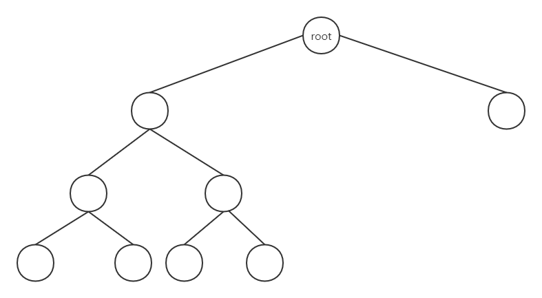

### 复杂度分析

```java
return 1 + countCompleteTree(root.left) + countCompleteTree(root.right);
```

参考完全二叉树求节点个数的代码可以发现，虽然最后是按照普通二叉树的节点个数进行计算的，但是由于完全二叉树的性质：

+ 完全二叉树的深度 = 满二叉树的深度
+ 一颗完全二叉树，其两颗子树中至少有一颗是满二叉树

所以这两个递归，只有一个会真的递归下去，另一个一定会触发 **hl == hr** 而立即返回，不会再从最底部往上回归。

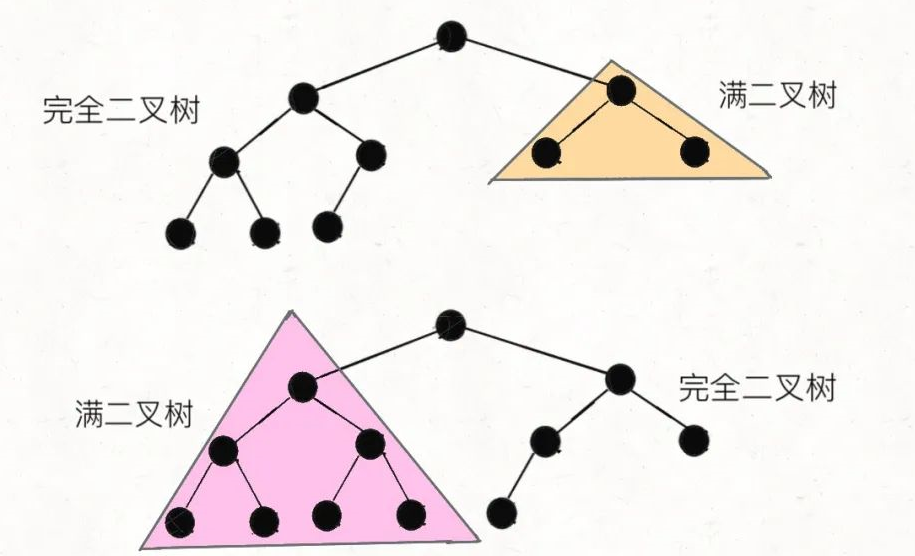

综上：算法的递归深度是树的深度 O(logN)，每次递归所花费的时间就是 while 循环，需要 O(logN)，所以总体的时间复杂度为 O(logNlogN)。所以说，“完全二叉树”还是有它存在的道理的，不仅适用于数组实现二叉堆，而且连计算节点总数这种看起来简单的操作都有高效的算法实现。

---

# 2020.12.25 & 26记录

## 序列化和反序列化二叉树(LeetCode297)

### 序列化和反序列化的意义

JSON 的运用非常广泛，比如我们经常将编程语言中的结构体序列化成 JSON 字符串，然后存入缓存或者通过网络发送给远端服务，消费者接收 JSON 字符串然后进行反序列化，就可以得到原始数据了。所以其目的是：

==以某种固定格式组织字符串，使得数据可以独立于编程语言。==

二叉树的序列化方法：serialize()，可以把一颗二叉树序列化为字符串

二叉树的反序列化方法：deserialize()，可以把字符串反序列化为二叉树

至于以什么格式序列化和反序列化，这个由自己决定。

==所谓序列化其实就是把结构化的数据”打平“，就是在考察二叉树的遍历方式==

### 前序遍历

**Example：**现有一颗二叉树，如下


相应的，代码框架为：

```java
private String serialize(TreeNode root) {
    if (root == null) {
        // 填充分隔符
        return;
    }
    
    // 前序遍历代码
    
    serialize(root.left, sb);
    serialize(root.right, sb);
}
```

对应完整程序为：

```java
// 二叉树前序遍历
// 代表分隔符的字符
String SEP = ",";
// 代表 null 指针的字符
String NULL = "#";

/*主函数：将二叉树序列化为字符串*/
private String serialize(TreeNode root) {
    StringBuilder sb = new StringBuilder();
    serialize(root, sb);
    return sb.toString();
}

/*辅助函数：将二叉树存入StringBuilder*/
private void serialize(TreeNode root, StringBuilder sb) {
    if (root == null) {
        sb.append(NULL).append(SEP);
        return;
    }

    // 进行前序遍历
    sb.append(root.val).append(SEP);

    serialize(root.left, sb);
    serialize(root.right, sb);
}
```

# 2020.12.27记录

### 反序列化(前序遍历)

单单前序遍历的结果是不能还原二叉树的，因为缺少空指针的信息。所以至少需要前、中、后序遍历的两种才能还原二叉树。但是这里的 node 列表包含空指针的信息，所以只使用 node 列表就可以还原二叉树。之前分析，这里的 node 列表就是一棵”打平“的二叉树。

那么，反序列化的过程也是一样的：==先确定根节点 Root，然后遵循前序遍历的规则，递归生成左右子树==

1. 先将字符串类型的节点转化为一个 List 数组，数组中只有相应的节点信息，供反序列化使用：

```java
/* 主函数：将字符串反序列化为二叉树结构 */
private TreeNode deserialize(String data) {
    // 将字符串转换成列表
    LinkedList<String> nodes = new LinkedList<>();
    for (String s : data.split(SEP)) {
        nodes.addLast(s); // 用于将对象链接到List的末尾
    }
    return deserialize(nodes); // 这里是真正实现反序列化生成二叉树的代码
}
```

2. 将列表中的节点信息反序列化为二叉树

```java
/* 辅助函数：通过 nodes 列表来构造二叉树*/
private TreeNode deserialize(LinkedList<String> nodes) {
    if (nodes.isEmpty()) return null;

    /* 前序遍历 */
    // nodes列表的最左侧就是根节点
    String first = nodes.removeFirst();
    if (first.equals(null)) return null;

    // Integer.parseInt(String)的作用就是将String字符类型数据转换为Integer整型数据。
    TreeNode root = new TreeNode(Integer.parseInt(first));
    /* 分隔线 */

    // 其余节点交给递归
    root.left = deserialize(nodes);
    root.right = deserialize(nodes);

    return root;
}
```

# 2020.12.28记录

### 后序遍历


后序遍历的框架为：

```java
/* 二叉树后续遍历 */
/*主函数：将二叉树序列化为字符串*/
private String postorderSerialize(TreeNode root) {
    StringBuilder sb = new StringBuilder();
    postorderSerialize(root, sb);
    return sb.toString();
}

/* 副函数：将二叉树序列化为字符串 */
private void postorderSerialize(TreeNode root, StringBuilder sb) {
    if (root == null) {
        sb.append(NULL).append(SEP);
        return;
    }

    // 后序遍历是先递归再进行转化为字符串
    postorderSerialize(root.left, sb);
    postorderSerialize(root.right, sb);

    sb.append(root.val).append(SEP);
}
```

### 反序列化(后序遍历)

**思路：**deserialize() 方法首先寻找 root 节点的值，然后递归计算左右子节点。

由上图可见，root 的值时列表最后一个元素。我们应该从后往前取出列表元素，先用最后一个元素构造 root，然后递归调用生成 root 的左右子树。

```java
/* 主函数，将字符串反序列化为二叉树结构 */
TreeNode deserialize(String data) {
    LinkedList<String> nodes = new LinkedList<>();
    for (String s : data.split(SEP)) {
        nodes.addLast(s);
    }
    return deserialize(nodes);
}

/* 辅助函数，通过 nodes 列表构造二叉树 */
TreeNode deserialize(LinkedList<String> nodes) {
    if (nodes.isEmpty()) return null;
    // 从后往前取出元素
    String last = nodes.removeLast();
    if (last.equals(NULL)) return null;
    TreeNode root = new TreeNode(Integer.parseInt(last));
    // 限构造右子树，后构造左子树
    root.right = deserialize(nodes);
    root.left = deserialize(nodes);

    return root;
}
```

**注意，根据上图，从后往前在 `nodes` 列表中取元素，一定要先构造 `root.right` 子树，后构造 `root.left` 子树**。

### 中序遍历

中序遍历只要把字符串的拼接操作放在中序遍历的位置就可以了：

```java
/* 二叉树的中序遍历 */
/* 主函数:将二叉树转换成字符串 */
private String inorderSerialize(TreeNode root) {
    StringBuilder sb = new StringBuilder();
    inorderSerialize(root, sb);
    return sb.toString();
}

/* 副函数：将二叉树序列化为字符串 */
private void inorderSerialize(TreeNode root, StringBuilder sb) {
    if (root == null) {
        sb.append(NULL).append(SEP);
        return;
    }

    inorderSerialize(root.left, sb);

    /* 中序遍历的位置 */
    sb.append(root.val).append(SEP);

    inorderSerialize(root.right, sb);
}
```

使用中序遍历==不能==实现反序列化的过程。因为要实现反序列方法，首先要构造 root 节点的位置，前序和后续遍历 root 节点分别在列表的首位和末位，而中序遍历的结果 root 节点在列表的中间，不知道其索引位置，所以我i发找到 root 节点。

### 层次遍历解法


# 2020.12.29记录

### 二叉树的层序遍历

其框架如下：

```java
/* 二叉树的层序遍历 */
/* 将二叉树序列化为字符串 */
private String levelSerialize(TreeNode root) {
    if (root == null) return "";
    StringBuilder sb = new StringBuilder();
    // 初始化队列，将 root 加入队列
    Queue<TreeNode> q = new LinkedList<>();
    q.offer(root);

    while (!q.isEmpty()) {
        TreeNode cur = q.poll(); // 取出并返回队列中的第一个元素

        /* 层级遍历的代码位置 */
        if (cur == null) {
            sb.append(NULL).append(SEP);
            continue;
        }
        sb.append(cur.val).append(SEP);
        /* 层级遍历的代码位置 */

        q.offer(cur.left);
        q.offer(cur.right);
    }

    return sb.toString();
}
```

其中：

offer

添加一个元素并返回true
如果队列已满，则返回false。

poll

将首个元素从队列中弹出（ 移除并返回队列头部的元素 ）（从队列中删除第一个元素）
如果队列是空的，就返回null。

### 反序列化(层序遍历)

由上图可以看到，每一个非空节点都会对应两个子节点，==那么反序列化的思路就是用队列进行层级遍历，同时用索引 **i ** 记录对应子节点的位置。==

```java
/* 反序列化(层序遍历) */
/* 主函数：将字符串反序列化为二叉树 */
private TreeNode deLevelSerialize(String data) {
    if (data.isEmpty()) return null;
    String[] nodes = data.split(SEP);
    // 第一个元素就是 root 的值
    TreeNode root = new TreeNode(Integer.parseInt(nodes[0]));

    // 队列 q 记录父节点，将 root 加入队列
    Queue<TreeNode> q = new LinkedList<>();
    q.offer(root);

    for (int i = 0; i < nodes.length; ) {
        // 队列存的都是父节点
        TreeNode parent = q.poll();
        // 父节点对应左侧节点的值
        String left = nodes[i++];
        if (!left.equals(NULL)) {
            parent.left = new TreeNode(Integer.parseInt(left));
            q.offer(parent.left);
        } else {
            parent.left = null;
        }
        // 父节点对应右侧子节点的值
        String right = nodes[i++];
        if (!right.equals(NULL)) {
            parent.right = new TreeNode(Integer.parseInt(right));
            q.offer(parent.right);
        } else {
            parent.right = null;
        }
    }
    return root;
}
```

## Git原理之二叉树最近公共祖先(leetcode [236])

使用 Git 的时候，比如

```java
git pull
```

它默认使用的是 `merge` 方式将远端别人的修改拉到本地；如果带上参数：

```java
git pull -r
```

就会使用 `rebase` 的方式将远端修改拉到本地。

`merge` 和 `rebase` 的区别：

+ `merge` 方式合并的分支会有很多“分叉”。
+ `rebase` 方式合并的就是一条直线。

对于多人合作的，`merge` 的方式并不好，一般来说，实际工作中更推荐使用 `rebase` 方式合并代码。

# 2020.12.30记录

### Git 寻找最近公共祖先的思路

首先，找到这两条的最近公共祖先 LCA，然后从 master 节点开始，重演 LCA 到 dev 几个 commit 的修改，如果这些修改和 LCA 到 master 的 commit 有冲突，就会提示你手动解决冲突，最后的结果就是把 dev 的分支完全接到 master 上。

涉及到二叉树肯定涉及到递归的问题，先列出所有二叉树问题的框架：

```java
void traverse(TreeNode root, variable, ...) {
    /* 前序遍历的位置 */
    ...
    /* 前序遍历的位置 */
    
    traverse(root.left, variable, ...);
    
    /* 中序遍历的位置 */
    ...
    /* 中序遍历的位置 */
        
    traverse(root.right, variable, ...)
        
    /* 后序遍历的位置 */
    ...
    /* 后序遍历的位置 */
}
```

所以，只要看到二叉树求其公共祖先的的问题，分析框架中要填的内容，先确定变量。

```java
TreeNode lowestCommonAcestor(TreeNode root, TreeNode p, TreeNode q) {
    TreeNode left = lowestCommonAcestor(root.left, p, q);
    TreeNode right = lowestCommonAcestor(root.right, p, q);
}
```

**面对递归问题的灵魂三问：**

+ **这个函数是干什么的？**

也就是说 `lowestCommonAcestor()` 函数的定义：在函数中输入三个参数 root、p、q，它会返回一个节点。

**情况①：**

如果 p 和 q 都在以 root 为根的数中，函数的返回即是 p 和 q 的公共祖先节点。

**情况②：**

如果 p 和 q 都不在以 root 为根的数中，那肯定没有它们的公共节点，返回 null。

**情况③：**

如果 p 和 q 只有一个存在于以 root 为根的树中，函数会返回那个节点。(**这个意思是输入的 p 和 q 中只有一个节点在树中，另一个是瞎写的不在树中，返回的是在树中的那个节点**)

题目说了输入的 p 和 q 一定存在于以 root 为根的树中，但是递归过程中，以上三种情况都有可能发生。这是 `lowestCommonAcestor()`函数的定义，无论发生什么，都不要怀疑这个定义的正确性。

+ **在这个函数的参数中，变量是什么？**

函数参数中的变量是 `root`，因为根据框架， `lowestCommonAcestor(root)`会递归调用 `root.left` 和`root.right`；至于 p 和 q，我们要求他们的公共祖先，他俩肯定是不会变化的。

以`root`为根会逐步转化为以`root.子节点`为根，即逐步缩小问题规模。

+ **得到函数递归的结果，你该干什么，即做什么选择？**

==如果 `left` 和 `right` 不为 null， 说明他们分别是 p 和 q。==

 **base case:**

1. 如果`root`为空，肯定得返回`null`。
2. 如果`root`本身就是`p`或者`q`，比如说`root`就是`p`节点吧，如果`q`存在于以`root`为根的树中，显然`root`就是最近公共祖先；
3. 即使`q`不存在于以`root`为根的树中，按照情况 3 的定义，也应该返回`root`节点。

**递归调用的结果`left`和`right`：**

情况 1，如果`p`和`q`都在以`root`为根的树中，那么`left`和`right`一定分别是`p`和`q`（从 base case 看出来的）。

情况 2，如果`p`和`q`都不在以`root`为根的树中，直接返回`null`。

情况 3，如果`p`和`q`只有一个存在于`root`为根的树中，函数返回该节点。

最后得到补充框架后的结果为：

```java
public class LowestCommonAncestor {

    private TreeNode lowestCommonAncestor(TreeNode root, TreeNode p, TreeNode q) {
        // 基本情况
        if (root == null) return null;
        if (root == p || root == q) return root;

        TreeNode left = lowestCommonAncestor(root.left, p, q);
        TreeNode right = lowestCommonAncestor(root.right, p, q);

        // 相当于二叉树的后序遍历
        // 情况1
        if (left != null && right != null) {
            return root;
        }
        // 情况2
        if (left == null && right == null) {
            return null;
        }
        // 情况3
        return left == null ? right : left;
    }
}
```

对于情况①，为什么 `left` 和 `right` 非空，就可以说明 `root` 是他们的最近公共祖先？

因为这里是二叉树后序遍历的过程！！！后序遍历是从下往上，好比从 p 和 q 出发往上走，第一次相交的节点就是这个 `root` 。

# 2021.1.8记录

## Java 中数组与 LinkedList(链表)的相互转换

### 数组转 LinkedList

```java
LinkedList linklist = new LinkedList(Arrays.asList(array));
```

数组转链表是调用了 Array.asList() 方法

```java
static List asList(T ... a) // 返回由指定数组支持的固定大小的链表
```

### LinkedList 转数组

```java
// 方法1
String[] array1 = (String[]) linklist.toArray(new String[0]);
// 此时以正确的顺序(从第一个到最后一个元素)返回一个包含此链表中所有元素的数组

// 方法2
String[] array2 = new String[linklist.size()];
linklist.toArray(array2);
// 以正确的顺组返回一个包含此链表中所有元素的数组，返回的数组的运行时类型是指定数组的运行时类型
```

## 特殊数据结构-单调栈，解决一类寻找 Next Greater Element 的问题

### 下一个更大元素 I(LeetCode[496])

### 题目描述

比如说，输入一个数组`nums = [2,1,2,4,3]`，你返回数组`[4,2,4,-1,-1]`。

解释：第一个 2 后面比 2 大的数是 4; 1 后面比 1 大的数是 2；第二个 2 后面比 2 大的数是 4; 4 后面没有比 4 大的数，填 -1；3 后面没有比 3 大的数，填 -1。

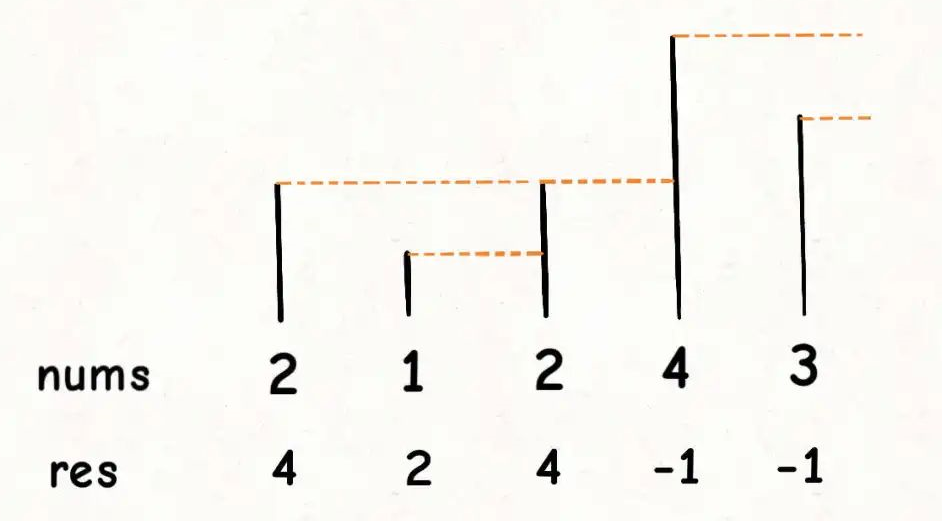

**定义：** 单调栈实际就是栈，使得每次新元素入栈后，栈内的元素都保持单调(单调递增或单调递减)。框架为：

```java
/*
 * 找到下一个更大的元素I
 * 比如输入一个数组 nums = [2, 1, 2, 4, 3]，算法返回 [4, 2, 4, -1, -1]
 * 暴力破解方法：对每个元素后面进行扫描，找到第一个更大的元素就行了。暴力破解的时间复杂度：O(n^2)
 * 算法时间复杂度为：O(n)
 */
// 核心思想：数组中的元素想象成一组不同身高的人，矮的人会被高的人遮住，所以只有越来越高才能被看见
// 即下一个更大的元素，输出没被“遮住”的元素
public int[] nextGreaterElement(int[] nums1, int[] nums2) {

    HashMap<Integer, Integer> map = new HashMap<>();
    int [] res = new int[nums1.length];
    // 栈中用来存放“更大的数”并不断更新
    Stack<Integer> s = new Stack<>();
    // 将 nums 数组的元素倒着放入栈中
    for (int i = nums2.length - 1; i >= 0; i--) {

        // 如果栈中元素不为空，说明至少两个以上的元素进行比较得出了一个更大的数，否则 s 会一直为空、
        while (!s.isEmpty() && nums2[i] >= s.peek()) {
            // 如果新输入的树比原来 s 中存的最大数还要大，那 s 的栈顶元素可以换了
            s.pop();
        }

        map.put(nums2[i], s.isEmpty() ? -1 : s.peek());

        s.push(nums2[i]);
    }

    for (int i = 0; i < nums1.length; i++) {
        res[i] = map.get(nums1[i]);
    }
    return res;
}
```

for 循环要从后往前扫描元素，因为我们借助的是栈的结构，倒着入栈，其实是正着出栈。while 循环是把两个「个子高」元素之间的元素排除，因为他们的存在没有意义，前面挡着个「更高」的元素，所以他们不可能被作为后续进来的元素的 Next Great Number 了。

### 时间复杂度

分析它的时间复杂度，要从整体来看：总共有`n`个元素，每个元素都被`push`入栈了一次，而最多会被`pop`一次，没有任何冗余操作。所以总的计算规模是和元素规模`n`成正比的，也就是`O(n)`的复杂度。

### 下一个更大元素 I(循环数组，LeetCode[496])

#### 题目描述

比如输入一个数组`[2,1,2,4,3]`，你返回数组`[4,2,4,-1,4]`。拥有了环形属性，**最后一个元素 3 绕了一圈后找到了比自己大的元素 4**。

#### 思路

**对于这种需求，常用套路就是将数组长度翻倍**：

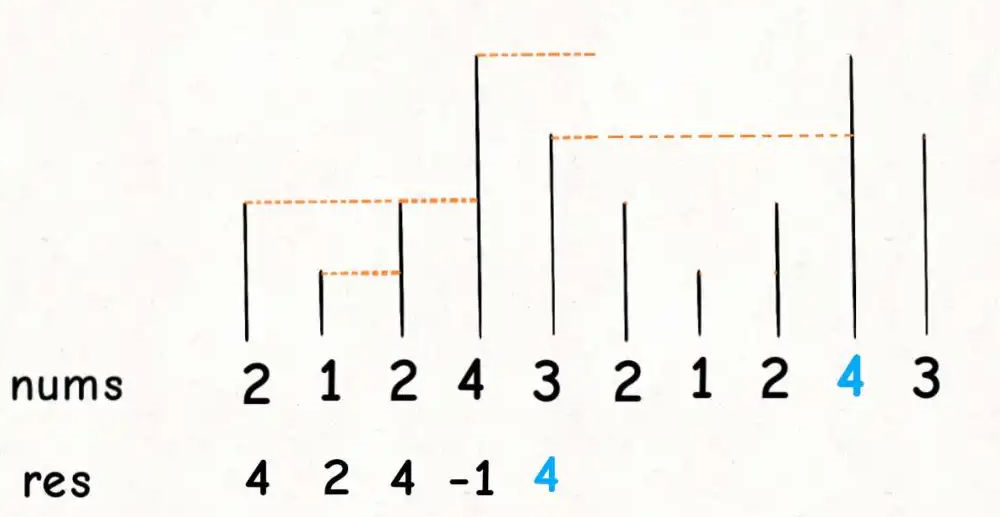

最简单的实现方式当然可以把这个双倍长度的数组构造出来，然后套用算法模板。但是，**我们可以不用构造新数组，而是利用循环数组的技巧来模拟数组长度翻倍的效果**。

#### 代码实现

```java
/* 寻找下一个更大的元素(循环数组) */
public int[] nextGreaterElements(int[] nums) {

    // nums 数组的大小
    int size = nums.length;

    // 装结果
    int[] res = new int[size];
    // 装比较的结果，即不断更新的"更大的数"
    Stack<Integer> stack = new Stack<>();

    // 倒着将 nums 数组中的元素放到栈中
    // 利用取模的方法可以使数组在不扩容的情况下实现增倍
    // 假装已经扩容了一倍
    for (int i = 2 * size - 1; i >= 0; i--) {

        // ②通过循环比较元素，更新栈中的“更大的元素”
        while (!stack.isEmpty() && nums[i % size] >= stack.peek()) {

            // 找到了更大的元素，栈中较小的元素就可以舍去
            stack.pop();
        }

        // ③找到了当前元素后第一个比它大的数，更新 res
        res[i % size] = stack.isEmpty() ? -1 : stack.peek();

        // ①放入数组元素
        stack.push(nums[i % size]);
    }
    return res;
}
```

### 每日温度(LeetCode[739])

#### 题目描述

给你一个数组`T`，这个数组存放的是近几天的天气气温，你返回一个等长的数组，计算：**对于每一天，你还要至少等多少天才能等到一个更暖和的气温；如果等不到那一天，填 0**。

比如说给你输入`T = [73,74,75,71,69,76]`，你返回`[1,1,3,2,1,0]`。

解释：第一天 73 华氏度，第二天 74 华氏度，比 73 大，所以对于第一天，只要等一天就能等到一个更暖和的气温，后面的同理。

#### 思路

这个问题本质上也是找 Next Greater Number，只不过现在不是问你 Next Greater Number 是多少，而是问你当前距离 Next Greater Number 的距离而已。

#### 代码实现

```java
/* 寻找下一个更大的温度 */
public int[] dailyTemperatures(int[] T) {

    // 装结果
    int[] res = new int[T.length];
    // 装索引
    Stack<Integer> stack = new Stack<>();

    // 将数组 T 中元素索引倒着入栈
    for (int i = T.length - 1; i >= 0; i--) {

        // ②循环进行元素大小比较
        // 如果栈中元素不为空，说明此时有比当前元素大的值
        // 如果战争没有元素，说明该元素后面没有比他大的
        while (!stack.isEmpty() && T[i] >= T[stack.peek()]) {

            // 如果栈中索引对应的值没有当前 T 数组中的元素大，那栈中索引对应的值可以“走了”
            stack.pop();
        }

        // ③将比较结果放入 res
        res[i] = stack.isEmpty() ? 0 : stack.peek() - i;

        // ①元素索引入栈
        stack.push(i);
    }
    return res;
}
```

# 2021.1.9记录

## 数据结构的存储方式

数据结构的存储方式只有两种：数组(顺序存储)、链表(链式存储)

我们分析问题，一定要有==递归的思想，自顶向下，从抽象到具体。==散列表、栈、队列、堆、树、图等都属于「上层建筑」，而数组和链表才是「结构基础」。因为那些多样化的数据结构，究其源头，都是在链表或者数组上的特殊操作，API 不同而已。

+ 「队列」、「栈」均可以由链表和数组实现。

  数组实现需要处理扩容缩容问题；

  链表实现没有这个问题，但是需要更多的内存空间存储节点指针

+ 「图」的两种表示方法，邻接表就是链表，邻接矩阵就是二维数组。

  邻接矩阵判断连通性迅速，并可以进行矩阵运算解决一些问题，但是如果图比较稀疏就会很耗费空间；

  邻接表比较节省空间，但是很多操作的效率上肯定比不过邻接矩阵。

+ 「散列表」通过散列函数把键映射到一个大数组里。

  对于解决散列冲突的方法，拉链法需要链表特性，操作简单，但需要额外的空间存储指针；

  线性探查法就需要数组特性，以便连续寻址，不需要指针的存储空间，但操作稍微复杂些。

+ 「树」用数组实现就是「堆」，因为「堆」是一个完全二叉树，用数组存储不需要节点指针，操作也比较简单；

  用链表实现就是很常见的那种「树」，因为不一定是完全二叉树，所以不适合用数组存储。为此，在这种链表「树」结构之上，又衍生出各种巧妙的设计，比如二叉搜索树、AVL 树、红黑树、区间树、B 树等等，以应对不同的问题。

==**数据结构种类很多，但它们存在的目的都是在不同的应用场景，尽可能高效地增删查改**。==

## 如何遍历 + 访问？

各种数据结构的遍历 + 访问无非两种形式：线性的和非线性的。

### 数组遍历框架，典型的线性迭代结构：

数组遍历框架，典型的线性迭代结构：

```java 
void traverse(int[] arr) {
    for (int i = 0; i < arr.length; i++) {
        // 迭代访问 arr[i]
    }
}
```

链表遍历框架，兼具迭代和递归结构：

```java
/* 基本的单链表节点 */
class ListNode {
    int val;
    ListNode next;
}

void traverse(ListNode head) {
    for (ListNode p = head; p != null; p.next) {
        // 迭代访问 p.val
    }
}

void traverse(ListNode head) {
    // 迭代访问 head.val
    traverse(head.next);
}
```

二叉树遍历框架，典型的非线性递归遍历结构：

```java
/* 基本的二叉树节点 */
class TreeNode {
    int val;
    TreeNode left, right;
}

void traverse(TreeNode root) {
    traverse(root.left);
    traverse(root.right);
}
```

二叉树框架可以扩展为 N 叉树的遍历框架：

```java
/* 基本的 N 叉树节点 */
class TreeNode {
    int val;
    TreeNode[] children;
}

void traverse(TreeNode root) {
    for (TreeNode child : root.children)
        traverse(child);
}
```

# 2021.1.10记录

## 92-反转链表II

### 递归反转整个链表

首先整个代码为：

```java
ListNode reverse(ListNode head) {
    if (head == null || head.next == null) return head;
    ListNode last = reverse(head.next);
    head.next.next = head;
    head.next = null;
    return last;
}
```

**对于递归算法，最重要的就是明确递归函数的定义**。具体来说，我们的 `reverse` 函数定义是这样的：

**输入一个节点** **`head`**，将「以 **`head`** **为起点」的链表反转，并返回反转之后的头结点**。


那么输入 `reverse(head)` 后，会在这里进行递归：

```java
ListNode last = reverse(head.next);
```


递归的结果如下：


将第二个节点指向第一个 head 节点

```java
head.next.next = head;
```

执行结果如下

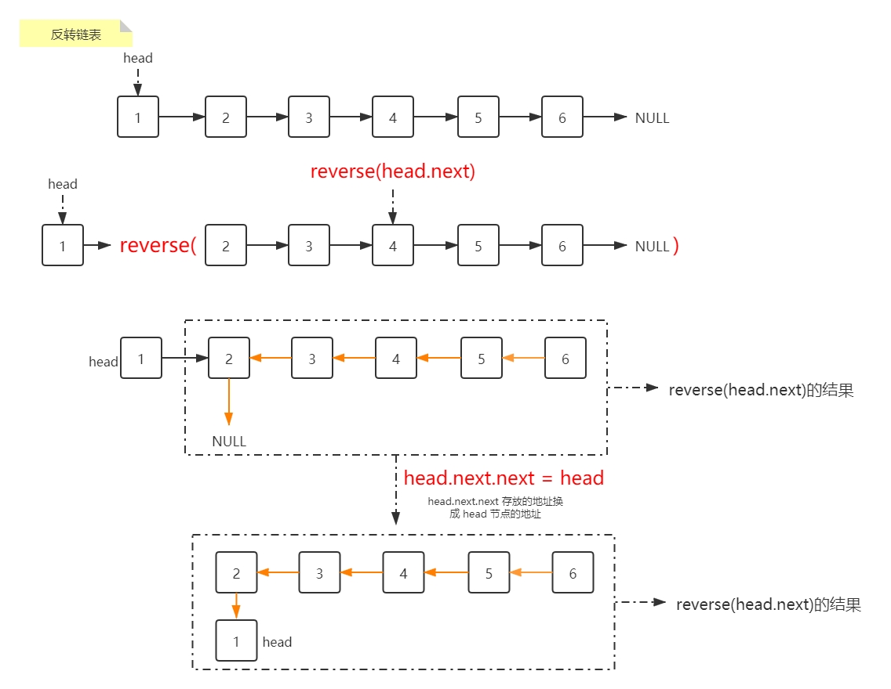

当链表递归反转之后，新的头结点是 `last`，而之前的 `head` 变成了最后一个节点，别忘了链表的末尾要指向 null：

```java
head.next = null;
return last;
```

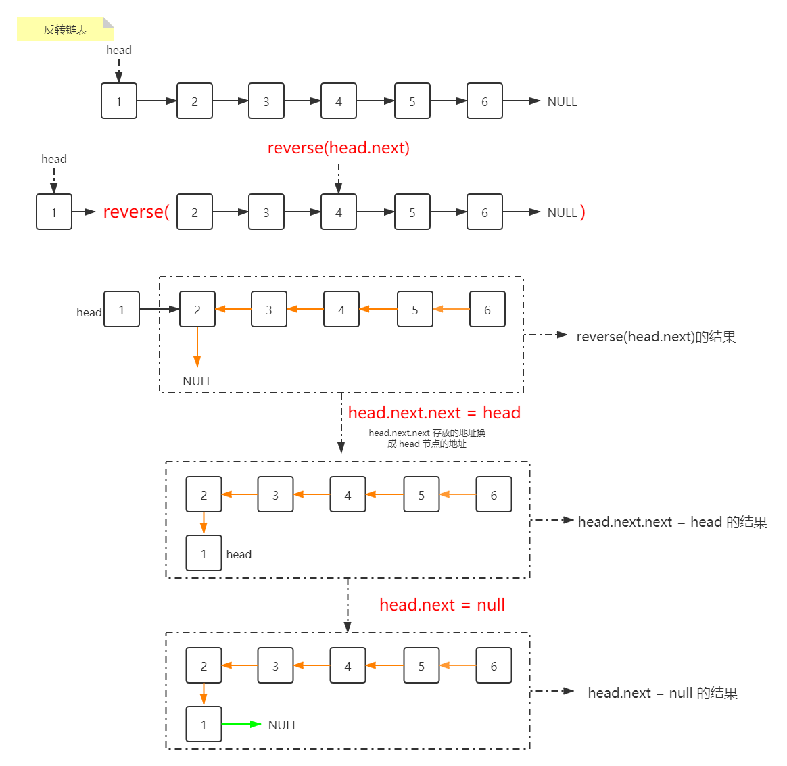

# 2021.1.11记录

### 反转链表前N个节点
首先我们要实现这样一个函数

```java
ListNode successor = null; // 后驱节点

// 反转以 head 为起点的 n 个节点，返回新的头结点
ListNode reverseN(ListNode head, int n) {
    if (n == 1) { 
        // 记录第 n + 1 个节点
        successor = head.next;
        return head;
    }
    // 以 head.next 为起点，需要反转前 n - 1 个节点
    ListNode last = reverseN(head.next, n - 1);

    head.next.next = head;
    // 让反转之后的 head 节点和后面的节点连起来
    head.next = successor;
    return last;
}
```

这个函数实现的效果如下：

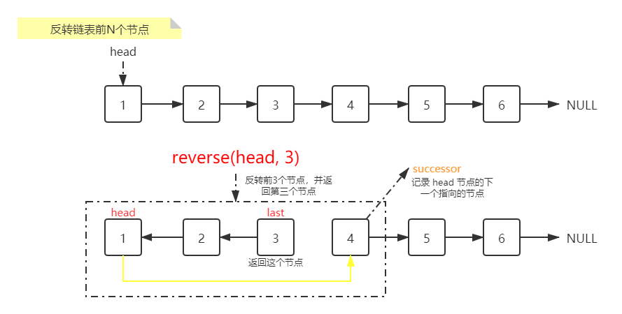

具体的区别：

1. base case 变为 n == 1，反转一个元素，就是它本身，同时要记录后驱节点
2. 刚才我们直接把 head.next 设置为 null，因为整个链表反转后原来的 head 变成了整个链表的最后一个节点。但现在 head 节点在递归反转之后不一定是最后一个节点了，所以要记录后驱 successor（第 n + 1 个节点），反转之后将 head 连接上。
3. base case 中 return head; ==是因为 last = 3，在反转之后就变成了头节点 head。==

### 反转链表的一部分
给一个索引区间 [m,n]（索引从 1 开始），仅仅反转区间中的链表元素。

```java
ListNode reverseBetween(ListNode head, int m, int n)
```

首先，如果 m == 1，就相当于反转链表开头的 n 个元素嘛，也就是我们刚才实现的功能：

```java
ListNode reverseBetween(ListNode head, int m, int n) {
    // base case
    if (m == 1) {
        // 相当于反转前 n 个元素
        return reverseN(head, n);
    }
    // ...
}
```

如果 m != 1 怎么办？如果我们把 head 的索引视为 1，那么我们是想从第 m 个元素开始反转对吧；
如果把 head.next 的索引视为 1 呢？==那么相对于 head.next，反转的区间应该是从第 m - 1 个元素开始的；==
那么对于 head.next.next 呢……


所以总的代码为：

```java
public ListNode reverseBetween(ListNode head, int m, int n) {
    if (m == 1) {
        // 相当于反转前 N 个元素
        return reverseN(head, n);
    }

    head.next = reverseBetween(head.next, m - 1, n - 1);
    return head;
}

ListNode successor = null;
public ListNode reverseN(ListNode head, int n) {
    // base case
    if (n == 1) {
        successor = head.next;
        return head;
    }

    ListNode last = reverseN(head.next, n - 1);
    head.next.next = head;
    head.next = successor;
    return last;
}
```

# 2021.1.12记录

## 如何 K 个一组反转链表？

### 思路分解的过程


### 代码实现

首先，我们要实现一个 `reverse` 函数反转一个区间之内的元素。在此之前我们再简化一下，给定链表头结点，如何反转整个链表？

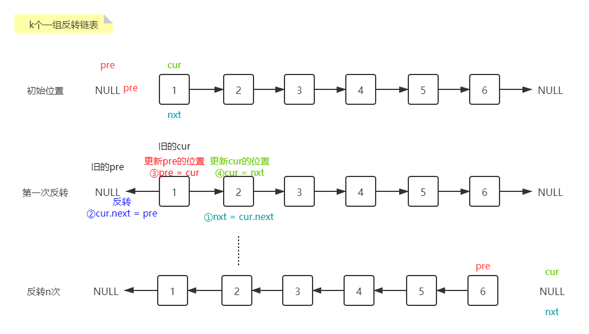

```java
// 反转以 a 为头结点的链表
ListNode reverse(ListNode a) {
    ListNode pre, cur, nxt;
    pre = null; cur = a; nxt = a;
    while (cur != null) {
        // 先将 nxt 移到 cur 的下一个节点
        nxt = cur.next;
        // 逐个结点反转
        cur.next = pre;
        // 更新指针位置
        pre = cur;
        cur = nxt;
    }
    // 返回反转后的头结点
    return pre;
}
```

「反转以 `a` 为头结点的链表」其实就是「反转 `a` 到 null 之间的结点」，那么如果让你「反转 `a` 到 `b` 之间的结点」，你会不会？

只要更改函数签名，==并把上面的代码中 `null` 改成 `b`== 即可：

```java
/** 反转区间 [a, b) 的元素，注意是左闭右开 */
ListNode reverse(ListNode a, ListNode b) {
    ListNode pre, cur, nxt;
    pre = null; cur = a; nxt = a;
    // while 终止的条件改一下就行了
    while (cur != b) {
        nxt = cur.next;
        cur.next = pre;
        pre = cur;
        cur = nxt;
    }
    // 返回反转后的头结点
    return pre;
}
```

总体解题的思路为：

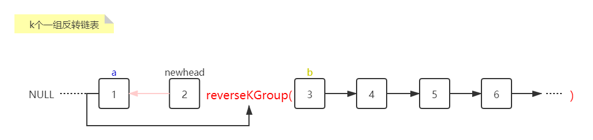

```java
// K 个一组反转链表
public ListNode reverseKGroup(ListNode head, int k) {
    if (head == null) return null;
    ListNode a, b;
    a = b = head;
    // base case: 当链表节点不满 K 个的时候，直接返回 head，不需要反转
    for (int i = 0; i < k; i++) {
        if (b == null) return head; // 先进行判断，在让 b = b.next 用以判断节点不满足 K 时不反转的功能
        b = b.next;
        // example：当节点数为 2，K = 2 时，i 取值 0 ~ 1。
        // 第一次：i = 0, b = head，不满足 if 中条件，执行 b = b.next;
        // 第二次: i = 1, b = head.next, 不满足 if 中条件，执行 b = b.next; 虽然此时 b = head.next.next == null, 但是此时 i 会递增为 2，不会在进行 for 循环了。
        // 以此判断节点数够不够 K 个
    }

    // 更新得到一个新的 head 节点，命名 newHead
    ListNode newHead = reverse(a, b);
    // 连接后续递归反转的链表
    head.next = reverseKGroup(b, k);
    return newHead;
}
```

# 2021.1.13记录

## 最长回文子串？(leetcode [5])

寻找回文串的核心思想是**从中心向两端扩展：**

```java
public String longestPalindrome(String s) {

    // base case
    if (s == null || s.length() == 0) {
        return "";
    }
    // 用数组定义返回字符串的上下标索引
    int[] range = new int[2];
    // 将输入的字符串 s 进行遍历，依次查找以每个元素开始的最长子回文串
    // 回文串：中间部分元素相同，两端元素对称相等
    char[] str = s.toCharArray();

    for (int i = 0; i < s.length(); i++) {

        // 定义函数 findLongest() 如果是偶数回文串返回 high + 1; 否则返回 high;
        // 在函数内部持续更新 range[0] 和 range[1] 的值
        i = findLongest(str, i, range);
    }
    return s.substring(range[0], range[1] + 1); // 左闭右开
}

public static int findLongest(char[] str, int low, int[] range) {

    // ①当 high < str.length - 1 时(因为如果 high == str.length，即 str 最后一个元素，不可能组成回文串)
    // 根据 low(字符串最左边元素的索引)，检查是否有中间元素相同的情况。若有，high ++;
    int high = low;
    while (high < str.length - 1 && str[low] == str[high + 1]) {
        high++;
    }

    // ②定位中间元素最后一位，下次即跳过这个索引开始查找回文串
    int ans = high;

    // ③以 low 和 high 为中心元素向两端查找，如果两端元素相同，则更新 range
    while (low > 0 && high < str.length - 1
           && str[low -1] == str[high + 1]) {
        low--;
        high++;
    }

    // ④判断 high - low ?> range[1] - range[0]
    // 是：有新的更长的回文串，更新range
    // 否：不更新
    if (high - low > range[1] - range[0]) {
        range[0] = low;
        range[1] = high;
    }
    return ans;
}
```

## 如何判断一个字符串是否是回文串(leetcode [125])

而判断一个字符串是不是回文串就简单很多，不需要考虑奇偶情况，只需要「双指针技巧」，**从两端向中间逼近即可：**

```java
// 核心思想：判断是不是回文串，只需从两端的元素进行比较，只要有一个不同，则返回 false，否则返回 true。
public boolean isPalindrome(String s) {
    // 先将字符串统一变成小写
    String str = s.toLowerCase();
    int left = 0;
    int right = s.length() - 1;

    // base case
    if (s == null || s.length() == 0) return true;

    // 注意循环条件
    while (left < right) {
        // 假如字符串中左边存在除了字母和数字以外的符号，让 left++;
        while (left < right && !Character.isLetterOrDigit(str.charAt(left))) {
            left++;
        }

        // 假如字符串中右边存在除了字母和数字以外的符号，让 right--;
        while (left < right && !Character.isLetterOrDigit(str.charAt(right))) {
            right--;
        }

        if (str.charAt(left) != str.charAt(right)) return false;
        left++; right--;
    }
    return true;
}
```

**因为回文串是对称的，所以正着读和倒着读应该是一样的，这一特点是解决回文串问题的关键**。

## 如何判断一个「单链表」是不是回文？(leetcode [234]）

输入一个单链表的头结点，判断这个链表中的数字是不是回文：

```java
/**
 * 单链表节点的定义：
 * public class ListNode {
 *     int val;
 *     ListNode next;
 * }
 */

boolean isPalindrome(ListNode head);

输入: 1->2->null
输出: false

输入: 1->2->2->1->null
输出: true
```

这道题的关键在于，单链表无法倒着遍历，无法使用双指针技巧。那么最简单的办法就是，把原始链表反转存入一条新的链表，然后比较这两条链表是否相同。

或者将单链表进行后序遍历存入 StringBuilder 中，再进行节点值的比对。

```java
public boolean isPalindrome(ListNode head) {
    StringBuilder sb1 = new StringBuilder();
    StringBuilder sb2 = new StringBuilder();

    preTraverse(head, sb1);
    postTraverse(head, sb2);

    // 判断
    for (int i = 0; i < sb1.length(); i++) {
        if (sb1.charAt(i) != sb2.charAt(i)) return false;
    }
    return true;
}

// 前序遍历链表
public static void preTraverse(ListNode head, StringBuilder sb) {
    if (head == null) return;

    // 前序遍历代码
    sb.append(head.val);

    preTraverse(head.next, sb);
}

// 后序遍历链表
public static void postTraverse(ListNode head, StringBuilder sb) {
    if (head == null) return;

    postTraverse(head.next, sb);

    // 后序遍历代码
    sb.append(head.val);
}
```

其中，在「学习数据结构的框架思维」中说过，链表兼具递归结构，树结构不过是链表的衍生。那么，**链表其实也可以有前序遍历和后序遍历**：

```java
void traverse(ListNode head) {
    // 前序遍历代码
    traverse(head.next);
    // 后序遍历代码
}
```

无论造一条反转链表还是利用后续遍历，算法的时间和空间复杂度都是 O(N)。

# 2021.1.14记录

## 进阶：优化空间复杂度

**1、先通过「双指针技巧」中的快慢指针来找到链表的中点**：

```java
ListNode slow, fast;
slow = fast = head;
while (fast != null && fast.next != null) {
    slow = slow.next;
    fast = fast.next.next;
}
// slow 指针现在指向链表中点
```

**2、如果**`fast`**指针没有指向**`null`**，说明链表长度为奇数，**`slow`**还要再前进一步**：

```
if (fast != null)
    slow = slow.next;
```

**3、从**`slow`**开始反转后面的链表，现在就可以开始比较回文串了**：

```java
ListNode left = head;
ListNode right = reverse(slow);

while (right != null) {
    if (left.val != right.val)
        return false;
    left = left.next;
    right = right.next;
}
return true;
```

总的流程图如下：

.png)

算法总体的时间复杂度 O(N)，空间复杂度 O(1)，已经是最优的了。

这种解法虽然高效，但破坏了输入链表的原始结构，能不能避免这个瑕疵呢？

其实这个问题很好解决，关键在于得到`p, q`这两个指针位置：

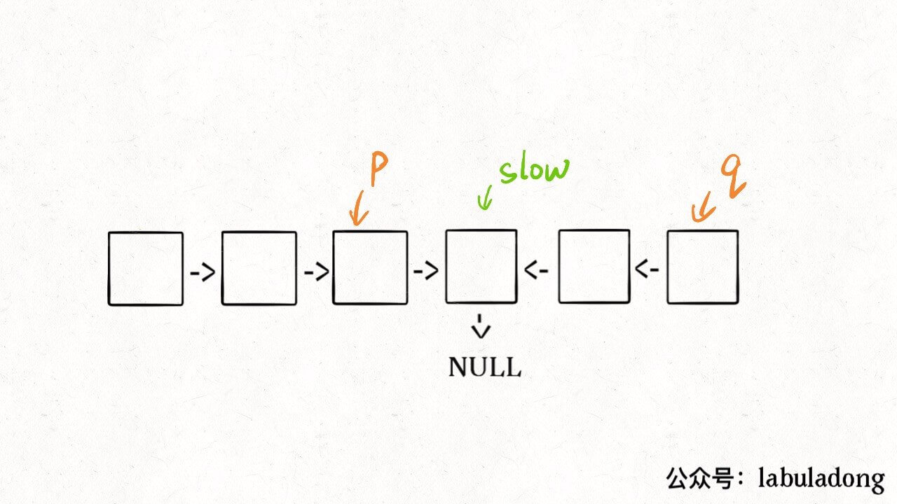

这样，只要在函数 return 之前加一段代码即可恢复原先链表顺序：

```java
p.next = reverse(q);
```

**总结：**首先，寻找回文串是从中间向两端扩展，判断回文串是从两端向中间收缩。对于单链表，无法直接倒序遍历，可以造一条新的反转链表，可以利用链表的后序遍历，也可以用栈结构倒序处理单链表。

具体到回文链表的判断问题，由于回文的特殊性，可以不完全反转链表，而是仅仅反转部分链表，将空间复杂度降到 O(1)。

### 反转二叉树(leetcode [226])

输入一个二叉树根节点 `root`，让你把整棵树镜像翻转，比如输入的二叉树如下：

```java
     4
   /   \
  2     7
 / \   / \
1   3 6   9
```

算法原地翻转二叉树，使得以 `root` 为根的树变成：

```java
     4
   /   \
  7     2
 / \   / \
9   6 3   1
```

**我们发现只要把二叉树上的每一个节点的左右子节点进行交换，最后的结果就是完全翻转之后的二叉树**。

```java
// 反转二叉树的关键思路：只需要将二叉树上的每个节点的左右子节点互换即可
public TreeNode invertTree(TreeNode root) {

    // base case
    if (root == null) return null;

    // 前序遍历的位置
    TreeNode tmp = root.left;
    root.left = root.right;
    root.right = tmp;    // base case + 前序遍历代码都是 root 节点要完成的事，剩下的交给递归

    invertTree(root.left);
    invertTree(root.right);

    return root;
}
```

**二叉树题目的一个难点就是，如何把题目的要求细化成每个节点需要做的事情**。

### 填充每个节点的下一个右侧节点指针(leetcode [116])

题目的意思就是把二叉树的每一层节点都用 `next` 指针连接起来：


题目说了，输入是一棵「完美二叉树」，形象地说整棵二叉树是一个正三角形，除了最右侧的节点 `next` 指针会指向 `null`，其他节点的右侧一定有相邻的节点。

**思考：**

把每一层的节点穿起来，是不是只要把每个节点的左右子节点都穿起来就行了？

这样做的话，节点 5 和节点 6 不属于同一个父节点，那么按照这个逻辑，它俩就没办法被穿起来，这是不符合题意的。

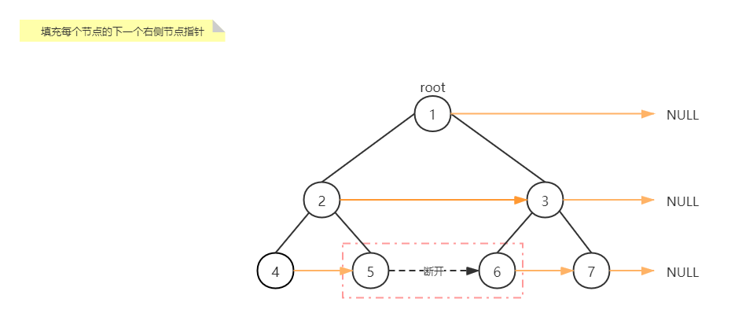

**二叉树的问题难点在于，如何把题目的要求细化成每个节点需要做的事情**，但是如果只依赖一个节点的话，肯定是没办法连接「跨父节点」的两个相邻节点的。

那么，我们的做法就是增加函数参数，一个节点做不到，我们就给他安排两个节点，「将每一层二叉树节点连接起来」可以细化成「将每两个相邻节点都连接起来」：

```java
// 因为仅仅连接父节点下的左右孩子节点会导致不在同一个父节点下的两个节点无法连接
// 所以再细化一下问题：输入两个节点，要求这两个节点之间进行连接操作
public Node connect(Node root) {

    if (root == null) return null; // root 都为 null 了，还往下写个啥呢？

    // 定义函数 connectTwoNode()，输入两个节点进行连接
    connectTwoNode(root.left, root.right);

    return root;
}

// 定义函数 connectTwoNode()
public void connectTwoNode(Node node1, Node node2) {

    // base case
    if (node1 == null || node2 == null) return;

    /**** 前序遍历位置 ****/
    // 将传入的两个节点连接
    node1.next = node2;

    // 连接相同父节点的两个孩子节点
    connectTwoNode(node1.left, node1.right);
    connectTwoNode(node2.left, node2.right);

    // 链接不同父节点之间的两个相邻节点，肯定是 node1.right-->node2.left
    connectTwoNode(node1.right, node2.left);
}
```

### 将二叉树展开为链表(leetcode [114])

函数签名如下：

```java
void flatten(TreeNode root);
```

**定义：**

**给** **`flatten`** **函数输入一个节点** **`root`****，那么以** **`root`** **为根的二叉树就会被拉平为一条链表**。

我们再梳理一下，如何按题目要求把一棵树拉平成一条链表？很简单，以下流程：

1. 将 `root` 的左子树和右子树拉平。

2. 将 `root` 的右子树接到左子树下方，然后将整个左子树作为右子树。

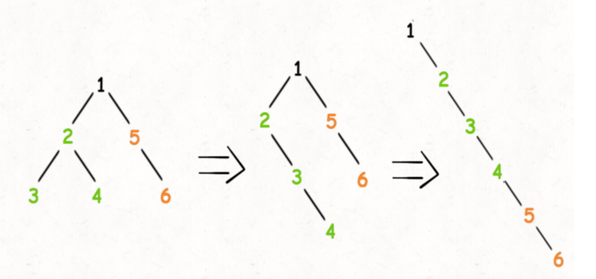

上面三步看起来最难的应该是第一步对吧，如何把 `root` 的左右子树拉平？

其实很简单，按照 `flatten` 函数的定义，对 `root` 的左右子树递归调用 `flatten` 函数即可：

```java
public void flatten(TreeNode root) {

    // base case
    if (root == null) return;

    // 后序遍历
    // 不需要管怎么才能把二叉树的左右子树拉直成一个链表，只需要递归调用这个函数即可
    flatten(root.left);
    flatten(root.right);

    // 执行完上述递归代码后，我们只需要知道此时二叉树的左右子树已经被拉直了
    // 考虑如何将 root 先拼接左子树，再在其基础上拼接右子树
    // 新定义两个 TreeNode 分别存放左子树和右子树
    TreeNode left = root.left;
    TreeNode right = root.right;

    // 清零 root 原先的左子树
    root.left = null;
    // 让 root 的下一个节点指向左子树的头节点
    root.right = left;

    // 将右子树拼接到上述的结果中
    // 在此之前需要获得拼接完左子树后的 root 的最后一个节点
    // 定义一个 p 复制 root，用它来计算最后一个节点
    TreeNode p = root;
    while (p.right != null) {
        p = p.right;
    }

    // 再让 p 的指向右子树的头节点即可
    p.right = right;
}
```

这就是递归的魅力，你说 `flatten` 函数是怎么把左右子树拉平的？说不清楚，但是只要知道 `flatten` 的定义如此，相信这个定义，让 `root` 做它该做的事情，然后 `flatten` 函数就会按照定义工作。另外注意递归框架是后序遍历，因为我们要**先拉平左右子树**才能进行后续操作。

# 2021.1.15记录

## 构造最大二叉树(leetcode [654])

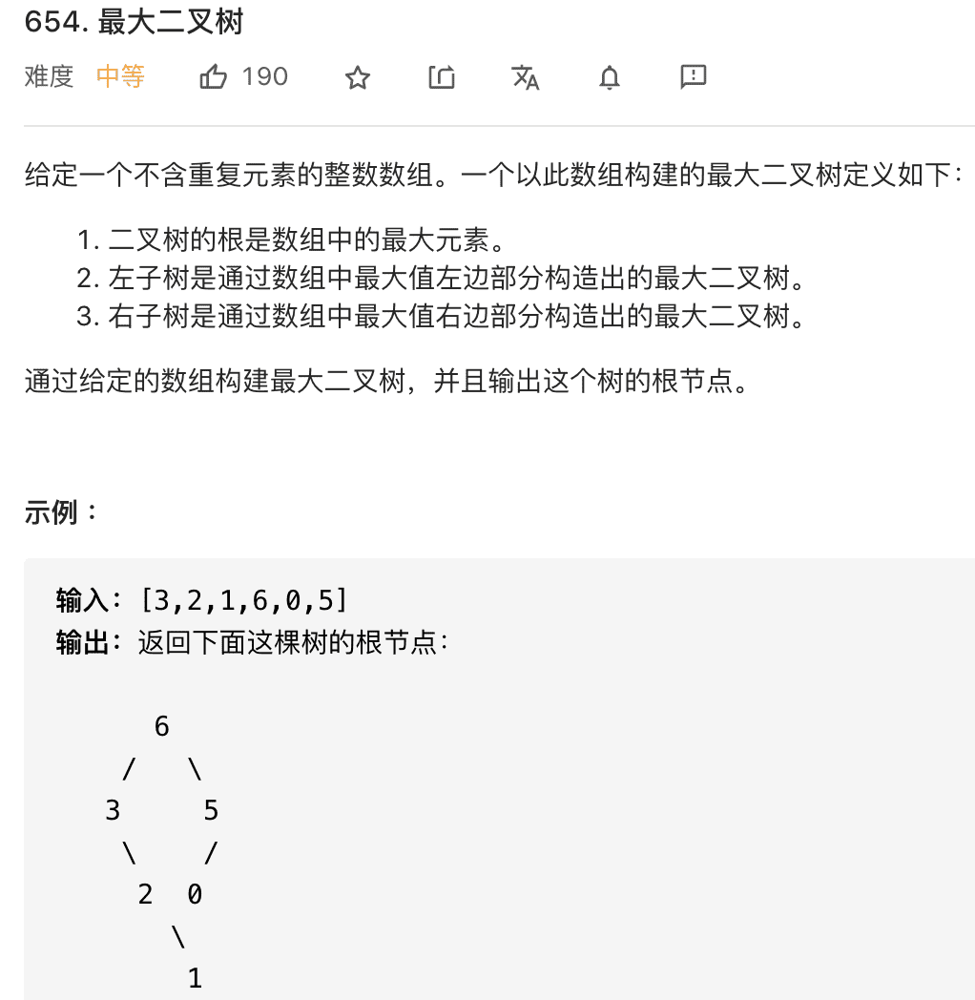

**对于构造二叉树的问题，根节点要做的就是把想办法把自己构造出来**。

**对于每个根节点，只需要找到当前** **`nums`** **中的最大值和对应的索引，然后递归调用左右数组构造左右子树即可**。

```java
public TreeNode constructMaximumBinaryTree(int[] nums) {
    return build(nums, 0, nums.length - 1);
}

public TreeNode build(int[] nums, int low, int high) {
    // base case：如果数组 nums 为空，则返回 null
    if (high < low) return null;

    // 找到数组中最大的元素当作根节点
    // 在JDK中，整形类型是有范围的，最大值为Integer.MAX_VALUE，即2147483647，最小值为Integer.MIN_VALUE -2147483648。
    int index = -1,  maxVal = Integer.MIN_VALUE;
    for (int i = low; i <= high; i++) {
        if (nums[i] > maxVal) {
            index = i;
            maxVal = nums[i];
        }
    }

    // 最大值找到后，以其作为根节点
    TreeNode root = new TreeNode(maxVal);

    // 递归找子区间的最大值构造根节点，以此类推
    root.left = build(nums, low, index - 1);
    root.right = build(nums, index + 1, high);

    return root;
}
```

## 通过前序和中序遍历结果构造二叉树(leetcode [105])

**要求：**

给出二叉树前序和中序遍历的结果，根据这两个结果重构原二叉树。

### 二叉树的前序和中序遍历结果

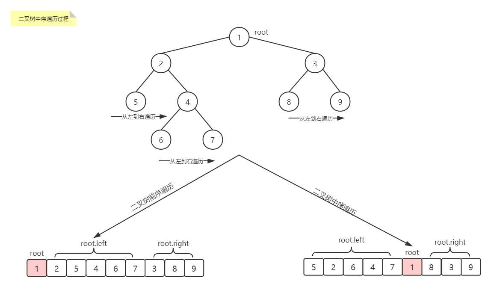

函数签名：

```java
TreeNode buildTree(int[] preorder, int[] inorder);
```


### 思路

**想办法确定根节点的值，把根节点做出来，然后递归构造左右子树即可**。

并且要明确我们定义的函数 **build**(**int**[] preorder, **int** preStart, **int** preEnd, **int**[] inorder, **int** inStart, **int** inEnd) 的功能：就是帮我们根据前序遍历和中序遍历的结果中左子树和右子树的索引返回重构出原左子树和原右子树。我们不要纠结这是怎么恢复的，只需要清楚这个函数的定义即可。

1. 根据前序遍历的结果，很容易得知原二叉树的根节点的值为前序遍历结果数组的第一个元素：preorder[0]
2. 根据找出的根节点的值，再 inorder[] 数组中找到对应的索引值
3. 明确左右子树在 inorder[] 中的索引范围：
   + 左子树：inStart ~ index - 1
   + 右子树：index + 1 ~ inEnd

4. 明确左右子树在 preorder[] 中的索引范围：

   假设左子树的元素个数为 leftSize，根据前序遍历的结果，可知左子树的范围：

   + 左子树：preStart + 1 ~ preStart + leftSize
   + 右子树：preStart + leftSize + 1 ~ preEnd

5. 求 leftSize 的值：

   因为在 inorder[] 中我们求得了 root 节点的索引值，在 root 之前的元素都是左子树的元素，所以

   leftSize = index - inStart

   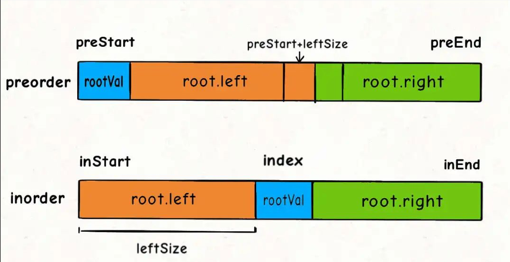

### 程序实现

```java
public TreeNode buildTree(int[] preorder, int[] inorder) {

    return build(preorder, 0, preorder.length - 1,
                 inorder, 0, inorder.length - 1);
}

// 定义函数 build()：根据前序遍历和中序遍历的结果中的左子树和右子树的索引范围重构二叉树
public TreeNode build(int[] preorder, int preStart, int preEnd,
                      int[] inorder, int inStart, int inEnd) {

    // base case
    if (preEnd < preStart) return null;

    // ①根据前序遍历的结果可以得出原二叉树的 root 节点的值
    int rootVal = preorder[preStart];

    // ②根据 root 节点的值找到其在 inorder[] 数组中的索引
    int index = 0;
    for (int i = 0; i <= inEnd; i++) {
        if (inorder[i] == rootVal) {
            index = i;
        }
    }

    // ③构造树
    TreeNode root = new TreeNode(rootVal);

    // ④计算leftSize(左子树元素个数)
    int leftSize = index - inStart;
    root.left = build(preorder, preStart + 1, preStart + leftSize,
                      inorder, inStart, index - 1);
    root.right = build(preorder, preStart + leftSize + 1, preEnd,
                       inorder, index + 1, inEnd);

    return root;
}
```

## 通过中序和后序遍历结果构造二叉树(leetcode [106])

### 二叉树的后序和中序遍历结果

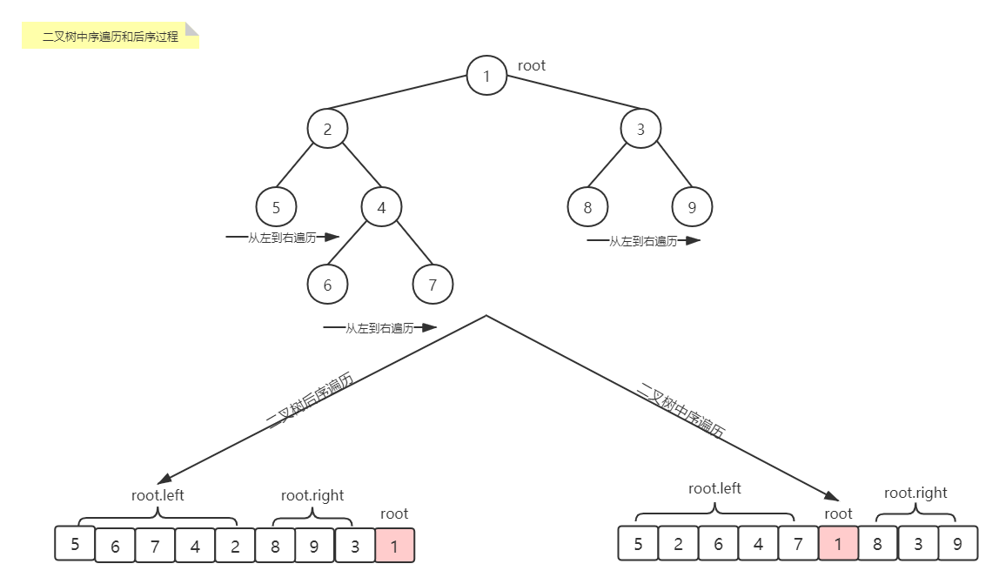

### 思路

**想办法确定根节点的值，把根节点做出来，然后递归构造左右子树即可**。

与上面思路完全相同只是现在求根据 index 求  rightSize，然后得到相应的左子树和右子树分别在后序遍历和中序遍历结果数组中的索引范围。

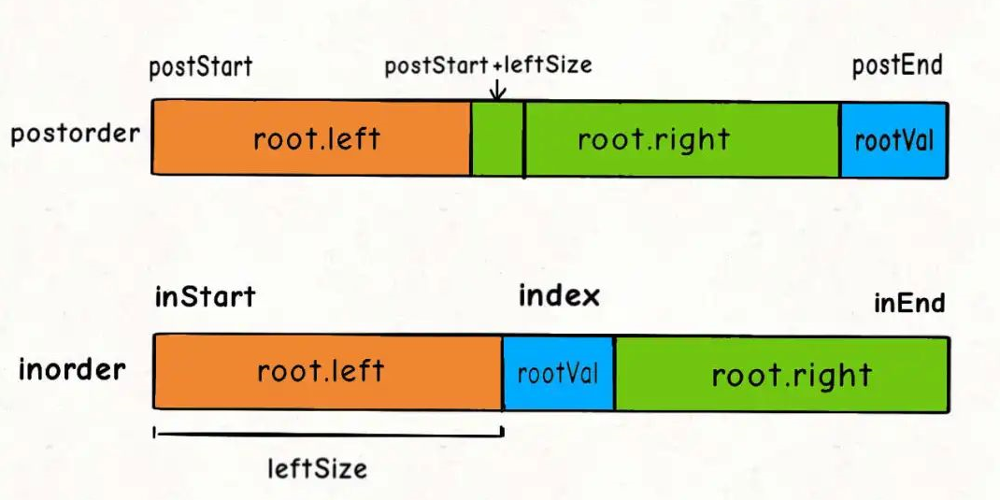

### 实现代码

```java
public TreeNode buildTree(int[] inorder, int[] postorder)  {

    return build(inorder, 0, inorder.length - 1,
                 postorder, 0, postorder.length - 1);
}

// 定义函数 build()：根据前序遍历和中序遍历的结果中的左子树和右子树的索引范围重构二叉树
public TreeNode build(int[] inorder, int inStart, int inEnd,
                      int[] postorder, int postStart, int postEnd) {

    // base case
    if (inEnd < inStart) return null;

    // ①根据前序遍历的结果可以得出原二叉树的 root 节点的值
    int rootVal = postorder[postEnd];

    // ②根据 root 节点的值找到其在 inorder[] 数组中的索引
    int index = 0;
    for (int i = 0; i <= inEnd; i++) {
        if (inorder[i] == rootVal) {
            index = i;
            break;
        }
    }

    // ③构造树
    TreeNode root = new TreeNode(rootVal);

    // ④计算leftSize(左子树元素个数)
    //        int leftSize = index - inStart;

    // 用右子树元素个数试试
    int rightSize = inEnd - index;

    //        root.left = build(inorder, inStart, index - 1,
    //                postorder, postStart,postStart + leftSize - 1);
    //        root.right = build(inorder, index + 1, inEnd,
    //                postorder, postStart + leftSize,postEnd - 1);

    root.left = build(inorder, inStart, index - 1,
                      postorder, postStart,postEnd - rightSize - 1);
    root.right = build(inorder, index + 1, inEnd,
                       postorder, postEnd - rightSize,postEnd - 1);

    return root;
}
```

## 寻找重复子树(leetcode [652])

### 题目描述

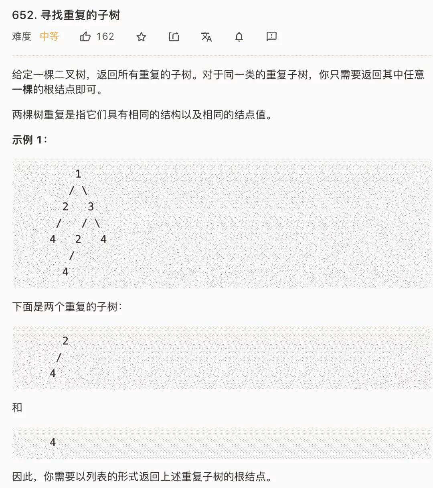

首先，**节点 4 本身可以作为一棵子树**，且二叉树中有多个节点 **4**

类似的，还存在两棵以 2 为根的重复子树。

那么，我们返回的`List`中就应该有两个`TreeNode`，值分别为 4 和 2（具体是哪个节点都无所谓）。

**函数签名：**

```java
List<TreeNode> findDuplicateSubtrees(TreeNode root);
```

### 思路

**老套路，先思考，对于某一个节点，它应该做什么**。

比如说，你站在图中这个节点 2 上：

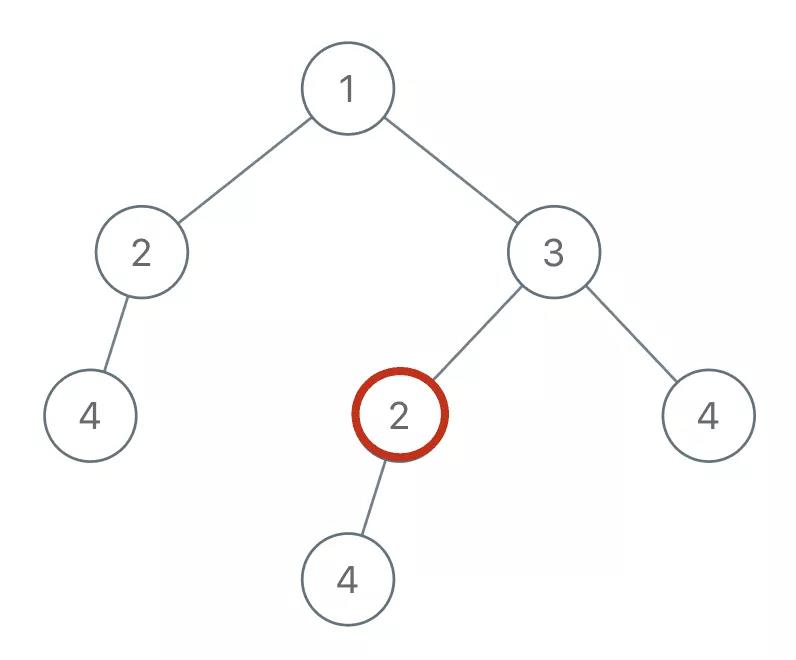

如果你想知道以自己为根的子树是不是重复的，是否应该被加入结果列表中，你需要知道两点：

1. **以我为根的这棵二叉树（子树）长啥样**？

2. **以其他节点为根的子树都长啥样**？

我得知道自己长啥样，还得知道别人长啥样，然后才能知道有没有人跟我重复，对不对？

#### **如何才能知道以自己为根的二叉树长啥样**？

这里就可以判断是使用什么遍历方式：

我要知道以自己为根的子树长啥样，是不是得先知道我的左右子树长啥样，再加上自己，就构成了整棵子树的样子？

比如：计算一棵二叉树有多少个节点。

```java
int count(TreeNode root) {
    if (root == null) {
        return 0;
    }
    // 先算出左右子树有多少节点
    int left = count(root.left);
    int right = count(root.right);
    /* 后序遍历代码位置 */
    // 加上自己，就是整棵二叉树的节点数
    int res = left + right + 1;
    return res;
}
```

这不就是标准的后序遍历框架嘛，和我们本题在思路上没啥区别对吧。

现在，明确了要用后序遍历，那应该怎么描述一棵二叉树的模样呢？二叉树的前序/中序/后序遍历结果可以描述二叉树的结构。

所以，我们可以通过拼接字符串的方式把二叉树序列化，看下代码：

```java
String traverse(TreeNode root) {
    // 对于空节点，可以用一个特殊字符表示
    if (root == null) {
        return "#";
    }
    // 将左右子树序列化成字符串
    String left = traverse(root.left);
    String right = traverse(root.right);
    /* 后序遍历代码位置 */
    // 左右子树加上自己，就是以自己为根的二叉树序列化结果
    String subTree = left + "," + right + "," + root.val;
    return subTree;
}
```

我们用非数字的特殊符`#`表示空指针，并且用字符`,`分隔每个二叉树节点值。

注意我们`subTree`是按照左子树、右子树、根节点这样的顺序拼接字符串，也就是后序遍历顺序。你完全可以按照前序或者中序的顺序拼接字符串，因为这里只是为了描述一棵二叉树的样子，什么顺序不重要。

**这样，我们第一个问题就解决了，对于每个节点，递归函数中的`subTree`变量就可以描述以该节点为根的二叉树**。

#### **我知道了自己长啥样，怎么知道别人长啥样**？

我们借助一个外部数据结构，让每个节点把自己子树的序列化结果存进去，这样，对于每个节点，不就可以知道有没有其他节点的子树和自己重复了么？

这里可以借助 HashSet 记录子树:

```java
// 记录所有子树
HashSet<String> memo = new HashSet<>();
// 记录重复的子树根节点
LinkedList<TreeNode> res = new LinkedList<>();

String traverse(TreeNode root) {
    if (root == null) {
        return "#";
    }

    String left = traverse(root.left);
    String right = traverse(root.right);

    String subTree = left + "," + right+ "," + root.val;

    if (memo.contains(subTree)) {
        // 有人和我重复，把自己加入结果列表
        res.add(root);
    } else {
        // 暂时没人跟我重复，把自己加入集合
        memo.add(subTree);
    }
    return subTree;
}
```

但是这样如果出现多棵重复的子树，结果集`res`中必然出现重复，而题目要求不希望出现重复。

所以将 HashSet 升级为 HashMap 记录每个子树出现的频次，即可解决：

```java
// 创建一个 HashMap 记录每个子树及其出现的频次
HashMap<String, Integer> memo = new HashMap<>();
// 创建一个 LinkedList 记录每一个重复的子树
LinkedList<TreeNode> res = new LinkedList<>();

public List<TreeNode> findDuplicateSubtrees(TreeNode root) {

    trverse(root); // 遍历二叉树
    return res;
}

public String trverse(TreeNode root) {

    //        StringBuilder s = new StringBuilder("#");
    // base case
    if (root == null) return "#";

    // 后序遍历的位置
    String left = trverse(root.left);
    String right = trverse(root.right);

    //        StringBuilder subTree = new StringBuilder();
    // 得到每一次递归的时候，每一个节点以自己为根节点时构成的子树 subTree
    String subTree = left + "," + right + "," + root.val;

    // 获取每一个子树出现的频次
    // 当Map集合中有这个key时，就使用这个key对应的value值，如果没有就使用默认值defaultValue
    // 相当于每次递归都会生成一个 subTree，每次都会判断 memo 中该子树的频次
    int freq = memo.getOrDefault(subTree, 0);
    memo.put(subTree, freq + 1);

    // 将前节点构成的子树与其他节点构成的子树进行对比
    if (freq == 1) {
        res.add(root);
    }

    return subTree; // 返回最终递归完成的 subTree，即序列化完成的结果
}
```

## 寻找第 K 小的元素(leetcode [230])

直接的思路就是升序排序，然后找第`k`个元素呗。BST 的中序遍历其实就是升序排序的结果：

```java
public int kthSmallest(TreeNode root, int k) {

    traverse(root, k);
    return res;
}

// 记录结果
int res = 0;
// 创建变量存放当前元素的排名
int rank = 0;

public void traverse(TreeNode root, int k) {

    // base case
    if (root == null) return;

    // 中序遍历
    traverse(root.left, k);

    /* 需要的操作 */
    // 因为时 BST 的中序遍历，所得的结果即是升序的结果
    // 所以每次递归，rank + 1
    rank ++;
    // 当 rank = K 时，即进行了 K 次递归，返回第 K 大的元素
    if (rank == k) {
        res = root.val;
        return;
    }

    traverse(root.right, k);

    return;
}
```

如果按照我们刚才说的方法，利用「BST 中序遍历就是升序排序结果」这个性质，每次寻找第`k`小的元素都要中序遍历一次，最坏的时间复杂度是`O(N)`，`N`是 BST 的节点个数。

要知道 BST 性质是非常牛逼的，像红黑树这种改良的自平衡 BST，增删查改都是`O(logN)`的复杂度，让你算一个第`k`小元素，时间复杂度竟然要`O(N)`，有点低效了。

**BST 的操作高效的原因：**

就拿搜索某一个元素来说，BST 能够在对数时间找到该元素的根本原因还是在 BST 的定义里，左子树小右子树大，所以每个节点都可以通过对比自身的值判断去左子树还是右子树搜索目标值，从而避免了全树遍历，达到对数级复杂度。

想找到第`k`小的元素，或者说找到排名为`k`的元素，如果想达到对数级复杂度，关键也在于每个节点得知道他自己排第几。

比如说你让我查找排名为`k`的元素，当前节点知道自己排名第`m`，那么我可以比较`m`和`k`的大小：

1. 如果`m == k`，显然就是找到了第`k`个元素，返回当前节点就行了。

2. 如果`k < m`，那说明排名第`k`的元素在左子树，所以可以去左子树搜索第`k`个元素。

3. 如果`k > m`，那说明排名第`k`的元素在右子树，所以可以去右子树搜索第`k - m - 1`个元素。

但这需要在二叉树节点中维护额外信息。**每个节点需要记录，以自己为根的这棵二叉树有多少个节点**。需要在 TreeNode 加一个字段

```java
class TreeNode {
    int val;
    // 以该节点为根的树的节点总数
    int size;
    TreeNode left;
    TreeNode right;
}
```

有了`size`字段，外加 BST 节点左小右大的性质，对于每个节点`node`就可以通过`node.left`推导出`node`的排名，从而做到我们刚才说到的对数级算法。

# 2021.1.16记录

## BST 转化累加树(leetcode [538 & 1038])

### 题目描述

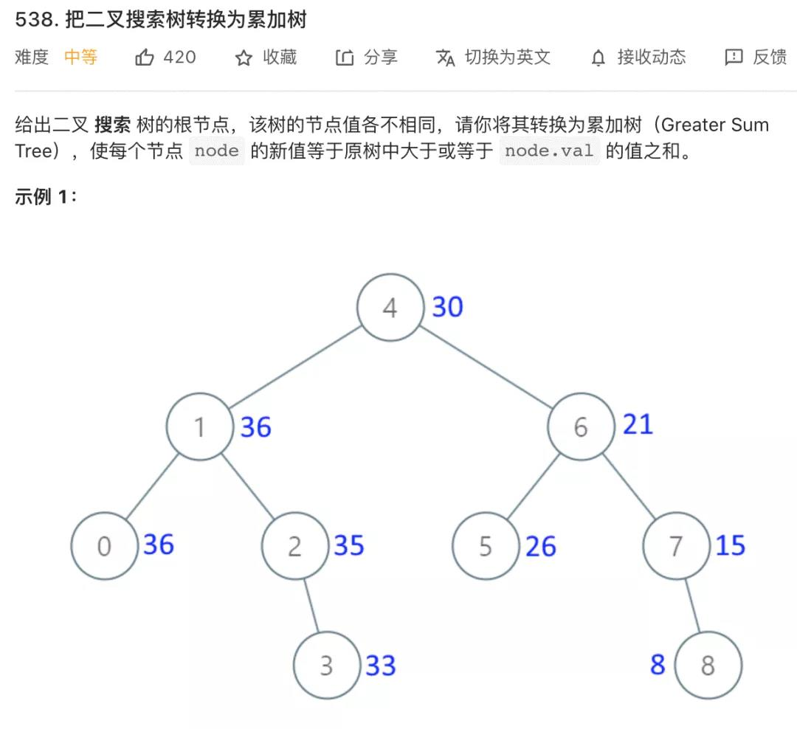

比如图中的节点 5，转化成累加树的话，比 5 大的节点有 6，7，8，加上 5 本身，所以累加树上这个节点的值应该是 5+6+7+8=26。

### 思路

**利用 BST 的中序遍历特性**。

BST 的中序遍历代码可以**升序**打印节点的值：

```java
void traverse(TreeNode root) {
    if (root == null) return;
    traverse(root.left);
    // 中序遍历代码位置
    print(root.val);
    traverse(root.right);
}
```

**降序**打印节点的值，修改代码：

```java
void traverse(TreeNode root) {
    if (root == null) return;
    // 先递归遍历右子树
    traverse(root.right);
    // 中序遍历代码位置
    print(root.val);
    // 后递归遍历左子树
    traverse(root.left);
}
```

**这段代码可以从大到小降序打印 BST 节点的值，如果维护一个外部累加变量`sum`，然后把`sum`赋值给 BST 中的每一个节点，不就将 BST 转化成累加树了吗**？

### 代码实现

```java
public TreeNode convertBST(TreeNode root) {

// traverse() 返回 root
return traverse(root);
}

// 定义一个 sum 记录每次遍历后降序求和的结果
// 比如：第一个 sum 就是最大节点的值，第二个 sum 是最大和第二大节点值的和，以此类推...
// 每一个 sum 赋值给当前 root 节点
int sum = 0;

public TreeNode traverse(TreeNode root) {

// base case
if (root == null) return null;

// 二叉搜索树的中序遍历
// 正常情况：从小到大，升序
// 先递归右子树：从大到小，降序
traverse(root.right);

sum += root.val;
root.val = sum;

traverse(root.left);

return root;
}
```

# 2021.1.17记录

## 扁平化嵌套列表迭代器(leetcode [341])

### 题目描述

首先，现在有一种数据结构`NestedInteger`，**这个结构中存的数据可能是一个`Integer`整数，也可能是一个`NestedInteger`列表**。注意，这个列表里面装着的是`NestedInteger`，也就是说这个列表中的每一个元素可能是个整数，可能又是个列表，这样无限递归嵌套下去……

`NestedInteger`有如下 API：

```java
public class NestedInteger {
    // 如果其中存的是一个整数，则返回 true，否则返回 false
    public boolean isInteger();

    // 如果其中存的是一个整数，则返回这个整数，否则返回 null
    public Integer getInteger();

    // 如果其中存的是一个列表，则返回这个列表，否则返回 null
    public List<NestedInteger> getList();
}
```

我们的算法会被输入一个`NestedInteger`列表，我们需要做的就是写一个迭代器类，将这个带有嵌套结构`NestedInteger`的列表「拍平」：

```java
public class NestedIterator implements Iterator<Integer> {
    // 构造器输入一个 NestedInteger 列表
    public NestedIterator(List<NestedInteger> nestedList) {}

    // 返回下一个整数
    public Integer next() {}

    // 是否还有下一个整数？
    public boolean hasNext() {}
}
```

我们写的这个类会被这样调用，**先调用`hasNext`方法，后调用`next`方法**：

```java
NestedIterator i = new NestedIterator(nestedList);
while (i.hasNext())
    print(i.next());
```

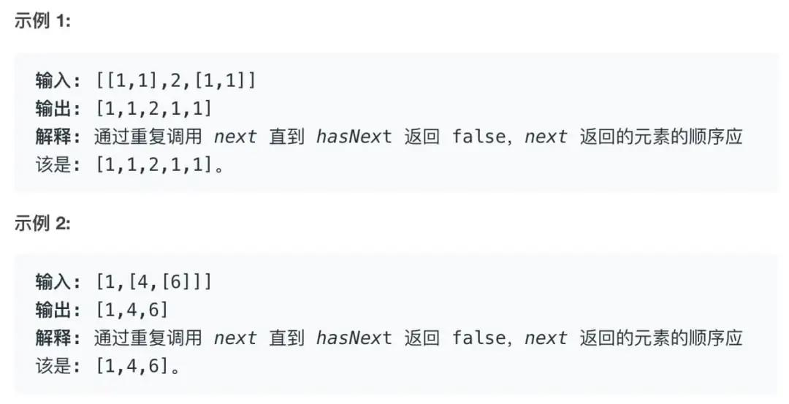

**迭代器是设计模式的一种**，目的就是为调用者屏蔽底层数据结构的细节，简单地通过`hasNext`和`next`方法有序地进行遍历。

### `NestedInteger`结构：

```java
public class NestedInteger {
    private Integer val;
    private List<NestedInteger> list;

    public NestedInteger(Integer val) {
        this.val = val;
        this.list = null;
    }
    public NestedInteger(List<NestedInteger> list) {
        this.list = list;
        this.val = null;
    }

    // 如果其中存的是一个整数，则返回 true，否则返回 false
    public boolean isInteger() {
        return val != null;
    }

    // 如果其中存的是一个整数，则返回这个整数，否则返回 null
    public Integer getInteger() {
        return this.val;
    }

    // 如果其中存的是一个列表，则返回这个列表，否则返回 null
    public List<NestedInteger> getList() {
        return this.list;
    }
}
```

### 和 N 叉树的关系：

```java
class NestedInteger {
    Integer val;
    List<NestedInteger> list;
}

/* 基本的 N 叉树节点 */
class TreeNode {
    int val;
    TreeNode[] children;
}
```

**这不就是棵 N 叉树吗？叶子节点是`Integer`类型，其`val`字段非空；其他节点都是`List<NestedInteger>`类型，其`val`字段为空，但是`list`字段非空，装着孩子节点**。

比如说输入是`[[1,1],2,[1,1]]`，其实就是如下树状结构：

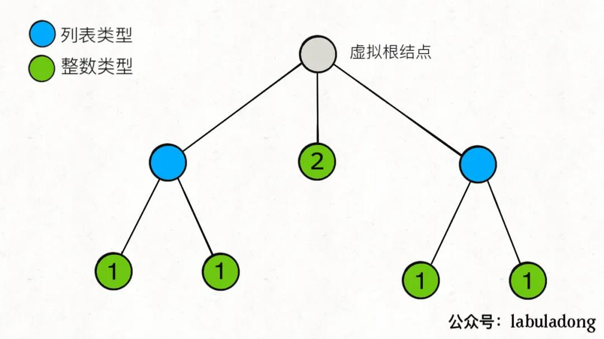

把一个`NestedInteger`扁平化对吧？**这不就等价于遍历一棵 N 叉树的所有「叶子节点」吗**？我把所有叶子节点都拿出来，不就可以作为迭代器进行遍历了吗？

### N 叉树的遍历框架

```java
void traverse(TreeNode root) {
    for (TreeNode child : root.children)
        traverse(child);
```

这个框架可以遍历所有节点，而我们只对整数型的`NestedInteger`感兴趣，也就是我们只想要「叶子节点」，所以`traverse`函数只要在到达叶子节点的时候把`val`加入结果列表即可。

### 代码实现：

```java
private Iterator<Integer> it;
// List<NestedInteger> 是一个包含 NestedInteger 整数和 NestedInteger 类型列表的一个无线嵌套的结果
// [1, 2, [1, 2], [1, [1, 2]], 3, [1, [12, 2, [1, 3, 4]]]]
public NestedIterator(List<NestedInteger> nestedList) {
    // 创建一个 result 列表存放将 List<NestedInteger> ”打平“之后的结果
    List<Integer> result = new LinkedList<>();
    for (NestedInteger node : nestedList) {

        // 以每个节点为根节点进行遍历，遍历函数：traverse()
        traverse(node, result);
    }
    // 得到 result 列表的迭代器
    this.it = result.iterator();
}

@Override
// 迭代器不是静止不动的，它是随着 next()方法而移动的
// 一开始迭代器在所有元素的左边，调用next()之后，迭代器移到第一个和第二个元素之间，next()方法返回迭代器刚刚经过的元素。
// hasNext()若返回True，则表明接下来还有元素，迭代器不在尾部。
// remove()方法必须和next方法一起使用，功能是去除刚刚next方法返回的元素。
public Integer next() {

    return it.next();
}

@Override
public boolean hasNext() {

    return it.hasNext();
}

public void traverse(NestedInteger root, List<Integer> result) {

    // base case：如果 root.isInteger() 返回 true, 说明此时的 root 是叶子节点
    if (root.isInteger()) {

        result.add(root.getInteger());
        return;
    }

    // 如果不是叶子节点，root.getList() 返回 List<NestedInteger> 列表
    // 再对这个列表里的 child 节点进行遍历判断：
    // 如果 child.getInteger() 为 true，就把这个节点装入 result
    // 否则继续遍历，以此输出所有的叶子节点的值装入 result 列表
    // N 叉树递归遍历过程
    for (NestedInteger child : root.getList()) {

        traverse(child, result);
    }
}
```

### 缺点及改进方案

我们的解法中，一次性算出了所有叶子节点的值，全部装到`result`列表，也就是内存中，`next`和`hasNext`方法只是在对`result`列表做迭代。如果输入的规模非常大，构造函数中的计算就会很慢，而且很占用内存。

一般的迭代器求值应该是「惰性的」，也就是说，如果你要一个结果，我就算一个（或是一小部分）结果出来，而不是一次把所有结果都算出来。

**改进思路：**

**调用`hasNext`时，如果`nestedList`的第一个元素是列表类型，则不断展开这个元素，直到第一个元素是整数类型**。

由于调用`next`方法之前一定会调用`hasNext`方法，这就可以保证每次调用`next`方法的时候第一个元素是整数型，直接返回并删除第一个元素即可。

```java
// 循环求拆解 NestedInteger 列表解法
private LinkedList<NestedInteger> list;
// List<NestedInteger> 是一个包含 NestedInteger 整数和 NestedInteger 类型列表的一个无线嵌套的结果
// [1, 2, [1, 2], [1, [1, 2]], 3, [1, [12, 2, [1, 3, 4]]]]
public NestedIterator(List<NestedInteger> nestedList) {

    // 不直接用 nestedList 的引用，是因为不能确定它的底层实现
    // 必须保证是 LinkedList，否则下面的 addFirst 会很低效
    list = new LinkedList<>(nestedList);
}

@Override
// 迭代器不是静止不动的，它是随着 next()方法而移动的
// 一开始迭代器在所有元素的左边，调用next()之后，迭代器移到第一个和第二个元素之间，next()方法返回迭代器刚刚经过的元素。
// hasNext()若返回True，则表明接下来还有元素，迭代器不在尾部。
// remove()方法必须和next方法一起使用，功能是去除刚刚next方法返回的元素。
// 因为 hasNext() 方法保证了将 NestedInteger 列表的第一个元素为“打平”之后的整数
public Integer next() {

    // 返回列表中的整数
    return list.remove(0).getInteger();
}

@Override
public boolean hasNext() {

    // 当 list 列表中第一个元素是一个被嵌套的列表时，将其展开
    while (!list.isEmpty() && !list.get(0).isInteger()) {

        // 取出 list 列表中的第一个元素并删除,这样下一个列表中的元素才能到第一个位置
        List<NestedInteger> first = list.remove(0).getList();

        // 将 first 列表中的元素“打平”
        // 即使 first 列表中还有 NestedInteger 类型的列表嵌套，只要 list 的第一个元素不是整数，一直在 while 循环
        for (int i = first.size() - 1; i >= 0; i--) {

            list.addFirst(first.get(i));
        }
    }

    return !list.isEmpty();
}
```

# 2021.1.19记录

## 数据流的中位数(LeetCode[295])

### 题目描述

如果输入一个数组，求中位数：排序

+ 如果数组长度是奇数，最中间的一个元素就是中位数；

+ 如果数组长度是偶数，最中间两个元素的平均数作为中位数。

如果数据规模非常巨大，排序是不太现实的。

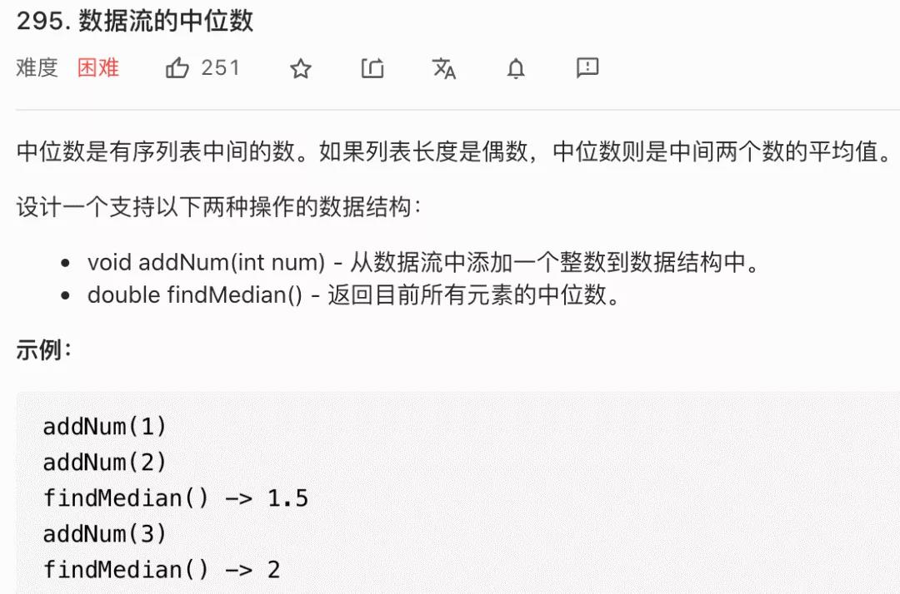

一个直接的解法可以用一个数组记录所有`addNum`添加进来的数字，通过插入排序的逻辑保证数组中的元素有序，当调用`findMedian`方法时，可以通过数组索引直接计算中位数。

但是用数组作为底层容器的问题也很明显，`addNum`搜索插入位置的时候可以用二分搜索算法，但是插入操作需要搬移数据，所以最坏时间复杂度为 O(N)。那换链表？链表插入元素很快，但是查找插入位置的时候只能线性遍历，最坏时间复杂度还是 O(N)。

### 思路

**我们必然需要有序数据结构，本题的核心思路是使用两个优先级队列**。

#### Java 中优先级队列介绍

Java中PriorityQueue通过二叉小顶堆实现，可以用一棵完全二叉树表示。它可以对插入的元素**自动排序**。乱序的元素插入其中就被放到了正确的位置，可以按照从小到大（或从大到小）有序地取出元素。

+ add()和offer()

  `add(E e)`和`offer(E e)`的语义相同，都是向优先队列中插入元素，只是`Queue`接口规定二者对插入失败时的处理不同，前者在插入失败时抛出异常，后则则会返回`false`。

+ `element()`和`peek()`的语义完全相同，都是获取但不删除队首元素，也就是队列中权值最小的那个元素，二者唯一的区别是当方法失败时前者抛出异常，后者返回`null`。根据小顶堆的性质，堆顶那个元素就是全局最小的那个；

+ `remove()`和`poll()`方法的语义也完全相同，都是获取并删除队首元素，区别是当方法失败时前者抛出异常，后者返回`null`。

+ `remove(Object o)`方法用于删除队列中跟`o`相等的某一个元素（如果有多个相等，只删除一个），该方法不是*Queue*接口内的方法，而是*Collection*接口的方法。

中位数是有序数组最中间的元素算出来的对吧，我们可以把「有序数组」抽象成一个倒三角形(**从小到大的队列，顶部是最大元素**)，宽度可以视为元素的大小，那么这个倒三角的中部就是计算中位数的元素。

这个大的倒三角形从正中间切成两半，变成一个小倒三角和一个梯形，这个小倒三角形相当于一个**从小到大的有序数组**，这个梯形相当于一个**从大到小的有序数组**。(从底部往上看的)

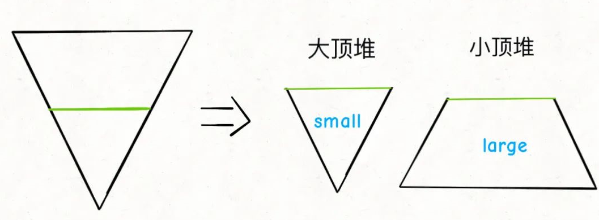

梯形虽然是小顶堆，但其中的元素是较大的，我们称其为`large`，倒三角虽然是大顶堆，但是其中元素较小，我们称其为`small`。(因为本身就是由一个大顶堆分开而成的)

==要想求出中位数，**两个堆中的元素之差不能超过 1**。==

**`findMedian`函数思路**，假设元素总数是`n`：

+ 如果`n`是偶数，我们希望两个堆的元素个数是一样的，这样把两个堆的堆顶元素拿出来求个平均数就是中位数；
+ 如果`n`是奇数，那么我们希望两个堆的元素个数分别是`n/2 + 1`和`n/2`，这样元素多的那个堆的堆顶元素就是中位数。

现在的问题是，如何实现`addNum`方法，维护「两个堆中的元素之差不能超过 1」这个条件呢？

==**不仅要维护`large`和`small`的元素个数之差不超过 1，还要维护`large`堆的堆顶元素要大于等于`small`堆的堆顶元素**。==

**简单说，想要往`large`里添加元素，不能直接添加，而是要先往`small`里添加，然后再把`small`的堆顶元素加到`large`中；向`small`中添加元素同理**。

假设我们准备向`large`中插入元素：

+ 如果插入的`num`小于`small`的堆顶元素，那么`num`就会留在`small`堆里，为了保证两个堆的元素数量之差不大于 1，作为交换，把`small`堆顶部的元素再插到`large`堆里。
+ 如果插入的`num`大于`small`的堆顶元素，那么`num`就会成为`samll`的堆顶元素，最后还是会被插入`large`堆中。
+ 反之，向`small`中插入元素是一个道理，这样就巧妙地保证了`large`堆整体大于`small`堆，且两个堆的元素之差不超过 1，那么中位数就可以通过两个堆的堆顶元素快速计算了。

### 时间复杂度

`addNum`方法时间复杂度 O(logN)，`findMedian`方法时间复杂度 O(1)。

### 代码实现

```java
/** initialize your data structure here. */
// 求中位数可以将元素进行排序求中间元素(分奇偶讨论)
// 可以把排序好的数看成一个大顶堆(倒三角)，从中间一分为二
// 第一部分：仍是倒三角，即大顶堆
// 第二部分：成了一个梯形，即小顶堆
// 大顶堆顶部元素 < 小顶堆顶部元素
// ①当输入数据为奇数时，中位数就是元素多的那个堆的顶部元素
// ②当输入数据为偶数时，中位数就是两个堆的顶部元素之和/2
private PriorityQueue<Integer> small;
private PriorityQueue<Integer> large;
public MedianFinder() {
    // 初始化小顶堆
    small = new PriorityQueue<>();
    // 初始化大顶堆
    large = new PriorityQueue<>((a, b) -> {
        return b - a;
    });
}

/* 向堆中添加元素 */
// 核心思想：保持两堆元素个数只差不超过1，并且始终保持大顶堆堆顶元素小于小顶堆堆顶元素
public void addNum(int num) {

    if (small.size() >= large.size()) {
        // 按道理说此时新加元素要加到大顶堆中
        // 但先把要添加的元素加到小顶堆中进行排序后
        // 将排序好的堆顶元素(大顶堆中的最大元素)加到小顶堆中
        // 保持大顶堆顶部元素 < 小顶堆顶部元素
        small.offer(num);
        large.offer(small.poll());
    } else {
        large.offer(num);
        small.offer(large.poll());
    }
}

/* 寻找中位数 */
// 核心思想：使大顶堆和小顶堆元素个数相差不超过 1
public double findMedian() {

    // 如果两个堆元素不相同，则元素多的堆的顶部元素必是中位数
    if (small.size() > large.size()) {
        return small.peek();
    } else if (small.size() < large.size()){
        return large.peek();
    }

    // 两个堆元素相等
    return (small.peek() + large.peek()) / 2.0;
}
```

# 2021.1.20记录

## list<Integer> 与 int[] 互转

### int[] 转 List<Integer>

```java
// int[] 转 List<Integer>
List<Integer> list1 = Arrays.stream(data).boxed().collect(Collectors.toList());
// Arrays.stream(arr) 可以替换成IntStream.of(arr)。
// 1.使用Arrays.stream将int[]转换成IntStream。
// 2.使用IntStream中的boxed()装箱。将IntStream转换成Stream<Integer>。
// 3.使用Stream的collect()，将Stream<T>转换成List<T>，因此正是List<Integer>。
```

### List<Integer> 转 int[]

```java
// List<Integer> 转 int[]
int[] arr1 = list1.stream().mapToInt(Integer::valueOf).toArray();
// 想要转换成int[]类型，就得先转成IntStream。
// 这里就通过mapToInt()把Stream<Integer>调用Integer::valueOf来转成IntStream
// 而IntStream中默认toArray()转成int[]。

// 将 ArrayList res 转换成 int[] 类型返回
int[] arr = new int[res.size()];
for (int i = 0; i < res.size(); i++) {
    arr[i] = res.get(i);
}
```

### int[] 转 Integer[]

```java
// int[] 转 Integer[]
Integer[] integers1 = Arrays.stream(data).boxed().toArray(Integer[]::new);
// 前两步同上，此时是Stream<Integer>。
// 然后使用Stream的toArray，传入IntFunction<A[]> generator。
// 这样就可以返回Integer数组。
// 不然默认是Object[]。
```

###  Integer[] 转 int[]

```java
// Integer[] 转 int[]
int[] arr2 = Arrays.stream(integers1).mapToInt(Integer::valueOf).toArray();
// 思路同上。先将Integer[]转成Stream<Integer>，再转成IntStream。
```

### List<Integer> 转 Integer[]

```java
// List<Integer> 转 Integer[]
Integer[] integers2 = list1.toArray(new Integer[0]);
// 调用toArray。传入参数T[] a。这种用法是目前推荐的。
// List<String>转String[]也同理。
```

### Integer[] 转 List<Integer>

```java
// Integer[] 转 List<Integer>
List<Integer> list2 = Arrays.asList(integers1);
// 最简单的方式。String[]转List<String>也同理。
```

## 滑动窗口最大值(Leetcode[239])

### 题目描述

输入一个数组`nums`和一个正整数`k`，有一个大小为`k`的窗口在`nums`上从左至右滑动，请你输出每次窗口中`k`个元素的最大值。

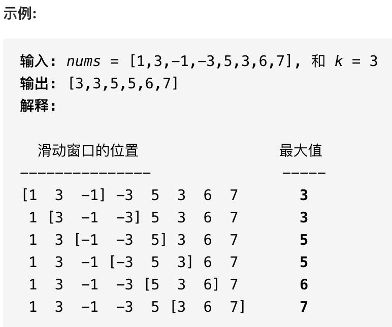

### 解题思路

本题难点在于如何在`O(1)`时间算出每个「窗口」中的最大值，使得整个算法在线性时间完成。这种问题的特殊点在于，「窗口」是不断滑动的，也就是你得**动态地**计算窗口中的最大值。

**在一堆数字中，已知最值为`A`，如果给这堆数添加一个数`B`，那么比较一下`A`和`B`就可以立即算出新的最值；但如果减少一个数，就不能直接得到最值了，因为如果减少的这个数恰好是`A`，就需要遍历所有数重新找新的最值**。

这道题的场景，每个窗口前进的时候，要添加一个数同时减少一个数，所以想在 O(1) 的时间得出新的最值，不是那么容易的，需要「单调队列」这种特殊的数据结构来辅助。

「单调队列」就是一个「队列」，只是使用了一点巧妙的方法，使得**队列中的元素全都是单调递增（或递减）的**。

一个普通的队列一定有这两个操作：

> ```java
> class Queue {
>     // enqueue 操作，在队尾加入元素 n
>     void push(int n);
>     // dequeue 操作，删除队头元素
>     void pop();
> }
> ```

一个「单调队列」的操作也差不多：

```java
class MonotonicQueue {
    // 在队尾添加元素 n
    void push(int n);
    // 返回当前队列中的最大值
    int max();
    // 队头元素如果是 n，删除它
    void pop(int n);
}
```

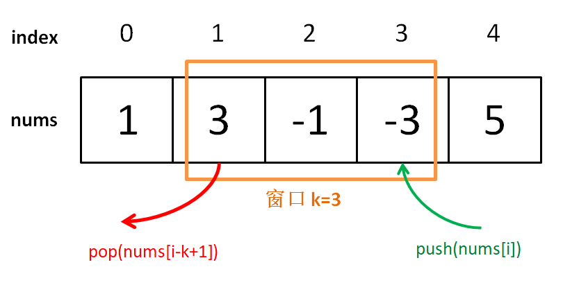

### 单调队列数据结构的实现

观察滑动窗口的过程就能发现，实现「单调队列」必须使用一种数据结构支持在头部和尾部进行插入和删除，很明显**双链表**是满足这个条件的。

「单调队列」的核心思路和「单调栈」类似，`push`方法依然在队尾添加元素，**但是要把前面比自己小的元素都删掉。**

可以想象，加入数字的大小代表人的体重，把前面体重不足的都压扁了，直到遇到更大的量级才停住。


如果每个元素被加入时都这样操作，最终单调队列中的元素大小就会保持一个**单调递减**的顺序。

队头元素`n`也可能已经被「压扁」了，可能已经不存在了。

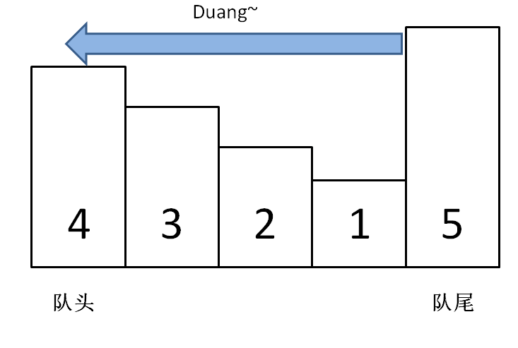

### 代码实现

```java
public class MonotonicQueue {

    // 底层用双向链表实现, 有三个 api
    LinkedList<Integer> q = new LinkedList<>();

    // ①push() 成员方法的实现
    public void push(int n) {

        // 加入元素之前会把 q 中小于该元素的其他元素删除，保持单调递减性
        while (!q.isEmpty() && q.getLast() < n) { // 相等的情况不能删
            q.pollLast();
        }
        // 然后在加入元素 n
        q.addLast(n);
    }

    // ②max() 方法
    public int max() {

        // 因为新加的元素只有当它之前有元素比它大时才会加入
        // 所以链表的头部元素就是最大的
        return q.getFirst();
    }

    // ③pop() 方法
    public void pop(int n) {

        // 因为会出现 q 头部的元素比后来添加的元素小的情况
        // 所以很有可能还没调用 pop() 方法，就被 push() 方法删除了
        if (n == q.getFirst()) {
            q.pollFirst();
        }
    }
}

public int[] maxSlidingWindow(int[] nums, int k) {

    MonotonicQueue window = new MonotonicQueue();
    // 使用数组存放结果方便根据索引查询
    ArrayList<Integer> res = new ArrayList<>();

    for (int i = 0; i < nums.length; i++) {

        // 先把窗口的前 k - 1 个元素填满
        if (i < k - 1) {

            window.push(nums[i]);
        } else { // 填充第三个元素的时候要同时计算窗口中的最大值

            // 队尾填充新元素
            window.push(nums[i]);
            // 将窗口中的最大值装入 res
            res.add(window.max());
            // 删除窗口队头的元素，为下一次填充元素求最大值做准备
            window.pop(nums[i - k + 1]);
        }
    }
    // 将 ArrayList res 转换成 int[] 类型返回
    int[] arr = new int[res.size()];
    for (int i = 0; i < res.size(); i++) {
        arr[i] = res.get(i);
    }
    return arr;
    //        return res.stream().mapToInt(Integer::valueOf).toArray();
}
```

### 算法复杂度分析

在实现`MonotonicQueue`时，我们使用了 Java 的`LinkedList`，因为链表结构支持在头部和尾部快速增删元素；而在解法代码中的`res`则使用的`ArrayList`结构，因为后续会按照索引取元素，所以数组结构更合适。

`push`操作中含有 while 循环，时间复杂度应该不是`O(1)`呀，那么本算法的时间复杂度应该不是线性时间吧？

单独看`push`操作的复杂度确实不是`O(1)`，但是算法整体的复杂度依然是`O(N)`线性时间。要这样想，`nums`中的每个元素最多被`push_back`和`pop_back`一次，没有任何多余操作，所以整体的复杂度还是`O(N)`。

空间复杂度就很简单了，就是窗口的大小`O(k)`。

## Java LinkedList 的方法

+ **int size（）：它返回此列表中元素的数量。**
+ void clear（）：它删除列表中的所有元素。
+ Object clone（）：它用于制作现有链接列表的副本。
+ **Object set（int index，Object element）：它用于用新元素替换列表中的现有元素。**
+ **boolean contains（Object element）：如果元素存在于列表中，则返回true。**
+ boolean add（Object element）：它将元素附加到列表的末尾。
+ **void addLast（Object element）：它将元素附加在列表的末尾**
+ **void add（int index，Object element）：它将元素插入列表中'index'位置。**
+ boolean addAll（Collection C）：它将一个集合追加到链接列表。
+ **Object get（int index）：它返回列表中位置'index'处的元素。如果索引超出了列表的范围，它会抛出'IndexOutOfBoundsException'。**
+ **Object getFirst（）：它返回链表的第一个元素。**
+ **Object getLast（）：它返回链接列表的最后一个元素。**
+ int indexOf（Object element）：如果找到元素，它将返回元素第一次出现的索引。否则，它返回-1。
+ int lastIndexOf（Object element）：如果找到元素，它将返回元素最后一次出现的索引。否则，它返回-1
+ **Object remove（）：它用于从列表头部删除并返回元素。**
+ **Object remove（int index）：它删除此列表中位置'index'处的元素。如果列表为空，它会抛出'NoSuchElementException'。**
+ boolean remove（Object O）：它用于从链表中移除一个特定的元素并返回一个布尔值。
+ **Object removeLast（）：它用于删除并返回链接列表的最后一个元素。**
+ **Object pollLast() : 此方法用于检索链表的最后一个元素或结尾元素，最后从列表中删除最后一个元素。如果列表为空，则它将返回null。**与 remove() 的区别是当没有特定元素的时候返回不一样，remove() 报异s常，pollLast() 返回 null。
+ **Collections.swap(数组nums, index1, index2)：**交换数组中的两个元素

## 用栈实现队列(Leetcode[232] && 剑指Offer[09])

队列是一种**先进先出**的数据结构，栈是一种**先进后出**的数据结构，形象一点就是这样：

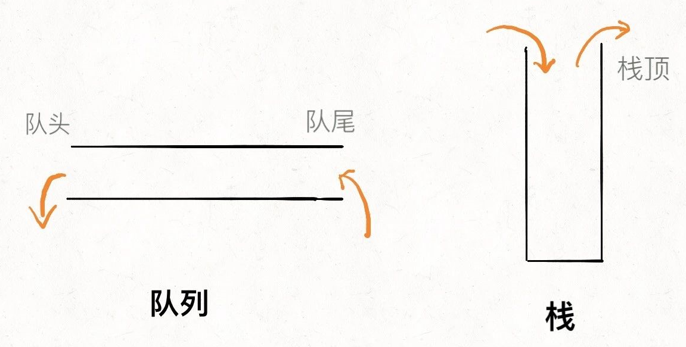

这两种数据结构底层其实都是数组或者链表实现的，只是 API 限定了它们的特性。

**队列的 API**

```java
class MyQueue {

    /** 添加元素到队尾 */
    public void push(int x);

    /** 删除队头的元素并返回 */
    public int pop();

    /** 返回队头元素 */
    public int peek();

    /** 判断队列是否为空 */
    public boolean empty();
}
```

### 思路

我们使用两个栈`s1, s2`就能实现一个队列的功能（这样放置栈可能更容易理解）：


当调用`push`让元素入队时，只要把元素压入`s1`即可，比如说`push`进 3 个元素分别是 1,2,3，那么底层结构就是这样：

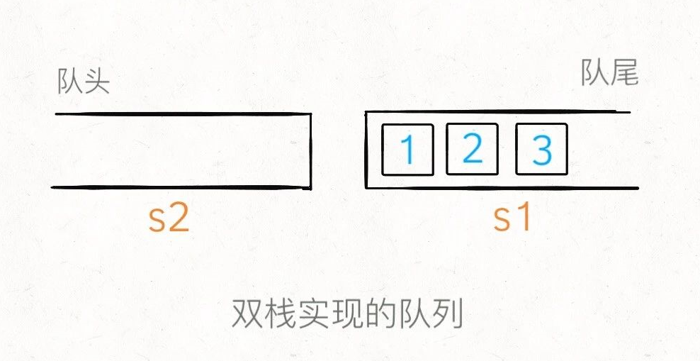

如果这时候使用`peek`查看队头的元素怎么办呢？按道理队头元素应该是 1，但是在`s1`中 1 被压在栈底，现在就要轮到`s2`起到一个中转的作用了：

**当`s2`为空时，可以把`s1`的所有元素取出再添加进`s2`，这时候`s2`中元素就是先进先出顺序了**。

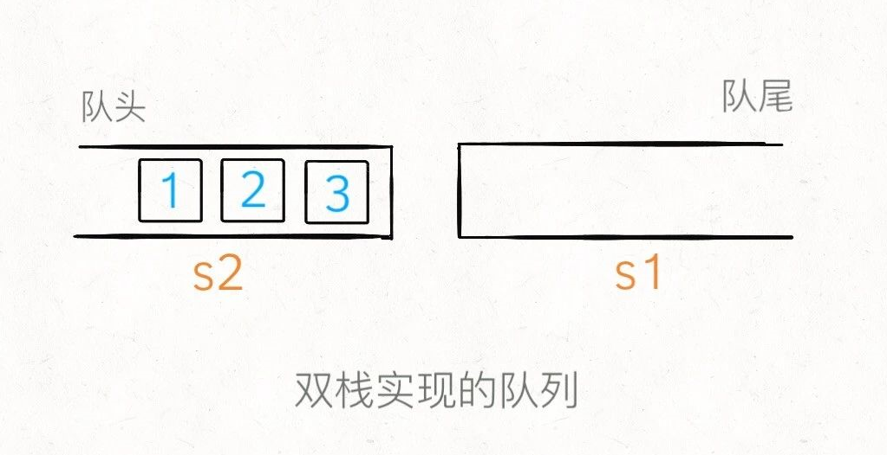

### 代码实现

```java
class MyQueue {

    /** Initialize your data structure here. */
    Stack<Integer> s1, s2;
    public MyQueue() {

        s1 = new Stack<>();
        s2 = new Stack<>();
    }

    /** Push element x to the back of queue. */
    public void push(int x) {

        // s1 用来接收 s2 出栈的元素
        // 所以入队的时候只需要操作 s2 即可
        s2.push(x);
    }

    /** Removes the element from in front of queue and returns that element. */
    public int pop() {

        // 先调用 peek() 保证 s1 非空
        peek();
        return s1.pop();
    }

    /** Get the front element. */
    public int peek() {

        // 因为 s2 是入栈操作
        // 要获得队列顶部的元素需要将 s2 元素出栈在入栈到 s1，就是顺着出栈了
        // 当 s1 为空时执行 s2 出栈操作
        if (s1.isEmpty()) {

            while (!s2.isEmpty()) {

                s1.push(s2.pop());
            }
        }
        return s1.peek();
    }

    /** Returns whether the queue is empty. */
    public boolean empty() {

        // 要判断 s1 && s2 是不是非空即可
        return s1.isEmpty() && s2.isEmpty();
    }
}
```

### 算法复杂度分析

其他操作都是 O(1)，有点意思的是`peek`操作，调用它时可能触发`while`循环，这样的话时间复杂度是 O(N)，但是大部分情况下`while`循环不会被触发，时间复杂度是 O(1)。由于`pop`操作调用了`peek`，它的时间复杂度和`peek`相同。

像这种情况，可以说它们的**最坏时间复杂度**是 O(N)，因为包含`while`循环，**可能**需要从`s1`往`s2`搬移元素。

但是它们的**均摊时间复杂度**是 O(1)，这个要这么理解：对于一个元素，最多只可能被搬运一次，也就是说`peek`操作平均到每个元素的时间复杂度是 O(1)。

## 用队列实现栈(Leetcode[225])

### 思路

+ 先说`push`API，直接将元素加入队列，同时记录队尾元素，因为**队尾元素相当于栈顶元素**，如果要`top`查看栈顶元素的话可以直接返回。
+ 底层数据结构是先进先出的队列，每次`pop`**只能从队头取元素**；但是栈是后进先出，也就是说`pop`API 要从队尾取元素。

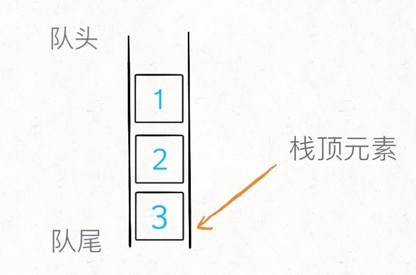

​	

​	解决方法简单粗暴，把队列前面的都取出来再加入队尾，让	之前的队尾元素排到队头，这样就可以取出了。

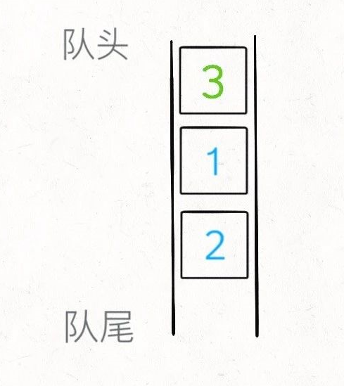

​	这样实现还有一点小问题就是，原来的队尾元素被提到队头	并删除了，但是`top_elem`变量没有更新。

+ 最后，API`empty`就很容易实现了，只要看底层的队列是否为空即可

### 代码实现

```java
Queue<Integer> q;
int top_elem;
/** Initialize your data structure here. */
public MyStack() {

    q = new LinkedList<>();
    this.top_elem = 0;
}

/** Push element x onto stack. */
public void push(int x) {

    // 因为底层是队列，先进先出(尾部加入，头部取出)
    // 用于实现栈，则新加入队列的元素(队列尾部)为栈顶元素
    q.offer(x);
    top_elem = x;
}

/** Removes the element on top of the stack and returns that element. */
public int pop() {

    // 获取栈顶(队列尾部)元素好获取，因为在每次 push() 的时候可以用一个变量记录
    // 但是 remove 的时候，队列仅提供队列头部元素的 remove 方法
    // 将队头的元素取出来重新添加到队尾，这样队尾的元素就被提到队头了
    int size = q.size();
    // 暂时保存队尾的两个元素
    while (size > 2) {

        // 循环将队列头部的元素加到队尾
        q.offer(q.poll());
        size--;
    }

    // 此时原队列尾部的两个元素被移到头部了
    // 更新 top_elem：即为即将要放到队尾的元素
    top_elem = q.peek();
    // 再把这个元素移到队尾
    q.offer(q.poll());
    // 此时原来在队尾的元素被真正移到队头了，返回即可
    return q.poll();
}

/** Get the top element. */
public int top() {

    // 返回栈顶元素，即 push() 后的元素 top_elem
    return top_elem;
}

/** Returns whether the stack is empty. */
public boolean empty() {

    return q.isEmpty();
}
```

### 复杂度分析

很明显，用队列实现栈的话，pop 操作时间复杂度是 O(N)，其他操作都是 O(1)。

# 2021.1.21记录

## 队列 java.util.Queue 方法

+ **add**    增加一个元索           如果队列已满，则抛出一个IIIegaISlabEepeplian异常
+ **remove**  移除并返回队列头部的元素  如果队列为空，则抛出一个NoSuchElementException异常
+ **element** 返回队列头部的元素       如果队列为空，则抛出一个NoSuchElementException异常
+ **peek**    返回队列头部的元素       如果队列为空，则返回null
+ **offer**    添加一个元素并返回true    如果队列已满，则返回false
+ **poll**     移除并返问队列头部的元素  如果队列为空，则返回null
+ **put**     添加一个元素           如果队列满，则阻塞
+ **take**    移除并返回队列头部的元素   如果队列为空，则阻塞

## 二分查找算法详解

总的模板：

```java
int binarySearch(int[] nums, int target) {
    int left = 0, right = ...;
    
    while(...) {
        int mid = (right + left) / 2;
        if (nums[mid] == target) {
            ...
        } else if (nums[mid] < target) {
            // 在 mid 的右边区间继续查找
            left = ...;
        } else if (nums[mid] > target) {
            // 在 mid 的左边区间继续查找
            right = ...;
        }
    }
    return ...;
}
```

**分析二分查找的一个技巧是：不要出现 else，而是把所有情况用 else if 写清楚，这样可以清楚地展现所有细节**。其中...标记的部分，就是可能出现细节问题的地方，当你见到一个二分查找的代码时，首先注意这几个地方。

### 寻找一个数(基本的二分搜索)

**应用场景：**搜索一个数，如果存在，返回其索引，否则返回 -1

#### 代码框架

```java
int binarySearch(int[] nums, int target) {
    int left = 0;
    int right = nums.length - 1; // 注意
    
    while(left <= right) { // 注意
        int mid = (right + left) / 2;
        if (nums[mid] == target) {
            return mid;
        } else if (nums[mid] < target) {
            left = mid - 1; // 注意
        } else if (nums[mid] >  target) {
            right = mid + 1; // 注意
        }
    }
    return -1;
}
```

>  *1*. 为什么 while 循环的条件中是 <=，而不是 < ？

答：因为元素索引从 0 开始，初始化 right 的赋值是 nums.length - 1，即最后一个元素的索引，而不是 nums.length。

这二者可能出现在不同功能的二分查找中，区别是：前者相当于两端都闭区间 [left, right]，后者相当于左闭右开区间 [left, right)，因为索引大小为 nums.length 是越界的。

我们这个算法中使用的是 [left, right] 两端都闭的区间。**这个区间就是每次进行搜索的区间，我们不妨称为「搜索区间」**。

> *2*. 什么时候应该停止搜索呢？

答：如果没找到，就需要 while 循环终止，然后返回 -1。那 while 循环什么时候应该终止？**搜索区间为空的时候应该终止**，意味着你没得找了，就等于没找到嘛。

+ while(left <= right)的终止条件是 left == right + 1，写成区间的形式就是 [right + 1, right]，或者带个具体的数字进去 [3, 2]，可见**这时候搜索区间为空**，因为没有数字既大于等于 3 又小于等于 2 的吧。所以这时候 while 循环终止是正确的，直接返回 -1 即可。
+ while(left < right)的终止条件是 left == right，写成区间的形式就是 [right, right]，或者带个具体的数字进去 [2, 2]，**这时候搜索区间非空**，还有一个数 2，但此时 while 循环终止了。也就是说这区间 [2, 2] 被漏掉了，索引 2 没有被搜索，如果这时候直接返回 -1 就可能出现错误。

> *3.*为什么 left = mid + 1，right = mid - 1？

我看有的代码是 right = mid 或者 left = mid，没有这些加加减减，到底怎么回事，怎么判断？

答：刚才明确了「搜索区间」这个概念，而且本算法的搜索区间是两端都闭的，即 [left, right]。那么当我们发现索引 mid 不是要找的 target 时，如何确定下一步的搜索区间呢？

当然是去搜索 [left, mid - 1] 或者 [mid + 1, right] 对不对？因为 mid 已经搜索过，应该从搜索区间中去除。

> *4.*此算法有什么缺陷？

比如说给你有序数组 nums = [1,2,2,2,3]，target = 2，此算法返回的索引是 2，没错。但是如果我想得到 target 的左侧边界，即索引 1，或者我想得到 target 的右侧边界，即索引 3，这样的话此算法是无法处理的。

这样的需求很常见。你也许会说，找到一个 target 索引，然后向左或向右线性搜索不行吗？可以，但是不好，因为这样难以保证二分查找对数级的复杂度了。

### 寻找左侧边界的二分搜索

**代码框架：**

```java
int left_bound(int[] nums, int target) {
    if (nums.length == 0) return -1;
    int left = 0;
    int right = nums.length; // 注意

    while (left < right) { // 注意
        int mid = (left + right) / 2;
        if (nums[mid] == target) {
            // 此时把搜索区间分成[left, mid)
            // 然后再在这个区间内寻找
            right = mid; // 注意
        } else if (nums[mid] < target) {
            left = mid + 1;
        } else if (nums[mid] > target) {
            right = mid; // 注意
        }
    }
    // ①当数组中存在 target时， right = mid，[left, mid) 左闭右开，只有当 left = right = mid 时才会停止搜索，即 return left <==> return right <==> return mid;
    // ②当数组中不存在 target 时，「左侧边界」的含义就是在数组中寻找比 target 元素小的元素个数
    return left;
}
```

> *1.*为什么没有返回 -1 的操作？如果 nums 中不存在 target 这个值，怎么办？

答：先理解一下这个「左侧边界」有什么特殊含义：

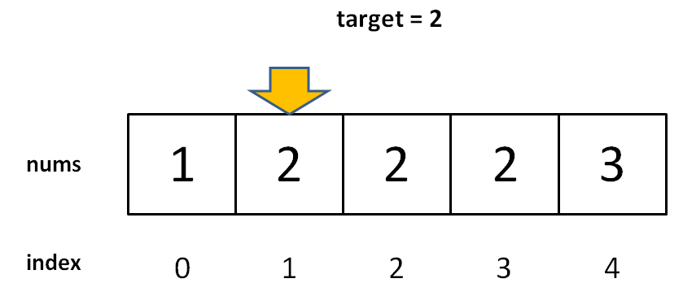

对于这个数组，算法会返回 1。这个 1 的含义可以这样解读：nums 中小于 2 的元素有 1 个。如果 target = 4，则会返回 5，表示 nums 中小于 4 的元素有五个。

综上可以看出，函数的返回值（即 left 变量的值）取值区间是闭区间 [0, nums.length]，所以我们简单添加两行代码就能在正确的时候 return -1：

```java
while (left < right) {
    //...
}
// 如果 target 比数组中所有数都大，所以此时 left 会逐步逼近 right，并最终成为 righ = nums.length
// 此时就表示没有匹配项
if (left == num.length) return -1;
// 如果 left 还在搜索区间[left, right)内,如果找到匹配的元素，则返回该元素的索引，否则返回 -1
return nums[left] == target ? left : -1;
```

> *2.* 为什么 left = mid + 1，right = mid ？和之前的算法不一样？

答：这个很好解释，因为我们的「搜索区间」是 [left, right) 左闭右开，所以当 nums[mid] 被检测之后，下一步的搜索区间应该去掉 mid 分割成两个区间，即 [left, mid) 或 [mid + 1, right)。

> *3.*为什么该算法能够搜索左侧边界？

答：关键在于对于 nums[mid] == target 这种情况的处理：

```java
    if (nums[mid] == target)
        right = mid;
```

可见，找到 target 时不要立即返回，而是缩小「搜索区间」的上界 right，在区间 [left, mid) 中继续搜索，即不断向左收缩，达到锁定左侧边界的目的。

> *4.* 为什么返回 left 而不是 right？

答：都是一样的，因为 while 终止的条件是 left == right。

### 寻找右侧边界的二分查找

**代码框架：**

```java
int right_bound(int[] nums, int target) {
    if (nums.length == 0) return -1;
    int left = 0, right = nums.length;

    while (left < right) {
        int mid = (left + right) / 2;
        if (nums[mid] == target) {
            left = mid + 1; // 注意
        } else if (nums[mid] < target) {
            left = mid + 1;
        } else if (nums[mid] > target) {
            right = mid;
        }
    }
    return left - 1; // 注意
}
```

>*1.*为什么这个算法能够找到右侧边界？

答：类似地，关键点还是这里：

```java
    if (nums[mid] == target) {
        left = mid + 1;
```

当 nums[mid] == target 时，不要立即返回，而是增大「搜索区间」的下界 left，使得区间不断向右收缩，达到锁定右侧边界的目的。

>*2.*为什么最后返回 left - 1 而不像左侧边界的函数，返回 left？而且我觉得这里既然是搜索右侧边界，应该返回 right 才对。

答：首先，while 循环的终止条件是 left == right，所以 left 和 right 是一样的，你非要体现右侧的特点，返回 right - 1 好了。

至于为什么要减一，这是搜索右侧边界的一个特殊点，关键在这个条件判断：

```java
    if (nums[mid] == target) {
        left = mid + 1;
        // 这样想: mid = left - 1
```

因为我们对 left 的更新必须是 left = mid + 1，就是说 while 循环结束时，nums[left] 一定不等于 target 了，而 nums[left - 1] 可能是 target。

> *3.* 为什么没有返回 -1 的操作？如果 nums 中不存在 target 这个值，怎么办？

答：类似之前的左侧边界搜索，因为 while 的终止条件是 left == right，就是说 left 的取值范围是 [0, nums.length]，所以可以添加两行代码，正确地返回 -1：

```java
while (left < right) {
    // ...
}
if (left == 0) return -1;
return nums[left-1] == target ? (left-1) : -1;
```

### 总结

+ 最基本的二分查找算法：

```
因为我们初始化 right = nums.length - 1
所以决定了我们的「搜索区间」是 [left, right]
所以决定了 while (left <= right)
同时也决定了 left = mid+1 和 right = mid-1

因为我们只需找到一个 target 的索引即可
所以当 nums[mid] == target 时可以立即返回
```

+ 寻找左侧边界的二分查找：

```
因为我们初始化 right = nums.length
所以决定了我们的「搜索区间」是 [left, right)
所以决定了 while (left < right)
同时也决定了 left = mid+1 和 right = mid

因为我们需找到 target 的最左侧索引
所以当 nums[mid] == target 时不要立即返回
而要收紧右侧边界以锁定左侧边界
```

+ 寻找右侧边界的二分查找：

```
因为我们初始化 right = nums.length
所以决定了我们的「搜索区间」是 [left, right)
所以决定了 while (left < right)
同时也决定了 left = mid+1 和 right = mid

因为我们需找到 target 的最右侧索引
所以当 nums[mid] == target 时不要立即返回
而要收紧左侧边界以锁定右侧边界

又因为收紧左侧边界时必须 left = mid + 1
所以最后无论返回 left 还是 right，必须减一
```

### 经验

+ 分析二分查找代码时，不要出现 else，全部展开成 else if 方便理解。
+ 注意「搜索区间」和 while 的终止条件，如果存在漏掉的元素，记得在最后检查。
+ 如需要搜索左右边界，只要在 nums[mid] == target 时做修改即可。搜索右侧时需要减一。

## 爱吃香蕉的珂珂(LeetCode[875])

### 题目描述

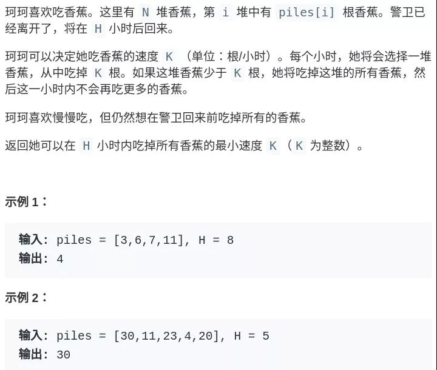

Koko 每小时最多吃一堆香蕉，如果吃不下的话留到下一小时再吃；如果吃完了这一堆还有胃口，也只会等到下一小时才会吃下一堆。在这个条件下，让我们确定 Koko 吃香蕉的**最小速度**（根/小时）。

先抛开二分查找技巧，**想想如何暴力解决这个问题呢？**

算法要求的是「`H`小时内吃完香蕉的最小速度」，我们不妨称为`speed`，**请问`speed`最大可能为多少，最少可能为多少呢？**

显然最少为 1，最大为`max(piles)`，因为一小时最多只能吃一堆香蕉。那么暴力解法就很简单了，只要从 1 开始穷举到`max(piles)`，一旦发现发现某个值可以在`H`小时内吃完所有香蕉，这个值就是最小速度：

```java
int minEatingSpeed(int[] piles, int H) {
    /* 暴力解法(不通过) */
    // 求 piles 数组最大值
    int max = getMax(piles);
    // 对速度由 1 根每小时遍历到 max 根每小时
    // 只要找到满足在 H 小时内吃掉所有香蕉的最小速度，即停止遍历并返回
    for(int speed = 1; speed < max; speed++) {
        if (canFinish(piles, speed, H)) {
            return speed;
        }
    }
    // 否则每小时必要吃掉这堆香蕉中最大的一堆
    return max;
}
```

### 思路

注意这个 for 循环，就是在**连续的空间线性搜索，这就是二分查找可以发挥作用的标志**。

由于我们要求的是最小速度，所以可以用一个**搜索左侧边界的二分查找**来代替线性搜索，提升效率

### 代码实现

```java
public int minEatingSpeed(int[] piles, int H) {
    /* 二分查找(因为寻找最小值，所以使用左侧边界框架) */
    // 求 piles 数组最大值
    int max = getMax(piles);
    // 因为暴力解法：for(int speed = 1; speed < max; speed++) speed 从 1 开始
    // 搜索空间：[left, right) = [1, max + 1)，并不包括 max + 1
    int left = 1, right = max + 1;

    while (left < right) {
        // 计算 mid，在本题相当于 speed
        int speed = (left + right) / 2;
        if (canFinish(piles, speed, H)) { // 这里包括 time <= H 的情况
            right = speed;
        } else { // time > H，加大吃香蕉速度
            left = speed + 1;
        }
    }
    return left;
}

private boolean canFinish(int[] piles, int speed, int H) {

    // 定义以 speed 根每小时吃完香蕉所需要的时间
    int time = 0;
    // 计算吃完所有堆香蕉花费的总时间
    for (int n : piles) {
        time += timeOf(n, speed); // 吃完一堆要花费的时间
    }
    // 如果 time <= H，返回 true，否则 false
    return time <= H;
}

private int timeOf(int n, int speed) {

    // n / speed：整数部分小时，如果有余数，再计算
    // n % speed：小数部分，如果大于 0，表示有余数，还需花 1h 吃完，如果等于 0，就刚好
    return (n / speed) + ((n % speed) > 0 ? 1 : 0);
}

private int getMax(int[] piles) {
    int max = 0;
    for (int p : piles) {
        max = Math.max(p, max);
    }
    return max;
}
```

## 在 D 天内送达包裹的能力(LeetCode[1011])

### 思路

与 H 天吃香蕉问题类似，不同的是 left 是 weights 数组中的最大数，因为货物不能拆分每次必须保证能至少运送一件货物；right 为 weights 数组的货物重量之和。

### 代码实现

```java
public int shipWithinDays(int[] weights, int D) {

    // 最小的载重，因为货物不能被分割，所以最小载重就是 weight 矩阵中的最大值
    int left = getMax(weights);
    // 最大的载重就是货物重量之和，因为是搜索左侧边界，所以 + 1
    int right = getSum(weights) + 1;
    while (left < right) {
        int mid = left + (right - left) / 2; // 等价于 (left + right) / 2
        if (canFinish(weights, mid, D)) {
            right = mid;
        } else {
            left = mid + 1;
        }
    }
    return left;
}

// 判断 D 天内能否以 cap 吨/天 的速度运完
private boolean canFinish(int[] weights, int cap, int D) {
    // 记录运送了多少件货物
    int i = 0;
    // 计算 D 天内运送了 i 件货物
    for (int day = 0; day < D; day++) {
        int maxCap = cap;
        while ((maxCap -= weights[i]) >= 0) {
            i++;
            // 假设计算了 D 天，若 i = weights.length
            if (i == weights.length) return true;
        }
    }
    return false;
}

private int getMax(int[] weights) {
    int max = 0;
    for (int w : weights) {
        max = Math.max(w, max);
    }
    return max;
}

private int getSum(int[] weights) {
    int sum = 0;
    for (int w : weights) {
        sum += w;
    }
    return sum;
}
```

首先思考使用 for 循环暴力解决问题，观察代码是否如下形式：

```java
for (int i = 0; i < n; i++)
    if (isOK(i))
        return answer;
```

如果是，那么就可以使用二分搜索优化搜索空间：如果要求最小值就是搜索左侧边界的二分，如果要求最大值就用搜索右侧边界的二分。

## 双指针技巧汇总

双指针技巧还可以分为两类，一类是「快慢指针」，一类是「左右指针」。前者解决主要解决链表中的问题，比如典型的判定链表中是否包含环；后者主要解决数组（或者字符串）中的问题，比如二分查找。

### 环形链表I(判断链表中是否有环LeetCode[141])

单链表的特点是每个节点只知道下一个节点，所以一个指针的话无法判断链表中是否含有环的。

如果链表中不含环，那么这个指针最终会遇到空指针 null 表示链表到头了，这还好说，可以判断该链表不含环。

```java
boolean hasCycle(ListNode head) {
    while (head != null)
        head = head.next;
    return false;
}
```

但是如果链表中含有环，那么这个指针就会陷入死循环，因为环形数组中没有 null 指针作为尾部节点。

经典解法就是用两个指针，一个每次前进两步，一个每次前进一步。如果不含有环，跑得快的那个指针最终会遇到 null，说明链表不含环；如果含有环，快指针最终会超慢指针一圈，和慢指针相遇，说明链表含有环。

```java
public boolean hasCycle(ListNode head) {

    // 定义快慢指针
    ListNode slow, faster;
    slow = faster = head;
    // 如果该链表不为环形链表，faster 必比 slow 先到末尾 null 的位置
    // slow 步进 1，faster 步进 2
    // 如果没有环，他们永远不会相遇，有环肯定会相遇的
    while (faster != null && faster.next != null) { // 快指针会先到末尾
        faster = faster.next.next;
        slow = slow.next;

        if (slow == faster) return true;
    }
    return false;
}
```

### 环形链表II(已知链表中含有环，返回这个环的起始位置LeetCode[142])

#### 题目描述

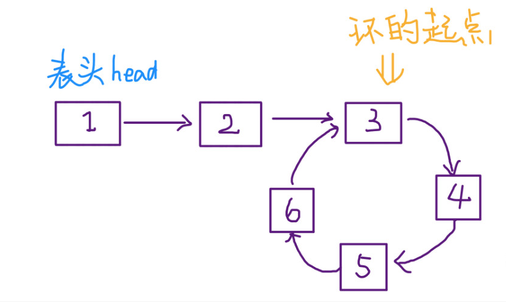

#### 思路

**核心思想：**当快慢指针第一次相遇的时候，让其中任意一个指针重新指向头结点，然后让它俩以**相同**的速度前进，再次相遇时 slow/fast 所在的节点就是环开始的起始位置。

**解释：**

第一次相遇时，假设慢指针 slow 走了 k 步，那么快指针 fast 一定走了 2k 步，也就是说比 slow 多走了 k 步（也就是环的长度）。**这一步是检测链表中是否有环**

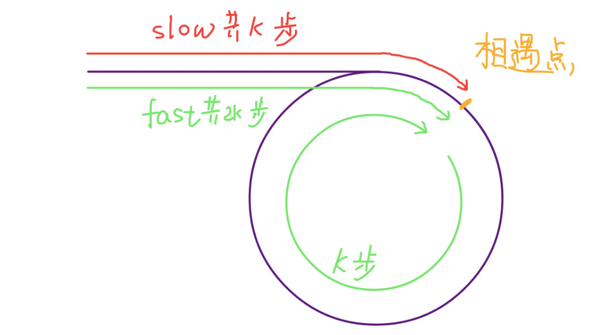

但是**不能保证**第一次相遇时 相遇点 = 环起始点！

设相遇点距环的起点的距离为 m，那么环的起点距头结点 head 的距离为 k - m，也就是说如果从 head 前进 k - m 步就能到达环起点。

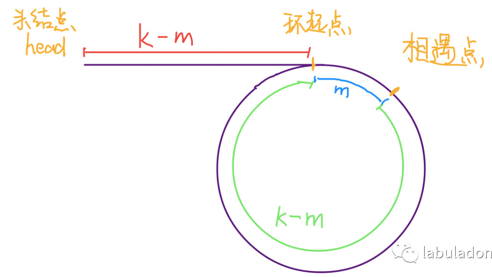

如果从相遇点继续前进 k - m 步，也恰好到达环起点。

所以，只要我们把快慢指针中的任一个重新指向 head，然后两个指针同速前进，k - m 步后就会相遇，相遇之处就是环的起点了。

#### 代码实现

```java
public ListNode detectCycle(ListNode head) {

    ListNode slow, fast;
    slow = fast = head;
    // 步进 2，所以必须保证 fast 和 fast.next != null
    //        while (fast != null && fast.next != null) {
    while (true) {
        if (fast == null || fast.next == null) return null;
        fast = fast.next.next;
        slow = slow.next;
        if (slow == fast) break;
    }
    slow = head;
    while (slow != fast) {
        slow = slow.next;
        fast = fast.next;
    }
    return slow;
}
```

### 链表的中间结点(LeetCode[876])

#### 题目描述

找到一个非环形链表的中间节点并返回，如果链表元素个数为偶数，返回链表中间节点的第二个节点。

#### 思路

可以让快指针一次前进两步，慢指针一次前进一步，当快指针到达链表尽头时，慢指针就处于链表的中间位置。

当链表的长度是奇数时，slow 恰巧停在中点位置；如果长度是偶数，slow 最终的位置是中间偏右：

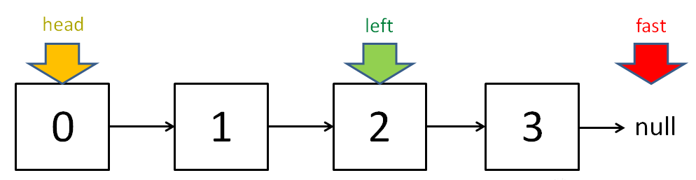

**寻找链表中点的一个重要作用是对链表进行归并排序。**

数组的归并排序：求中点索引递归地把数组二分，最后合并两个有序数组。对于链表，合并两个有序链表是很简单的，难点就在于二分。

#### 代码实现

```java
public ListNode middleNode(ListNode head) {

    // 定义快慢指针
    ListNode slow, fast;
    slow = fast = head;
    // 因为 fast 步进 2，所以当奇数时 fast 最终会在最后一个节点，没指向 null
    // 偶数时，fast 指向 null
    // 所以当 fast == null || fast.next == null，循环结束
    // 否命题就是 fast != null && fast.next != null
    // a || b --> 否 a && 否 b
    // a && b --> 否 a || 否 b
    while (fast != null && fast.next != null) {
        slow =slow.next;
        fast = fast.next.next;
    }
    return slow;
}
```

### [剑指 Offer 22]链表中倒数第k个节点

#### 题目描述

输入一个链表，输出该链表中倒数第k个节点。为了符合大多数人的习惯，本题从1开始计数，即链表的尾节点是倒数第1个节点。例如，一个链表有6个节点，从头节点开始，它们的值依次是1、2、3、4、5、6。这个链表的倒数第3个节点是值为4的节点。

#### 思路

思路还是使用快慢指针，让快指针先走 k 步，然后快慢指针开始同速前进。这样当快指针走到链表末尾 null 时，慢指针所在的位置就是倒数第 k 个链表节点（为了简化，假设 k 不会超过链表长度）

#### 代码实现

```java
public ListNode getKthFromEnd(ListNode head, int k) {

    ListNode slow, fast;
    slow = fast = head;

    // 先让 fast 先走 k 步
    while (k > 0) {
        fast = fast.next;
        k--;
    }
    while (fast != null) {
        fast = fast.next;
        slow = slow.next;
    }
    return slow;
}
```

# 2021.1.22记录

## 左右指针的常用算法

### 二分查找

见上面二分查找算法详解

### 两数之和(LeetCode[1] && [167])

#### 题目描述

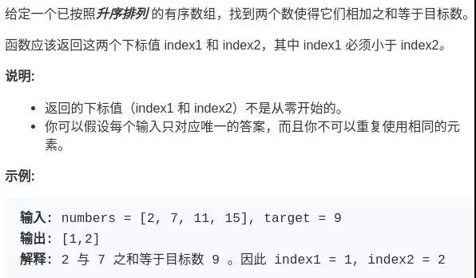

#### 思路

只要数组有序，就应该想到双指针技巧。这道题的解法有点类似二分查找，通过调节 left 和 right 可以调整 sum 的大小。

#### Java 自带排序方法

+ 快速排序：首先是最简单的Array.sort，直接进行排序：

```java
int[] arr = {4,3,5,1,7,9,3};
Arrays.sort(arr);
```

+ 部分排序法：使用Array.sort还可进行选择想要排序的部分数字，如将下角标编号为1~4的数字进行排序，其他数字顺序不变。

```java
int[] arr = {4,3,5,1,2,9,3,0};
Arrays.sort(arr,1,4);
```

#### Java 中复制数组的方法

```java
// nums：原数组
// 0：起始位置
// nums.length：新数组的长度
int[] arr = Arrays.copyOfRange(nums, 0, nums.length);
```

根据 sort() 方法可以很方便的计算数组最大值

#### 代码实现

```java
// 有序数组就要想到左右指针的方法
public int[] twoSum(int[] nums, int target) {
    int left = 0; // 左侧最小索引
    int right = nums.length - 1; // 搜索空间：[left, right]
    int[] arr = Arrays.copyOfRange(nums, 0, nums.length);
    Arrays.sort(arr);
    while (left <= right) {
        int sum = arr[left] + arr[right];
        if (sum == target) {
            int a = findIndex(left, arr, nums);
            int b = findIndex(right, arr, nums);
            if (a == b) {
                // 找到一个不在 nums 数组中的数
                // 此时 arr 为有序数组，arr[arr.length - 1] 表示 arr 和 nums 数组的最大值
                // arr[arr.length - 1] + 1 在 nums 中一定不存在
                nums[b] = arr[arr.length - 1] + 1;
                b = findIndex(right, arr, nums);
            }
            return new int[]{a, b};
        } else if (sum < target) {
            left++; // 让 left 大一点再搜索
        } else if (sum > target) {
            right--; // right 小一点再搜索
        }
    }
    return new int[]{-1, -1};
}

// 找到 left 和 right 在 nums 数组中的索引
private int findIndex(int afterIndex, int[] arr, int[] nums) {
    int orignalIndex = 0, i = 0;
    while (i < nums.length) {
        if (arr[afterIndex] == nums[i]) {
            orignalIndex = i;
            break;
        }
        i++;
    }
    return orignalIndex;
}
```

### 无序数组的 TwoSum 问题

#### 思路

核心思想：在哈希表 index 存储的元素中，如果能找到两个元素之和等于 target 并且它们的索引不同，则这两个元素的索引即为所求

#### 代码实现

```java
/* 使用 HashMap 存储每个元素索引解决问题*/
public int[] twoSum(int[] nums, int target) {
    // 创建 nums 数组中元素 --> 其对应索引 的映射
    HashMap<Integer, Integer> index = new HashMap<>();
    // 将元素和索引放入 index
    for (int i = 0; i < nums.length; i++) {
        index.put(nums[i], i);
    }
    // 核心思想：在 index 存储的元素中，如果能找到两个元素之和等于 target 并且它们的索引不同，则即为所求
    for (int i = 0; i < nums.length; i++) {
        // nums[i] + other = target
        int other = target - nums[i];
        // 若 other 也在 index 中并且 other 的索引跟 nums[i] 的索引还不一样
        if (index.containsKey(other) && index.get(other) != i) {
            return new int[]{i, index.get(other)};
        }
    }
    return new int[]{-1, -1};
}
```

由于哈希表的查询时间为 O(1)，算法的时间复杂度降低到 O(N)，但是需要 O(N) 的空间复杂度来存储哈希表。

### 两数之和 III - 数据结构设计(LeetCode[167])

#### 题目描述

设计一个类，拥有两个 API：

```java
class TwoSum {
    // 向数据结构中添加一个数 number
    public void add(int number);
    // 寻找当前数据结构中是否存在两个数的和为 value
    public boolean find(int value);
}
```

#### 思路

+ 可以仿照上一道题目，使用一个哈希表辅助`find`方法。

  这个解法的时间复杂度呢，`add`方法是 O(1)，`find`方法是 O(N)，空间复杂度为 O(N)

+ 对于频繁使用`find`方法的场景，我们可以进行优化。我们可以参考上一道题目的暴力解法，借助**哈希集合**来针对性优化`find`方法

  这样`sum`中就储存了所有加入数字可能组成的和，每次`find`只要花费 O(1) 的时间在集合中判断一下是否存在就行。

#### 代码实现

```java
/* 设计一个类，拥有两个 API：哈希表辅助 find 方法*/
class TwoSum {
    // 创建存放 元素 --> 索引 的 HashMap
    HashMap<Integer, Integer> index = new HashMap<>();
    // 向数据结构中添加一个数 number
    public void add(int number) {
        index.put(number, index.getOrDefault(number, 0) + 1);
    }
    // 寻找当前数据结构中是否存在两个数的和为 value
    public boolean find(int value) {
        for (Integer key : index.keySet()) { // 获取 HashMap 中的 key 的集合
            // other = value - key
            int other = value - key;
            // 此时有两个一样的元素组成 value
            if (key == other && index.get(key) > 1) return true;
            // 两个不一样的元素组成
            if (key != other && index.containsKey(other)) return true;
        }
        return false;
    }
}

/* 设计一个类，拥有两个 API：哈希集合实现*/
class TwoSum {
    // 创建存放所有元素全部组合的 sum
    Set<Integer> sum = new HashSet<>();
    // 创建存放 number 的数组
    ArrayList<Integer> nums = new ArrayList<>();
    // 向数据结构中添加一个数 number
    public void add(int number) {
        for (Integer num : nums) {
            sum.add(num + number);
        }
        nums.add(number);
    }
    // 寻找当前数据结构中是否存在两个数的和为 value
    public boolean find(int value) {
        return sum.containsKey(value);
    }
}
```

#### 总结

对于 TwoSum 问题，一个难点就是给的数组**无序**。对于一个无序的数组，我们似乎什么技巧也没有，只能暴力穷举所有可能。

**一般情况下，我们会首先把数组排序再考虑双指针技巧**。

TwoSum 启发我们，HashMap 或者 HashSet 也可以帮助我们处理无序数组相关的简单问题。

### 反转数组

#### 思路

利用左右指针分别指向数组的最左边和最右边，先交换这两个值，依次对左右指针--，遍历数组元素即可完成反转。

#### 代码实现

```java
public void traverse(int[] nums) {
    int left = 0;
    int right = nums.length - 1;
    while(left < right) { // 排除奇数元素个数的情况
        int tmp = nums[left];
        nums[left] = nums[right];
        nums[right] = tmp;
        left--;
        right--;
    }
}
```

### 滑动窗口算法

这也许是双指针技巧的最高境界了，如果掌握了此算法，可以解决一大类子字符串匹配的问题，不过「滑动窗口」算法比上述的这些算法稍微复杂些。

# 2021.1.22记录

#### 滑动窗口顺口溜

```markdown
链表字串数组题，double指针快下笔
双指针家三兄弟，各个都是万人迷

快慢指针最神奇，链表操作无压力
归并排序找中点，链表成环做判定

左右指针最常见，两端分别向中间
反转数组简单写，二分搜索信手拈

滑动窗口无敌哥，字串问题别得瑟
左右指针滑窗口，齐头并进分前后
```

#### Java 中遍历字符串字符的方法

```java
String str = "asdfghjkl";
// 方法一
for(int i=0; i<str.length(); i++){
	char ch = str.charAt(i);
}
// 方法二
char[] c=s.toCharArray();
for(char cc:c){
...//cc直接用了
} 
// 方法三
for(int i=0;i<str.length();i++){
	String subStr = str.substring(i, i+1);
}
```

### 最小覆盖字串(LeetCode[76])

#### 问题描述


就是说要在`S`(source) 中找到包含`T`(target) 中全部字母的一个子串，且这个子串一定是所有可能子串中最短的。

#### 滑动窗口思路

***1、***我们在字符串`S`中使用双指针中的左右指针技巧，初始化`left = right = 0`，**把索引左闭右开区间`[left, right)`称为一个「窗口」**。

***2、***我们先不断地增加`right`指针扩大窗口`[left, right)`，直到窗口中的字符串符合要求（包含了`T`中的所有字符）。**可行解**

***3、***此时，我们停止增加`right`，转而不断增加`left`指针缩小窗口`[left, right)`，直到窗口中的字符串不再符合要求（不包含`T`中的所有字符了）。同时，每次增加`left`，我们都要更新一轮结果。**寻找最优解**

***4、***重复第 2 和第 3 步，直到`right`到达字符串`S`的尽头。

**第 2 步相当于在寻找一个「可行解」，然后第 3 步在优化这个「可行解」，最终找到最优解，**也就是最短的覆盖子串。

画图理解一下，`needs`和`window`相当于计数器，分别记录`T`中字符出现次数和「窗口」中的相应字符的出现次数。

初始状态：

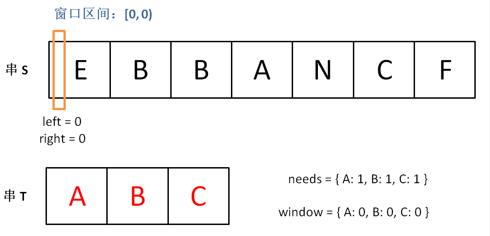

增加`right`，直到窗口`[left, right)`包含了`T`中所有字符：

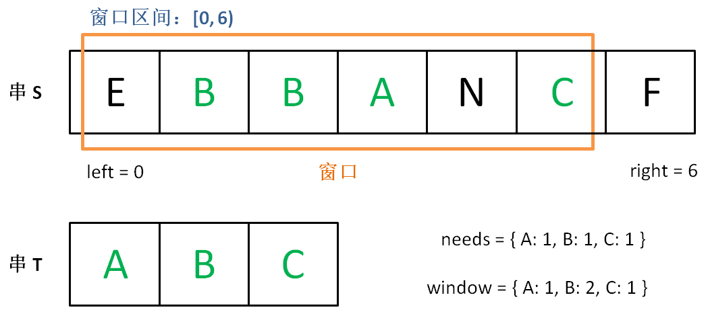

现在开始增加`left`，缩小窗口`[left, right)`。

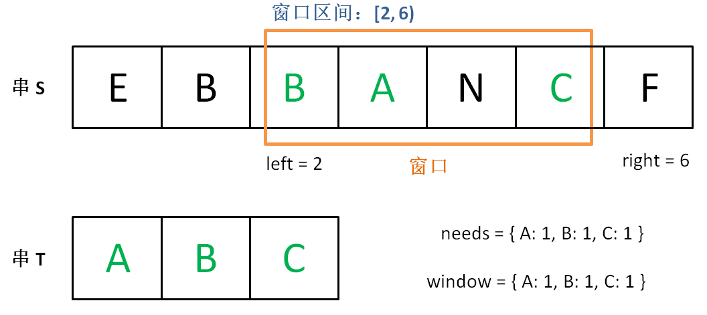

直到窗口中的字符串不再符合要求，`left`不再继续移动。**虽然 left = 3 不满足最小字串条件，但是在缩小窗口之前由变量 start = left 记录了最小字串的左边界**  

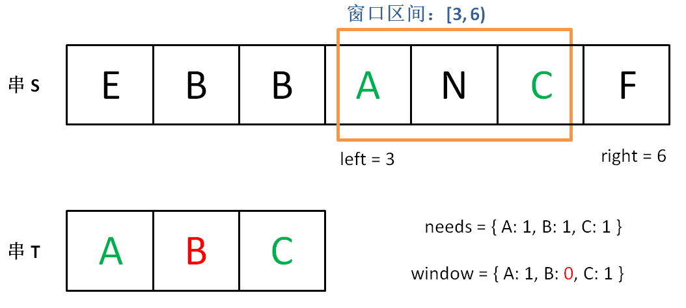

之后重复上述过程，先移动`right`，再移动`left`…… 直到`right`指针到达字符串`S`的末端，算法结束。

#### 代码实现

```java
public String minWindow(String s, String t) {
    HashMap<Character, Integer> need = new HashMap<>();
    HashMap<Character, Integer> window = new HashMap<>();
    // 将 t 字串的每个字符放入 need 和 window，初始化各个字符的次数都为 0
    char[] s_arr = s.toCharArray();
    char[] t_arr = t.toCharArray();
    for (char c : t_arr) need.put(c, need.getOrDefault(c, 0) + 1);
    // 初始化左右指针，初始位置：[left, right) = [0, 0)
    int left = 0, right = 0;
    // 用 valid 变量表示窗口中满足 need 条件的字符个数
    int valid = 0;
    // 记录覆盖最小字串的起始坐标和长度
    int start = 0, len = Integer.MAX_VALUE;
    // 循环遍历整个字符转 s
    while (right < s_arr.length) {
        // 先 left 不动，移动 right，直到找到一个可行解
        char c = s_arr[right];
        // 右移扩大窗口
        right++;
        // 更新窗口内的数据
        if (need.containsKey(c)) {
            // 如果 c 就是我们要找的字符之一，让 window 中对应的 key 的值 + 1
            // window.getOrDefault(c, 0)：如果 window 中没有 c，自动创建并设置默认值为 0
            window.put(c, window.getOrDefault(c, 0) + 1);
            // 如果两个 map 中 c 对应的次数一致，即找到一个想要的字符
            if (window.get(c).equals(need.get(c))) {
                valid++;
            }
        }

        // 如果在扩大 right 的过程中找到了一个可行解，判断是否需要缩小 left 以获得最优解
        // 此 while 在上一个 while 中
        while (valid == need.size()) {
            // 更新最小覆盖字串
            // 初次比较肯定小于 len
            if (right - left < len) {
                // 记录原始 left
                start = left;
                len = right - left;
            }
            // 逐步将窗口左边的元素移除窗口，看 valid == need.size() 还成立不？
            char d = s_arr[left];
            // 移动左边的窗口
            left++;
            // 更新窗口中的数据，如果 d 有用
            if (need.containsKey(d)) {
                // 如果 d 在 need 和 window 中出现的次数相同，即为 1
                if (window.get(d).equals(need.get(d))) {
                    valid--;
                }
                window.put(d, window.getOrDefault(d, 0) - 1);
            }
        }
    }
    return len == Integer.MAX_VALUE ? "" : s.substring(start, start + len);
}
```

需要注意的是，当我们发现某个字符在`window`的数量满足了`need`的需要，就要更新`valid`，表示有一个字符已经满足要求。而且，你能发现，两次对窗口内数据的更新操作是完全对称的。

**当`valid == need.size()`时，说明`T`中所有字符已经被覆盖，已经得到一个可行的覆盖子串**，现在应该开始收缩窗口了，以便得到「最小覆盖子串」。

移动`left`收缩窗口时，窗口内的字符都是可行解，所以应该在收缩窗口的阶段进行最小覆盖子串的更新，以便从可行解中找到长度最短的最终结果。

### 字符串的排列(Leetcode[567])

#### 题目描述

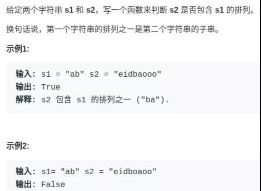

#### 思路

注意，输入的`s1`是可以包含重复字符的。这种题目，是明显的滑动窗口算法，**相当给你一个`S`和一个`T`，请问你`S`中是否存在一个子串，包含`T`中所有字符且不包含其他字符**？

#### 代码实现

```java
/* 找出 s2 中是否存在一个字串，包含 s1 中所有字符而不包括其他字符 */
// 滑动窗口无敌哥，字串问题别得瑟
// 左右指针滑窗口，齐头并进分前后
public boolean checkInclusion(String s1, String s2) {
    HashMap<Character, Integer> need = new HashMap<>();
    HashMap<Character, Integer> window = new HashMap<>();
    // String to char[]
    char[] s1_arr = s1.toCharArray();
    char[] s2_arr = s2.toCharArray();
    // 将所要找的元素和其出现的次数放入 need 中
    for (char c : s1_arr) {
        need.put(c, need.getOrDefault(c, 0) + 1);
    }
    int left = 0, right = 0;
    // 记录 window 中元素的个数
    int valid = 0;
    // 滑动 right
    while (right < s2_arr.length) {
        // c 是滑动的元素
        char c = s2_arr[right];
        right ++;
        // 更新 window 中的数据
        if (need.containsKey(c)) {
            window.put(c, window.getOrDefault(c, 0) + 1);
            // 如果 need 和 window 中 c 对应的 val 相同，说明完成了一个字符
            if (need.get(c).equals(window.get(c))) {
                valid++;
            }
        }

        // 再往右滑的过程中，如果找到一个可行解，判断要不要收缩
        // 只要大于等于字串的长度就应该移动，保证字串的长度就是窗口的长度
        while (right - left >= s1_arr.length) {
            if (valid == need.size()) {
                return true;
            }
            // d 是 left 向右滑动要去掉的元素
            char d = s2_arr[left];
            left++;
            // 更新 window 中的数据
            if (need.containsKey(d)) {
                if (need.get(d).equals(window.get(d))) {
                    valid--;
                }
                window.put(d, window.getOrDefault(d, 0) - 1);
            }
        }
    }
    return false;
}
```

对于这道题的解法代码，基本上和最小覆盖子串一模一样，只需要改变两个地方：

**1、**本题移动`left`缩小窗口的时机是窗口大小大于`t.size()`时，因为排列嘛，显然长度应该是一样的。

**2、**当发现`valid == need.size()`时，就说明窗口中就是一个合法的排列，所以立即返回`true`。

至于如何处理窗口的扩大和缩小，和最小覆盖子串完全相同。

### 找所有字母异位词(LeetCode[438])

#### 题目描述

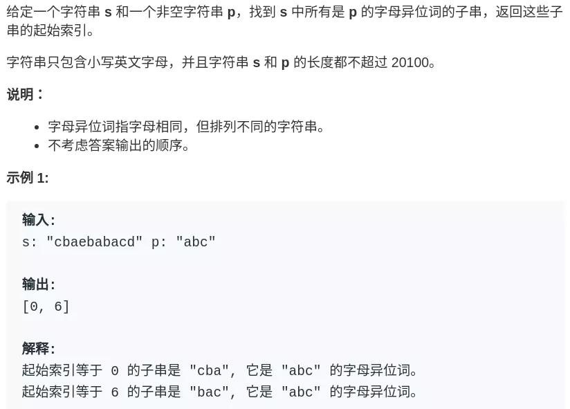

#### 思路

 这个所谓的字母异位词，不就是排列吗？

**相当于，输入一个串`S`，一个串`T`，找到`S`中所有`T`的排列，返回它们的起始索引**。

#### 实现代码

```java
public List<Integer> findAnagrams(String s, String p) {
    HashMap<Character, Integer> need = new HashMap<>();
    HashMap<Character, Integer> window = new HashMap<>();
    List<Integer> res = new ArrayList<>();
    // 将 t 字串的每个字符放入 need 和 window，初始化各个字符的次数都为 0
    char[] s_arr = s.toCharArray();
    char[] p_arr = p.toCharArray();
    for (char c : p_arr) need.put(c, need.getOrDefault(c, 0) + 1);
    // 初始化左右指针，初始位置：[left, right) = [0, 0)
    int left = 0, right = 0;
    // 用 valid 变量表示窗口中满足 need 条件的字符个数
    int valid = 0;
    // 循环遍历整个字符转 s
    while (right < s_arr.length) {
        // 先 left 不动，移动 right，直到找到一个可行解
        char c = s_arr[right];
        // 右移扩大窗口
        right++;
        // 更新窗口内的数据
        if (need.containsKey(c)) {
            // 如果 c 就是我们要找的字符之一，让 window 中对应的 key 的值 + 1
            // window.getOrDefault(c, 0)：如果 window 中没有 c，自动创建并设置默认值为 0
            window.put(c, window.getOrDefault(c, 0) + 1);
            // 如果两个 map 中 c 对应的次数一致，即找到一个想要的字符
            if (window.get(c).equals(need.get(c))) {
                valid++;
            }
        }

        // 如果在扩大 right 的过程中找到了一个可行解，判断是否需要缩小 left 以获得最优解
        // 此 while 在上一个 while 中
        while (right - left >= p_arr.length) {
            if (valid == need.size()) {
                res.add(left);
            }
            // 逐步将窗口左边的元素移除窗口，看 valid == need.size() 还成立不？
            char d = s_arr[left];
            // 移动左边的窗口
            left++;
            // 更新窗口中的数据，如果 d 有用
            if (need.containsKey(d)) {
                // 如果 d 在 need 和 window 中出现的次数相同，即为 1
                if (window.get(d).equals(need.get(d))) {
                    valid--;
                }
                window.put(d, window.getOrDefault(d, 0) - 1);
            }
        }
    }
    return res;
}
```

跟寻找字符串的排列一样，只是找到一个合法异位词（排列）之后将起始索引加入`res`即可。

### 最长无重复字串(LeetCode[3])

#### 问题描述


#### 思路

`need`和`valid`都不需要，而且更新窗口内数据也只需要简单的更新计数器`window`即可，当`window[c]`值大于 1 时，说明窗口中存在重复字符，不符合条件，就该移动`left`缩小窗口了。

#### 代码实现

```java
public int lengthOfLongestSubstring(String s) {
    HashMap<Character, Integer> window = new HashMap<>();
    int res = 0;
    int left = 0, right = 0;
    char[] s_arr = s.toCharArray();
    while (right < s_arr.length) {
        char c = s_arr[right];
        right++;
        window.put(c, window.getOrDefault(c, 0) + 1);

        // 收缩窗口
        while (window.get(c) > 1) { // 此时有重复元素了
            char d = s_arr[left];
            left++;
            window.put(d, window.getOrDefault(d, 0) - 1);
        }
        res = Math.max(res, right - left);
    }
    return res;
}
```

唯一需要注意的是，在哪里更新结果`res`呢？我们要的是最长无重复子串，哪一个阶段可以保证窗口中的字符串是没有重复的呢？

这里和之前不一样，**要在收缩窗口完成后更新`res`**，因为窗口收缩的 while 条件是存在重复元素，换句话说收缩完成后一定保证窗口中没有重复。

# 2021.1.24记录

## 常数时间插入、删除和获取随机元素(LeetCode[380])

### 题目描述

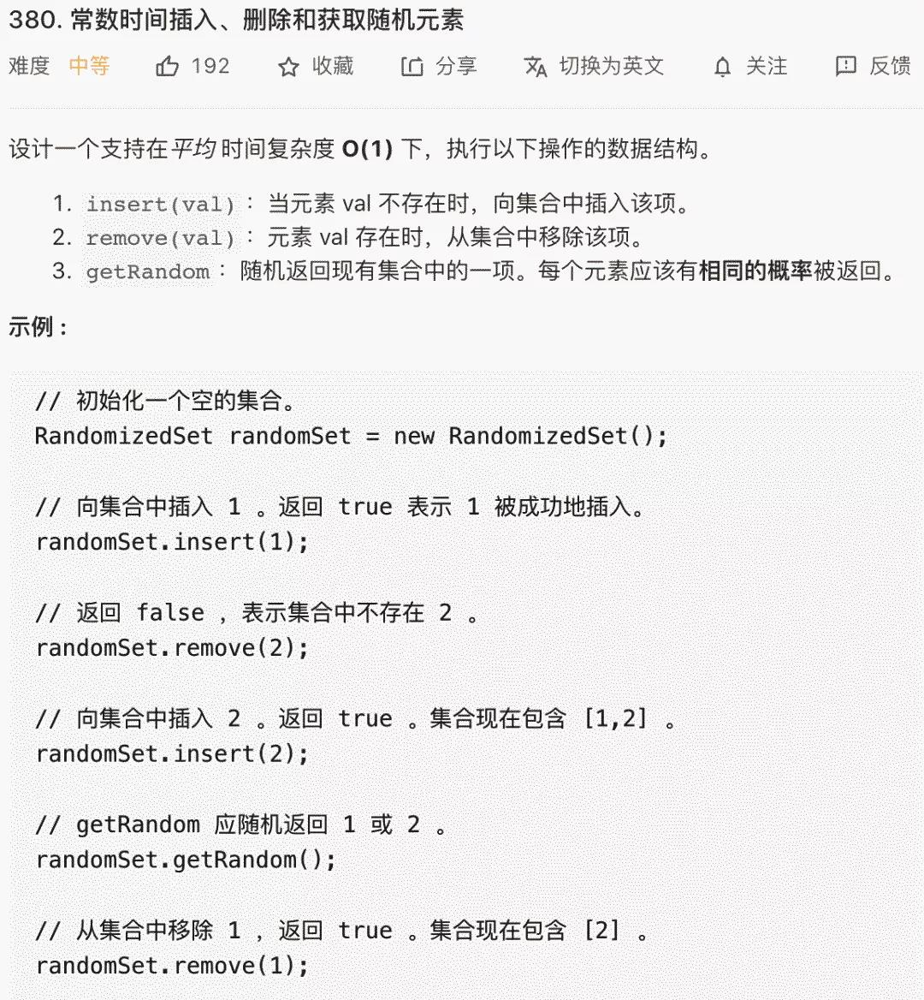

**1、插入，删除，获取随机元素这三个操作的时间复杂度必须都是 O(1)**。

**2、`getRandom`方法返回的元素必须等概率返回随机元素**，也就是说，如果集合里面有`n`个元素，每个元素被返回的概率必须是`1/n`。

### 思路

对于`getRandom`方法，如果想「等概率」且「在 O(1) 的时间」取出元素，一定要满足：**底层用数组实现，且数组必须是紧凑的**。

这样我们就可以直接生成随机数作为索引，从数组中取出该随机索引对应的元素，作为随机元素。

**但如果用数组存储元素的话，插入，删除的时间复杂度怎么可能是 O(1) 呢**？

可以做到！对数组尾部进行插入和删除操作不会涉及数据搬移，时间复杂度是 O(1)。

**所以，如果我们想在 O(1) 的时间删除数组中的某一个元素`val`，可以先把这个元素交换到数组的尾部，然后再`pop`掉**。

交换两个元素必须通过索引进行交换对吧，那么我们需要一个哈希表`valToIndex`来记录每个元素值对应的索引。

### 代码实现

```java
/* 以 O(1) 时间复杂度完成插入、删除、随机获取元素的操作*/
class RandomizedSet {
    // 想要以 O(1) 随机访问元素，必选数组实现
    ArrayList<Integer> nums;
    // 创建 HashMap 记录数组元素对应的索引值
    HashMap<Integer, Integer> valToIndex;
    /** Initialize your data structure here. */
    public RandomizedSet() {
        this.nums = new ArrayList<>();
        this.valToIndex = new HashMap<>();
    }

    /** Inserts a value to the set. Returns true if the set did not already contain the specified element. */
    public boolean insert(int val) {
        // 如果数组中存在 val，则返回false
        if (valToIndex.containsKey(val)) return false;
        // 想要以 O(1) 复杂度插入元素，为了避免移动元素，必须将元素插入至数组末尾
        // 没加任何数之前，nums.size() == 0
        valToIndex.put(val, nums.size());
        nums.add(val);
        return true;
    }

    /** Removes a value from the set. Returns true if the set contained the specified element. */
    public boolean remove(int val) {
        // 如果元素不存在 val，返回false
        if (!valToIndex.containsKey(val)) return false;
        // 想要以 O(1) 复杂度移除元素，先将要删除元素移动至数组末尾，再删除
        int index = valToIndex.get(val); // 获取 val 的索引 index
        // 将 valToIndex 中最后元素(即 nums 里最后的元素)索引换成 index
        valToIndex.put(nums.get(nums.size() - 1), index);
        // 将数组中 val 和 最后的元素互换位置, 此时 val 就是最后的元素
        Collections.swap(nums, index, nums.size() - 1);
        // 删除数组最后一个元素，即为 val
        nums.remove(nums.size() - 1);
        // 删除 valToIndex 中 val 对应的索引
        valToIndex.remove(val);
        return true;
    }

    /** Get a random element from the set. */
    public int getRandom() {
        return nums.get((int)(Math.random() * nums.size()));
    }
}
```

### Java 中生成随机数的方法

```java
nums.get((int)(Math.random() * nums.size()));
```

# 2021.1.25记录

## Java 中数组的相关方法

+ 声明数组

```java
String[] aArray = new String[5];
String[] bArray = {"a","b","c", "d", "e"};
String[] cArray = new String[]{"a","b","c","d","e"};
```

+ 打印数组

```java
int[] intArray = { 1, 2, 3, 4, 5 };
String intArrayString = Arrays.toString(intArray);
// print directly will print reference value
System.out.println(intArray);
// [I@7150bd4d
System.out.println(intArrayString);
// [1, 2, 3, 4, 5]
```

+ 由数组创建一个 ArrayList

```java
String[] stringArray = { "a", "b", "c", "d", "e" };
ArrayList<String> arr = new ArrayList<String>(Arrays.asList(StringArray));
System.out.println(arr);
// [a, b, c, d, e]
```

+ 检查数组是否包含一个值

```java
String[] stringArray = { "a", "b", "c", "d", "e" };
boolean b = Arrays.asList(stringArray).contains("a");
System.out.println(b);
// true
```

+ 合并数组

```java
int[] intArray = { 1, 2, 3, 4, 5 };
int[] intArray2 = { 6, 7, 8, 9, 10 };
// Apache Commons Lang library
int[] combinedIntArray = ArrayUtils.addAll(intArray, intArray2);
```

+ 一行代码声明数组

```java
method(new String[]{"a", "b", "c", "d", "e"});
```

+ 把数组中的元素用指定的分隔符连接起来

```java
// containing the provided list of elements
// Apache common lang
String j = StringUtils.join(new String[] { "a", "b", "c" }, ", ");
System.out.println(j);
// a, b, c
```

+ 把一个 ArrayList 转换成数组

见上述记录

+ 把一个数组转换成 Set

```java
String[] stringArray = { "a", "b", "c", "d", "e" };
// Arrays.asList()方法的作用是将数组或一些元素转为集合,而你得到的集合并不是我们通常使用的List集合，而是Arrays里面的一个内部类。
Set<String> set = new HashSet<String>(Arrays.asList(stringArray));
System.out.println(set);
//[d, e, b, c, a]
```

+ 反转数组

```java
int[] intArray = { 1, 2, 3, 4, 5 };
ArrayUtils.reverse(intArray);
System.out.println(Arrays.toString(intArray));
//[5, 4, 3, 2, 1]
```

+ 移除数组中的元素

```java
int[] intArray = { 1, 2, 3, 4, 5 };
int[] removed = ArrayUtils.removeElement(intArray, 3);//create a new array
System.out.println(Arrays.toString(removed));
```

## 避开黑名单的随机数(LeetCode[710])

### 题目描述

输入一个正整数`N`，代表左闭右开区间`[0,N)`，再给你输入一个数组`blacklist`，其中包含一些「黑名单数字」，且`blacklist`中的数字都是区间`[0,N)`中的数字。

需要设计数据结构：

```java
class Solution {
public:
    // 构造函数，输入参数
    Solution(int N, vector<int>& blacklist) {}

    // 在区间 [0,N) 中等概率随机选取一个元素并返回
    // 这个元素不能是 blacklist 中的元素
    int pick() {}
};
```

`pick`函数会被多次调用，每次调用都要在区间`[0,N)`中「等概率随机」返回一个「不在`blacklist`中」的整数。

**而且题目要求，在`pick`函数中应该尽可能少调用随机数生成函数`rand()`**。

### 思路

 **类似上一道题，我们可以将区间`[0,N)`看做一个数组，然后将`blacklist`中的元素移到数组的最末尾，同时用一个哈希表进行映射**。

+ 分区间：size = N - blacklist.length;

  表示 size 左边的数都不是黑名单的数，pick() 函数调用的时候只会生成 [0, size）范围内的随机数，即使 size 左边有黑名单内的数，我们也要把他映射成不是黑名单的数。

+ 细节1：若 [size, N - 1) 内有黑名单的数，不需要再次映射了。

+ 细节2：要保证 mapping.put(b, last) 中 last 一定不是内名单内的数，需要进行处理。其中 mapping 为黑名单元素到不是黑名单元素的 HashMap，b 为黑名单的数，last = N - 1。 

#### 处理时会出现的情况

+ 黑名单内的数都在 size 左边

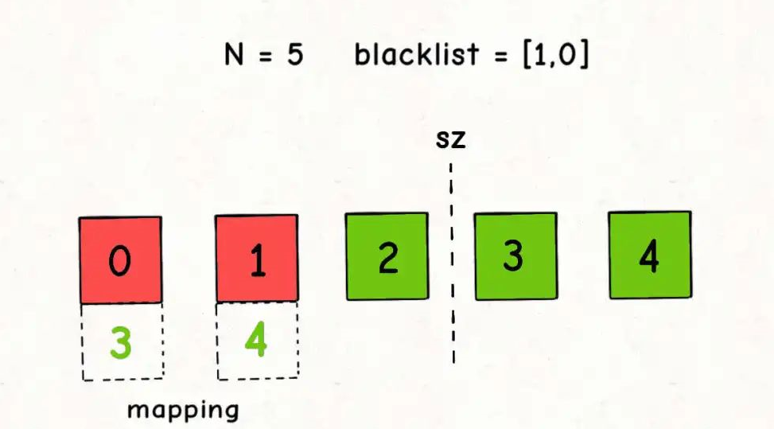

+ 黑名单内的数都在 size 两边

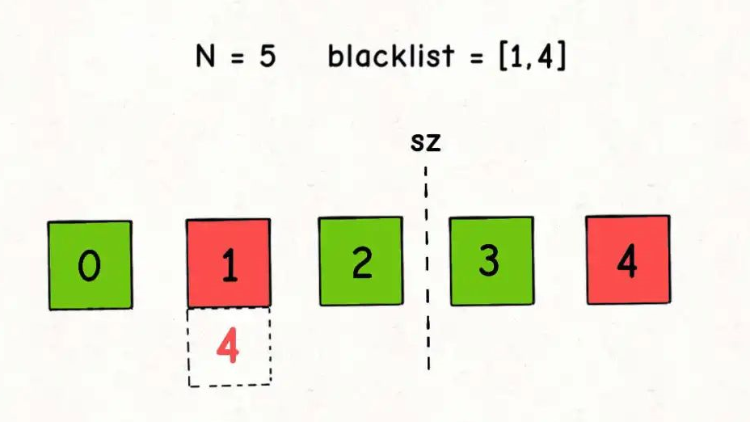

**在对`mapping[b]`赋值时，要保证`last`一定不在`blacklist`中**

### 代码实现

```java
int N;
int size;
int[] blacklist;
HashMap<Integer, Integer> mapping = new HashMap<>();
public Solution(int N, int[] blacklist) {
    this.N = N;
    this.blacklist = blacklist;
    // 需要定义一个边界，让 size 左边在黑名单的数字映射成 size 右边不在黑名单内的数字
    // 则数组分成了两边，size 左边都是不在黑名单内的，即使在，也被映射成了不在黑名单的数字
    // size 右边都是黑名单内的数字，不会在 size ~ N - 1 范围内取数字
    size = N - blacklist.length;
    // 给黑名单数初始化到 mapping 中
    for (int i : blacklist) {
        mapping.put(i, 666);
    }
    int last = N - 1;
    // 映射 blacklist 中的黑名单数
    for (int b : blacklist) {
        // 若 size 右边本身存在黑名单数，不需要重新映射
        if (b >= size) {
            continue;
        }
        // 当 last == N - 1 已经在 mapping 中了
        // 即在初始化 mapping 过程中，blacklist 中包括有 last
        // 要保证 size 右边的 last 一定是一个不在黑名单内的数
        while (mapping.containsKey(last)) {
            last--;
        }
        // 只有 b 比 size 小才需要重新映射
        mapping.put(b, last);
        last--;
    }
}

public int pick() {
    int randomNum = (int) (Math.random() * size);
    // 如果 randomNum 是在黑名单内
    if (mapping.containsKey(randomNum)) {
        return mapping.get(randomNum);
    }
    return randomNum;
}
```

### 总结核心思想

+ 如果想高效地，等概率地随机获取元素，就要使用数组作为底层容器。
+ 如果要保持数组元素的紧凑性，可以把待删除元素换到最后，然后`pop`掉末尾的元素，这样时间复杂度就是 O(1) 了。当然，我们需要额外的哈希表记录值到索引的映射。
+ 对于第二题，数组中含有「空洞」（黑名单数字），也可以利用哈希表巧妙处理映射关系，让数组在逻辑上是紧凑的，方便随机取元素。

## 去除重复字母(LeetCode[316]) && 不同字符的最小子序列(LeetCode[1081])

### 问题描述

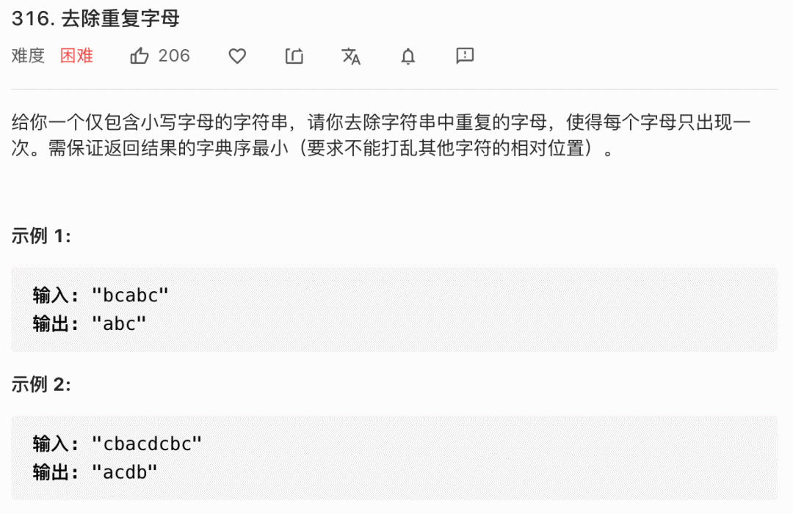

要求一、**要去重**。

要求二、去重字符串中的字符顺序**不能打乱`s`中字符出现的相对顺序**。

要求三、在所有符合上一条要求的去重字符串中，**字典序最小**的作为最终结果。

比如说输入字符串`s = "babc"`，去重且符合相对位置的字符串有两个，分别是`"bac"`和`"abc"`，但是我们的算法得返回`"abc"`，因为它的字典序更小。

### 思路

+ 保证字串中没有重复字母 --> 通过 inStack[] 数组记录 s 中的字母是否在栈 stk 中
+ 要使得获得的字串中字典序最小 --> 通过比较入栈元素和栈顶元素的大小判断是否需要弹栈
+  保证即使字典序大，但是只有唯一的一个字母，也不能进行弹栈操作 --> 维护一个 count[] 记录每个字母的次数

### 代码实现

```java
/* ①保证字串中没有重复字母 --> 通过 inStack[] 数组记录 s 中的字母是否在栈 stk 中
*  ②要使得获得的字串中字典序最小 --> 通过比较入栈元素和栈顶元素的大小判断是否需要弹栈
*  ③保证即使字典序大，但是只有唯一的一个字母，也不能进行弹栈操作 --> 维护一个 count[] 记录每个字母的次数*/
public String smallestSubsequence(String s) {
    // 定义 stk，对 s 中的元素进行入、出栈的操作
    Stack<Character> stk = new Stack<>();
    // 定义一个数组记录每个字母出现的次数
    int[] count = new int[256]; // 字母的话，存 ASCII 码，0~255够了
    for (int i = 0; i < s.length(); i++) {
        count[s.charAt(i)]++;
    }
    boolean[] inStark = new boolean[256];
    // 遍历 s 中所有字母进行 进、出栈 操作
    for (char c : s.toCharArray()) {
        // 遍历一个元素，该元素对应的次数减一
        count[c]--;

        // 若 c 已经在 inStack[] 中了，不需要再 进、出栈 了
        if (inStark[c]) continue;

        // 循环判断 stk 是否为空并且入栈元素和栈顶元素的字典序
        // 字典序由小到大，不满足的弹栈
        while (!stk.isEmpty() && stk.peek() > c) {
            // 如果此时 stk.peek() 的次数已经为 0 了，即使 stk.peek() > c，也不要 pop(stk.peek())
            if (count[stk.peek()] == 0) {
                break;
            }
            // 否则 pop 并更新 c 在 inStack 中的状态
            inStark[stk.pop()] = false;
        }
        stk.push(c);
        // 更新 c 在 inStack[] 中的状态，表示 c 在 inStack[] 中了
        inStark[c] = true;
    }
    StringBuilder sb = new StringBuilder();
    while (!stk.empty()) {
        sb.append(stk.pop());
    }
    return sb.reverse().toString();
}
```

## 有序数组去重(LeetCode[26])

### 题目描述

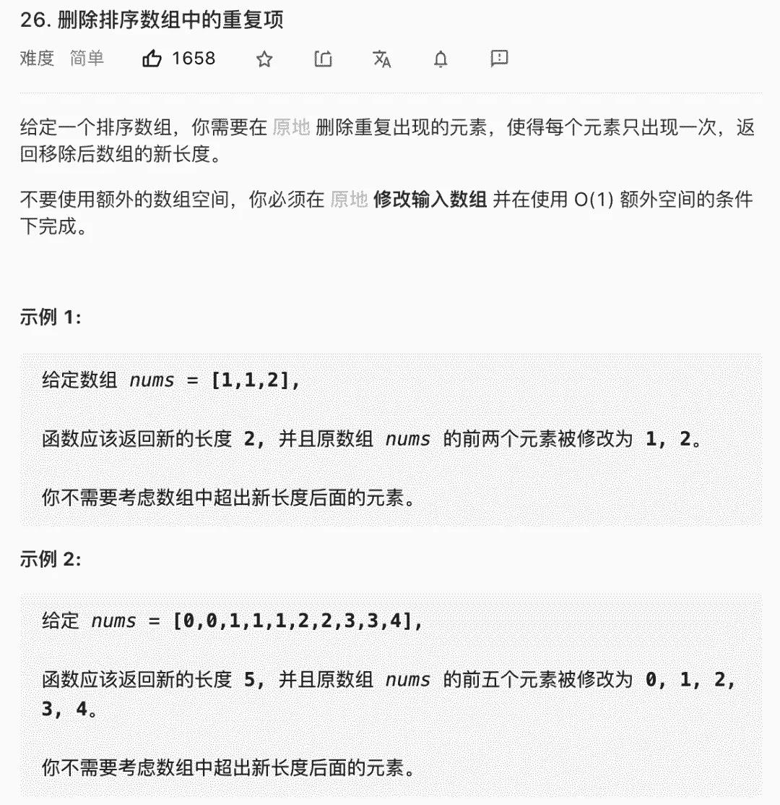

如果不是原地修改的话，我们直接 new 一个`int[]`数组，把去重之后的元素放进这个新数组中，然后返回这个新数组即可。

但是原地删除，不允许我们 new 新数组，只能在原数组上操作，然后返回一个长度，这样就可以通过返回的长度和原始数组得到我们去重后的元素有哪些了。

### 思路

**通用解法就是快慢指针技巧**。我们让慢指针`slow`走在后面，快指针`fast`走在前面探路，找到一个不重复的元素就告诉`slow`并让`slow`前进一步。这样当`fast`指针遍历完整个数组`nums`后，**`nums[0..slow]`就是不重复元素**。

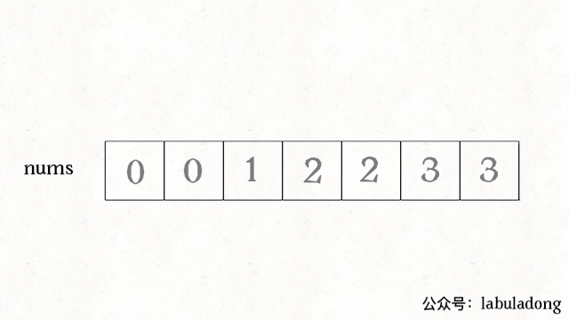

### 代码实现

```java
/* 原地删除(不增加新的存储空间)数组中的重复项 */
// 核心思想：快指针先去前面探路，没有重复项，让 slow++，并且 nums[slow] == nums[fast]
public int removeDuplicates(int[] nums) {
    if (nums.length == 0) return 0;

    // 定义快慢指针
    int slow = 0, fast = 0;
    // 遍历数组，快指针在前，满指针在后
    while (fast < nums.length) {
        // 若 nums[slow] != nums[fast]，说明 fast 前进到跟 slow 不重复的地方了
        if (nums[fast] != nums[slow]) {
            // slow 可以往前移动了，前面没有雷
            slow++;
            // 把 num[fast] 的值赋给 num[slow]
            nums[slow] = nums[fast];
        }
        fast++;
    }
    return slow + 1;
}
```

## 有序链表去重(LeetCode[83])

### 题目描述

给定一个排序链表，删除所有重复的元素，使得每个元素只出现一次。 

### 思路

同有序数组去重，唯一的区别是把数组赋值操作变成操作指针。


### 代码实现

```java
/* 原地删除(不增加新的存储空间)链表中的重复项 */
// 核心思想：快指针先去前面探路，没有重复项，让 slow++，并且 nums[slow] == nums[fast]
public ListNode deleteDuplicates(ListNode head) {
    if (head == null) return null;

    // 定义快慢指针
    ListNode slow, fast;
    slow = fast = head;
    // fast 指针去前面探雷
    while (fast != null) {
        // 刚开始快慢指针对应的值肯定是相同的，随着 fast 的前行，当快慢指针对应的值不等时
        if (fast.val != slow.val) {
            // 更新 slow 的指针信息
            slow.next = fast;
            // slow++，维持 slow 与 fast 又在同一起跑线上
            //                slow = slow.next; // slow = slow.next = fast;
            slow = fast;
        }
        // 快指针递增
        fast = fast.next;
    }
    // 遍历完成后
    slow.next = null;
    return head;
}
```

## 移除元素(LeetCode[27])

### 题目描述

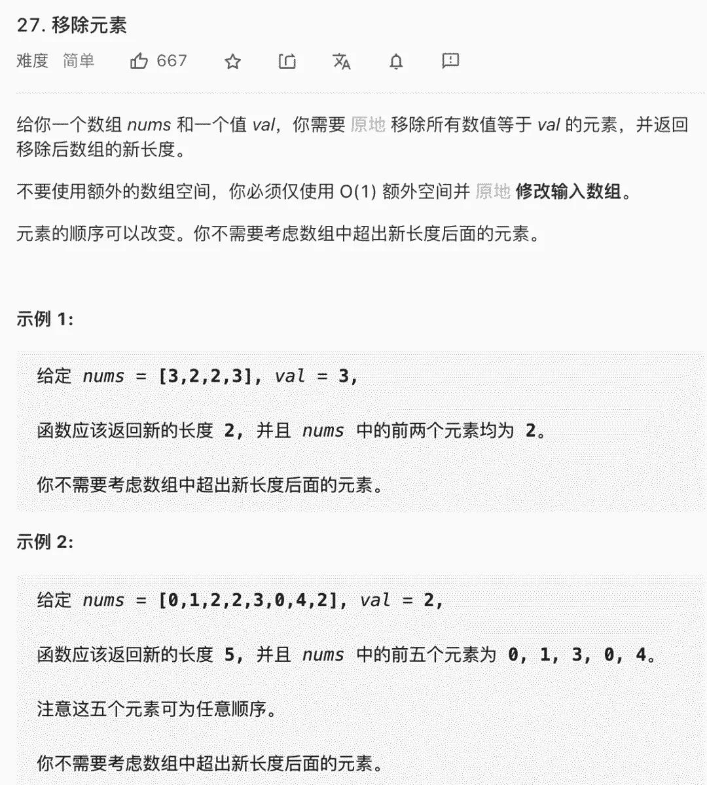

### 思路

如果`fast`遇到需要去除的元素，则直接跳过，否则就告诉`slow`指针，并让`slow`前进一步。

### 代码实现

```java
/* 原地删除数组中指定的值并返回删除元素后数组的长度 */
public int removeElement(int[] nums, int val) {
    int slow = 0, fast = 0;
    while (fast < nums.length) {
        // 若 nums[fast] == val，说明 fast 踩到雷了，别让 slow++ 了
        // 必须先判断再 fast++，因为有可能第一个元素就等于 val
        if (nums[fast] != val) {
            // 更新 slow 对应的值
            nums[slow] = nums[fast]; // 此时 slow 和 fast 都没 ++
            // 没踩到雷时，slow 前进
            slow++;
        }
        // fast 前进
        fast++;
    }
    // 因为到最后 slow 实际上比 fast 先进行 ++，所以返回 slow 即可
    return slow;
}
```

**注意这里和有序数组去重的解法有一个重要不同**，我们这里是先给`nums[slow]`赋值然后再给`slow++`，这样可以保证`nums[0..slow-1]`是不包含值为`val`的元素的，最后的结果数组长度就是`slow`。**实际上 slow++ 是先执行的**

## 移动零(LeetCode[283])

### 题目描述

给你输入一个数组`nums`，请你**原地修改**，将数组中的所有值为 0 的元素移到数组末尾。比如说给你输入`nums = [0,1,4,0,2]`，你的算法没有返回值，但是会把`nums`数组原地修改成`[1,4,2,0,0]`。

### 思路

题目让我们将所有 0 移到最后，其实就相当于移除`nums`中的所有 0，然后再把后面的元素都赋值为 0 即可。

### 代码实现

```java
public void moveZeroes(int[] nums) {
    int slow = 0, fast = 0;
    int l = nums.length;
    while (fast < l) {
        // 判断 fast 是否踩到雷(0)
        if (nums[fast] != 0) {
            nums[slow] = nums[fast];
            slow++;
        }
        fast++;
    }
    for (int index = slow; index < l; index++) {
        nums[index] = 0;
    }
}
```

# 2021.1.26记录

## 斐波那契数列(LeetCode[509]) 动态规划分析

### 题目描述

斐波那契数列的数学形式就是递归的，写成代码就是这样：

```java
/* 递归求解，时间复杂度 O(2^n) */
public int fib(int n) {
    // base case
    if (n == 1 || n == 2) return 1;

    return fib(n - 1) + fib(n - 2);
}
```

这样写代码虽然简洁易懂，但是十分低效，低效在哪里？假设 n = 20，请画出递归树。

PS：但凡遇到需要递归的问题，最好都画出递归树，这对你分析算法的复杂度，寻找算法低效的原因都有巨大帮助。

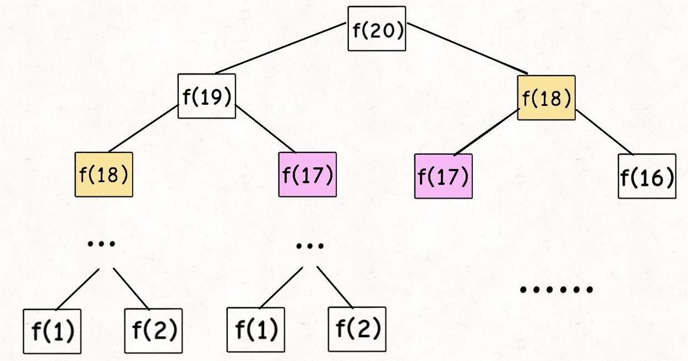

要计算原问题`f(20)`，我就得先计算出子问题`f(19)`和`f(18)`，然后要计算`f(19)`，我就要先算出子问题`f(18)`和`f(17)`，以此类推。最后遇到`f(1)`或者`f(2)`的时候，结果已知，就能直接返回结果，递归树不再向下生长了。

**递归算法的时间复杂度计算：子问题个数乘以解决一个子问题需要的时间。**

子问题个数，即递归树中节点的总数。显然二叉树节点总数为指数级别，所以子问题个数为 O(2^n)。

解决一个子问题的时间，在本算法中，没有循环，只有 f(n - 1) + f(n - 2) 一个加法操作，时间为 O(1)。

所以，这个算法的时间复杂度为 O(2^n)，指数级别，爆炸。

### 思路

观察递归树，很明显发现了算法低效的原因：存在大量重复计算，比如`f(18)`被计算了两次，而且你可以看到，以`f(18)`为根的这个递归树体量巨大，多算一遍，会耗费巨大的时间。更何况，还不止`f(18)`这一个节点被重复计算，所以这个算法及其低效。

这就是动态规划问题的第一个性质：**重叠子问题**。

+ **带备忘录的递归解法**

  耗时的原因是重复计算，那么我们可以造一个「备忘录」，每次算出某个子问题的答案后别急着返回，先记到「备忘录」里再返回；每次遇到一个子问题先去「备忘录」里查一查，如果发现之前已经解决过这个问题了，直接把答案拿出来用，不要再耗时去计算了。

  画出递归树，你就知道「备忘录」到底做了什么：

  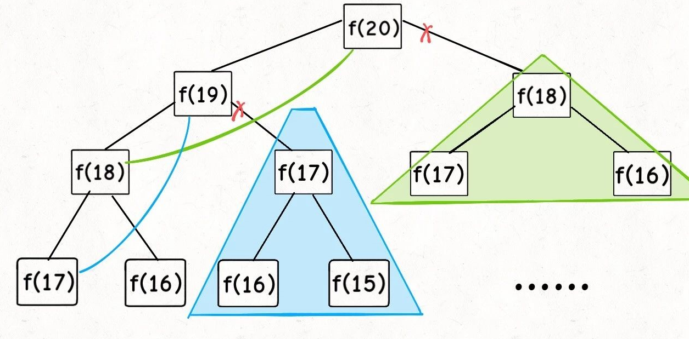

  实际上，带「备忘录」的递归算法，把一棵存在巨量冗余的递归树通过「剪枝」，改造成了一幅不存在冗余的递归图，极大减少了子问题（即递归图中节点）的个数。

  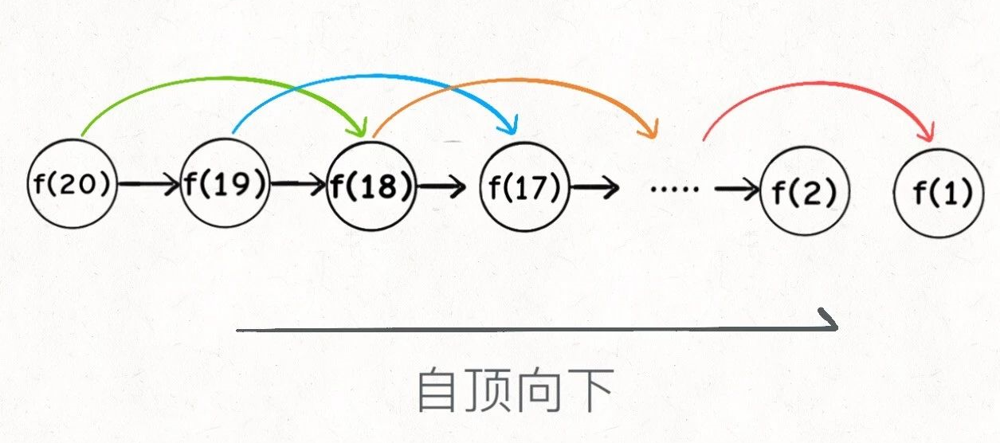

  由于本算法不存在冗余计算，子问题就是`f(1)`,`f(2)`,`f(3)`…`f(20)`，数量和输入规模 n = 20 成正比，所以子问题个数为 O(n)。

+ **dp 数组的迭代解法**

  有了上一步「备忘录」的启发，我们可以把这个「备忘录」独立出来成为一张表，就叫做 DP table 吧

  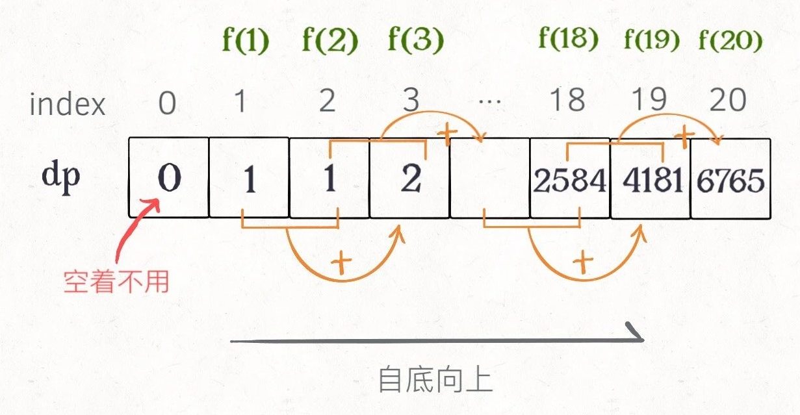

  画个图就很好理解了，而且你发现这个 DP table 特别像之前那个「剪枝」后的结果，只是反过来算而已。实际上，带备忘录的递归解法中的「备忘录」，最终完成后就是这个 DP table，所以说这两种解法其实是差不多的，大部分情况下，效率也基本相同。

### 「自顶向下」 和 「自底向上」思想

+ 「自顶向下」：画的递归树（或者说图），是从上向下延伸，都是从一个规模较大的原问题比如说`f(20)`，向下逐渐分解规模，直到`f(1)`和`f(2)`触底，然后逐层返回答案，这就叫「自顶向下」。
+ 「自底向上」：反过来，我们直接从最底下，最简单，问题规模最小的`f(1)`和`f(2)`开始往上推，直到推到我们想要的答案`f(20)`，这就是动态规划的思路，这也是为什么动态规划一般都脱离了递归，而是由循环迭代完成计算。

### 状态转移方程

这里，引出「状态转移方程」这个名词，实际上就是描述问题结构的数学形式：


把 f(n) 想做一个状态 n，这个状态 n 是由状态 n - 1 和状态 n - 2 相加转移而来，这就叫状态转移，仅此而已。

上面的几种解法中的所有操作，例如 return f(n - 1) + f(n - 2)，dp[i] = dp[i - 1] + dp[i - 2]，以及对备忘录或 DP table 的初始化操作，都是围绕这个方程式的不同表现形式。可见列出「状态转移方程」的重要性，它是解决问题的核心。很容易发现，**其实状态转移方程直接代表着暴力解法。**

**千万不要看不起暴力解，动态规划问题最困难的就是写出状态转移方程**，即这个暴力解。优化方法无非是用备忘录或者 DP table，再无奥妙可言。

### 代码实现

```java
/* 构建备忘录进行计算，O(N) */
public int fib(int n) {
    if (n < 1) return 0;
    // 创建一个数组(备忘录)记录每个节点的计算结果，防止冗余计算
    ArrayList<Integer> memo = new ArrayList<>(Collections.nCopies(n + 1, 0));
    // 初始化 memo 全设置为 0
    return helper(memo, n);
}

private int helper(ArrayList<Integer> memo, int n) {
    // base case
    if (n == 1 || n == 2) return 1;
    // 如果已经计算过 n 节点的值，直接调用 memo[n]
    if (memo.get(n) != 0) return memo.get(n);
    // 不断计算 memo[n] 的值
    memo.set(n, helper(memo, n -1) + helper(memo, n - 2));
    return memo.get(n);
}

/* 根据 DP 表和状态方程解决 */
public int fib(int n) {
    if (n < 1) return 0;
    if (n == 1 || n == 2) return 1;
    // 以数组形式创建 DP 表
    ArrayList<Integer> DP = new ArrayList<>(Collections.nCopies(n + 1, 0));
    // base case
    DP.set(1, 1); DP.set(2, 1);
    for (int i = 3; i <= n; i++) {
        DP.set(i, DP.get(i - 1) + DP.get(i - 2));
    }
    return DP.get(n);
}

/* 根据状态方程解决 --> 优化：只需要每次维护 DP[n - 1] 和 DP[n - 2] 即可 O(1)*/
public int fib(int n) {
    if (n < 1) return 0;
    if (n == 1 || n == 2) return 1;
    // base case
    int prev = 1, curr = 1;
    for (int i = 3; i <= n; i++) {
        int sum = prev + curr;
        // 更新 prev(DP[n - 1]) 和 curr(DP[n - 2])
        prev = curr; // 新的 prev 是以前的 curr
        curr = sum; // 新的 curr 就是以前的 sum
    }
    return curr;
}
```

有人会问，动态规划的另一个重要特性「最优子结构」，怎么没有涉及？下面会涉及。斐波那契数列的例子严格来说不算动态规划，因为没有涉及求最值，以上旨在演示算法设计螺旋上升的过程。

## 零钱兑换(LeetCode[322])

### 题目描述

给你`k`种面值的硬币，面值分别为`c1, c2 ... ck`，每种硬币的数量无限，再给一个总金额`amount`，问你**最少**需要几枚硬币凑出这个金额，如果不可能凑出，算法返回 -1 。

比如说`k = 3`，面值分别为 1，2，5，总金额`amount = 11`。那么最少需要 3 枚硬币凑出，即 11 = 5 + 5 + 1。

### 思路

首先，这个问题是动态规划问题，因为它具有「最优子结构」。**要符合「最优子结构」，子问题间必须互相独立**。

比如说，你的原问题是考出最高的总成绩，那么你的子问题就是要把语文考到最高，数学考到最高…… 为了每门课考到最高，你要把每门课相应的选择题分数拿到最高，填空题分数拿到最高…… 当然，最终就是你每门课都是满分，这就是最高的总成绩。

得到了正确的结果：最高的总成绩就是总分。因为这个过程符合最优子结构，“每门科目考到最高”这些子问题是互相独立，互不干扰的。

但是，如果加一个条件：你的语文成绩和数学成绩会互相制约，此消彼长。这样的话，显然你能考到的最高总成绩就达不到总分了，按刚才那个思路就会得到错误的结果。因为子问题并不独立，语文数学成绩无法同时最优，所以最优子结构被破坏。

回到凑零钱问题，为什么说它符合最优子结构呢？比如你想求`amount = 11`时的最少硬币数（原问题），如果你知道凑出`amount = 10`的最少硬币数（子问题），你只需要把子问题的答案加一（再选一枚面值为 1 的硬币）就是原问题的答案，因为硬币的数量是没有限制的，子问题之间没有相互制，是互相独立的。

+ **暴力递归解法**

  + 明确递归解法中的变量：唯一会变的就是 amount
  + 明确递归函数的定义：int dp(int[] coins, int amount) 表示输入金额 amount，返回最小的组合数
  + 子问题：对于每个金额 amount，其子问题可以表示 dp(int[] coins, int amount - coin)，子问题 + 1就是原问题的答案，然后自顶向下不断分解，再触底反弹。
  + base case：显然目标金额为 0 时，所需硬币数量为 0；当目标金额小于 0 时，无解，返回 -1。

  比如`amount = 11, coins = {1,2,5}`时画出递归树

  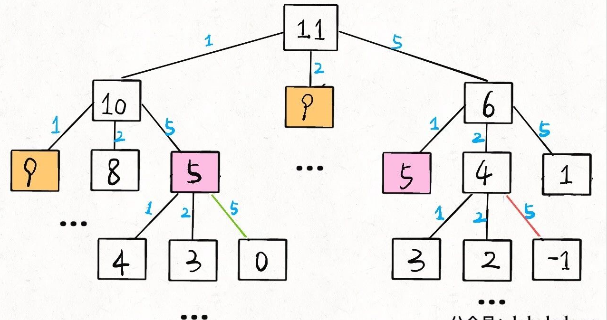

  子问题总数为递归树节点个数，这个比较难看出来，是 O(k^n)，总之是指数级别的。每个子问题中含有一个 for 循环，复杂度为 O(k)。所以总时间复杂度为 O(k * k^n)，指数级别。

+ **带备忘录的递归**

  考虑如何通过备忘录消除重复子问题。

  很显然「备忘录」大大减小了子问题数目，完全消除了子问题的冗余，所以子问题总数不会超过金额数 n，即子问题数目为 O(n)。处理一个子问题的时间不变，仍是 O(k)，所以总的时间复杂度是 O(kn)。

+ **dp 数组的迭代解法**

  既然知道了这是个动态规划问题，就要思考**如何列出正确的状态转移方程**。

  + **先确定「状态」**：也就是原问题和子问题中变化的变量。由于硬币数量无限，所以唯一的状态就是目标金额`amount`。
  + **然后确定`dp`函数的定义**：函数 dp(n)表示，当前的目标金额是`n`，至少需要`dp(n)`个硬币凑出该金额。
  + **然后确定「选择」并择优**，也就是对于每个状态，可以做出什么选择改变当前状态。具体到这个问题，无论当的目标金额是多少，选择就是从面额列表`coins`中选择一个硬币，然后目标金额就会减少。
  + **最后明确 base case**，显然目标金额为 0 时，所需硬币数量为 0；当目标金额小于 0 时，无解，返回 -1。

  至此，状态转移方程其实已经完成了，以上算法已经是暴力解法了，以上代码的数学形式就是状态转移方程

  

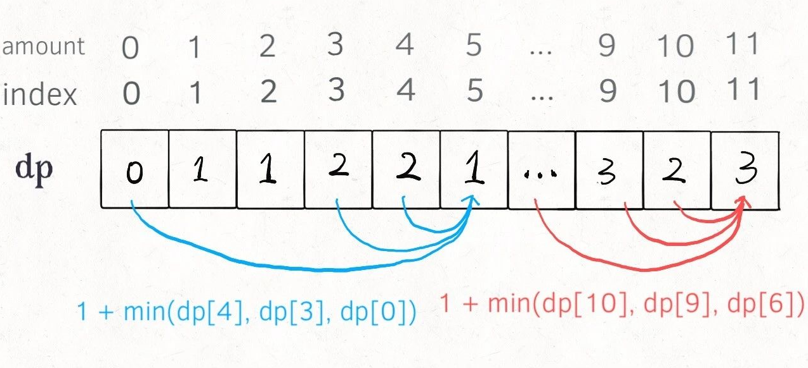

为啥`dp`数组初始化为`amount + 1`呢，因为凑成`amount`金额的硬币数最多只可能等于`amount`（全用 1 元面值的硬币），所以初始化为`amount + 1`就相当于初始化为正无穷，便于后续取最小值。

### 代码实现

```java
/* 暴力解法 */
public int coinChange(int[] coins, int amount) {
    return dp(coins, amount);
}
private int dp(int[] coins, int amount) {
    if (amount < 0) return -1;
    // base case：当 amount 为 0 时返回 0；
    if (amount == 0) return 0;
    // 求所需组合的最小值，初始化 res 为最大值
    int res = Integer.MAX_VALUE;
    // 暴力求解
    for (int coin : coins) {
        // 如果 subProblem == -1，表示无解，不用再比较最小值
        int subProblem = coinChange(coins, amount - coin);
        if (subProblem == -1) continue;
        res = Math.min(res, 1 + subProblem);
    }
    return res;
}

/* 利用备忘录简化时间复杂度 */
public int coinChange(int[] coins, int amount) {
    // 创建备忘录
    int[] memo = new int[amount + 1];
    return dp(memo, coins, amount);
}
/* 函数定义： 计算 amount 金额时需要的最小数量的零钱组合并将结果记录在 memo 中*/
private int dp(int[] memo, int[] coins, int amount) {
    if (amount < 0) return -1;
    // base case：当 amount 为 0 时返回 0；
    if (amount == 0) return 0;
    // 求所需组合的最小值，初始化 res 为最大值
    int res = Integer.MAX_VALUE;
    // 如果备忘录里已经记下了 amount 的计算结果，直接返回
    if (memo[amount] != 0) return memo[amount];

    for (int coin : coins) {
        // 如果 subProblem == -1，表示无解，不用再比较最小值
        int subProblem = dp(memo, coins, amount - coin);
        if (subProblem == -1) continue;
        res = Math.min(res, 1 + subProblem);
    }
    if (res != Integer.MAX_VALUE) {
        memo[amount] = res;
    } else memo[amount] = -1;

    return memo[amount];
}

/* dp 数组的迭代解法 */
public int coinChange(int[] coins, int amount) {
    // 创建 dp 数组
    ArrayList<Integer> dp = new ArrayList<>(Collections.nCopies(amount + 1, amount + 1));
    dp.set(0, 0);
    // 自底向上求 dp 表
    for (int i = 0; i < dp.size(); i++) {
        // 从 0 开始，向上求 dp[1]、dp[2]...
        for (int coin : coins) {
            // 如果 dp[i - coin < 0]，负数金额不存在的，直接跳过
            if (i - coin < 0) continue;
            dp.set(i, Math.min(dp.get(i), 1 + dp.get(i - coin)));
        }
    }
    return dp.get(amount) == amount + 1 ? -1 : dp.get(amount);
}
```

### 总结

第一个斐波那契数列的问题，解释了如何通过「备忘录」或者「dp table」的方法来优化递归树，并且明确了这两种方法本质上是一样的，只是自顶向下和自底向上的不同而已。

第二个凑零钱的问题，展示了如何流程化确定「状态转移方程」，只要通过状态转移方程写出暴力递归解，剩下的也就是优化递归树，消除重叠子问题而已。

**计算机解决问题其实没有任何奇技淫巧，它唯一的解决办法就是穷举**，穷举所有可能性。算法设计无非就是先思考“如何穷举”，然后再追求“如何聪明地穷举”。

列出动态转移方程，就是在解决“如何穷举”的问题。之所以说它难，一是因为很多穷举需要递归实现，二是因为有的问题本身的解空间复杂，不那么容易穷举完整。

备忘录、DP table 就是在追求“如何聪明地穷举”。用**空间换时间的**思路，是降低时间复杂度的不二法门。

# 2021.1.27记录

## 最优子结构详解

「最优子结构」是某些问题的一种特定性质，并不是动态规划问题专有的。也就是说，很多问题其实都具有最优子结构，只是其中大部分不具有重叠子问题，所以我们不把它们归为动态规划系列问题而已。

**例子1：**假设你们学校有 10 个班，你已经计算出了每个班的最高考试成绩。那么现在我要求你计算全校最高的成绩，你会不会算？当然会，而且你不用重新遍历全校学生的分数进行比较，而是只要在这 10 个最高成绩中取最大的就是全校的最高成绩。

我给你提出的这个问题就**符合最优子结构**：可以从子问题的最优结果推出更大规模问题的最优结果。让你算**每个班**的最优成绩就是子问题，你知道所有子问题的答案后，就可以借此推出**全校**学生的最优成绩这个规模更大的问题的答案。

这么简单的问题都有最优子结构性质，只是因为显然没有重叠子问题，所以我们简单地求最值肯定用不出动态规划。

**例子2：**假设你们学校有 10 个班，你已知每个班的最大分数差（最高分和最低分的差值）。那么现在我让你计算全校学生中的最大分数差，你会不会算？可以想办法算，但是肯定不能通过已知的这 10 个班的最大分数差推到出来。因为这 10 个班的最大分数差不一定就包含全校学生的最大分数差，比如全校的最大分数差可能是 3 班的最高分和 6 班的最低分之差。

这次我给你提出的问题就**不符合最优子结构**，因为你没办通过每个班的最优值推出全校的最优值，没办法通过子问题的最优值推出规模更大的问题的最优值。想满足最优子结，子问题之间必须互相独立。全校的最大分数差可能出现在两个班之间，显然子问题不独立，所以这个问题本身不符合最优子结构。

**遇到这种最优子结构失效情况，怎么办？策略是：改造问题**。

改造问题，也就是把问题等价转化：最大分数差，不就等价于最高分数和最低分数的差么，**那不就是要求最高和最低分数么**，不就是我们讨论的第一个问题么，不就具有最优子结构了么？那现在改变思路，借助最优子结构解决**最值**问题，再回过头解决最大分数差问题，是不是就高效多了？

### 鸡蛋掉落(LeetCode[887])

#### 题目描述

若干层楼，若干个鸡蛋，让你算出最少的尝试次数，找到鸡蛋恰好摔不碎的那层楼。

你面前有一栋从 1 到`N`共`N`层的楼，然后给你`K`个鸡蛋（`K`至少为 1）。现在确定这栋楼存在楼层`0 <= F <= N`，在这层楼将鸡蛋扔下去，鸡蛋**恰好没摔碎**（高于`F`的楼层都会碎，低于`F`的楼层都不会碎）。现在问你，**最坏**情况下，你**至少**要扔几次鸡蛋，才能**确定**这个楼层`F`呢？

PS：F 可以为 0，比如说鸡蛋在 1 层都能摔碎，那么 F = 0。

#### 思路1

也就是让你找摔不碎鸡蛋的最高楼层`F`，但什么叫「最坏情况」下「至少」要扔几次呢？

最原始的方式就是线性扫描：我先在 1 楼扔一下，没碎，我再去 2 楼扔一下，没碎，我再去 3 楼……

以这种策略，**最坏**情况应该就是我试到第 7 层鸡蛋也没碎（`F = 7`），也就是我扔了 7 次鸡蛋。

**鸡蛋破碎一定发生在搜索区间穷尽时**，不会说你在第 1 层摔一下鸡蛋就碎了，这是你运气好，不是最坏情况。

对动态规划问题，直接套框架即可：这个问题有什么「状态」，有什么「选择」，然后穷举。

**「状态」很明显，就是当前拥有的鸡蛋数`K`和需要测试的楼层数`N`**。随着测试的进行，鸡蛋个数可能减少，楼层的搜索范围会减小，这就是状态的变化。

**「选择」其实就是去选择哪层楼扔鸡蛋**。

现在明确了「状态」和「选择」，**动态规划的基本思路就形成了**：肯定是个二维的`dp`数组或者带有两个状态参数的`dp`函数来表示状态转移；外加一个 for 循环来遍历所有选择，择最优的选择更新结果 。

我们在第`i`层楼扔了鸡蛋之后，可能出现两种情况：鸡蛋碎了，鸡蛋没碎。**注意，这时候状态转移就来了**：

**如果鸡蛋碎了**，那么鸡蛋的个数`K`应该减一，搜索的楼层区间应该从`[1..N]`变为`[1..i-1]`共`i-1`层楼；

**如果鸡蛋碎了**，那么鸡蛋的个数`K`应该减一，搜索的楼层区间应该从`[1..N]`变为`[1..i-1]`共`i-1`层楼；


因为我们要求的是**最坏情况**下扔鸡蛋的次数，所以鸡蛋在第`i`层楼碎没碎，取决于那种情况的结果**更大**：

```c++
def dp(K, N):
    for 1 <= i <= N:
        # 最坏情况下的最少扔鸡蛋次数
        res = min(res, 
                  max( 
                        dp(K - 1, i - 1), # 碎
                        dp(K, N - i)      # 没碎
                     ) + 1 # 在第 i 楼扔了一次
                 )
    return res
```

递归的 base case 很容易理解：当楼层数`N`等于 0 时，显然不需要扔鸡蛋；当鸡蛋数`K`为 1 时，显然只能线性扫描所有楼层：

```c++
def dp(K, N):
    if K == 1: return N
    if N == 0: return 0
    ...
```

#### 状态转移方程

「状态」很明显，就是当前拥有的鸡蛋数`K`和需要测试的楼层数`N`，**要通过这两个状态的变化不断求最坏情况下确定楼层的最小次数 `m`。**即：

```java
dp[K][N]-->不断变化-->得出-->m
```

因为最终需要的结果是所有最坏情况的最小尝试次数 `m`。

**dp[K] [N]：**表示当鸡蛋个数为 K，给定楼层为 N 的情况下给我确定最坏情况下的最小尝试次数。

分解找到子问题：楼层从 `i == 0 ~ i == N` 不断变化

**dp[K] [N - i]：** 表示尝试了一次后，鸡蛋没破，所以锁定 `i` 楼层以上的层数 `N - i` 层继续尝试得到此时的最坏情况的最小尝试次数。

**dp[K - 1] [i - 1]：** 表示尝试了一次后，鸡蛋破了，所以锁定 `i` 楼层以下的层数 `i - 1` 层继续尝试得到此时的最坏情况的最小尝试次数。

**因为要求 `dp[K][N] = min{m1, m2, ...} mi表示子问题中的最坏情况下的最小尝试次数`。 我们发现 `dp[K][N]`的子问题有两种情况，但这两种情况都要取吗(也就是 subProblem1 && subProblem2)？**

**答案是：不！！！**

我们只要子问题在最坏情况下的所得到的尝试次数 `mi`，所以得到的状态转移方程为：

```java
dp[K][N] = max{dp[K][N - i], dp[K - 1][i - 1] + 1}
// 因为在 i 楼尝试过一次，所以要 + 1
```

**两个子问题是 `or` 的关系，我们只要最坏情况下得到的尝试次数。**

而这种情况就不好用递推公式自底向上一层层递推了，所以即使用备忘录对递归树剪枝，得到的时间复杂度也是不够低的。

#### 代码实现1(带备忘录的递归求解)

```java
/* 动态规划：根据鸡蛋个数和楼层数求最坏情况下最少需要扔几次鸡蛋能确定楼层 F，F 从 0 开始计数 */
public int superEggDrop(int K, int N) {
// 增加备忘录解法
HashMap<String, Integer> memo = new HashMap<>();
return dp(memo, K, N);
}
private int dp(HashMap<String, Integer> memo, int K, int N) {
// base case1：当鸡蛋 K == 1 了，最坏情况下要扔 N(楼层数) 才能确定 F
// base case2：当楼层数 F == 0，不需要扔即可确定 F == 0
if (K == 1) return N;
if (N == 0) return 0;

// 如果备忘录里有结果，直接返回
if (memo.containsKey(K + "&" + N)) return memo.get(K + "&" + N);

// 定义结果 res
int res = Integer.MAX_VALUE;

// 原问题：拿着 K 个鸡蛋从 F 层高的楼扔
// 子问题：min{ max(
// ①当鸡蛋在第 i 层碎了，鸡蛋个数减一，第 i 层以上的楼层不用再试了：dp(K - 1, 1 ~ i - 1)
// ②当鸡蛋仔第 i 层没碎，鸡蛋个数不变，第 i 层以下的楼层不用再试了：dp(K, i + 1 ~ N)
// ) } + 1
// 最后 + 1 表示在第 i 层做的一次尝试，要加上
for (int i = 1; i <= N; i++) {
// 递归分解子问题求解
int subProblem = Math.max(dp(memo, K - 1, i - 1), dp(memo, K, N - i)) + 1;
res = Math.min(res, subProblem);
}
// 备忘录增加结果
memo.put(K + "&" + N, res);
return res;
}
```

这个算法的时间复杂度是多少呢？**动态规划算法的时间复杂度就是子问题个数 × 函数本身的复杂度**。

函数本身的复杂度就是忽略递归部分的复杂度，这里`dp`函数中有一个 for 循环，所以函数本身的复杂度是 O(N)。

子问题个数也就是不同状态组合的总数，显然是两个状态的乘积，也就是 O(KN)。

所以算法的总时间复杂度是 **O(K*N^2)**, 空间复杂度为子问题个数，即 **O(KN)**。

### 思路2

思路 1 中我们只要**确定当前的鸡蛋个数和面对的楼层数，就知道最小扔鸡蛋次数**。最终我们想要的答案就是`dp(K, N)`的结果。

换个思路我们可以得到：

**确定当前的鸡蛋个数和最多允许的扔鸡蛋次数，就知道能够确定`F`的最高楼层数**。

```java
dp[k][m] = n
# 当前有 k 个鸡蛋，可以尝试扔 m 次鸡蛋
# 这个状态下，最坏情况下最多能确切测试一栋 n 层的楼

# 比如说 dp[1][7] = 7 表示：
# 现在有 1 个鸡蛋，允许你扔 7 次;
# 这个状态下最多给你 7 层楼，
# 使得你可以确定楼层 F 使得鸡蛋恰好摔不碎
# （一层一层线性探查嘛）
```

我们最终要求的其实是扔鸡蛋次数`m`，但是这时候`m`在状态之中而不是`dp`数组的结果。

我们只需要考虑：

**1、无论你在哪层楼扔鸡蛋，鸡蛋只可能摔碎或者没摔碎，碎了的话就测楼下，没碎的话就测楼上**。

**2、无论你上楼还是下楼，总的楼层数 = 楼上的楼层数 + 楼下的楼层数 + 1（当前这层楼）**。

#### 状态转移方程

现在「状态」变成了**当鸡蛋个数 `K` 和尝试次数 `m` 不断变化时，求最多能确切测试一栋 `N` 层的楼。**

**dp[K] [m]：**表示当鸡蛋个数为 K，给定尝试次数为 `m` 的情况下最多测试 `dp[K][m]` 层高的楼。

分解找到子问题：当我从第 i 层扔下鸡蛋

**dp[K] [m - 1]：** 表示尝试了一次后，鸡蛋没破，所以锁定 `i` 楼层以上的楼层继续尝试，但此时我只有 `m - 1` 次机会，然后得到最大的能测的楼层数为 `dp[K][m - 1]`。

**dp[K - 1] [m - 1]：** 表示尝试了一次后，鸡蛋破了，所以锁定 `i` 楼层以下的楼层继续尝试，但此时我只有 `m - 1` 次机会，然后得到最大的能测的楼层数为 `dp[K - 1][m - 1]`。

分析可知：`dp[K][m]` 总问题表示在给定鸡蛋数量和最大尝试次数求得的最大能测的楼层 `N`。

**dp[K] [m - 1] (子问题1)：**能测出鸡蛋**没碎**的时候，给我 `m - 1` 次机会 (本来第一次就消耗了一次机会，这里肯定是 `m - 1` 对不对？) ，我再跑到**第 i 层楼 (第一次扔鸡蛋的楼层) 楼上**扔鸡蛋，得到的最大能测的楼层数 `N1`。

**dp[K -  1] [m - 1] (子问题2)：**能测出鸡蛋**碎了**的时候，给我 `m - 1` 次机会 (本来第一次就消耗了一次机会，这里肯定是 `m - 1` 对不对？) ，我再跑到**第 i 层楼 (第一次扔鸡蛋的楼层) 楼下**扔鸡蛋，得到的最大能测的楼层数 `N2`。

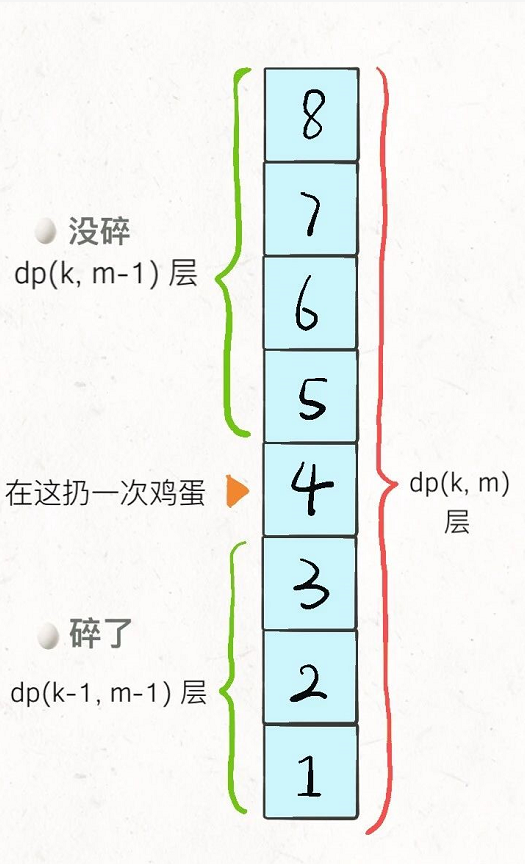

所以，得到的状态转移方程为：

```java
dp[K][m] = dp[K][m - 1] + dp[K - 1][m - 1] + 1;
// 因为在 i 楼尝试过一次，所以要 + 1
```

显而易见，**这次我们要得出总问题的答案，需要把两个子问题分别得出的楼层进行相加才行！！(也就是 and 的关系)。**

#### 代码实现2(逻辑转换 + dp数组)

```java
/* 动态规划：根据鸡蛋个数和楼层数求最坏情况下最少需要扔几次鸡蛋能确定楼层 F，F 从 0 开始计数 */
public int superEggDrop(int K, int N) {
    // 思维改变 + 二维数组
    int[][] dp = new int[K + 1][N + 1]; // 因为楼层从 0 ~ N
    // base case:
    // dp[0][..] = 0
    // dp[..][0] = 0
    // Java 默认初始化数组都为 0
    int m = 0;
    // 换思路：dp[K][m] = N
    while (dp[K][m] < N) { // 结束条件：当 m = N 时
        m++;
        for (int k = 1; k <= K; k++) {
            // 状态转移方程
            dp[k][m] = dp[k][m - 1] + dp[k - 1][m - 1] + 1;
        }
    }
    // while 循环也可以写成：
    //        for (int m = i; dp[K][m] < N; m++) {
    //            for (int k = 1; k <= K; k++) {
    //                // 状态转移方程
    //                dp[k][m] = dp[k][m - 1] + dp[k - 1][m - 1] + 1;
    //            }
    //        }
    return m;
}
```

优化后的算法时间复杂度为：**O(K*N*logN)**

最优子结构并不是动态规划独有的一种性质，能求最值的问题大部分都具有这个性质；**但反过来，最优子结构性质作为动态规划问题的必要条件，一定是让你求最值的**，以后碰到那种恶心人的最值题，思路往动态规划想就对了，这就是套路。

动态规划不就是从最简单的 base case 往后推导吗，可以想象成一个链式反应，不断以小博大。但只有符合最优子结构的问题，才有发生这种链式反应的性质。

找最优子结构的过程，其实就是证明状态转移方程正确性的过程，方程符合最优子结构就可以写暴力解了，写出暴力解就可以看出有没有重叠子问题了，有则优化，无则 OK。这也是套路。

# 2021.1.28记录(子序列问题模板)

## 最长递增子序列(LeetCode[300])

子序列问题的套路，**其实就有两种模板，相关问题只要往这两种思路上想，十拿九稳。**

一般来说，这类问题都是让你求一个**最长**子序列，因为最短子序列就是一个字符嘛，没啥可问的。一旦涉及到子序列和最值，那几乎可以肯定，**考察的是动态规划技巧，时间复杂度一般都是 O(n^2)**。

既然要用动态规划，那就要定义 dp 数组，找状态转移关系。我们说的两种思路模板，就是 dp 数组的定义思路。不同的问题可能需要不同的 dp 数组定义来解决。

**1、第一种思路模板是一个一维的 dp 数组**：

```java
int n = array.length;
int[] dp = new int[n];

for (int i = 1; i < n; i++) {
    for (int j = 0; j < i; j++) {
        dp[i] = 最值(dp[i], dp[j] + ...)
    }
}
```

### 题目描述

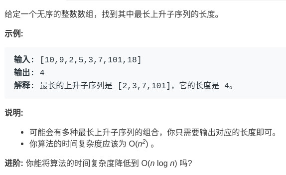

### 思路1(动态规划：O(n^2))

**动态规划的核心设计思想是数学归纳法。**

比如我们想证明一个数学结论，那么我们先假设这个结论在 k<n 时成立，然后想办法证明 k=*n* 的时候此结论也成立。如果能够证明出来，那么就说明这个结论对于 k 等于任何数都成立。

类似的，我们设计动态规划算法，不是需要一个 dp 数组吗？我们可以假设 *d**p*[0...*i*−1] 都已经被算出来了，然后问自己：怎么通过这些结果算出*dp[i] ?*

**首先要定义清楚 dp 数组的含义，即 dp[i] 的值到底代表着什么？**

**我们的定义是这样的：**dp[i] 表示以 nums[i] 这个数结尾的最长递增子序列的长度。

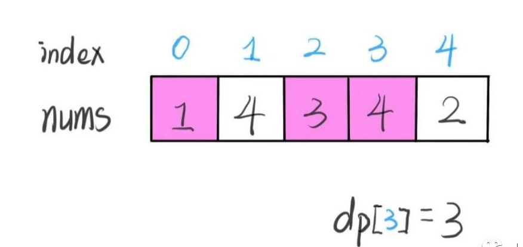

算法演进的过程是这样的：


根据这个定义，我们的最终结果（子序列的最大长度）应该是 dp 数组中的最大值。

动态规划的重头戏了，要思考如何进行状态转移，这里就可以使用数学归纳的思想：

我们已经知道了 *dp*[0...4] 的所有结果，我们如何通过这些已知结果推出 *dp*[5] 呢？

根据刚才我们对 dp 数组的定义，现在想求 dp[5] 的值，也就是想求以 nums[5] 为结尾的最长递增子序列。

**nums[5] = 3，既然是递增子序列，我们只要找到前面那些结尾比 3 小的子序列，然后把 3 接到最后，就可以形成一个新的递增子序列，而且这个新的子序列长度加一。**

当然，可能形成很多种新的子序列，但是我们只要最长的，把最长子序列的长度作为 dp[5] 的值即可。

### 代码实现1(动态规划)

```java
// 动态规划解法：O(n^2)
public int lengthOfLIS(int[] nums) {
    // dp[] 数组定义：假设 nums = [1,2,3,7,5]
    // dp[1] = 1; dp[2] = 2; ... dp[5] = 4
    // dp[i] 表示以 nums[i] 这个数结尾的最长递增子序列的长度。
    int[] dp = new int[nums.length];
    // 因为最小的递增子序列为 1，所以 dp[] 初始化都为 1
    Arrays.fill(dp, 1);
    // 计算 i = 0 开始每一个 dp[i] 的值
    for (int i = 0; i < nums.length; i++) {
        // 相当于数学归纳法中，先知道了 dp[i -  1]，求 dp[i]
        for (int j = 0; j < i; j++) {
            // 求解 dp[i]，只要知道 nums[i] > nums[j]
            // dp[j] 的值 + 1，并且在所有的 dp[j] 中取最大的作为 dp[i] 的值
            if (nums[i] > nums[j]) {
                dp[i] = Math.max(dp[i], dp[j] + 1);
            }
        }
    }
    // 因为 dp[] 返回 nums[] 数组每个元素对应的最长递增序列的长度
    // 所以在 dp[] 数组中挑出最大值作为输出
    int max_res = 0;
    for (int i = 0; i < dp.length; i++) {
        max_res = Math.max(max_res, dp[i]);
    }
    return max_res;
}
```

### 动态规划的设计流程

+ 首先明确 dp 数组所存数据的含义。这步很重要，如果不得当或者不够清晰，会阻碍之后的步骤。
+ 然后根据 dp 数组的定义，运用数学归纳法的思想，假设 *dp*[0...*i*−1] 都已知，想办法求出 *dp*[*i*]，一旦这一步完成，整个题目基本就解决了。
+ 但如果无法完成这一步，很可能就是 dp 数组的定义不够恰当，需要重新定义 dp 数组的含义；或者可能是 dp 数组存储的信息还不够，不足以推出下一步的答案，需要把 dp 数组扩大成二维数组甚至三维数组。

### 思路2(二分查找解法：O(NlogN))

其实最长递增子序列和一种叫做 patience game 的纸牌游戏有关，甚至有一种排序方法就叫做 patience sorting（耐心排序）。

首先，给你一排扑克牌，我们像遍历数组那样从左到右一张一张处理这些扑克牌，最终要把这些牌分成若干堆。

处理这些扑克牌要遵循以下规则：

**只能把点数小的牌压到点数比它大的牌上。如果当前牌点数较大没有可以放置的堆，则新建一个堆，把这张牌放进去。如果当前牌有多个堆可供选择，则选择最左边的堆放置。**

比如说上述的扑克牌最终会被分成这样 5 堆（我们认为 A 的值是最大的，而不是 1）。

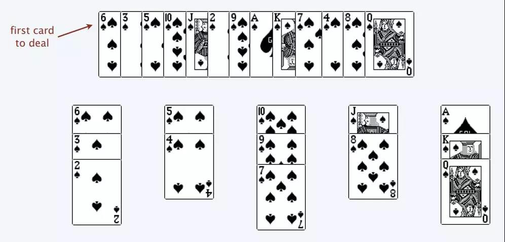

为什么遇到多个可选择堆的时候要放到最左边的堆上呢？因为这样可以保证牌堆顶的牌有序（2, 4, 7, 8, Q），证明略。

按照上述规则执行，可以算出最长递增子序列，牌的堆数就是我们想求的最长递增子序列的长度，证明略。

我们只要把处理扑克牌的过程编程写出来即可。每次处理一张扑克牌不是要找一个合适的牌堆顶来放吗，牌堆顶的牌不是有序吗，这就能用到二分查找了：**用二分查找来搜索当前牌应放置的位置。**

## 状态压缩 ---- 动态规划降维

态规划技巧对于算法效率的提升非常可观，一般来说都能把指数级和阶乘级时间复杂度的算法优化成 O(N^2)，堪称算法界的二向箔，把各路魑魅魍魉统统打成二次元。

**2、第二种思路模板是一个二维的 dp 数组**：

```java
int n = arr.length;
int[][] dp = new dp[n][n];

for (int i = 0; i < n; i++) {
    for (int j = 1; j < n; j++) {
        if (arr[i] == arr[j]) 
            dp[i][j] = dp[i][j] + ...
        else
            dp[i][j] = 最值(...)
    }
}
```

这种思路运用相对更多一些，尤其是涉及两个字符串/数组的子序列。本思路中 dp 数组含义又分为「只涉及一个字符串」和「涉及两个字符串」两种情况。

**2.1** **涉及两个字符串/数组时**（比如最长公共子序列），dp 数组的含义如下：

**在子数组`arr1[0..i]`和子数组`arr2[0..j]`中，我们要求的子序列（最长公共子序列）长度为`dp[i][j]`**。

### 编辑距离(LeetCode[72])

#### 题目描述

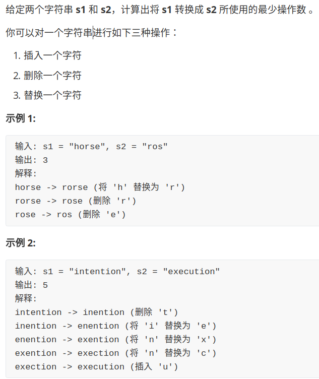

编辑距离问题就是给我们两个字符串`s1`和`s2`，只能用三种操作，让我们把`s1`变成`s2`，求最少的操作数。需要明确的是，不管是把`s1`变成`s2`还是反过来，结果都是一样的。

**解决两个字符串的动态规划问题，一般都是用两个指针`i,j`分别指向两个字符串的最后，然后一步步往前走，缩小问题的规模**。

设两个字符串分别为 "rad" 和 "apple"，为了把`s1`变成`s2`，算法会这样进行：

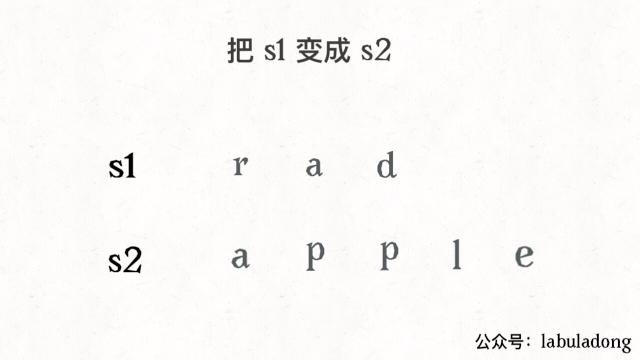

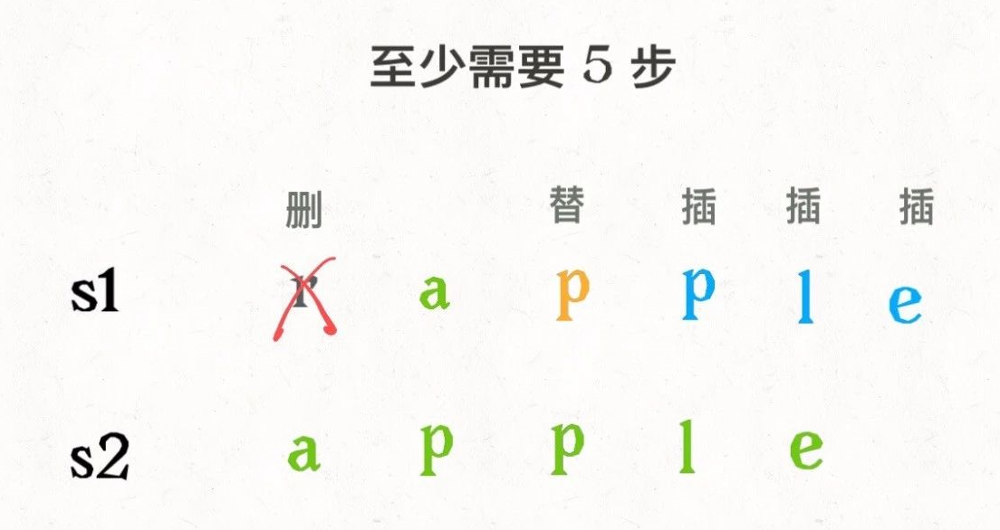

根据上面的 GIF，可以发现操作不只有三个，其实还有第四个操作，就是什么都不要做（skip）。比如这个情况：

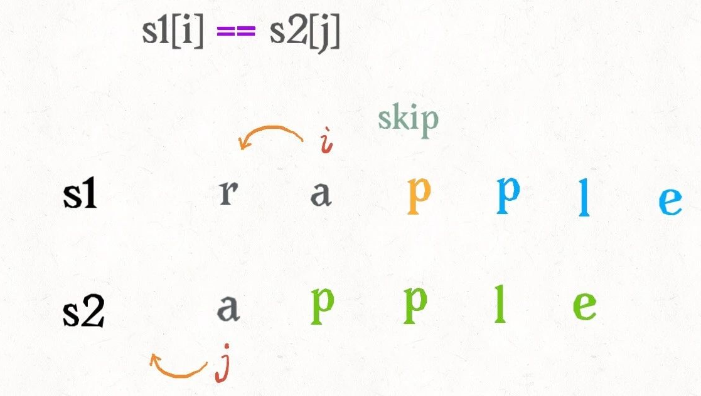

因为这两个字符本来就相同，为了使编辑距离最小，显然不应该对它们有任何操作，直接往前移动`i,j`即可。

还有一个很容易处理的情况，就是`j`走完`s2`时，如果`i`还没走完`s1`，那么只能用删除操作把`s1`缩短为`s2`。比如这个情况：

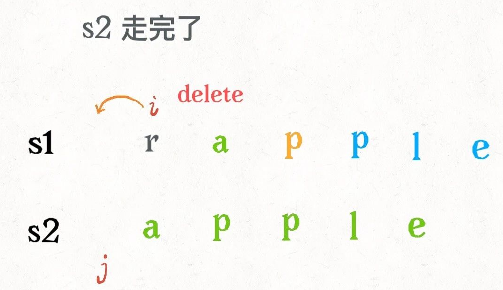

类似的，如果`i`走完`s1`时`j`还没走完了`s2`，那就只能用插入操作把`s2`剩下的字符全部插入`s1`。等会会看到，这两种情况就是算法的 **base case**。

#### 思路1(递归 + 备忘录)

base case 是`i`走完`s1`或`j`走完`s2`，可以直接返回另一个字符串剩下的长度。

对于每对儿字符`s1[i]`和`s2[j]`，可以有四种操作：

```markdown
if s1[i] == s2[j]:
  啥都别做（skip）
  i, j 同时向前移动
else:
  三选一：
    插入（insert）
    删除（delete）
    替换（replace）
```

这个「三选一」到底该怎么选择呢？很简单，全试一遍，哪个操作最后得到的编辑距离最小，就选谁。

其中，**dp(i, j)** 函数的定义是这样的：

```c++
def dp(i, j) -> int
# 返回 s1[0..i] 和 s2[0..j] 的最小编辑距离
```

#### 代码实现1(递归 + 备忘录)

```java
/* 找到字符串 s1 和 s2 的最短编辑距离(长度) */
public int minDistance(String word1, String word2) {
    /* 递归 + 备忘录 */
    HashMap<String, Integer> memo = new HashMap<>();
    return dp(memo, word1.length() - 1, word2.length() - 1, word1, word2);
}
/* 递归函数：返回 s1[0..index1] 和 s2[0..index2] 的最小编辑距离*/
private int dp(HashMap<String, Integer> memo, int index1, int index2, String word1, String word2) {
    // base case：如果两个字符串遍历索引 i，j 有一个先遍历完了，直接返回另一个字符串剩下的长度
    if (index1 == -1) return index2 + 1;
    if (index2 == -1) return index1 + 1;

    // 如果备忘录里有
    if (memo.containsKey(index1 + "&" + index2)) return memo.get(index1 + "&" + index2);

    // 分情况进行递归
    // 如果在两个字符串中两个索引对应的字符相等，那我直接跳过这个字符，判断下一个字符
    if (word1.charAt(index1) == word2.charAt(index2)) {
        memo.put(index1 + "&" + index2, dp(memo, index1 - 1, index2 - 1, word1, word2));
    } else {
        // s1[index1]！=s2[index2] 插入、删除、替换操作最后得到的编辑距离最小，就选谁
        memo.put(index1 + "&" + index2, Math.min(Math.min(dp(memo, index1, index2 - 1, word1, word2) + 1, dp(memo, index1 - 1, index2, word1, word2) + 1), dp(memo,index1 - 1, index2 - 1, word1, word2) + 1));
    }
    return memo.get(index1 + "&" + index2);
}
```

#### 思路2(动态规划)

首先明确 dp 数组的含义，dp 数组是一个二维数组，长这样：

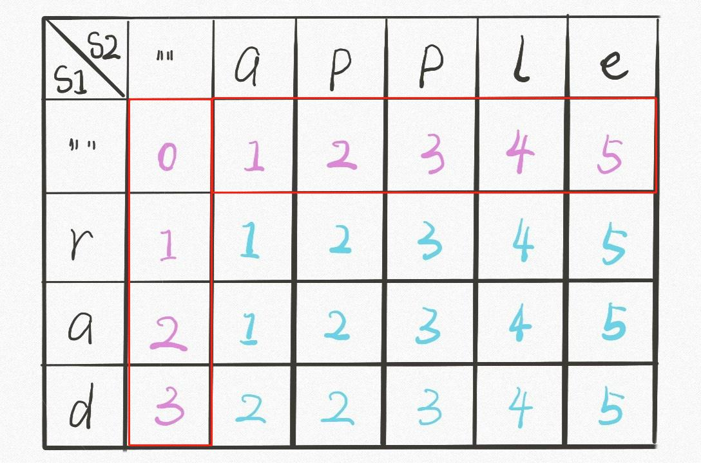

红线部分为初始情况：当两个字符串 s1 为空时(i = 0)，想要变成 s2，都需要 s2.length 步。比如 0 --> ab 需要两步。`dp[..][0]`和`dp[0][..]`对应 base case。

**dp 数组的定义：** 在两个字符串中，我们要求的最小编辑距离为`dp[i][j]`。`s1[0..i]` 和 `s2[0..j]` 的最小编辑距离。

既然 dp 数组和递归 dp 函数含义一样，也就可以直接套用之前的思路写代码，**唯一不同的是，DP table 是自底向上求解，递归解法是自顶向下求解**

#### 代码实现2(动态规划)

```java
/* 找到字符串 s1 和 s2 的最短编辑距离(长度) */
public int minDistance(String word1, String word2) {
    /* 动态规划 */
    // 创建 dp 表并初始化：当两个字符串 s1 为空时(i = 0)，想要变成 s2，都需要 s2.length 步。比如 0 --> ab 需要两步
    int m = word1.length();
    int n = word2.length();
    int[][] dp = new int[m + 1][n + 1];
    // s1 为 0 时的 base case
    for (int i = 0; i <= m; i++) {
        dp[i][0] = i;
    }
    // s2 为 0 时的 base case
    for (int j = 0; j <= n; j++) {
        dp[0][j] = j;
    }
    // 核心状态转移：由已知状态推出未知状态的过程
    // 由 dp[i - 1][j - 1], dp[i][j - 1], dp[i - 1][j] 推出 dp[i][j]，由左向右由上到下遍历即可
    for (int i = 1; i <= m; i++) {
        for (int j = 1; j <= n; j++) {
            // 如果两个字符 word[i] = word[j]，直接跳过比较下一个
            if (word1.charAt(i - 1) == word2.charAt(j - 1)) {
                dp[i][j] = dp[i - 1][j - 1];
            } else {
                // word[i] != word[j]，分别用插入、删除、替换来试一次，哪个得到的结果小取哪个
                // ①插入：s2 取出字符 s2[j] 插入 s1 索引 i 之和，则 s2[j] 与 s1 新插入的字符 s1[i + 1] 匹配了，j - 1 继续向前判断
                // ②删除：s1 删除字符 s1[i]，则向前取 s1[i - 1] 继续与 s2[j] 比较
                // ③替换：s2 取出字符 s2[j] 替换 s1[i]，则双方都 - 1，继续比较 s1[i - 1] 和 s2[j - 1]
                dp[i][j] = min(
                    dp[i][j - 1] + 1, // 别忘了 +1(本身的这次操作)
                    dp[i - 1][j] + 1, // 别忘了 +1(本身的这次操作)
                    dp[i - 1][j - 1] + 1 // 别忘了 +1(本身的这次操作)
                );
            }
        }
    }
    return dp[m][n];
}
private int min(int a, int b, int c) {
    return Math.min(Math.min(a, b), c);
}
```

一般来说，处理两个字符串的动态规划问题，都是按本文的思路处理，建立 DP table。为什么呢，因为易于找出状态转移的关系，比如编辑距离的 DP table：

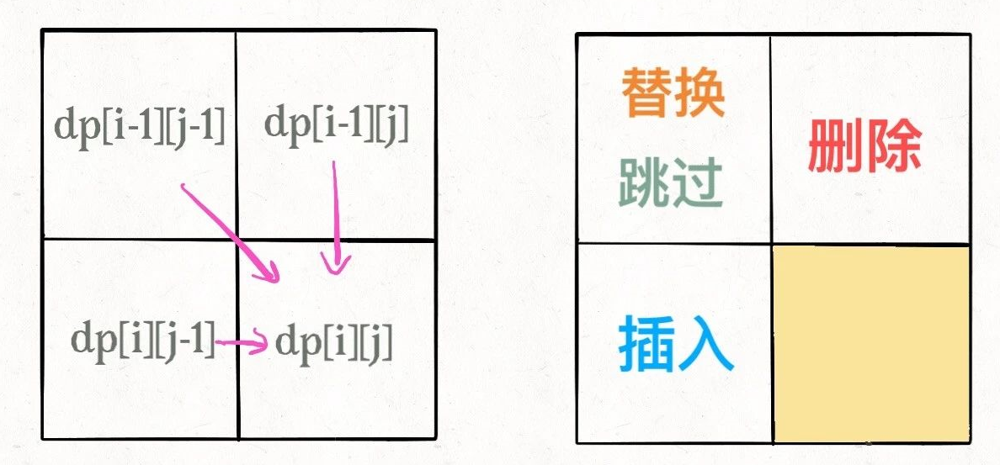

### 最长公共子序列(LeetCode[1143])

#### 题目描述

最长公共子序列（Longest Common Subsequence，简称 LCS）是一道非常经典的面试题目，因为它的解法是典型的二维动态规划，大部分比较困难的字符串问题都和这个问题一个套路，比如说编辑距离。而且，这个算法稍加改造就可以用于解决其他问题，所以说 LCS 算法是值得掌握的。

题目就是让我们求两个字符串的 LCS 长度：

```java
输入: str1 = "abcde", str2 = "ace" 
输出: 3  
解释: 最长公共子序列是 "ace"，它的长度是 3
```

#### 动态规划思路

只要涉及子序列问题，十有八九都需要动态规划来解决，往这方面考虑就对了。

+ **第一步，一定要明确`dp`数组的含义**。

  **在子数组`arr1[0..i]`和子数组`arr2[0..j]`中，我们要求的子序列（最长公共子序列）长度为`dp[i][j]`**。

+ 比如说对于字符串`s1`和`s2`，一般来说都要构造一个这样的 DP table：

  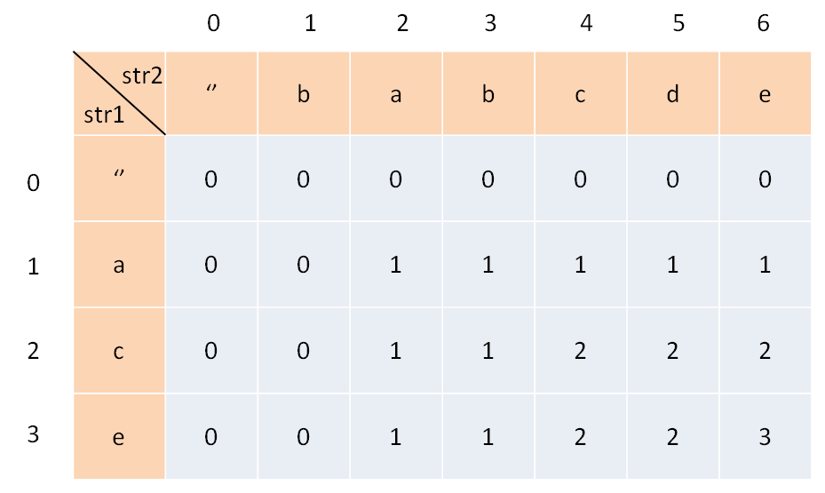

  为了方便理解此表，我们暂时认为索引是从 1 开始的，待会的代码中只要稍作调整即可。其中，`dp[i][j]`的含义是：对于`s1[1..i]`和`s2[1..j]`，它们的 LCS 长度是`dp[i][j]`。

  比如上图的例子，d[2][4] 的含义就是：对于`"ac"`和`"babc"`，它们的 LCS 长度是 2。我们最终想得到的答案应该是`dp[3][6]`。

+ **第二步，定义 base case。**

  我们专门让索引为 0 的行和列表示空串，`dp[0][..]`和`dp[..][0]`都应该初始化为 0，这就是 base case。

  比如说，按照刚才 dp 数组的定义，`dp[0][3]=0`的含义是：对于字符串`""`和`"bab"`，其 LCS 的长度为 0。因为有一个字符串是空串，它们的最长公共子序列的长度显然应该是 0。

+ **第三步，找状态转移方程。**

  状态转移说简单些就是做选择，比如说这个问题，是求`s1`和`s2`的最长公共子序列，不妨称这个子序列为`lcs`。那么对于`s1`和`s2`中的每个字符，有什么选择？很简单，两种选择，要么在`lcs`中，要么不在。

  这个「在」和「不在」就是选择，关键是，应该如何选择呢？这个需要动点脑筋：如果某个字符应该在`lcs`中，那么这个字符肯定同时存在于`s1`和`s2`中，因为`lcs`是最长**公共**子序列嘛。所以本题的思路是这样：

  用两个指针`i`和`j`从后往前遍历`s1`和`s2`，如果`s1[i]==s2[j]`，那么这个字符**一定在`lcs`中**；否则的话，`s1[i]`和`s2[j]`这两个字符**至少有一个不在`lcs`中**，需要丢弃一个。

  对于第一种情况，找到一个`lcs`中的字符，同时将`i, j`向前移动一位，并给`lcs`的长度加一；对于后者，则尝试两种情况，取更大的结果。

#### 代码实现

```java
/* 找到字符串 s1 和 s2 的最长公共子序列长度 */
public int longestCommonSubsequence(String text1, String text2) {
    // dp[i][j] 含义(下标从 1 开始)：表示 s1[1,...i] 与 s2[1,...j] 的最长公共子序列长度
    // 初始化考虑 base case：当 i = j = 0 时，字符串长度都为 0，则最长公共子序列必为 0
    int n = text1.length();
    int m = text2.length();
    int[][] dp = new int[n + 1][m + 1]; // 空出一行一列留给 base case
    // 先初始化为 0
    for (int i = 0; i < (n + 1); i++) {
        for (int j = 0; j < (m + 1); j++) {
            dp[i][j] = 0;
        }
    }
    // 核心：状态转移，dp[i][j] 由 dp[i - 1][j - 1], dp[i][j - 1], dp[i - 1][j] 共同推导，选择正常遍历即可
    for (int i = 1; i < (n + 1); i++) {
        for (int j = 1; j < (m + 1); j++) {
            // 遍历的时候如果找到一个 s1、s2 公共的字符，即 s1[i] == s2[j]
            if (text1.charAt(i - 1) == text2.charAt(j - 1)) {
                // 直接将子问题长度 +1 即可
                dp[i][j] = dp[i - 1][j - 1] + 1;
            } else {
                // 如果没找到，s1[i] 和 s2[j] 这两个字符至少有一个不在 lcs 中，在 dp[i - 1][j - 1]，dp[i][j - 1] 和 dp[i - 1][j] 找到更大的即可
                // 但实际上 dp[i - 1][j - 1] 是三者中最小的，没有比较的必要
                dp[i][j] = Math.max(dp[i][j - 1], dp[i - 1][j]);
            }
        }
    }
    return dp[n][m];
}
```

对于两个字符串的动态规划问题，一般来说都是像本文一样定义 DP table，因为这样定义有一个好处，就是容易写出状态转移方程，`dp[i][j]`的状态可以通过之前的状态推导出来：

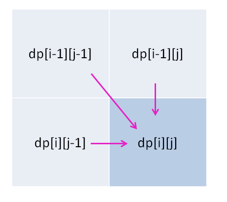

找状态转移方程的方法是，**思考每个状态有哪些「选择」，只要我们能用正确的逻辑做出正确的选择，算法就能够正确运行**。

**2.2** **只涉及一个字符串/数组时**（比如本文要讲的最长回文子序列），dp 数组的含义如下：

**在子数组`array[i..j]`中，我们要求的子序列（最长回文子序列）的长度为`dp[i][j]`**。

### 最长回文子序列(LeetCode[516])

#### 题目描述


#### 思路 

对 dp 数组的定义是：**在子串`s[i..j]`中，最长回文子序列的长度为`dp[i][j]`**。

为啥这个问题要这样定义二维的 dp 数组呢？我们前文多次提到，**找状态转移需要归纳思维，说白了就是如何从已知的结果推出未知的部分**，这样定义容易归纳，容易发现状态转移关系。

具体来说，如果我们想求`dp[i][j]`，假设你知道了子问题`dp[i+1][j-1]`的结果（`s[i+1..j-1]`中最长回文子序列的长度），你是否能想办法算出`dp[i][j]`的值（`s[i..j]`中，最长回文子序列的长度）呢？

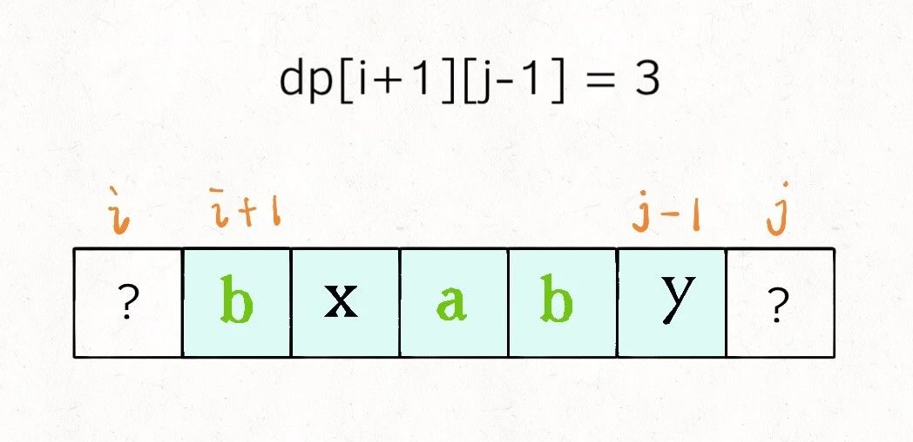

可以！**这取决于`s[i]`和`s[j]`的字符**：

**如果它俩相等**，那么它俩加上`s[i+1..j-1]`中的最长回文子序列就是`s[i..j]`的最长回文子序列：

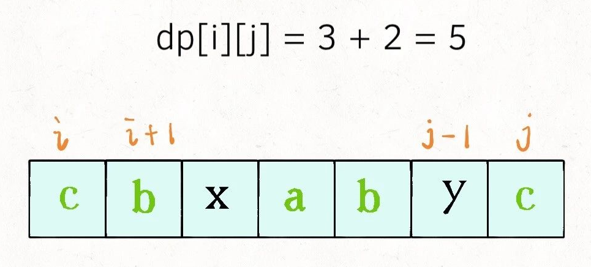

**如果它俩不相等**，说明它俩**不可能同时**出现在`s[i..j]`的最长回文子序列中，那么把它俩**分别**加入`s[i+1..j-1]`中，看看哪个子串产生的回文子序列更长即可：

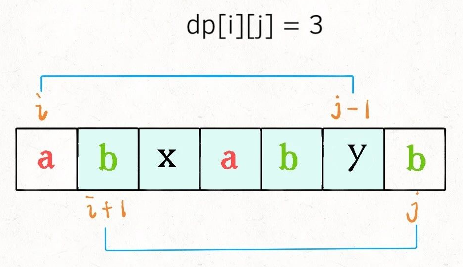

明确一下 base case，如果只有一个字符，显然最长回文子序列长度是 1，也就是`dp[i][j] = 1,(i == j)`。

因为`i`肯定小于等于`j`，所以对于那些`i > j`的位置，根本不存在什么子序列，应该初始化为 0。

另外，看看刚才写的状态转移方程，想求`dp[i][j]`需要知道`dp[i+1][j-1]`，`dp[i+1][j]`，`dp[i][j-1]`这三个位置；再看看我们确定的 base case，填入 dp 数组之后是这样：

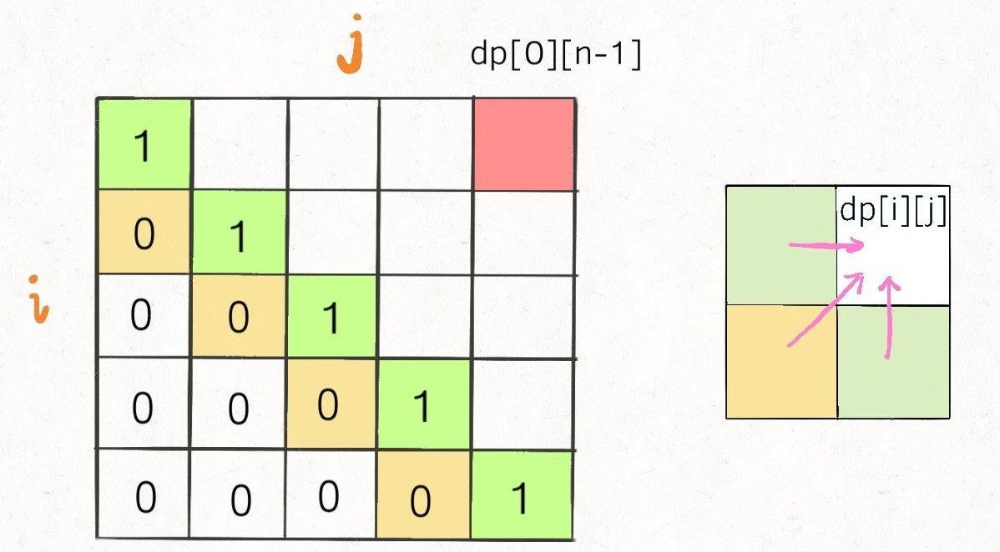

**为了保证每次计算`dp[i][j]`，左、下、左下三个方向的位置已经被计算出来，只能斜着遍历或者反着遍历**：

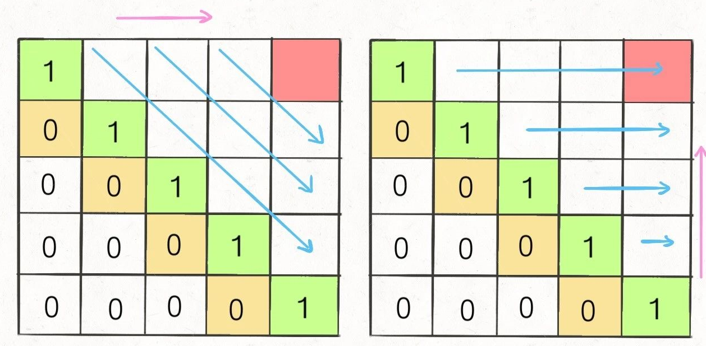

#### 代码实现

```java
/* 找到字符串最长回文子序列 */
public int longestPalindromeSubseq(String s) {
    // dp[i][j] 定义：在子串 s[i,...,j] 中最长回文子序列的长度为 dp[i][j]
    // base case：如果只有一个字符串，则 dp[i][j] = 1 (i = j = 1)
    // 如果索引 i < j，明显字符串都为空，何况子序列
    // 初始化 dp 数组，全设置为 0
    int n = s.length();
    int[][] dp = new int[n][n];
    //        Arrays.fill(dp, 0); 二维数组不适用
    for (int i = n - 1; i >= 0; i--) {
        for (int j = 0; j < n; j++) {
            dp[i][j] = 0;
        }
    }
    // 对角线上 i = j 时，均为 1
    for (int i = 0; i < n; i++) {
        dp[i][i] = 1;
    }
    // 核心：状态转移，根据数学归纳法，只要考虑怎么由子问题 dp[i + 1][j - 1](i + 1 ~ j - 1 长度的字符串中的最长子序列) 得到 dp[i][j]
    // 为了状态最后正确转移到 dp[i][j]，选择倒着遍历
    for (int i = n - 1; i >= 0; i--) {
        for (int j = i + 1; j < n; j++) {
            // ①当 s 中字符 s[i] = s[j] 时，如果知道子问题的最长回文子序列长度，直接 +2 即可
            if (s.charAt(i) == s.charAt(j)) {
                dp[i][j] = dp[i + 1][j - 1] + 2;
            } else {
                // ②s[i] != s[j]，只能比较 s[i] 和 s[j] 分别加入子问题 dp[i + 1][j - 1] 中哪个组成的回文子序列更长了
                dp[i][j] = Math.max(dp[i][j - 1], dp[i + 1][j]);
            }
        }
    }
    // 最后遍历完结果放在 i = 0，j = n - 1 的位置
    return dp[0][n - 1];
}
```

主要还是正确定义 dp 数组的含义，遇到子序列问题，首先想到两种动态规划思路，然后根据实际问题看看哪种思路容易找到状态转移关系。

另外，找到状态转移和 base case 之后，**一定要观察 DP table**，看看怎么遍历才能保证通过已计算出来的结果解决新的问题

# 2021.1.29记录

# 数组中重复的数字(剑指Offer[03])

### 题目描述

找出数组中重复的数字并输出。

### 思路

由于只需要找出数组中任意一个重复的数字，因此遍历数组，遇到重复的数字即返回。为了判断一个数字是否重复遇到，使用集合存储已经遇到的数字，如果遇到的一个数字已经在集合中，则当前的数字是重复数字。

初始化集合为空集合，重复的数字 repeat = -1，遍历数组中的每个元素：

+ 将该元素加入集合中，判断是否添加成功
+ 如果添加失败，说明该元素已经在集合中，因此该元素是重复元素，将该元素的值赋给 repeat，并结束遍历
+ 返回 repeat 

### 代码实现

```java
/* 找到数组中重复的数组并输出 */
public int findRepeatNumber(int[] nums) {
    // 思路：把数组中的元素和他对应的出现次数放入 HashSet，如果放入成功，不重复，放入失败，重复，返回即可
    HashSet<Integer> set = new HashSet<>();
    int repeat = 0;
    for (int num : nums) {
        // 没添加成功
        if (!set.add(num)) {
            repeat = num;
            break;
        }
    }
    return repeat;
}
```

# 2021.1.30记录

## 俄罗斯套娃信封问题(LeetCode[354])

### 题目描述

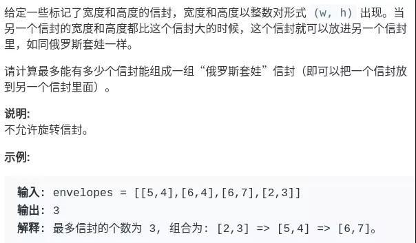

### 思路

这道题目其实是最长递增子序列（Longes Increasing Subsequence，简写为 LIS）的一个变种，因为很显然，每次合法的嵌套是大的套小的，相当于找一个最长递增的子序列，其长度就是最多能嵌套的信封个数。

但是难点在于，标准的 LIS 算法只能在数组中寻找最长子序列，而我们的信封是由`(w,h)`这样的二维数对形式表示的，如何把 LIS 算法运用过来呢？

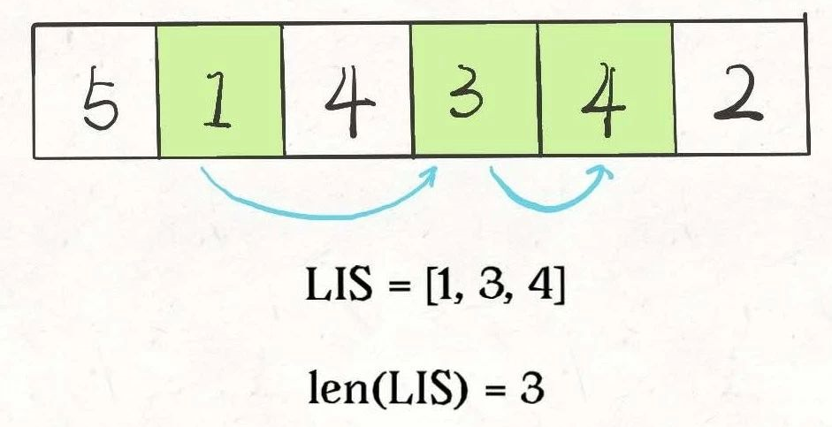

**核心思想：**

**先对宽度`w`进行升序排序，如果遇到`w`相同的情况，则按照高度`h`降序排序。之后把所有的`h`作为一个数组，在这个数组上计算 LIS 的长度就是答案。**

画个图理解一下，先对这些数对进行排序：

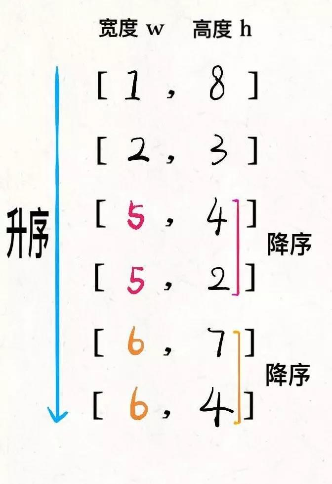

然后在`h`上寻找最长递增子序列：

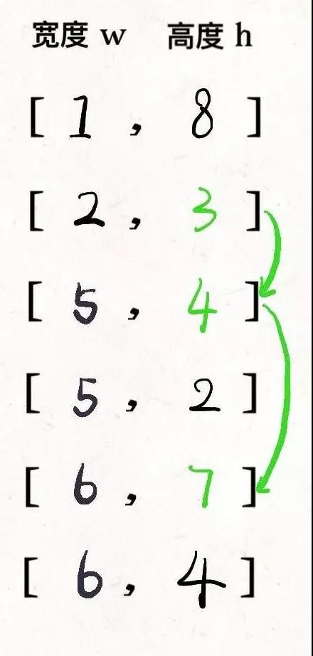

这个子序列 [2,3],[5,4],[6,7] 就是最优的嵌套方案。

这个解法的关键在于，对于宽度`w`相同的数对，要对其高度`h`进行降序排序。因为两个宽度相同的信封不能相互包含的，而逆序排序保证在`w`相同的数对中最多只选取一个计入 LIS。

### 代码实现

```java
/* 俄罗斯套娃信封问题 */
public int maxEnvelopes(int[][] envelopes) {
    // 核心思想：对于二维的信封，有宽度 W 和高度 H
    // ①按宽度 W 进行升序排序：宽度越来越大才能进行嵌套
    // ②当宽度 W 相同的时候，高度 H 降序排序：因为宽度相同的信封不能嵌套，只能从中选择一封
    // ③求高度 H 的最长递增子序列就是可以嵌套的信封数量

    int n = envelopes.length; // 获得二维数组的行数，就相当每一列有多少个数
    Arrays.sort(envelopes, new Comparator<int[]>()
                // 注意compare 排序中默认升序
                // 返回 1 == true 代表降序，我想调整顺序
                // 返回 -1 代表升序
                {
                    public int compare(int[] a, int[] b) {
                        // 默认升序：a[0] - b[0] < 0 = -1，第 0 列按升序处理
                        // b[1] - a[1] > 0 = 1，第 1 列按降序处理
                        return a[0] == b[0] ?
                            b[1] - a[1] : a[0] - b[0];
                    }
                });
    // 获得排序好的 envelope 数组的第 2 列
    int[] height = new int[n];
    for (int i = 0; i < n; i++) {
        height[i] = envelopes[i][1];
    }
    // 求 height 中的最长递增子序列
    int[] dp = new int[height.length];
    // base case
    Arrays.fill(dp, 1);
    for (int i = 0; i < height.length; i++) {
        for (int j = 0; j < i; j++) {
            if (height[i] > height[j]) {
                int tmp = dp[j] + 1; //找到一个升序的了，先让 dp[j] + 1
                dp[i] = Math.max(dp[i], tmp); // 再比较
            }
        }
    }
    // dp 数组中的最大值即为所求
    int res = 0;
    for (int i = 0; i < dp.length; i++) {
        res = Math.max(res, dp[i]);
    }
    return res;
}
```

# 2021.1.31记录

## 最大子数组和(LeetCode[53])

### 题目描述


### 思路

**这道题还不能用滑动窗口算法，因为数组中的数字可以是负数**。

滑动窗口算法无非就是双指针形成的窗口扫描整个数组/子串，但关键是，你得清楚地知道什么时候应该移动右侧指针来扩大窗口，什么时候移动左侧指针来减小窗口。

而对于这道题目，你想想，当窗口扩大的时候可能遇到负数，窗口中的值也就可能增加也可能减少，这种情况下不知道什么时机去收缩左侧窗口，也就无法求出「最大子数组和」。

解决这个问题需要动态规划技巧，但是`dp`数组的定义比较特殊。按照我们常规的动态规划思路，一般是这样定义`dp`数组：

**`nums[0..i]`中的「最大的子数组和」为`dp[i]`**。

如果这样定义的话，整个`nums`数组的「最大子数组和」就是`dp[n-1]`。如何找状态转移方程呢？按照数学归纳法，假设我们知道了`dp[i-1]`，如何推导出`dp[i]`呢？

如下图，按照我们刚才对`dp`数组的定义，`dp[i] = 5`，也就是等于`nums[0..i]`中的最大子数组和：


那么在上图这种情况中，利用数学归纳法，你能用`dp[i]`推出`dp[i+1]`吗？

**实际上是不行的，因为子数组一定是连续的，按照我们当前`dp`数组定义，并不能保证`nums[0..i]`中的最大子数组与`nums[i+1]`是相邻的**，也就没办法从`dp[i]`推导出`dp[i+1]`。

所以说我们这样定义`dp`数组是不正确的，无法得到合适的状态转移方程。对于这类子数组问题，我们就要重新定义`dp`数组的含义：

**核心思路：**使用数学归纳法来找状态转移关系：假设我们已经算出了`dp[i-1]`，如何推导出`dp[i]`呢？

可以做到，`dp[i]`有两种「选择」，要么与前面的相邻子数组连接，形成一个和更大的子数组；要么不与前面的子数组连接，自成一派，自己作为一个子数组。

**以`nums[i]`为结尾的「最大子数组和」为`dp[i]`**。

### 代码实现

```java
/* 最大子序和问题 */
public int maxSubArray(int[] nums) {
    // dp[i] 数组：数组以 nums[i] 结尾的最大字序和
    int n = nums.length;
    if (n == 0) return 0;
    int[] dp = new int[n];
    // base case：数组第一位 nums[0] = dp[0]
    dp[0] = nums[0];
    for (int i = 1; i < n; i++) {
        // dp[i] 表示 dp[i - 1] 如果跟 nums[i] 相加形成一个更大的子数组的话，就返回这个合并数组
        // 如果合并数组还没有自己本身 nums[i] 的数值大，直接返回 nums[i] 即可
        dp[i] = Math.max(nums[i], dp[i - 1] + nums[i]);
    }
    int res = Integer.MIN_VALUE;
    for (int i = 0; i < n; i++) {
        res = Math.max(res, dp[i]);
    }
    return res;
}
```

## 0-1背包问题

### 题目描述

给你一个可装载重量为`W`的背包和`N`个物品，每个物品有重量和价值两个属性。其中第`i`个物品的重量为`wt[i]`，价值为`val[i]`，现在让你用这个背包装物品，最多能装的价值是多少？

举个简单的例子，输入如下：

```java
N = 3, W = 4
wt = [2, 1, 3]
val = [4, 2, 3]
```

算法返回 6，选择前两件物品装进背包，总重量 3 小于`W`，可以获得最大价值 6。

题目就是这么简单，一个典型的动态规划问题。**这个题目中的物品不可以分割，要么装进包里，要么不装，不能说切成两块装一半。**这也许就是 0-1 背包这个名词的来历。

### 动态规划标准套路

**第一步要明确两点，「状态」和「选择」**。

先说状态，如何才能描述一个问题局面？只要给定几个可选物品和一个背包的容量限制，就形成了一个背包问题，对不对？**所以状态有两个，就是「背包的容量」和「可选择的物品」**。

再说选择，也很容易想到啊，你能选择什么？**选择就是「装进背包」或者「不装进背包」嘛**。

明白了状态和选择，动态规划问题基本上就解决了，只要往这个框架套就完事儿了：

```java
for 状态1 in 状态1的所有取值：
    for 状态2 in 状态2的所有取值：
        for ...
            dp[状态1][状态2][...] = 择优(选择1，选择2...)
```

**第二步要明确`dp`数组的定义**。

`dp`数组是什么？其实就是描述问题局面的一个数组。换句话说，我们刚才明确问题有什么「状态」，现在需要用`dp`数组把状态表示出来。

首先看看刚才找到的「状态」，有两个，也就是说我们需要一个二维`dp`数组，一维表示可选择的物品，一维表示背包的容量。

**`dp[i][w]`的定义如下：对于前`i`个物品，当前背包的容量为`w`，这种情况下可以装的最大价值是`dp[i][w]`。**

比如说，如果 dp[3] [5] = 6，其含义为：对于给定的一系列物品中，若只对前 3 个物品进行选择，当背包容量为 5 时，最多可以装下的价值为 6。

**根据这个定义，我们想求的最终答案就是`dp[N][W]`。base case 就是`dp[0][..] = dp[..][0] = 0`**，因为没有物品或者背包没有空间的时候，能装的最大价值就是 0。

细化上面的框架：

```java
int dp[N+1][W+1]
dp[0][..] = 0
dp[..][0] = 0

for i in [1..N]:
    for w in [1..W]:
        dp[i][w] = max(
            把物品 i 装进背包,
            不把物品 i 装进背包
        )
return dp[N][W]
```

**第三步，根据「选择」，思考状态转移的逻辑**。

简单说就是，上面伪码中「把物品`i`装进背包」和「不把物品`i`装进背包」怎么用代码体现出来呢？

**这一步要结合对`dp`数组的定义和我们的算法逻辑来分析：**

先重申一下刚才我们的`dp`数组的定义：

`dp[i][w]`表示：对于前`i`个物品，当前背包的容量为`w`时，这种情况下可以装下的最大价值是`dp[i][w]`。

**如果你没有把这第`i`个物品装入背包**，那么很显然，最大价值`dp[i][w]`应该等于`dp[i-1][w]`。你不装嘛，那就继承之前的结果。

**如果你把这第`i`个物品装入了背包**，那么`dp[i][w]`应该等于`dp[i-1][w-wt[i-1]] + val[i-1]`。

首先，由于`i`是从 1 开始的，所以对`val`和`wt`的取值是`i-1`。

而`dp[i-1][w-wt[i-1]]`也很好理解：你如果想装第`i`个物品，你怎么计算这时候的最大价值？**换句话说，在装第`i`个物品的前提下，背包能装的最大价值是多少？**

显然，你应该寻求剩余重量`w-wt[i-1]`限制下能装的最大价值，加上第`i`个物品的价值`val[i-1]`，这就是装第`i`个物品的前提下，背包可以装的最大价值。

**最后一步，把伪码翻译成代码，处理一些边界情况**。

把上面的思路完全翻译了一遍，并且处理了`w - wt[i-1]`可能小于 0 导致数组索引越界的问题：

```c++
int knapsack(int W, int N, vector<int>& wt, vector<int>& val) {
    // vector 全填入 0，base case 已初始化
    vector<vector<int>> dp(N + 1, vector<int>(W + 1, 0));
    for (int i = 1; i <= N; i++) {
        for (int w = 1; w <= W; w++) {
            if (w - wt[i-1] < 0) {
                // 当前背包容量装不下，只能选择不装入背包
                dp[i][w] = dp[i - 1][w];
            } else {
                // 装入或者不装入背包，择优
                dp[i][w] = max(dp[i - 1][w - wt[i-1]] + val[i-1], 
                               dp[i - 1][w]);
            }
        }
    }

    return dp[N][W];
}
```

这是比较简单的动态规划问题，因为状态转移的推导逻辑比较容易想到，基本上你明确了`dp`数组的定义，就可以理所当然地确定状态转移了。

### 例题1：分割等和子集(LeetCode[416])

#### 题目描述

```java
//给定一个只包含正整数的非空数组。是否可以将这个数组分割成两个子集，使得两个子集的元素和相等。 
// 示例 1: 
//
// 输入: [1, 5, 11, 5]
//
//输出: true
//
//解释: 数组可以分割成 [1, 5, 5] 和 [11].
```

#### 思路

如果一个大的数组可以分成两个 “和” 相同的两个数组

==>可以等价的看出大的数组中有没有一个子数组的和等于大数组所有元素和的一半

==>进一步看成 0-1 背包问题：子数组中的元素个数看成背包中的物品个数，其对应值的和应该是大数组元素和的一半

**dp[i] [w] 数组的定义：**表示从数组 `nums[0,...i]` 挑选几个正整数的组合，使之和为 `w` 的真假为 `dp[i] [w]`

**base case：**当背包中元素只有 nums[0] 时，满足 `nums[0,...,i]` 和为 w 的只有 `dp[0] [nums[0]`

**状态变化在代码中有详细解释**

#### 代码实现

```java
// 思路：如果一个大的数组可以分成两个 “和” 相同的两个数组
// 可以等价的看出大的数组中有没有一个子数组的和等于大数组所有元素和的一半
// 进一步看成 0-1 背包问题：子数组中的元素个数看成背包中的物品个数，其对应值的和应该是大数组元素和的一半
public boolean canPartition(int[] nums) {
    // dp[i][w]：表示从数组 nums[0,...i] 挑选几个正整数的组合，使之和为 w
    int N = nums.length;
    int W = 0;
    for (int num : nums) {
        W += num;
    }
    if (W % 2 != 0) return false;
    // 定义背包的容量 w
    int W_target = W / 2;
    boolean[][] dp = new boolean[N][W + 1];
    // base case：当背包中元素只有 nums[0] 时，满足 nums[0,...,i] 和为 w 的只有 dp[0][nums[0]]
    // 如果 nums[0] 还在背包的容纳范围内
    if (nums[0] < W) {
        dp[0][nums[0]] = true;
    }
    // 状态变化
    for (int i = 1; i < N; i++) {
        for (int w = 0; w <= W_target; w++) {
            if (w - nums[i] < 0) {
                // ①背包容量不够了，不在背包中新增元素
                // 这个情况背包容量 w 不变，即等于 dp[i - 1] 时的背包容量
                // 并且此时 dp[i][w] 为真为假只取决于 dp[i - 1][w]
                dp[i][w] = dp[i - 1][w];
                // 如果背包容量 w 恰好等于 nums[i] 那么加上 nums[i] 后，至少有 nums[i] 这个组合的值等于 w，必为真
            } else if (w - nums[i] == 0) {
                dp[i][w] = true;
                continue;
            } else {
                // ②容量够，可以塞也可以不塞东西
                // 继续塞东西后可能就有子数组在索引 0 ~ i - 1 内的和等于 w - nums[i] 了，那再其基础上 + nums[i]，肯定有子数组的和等于 w
                // 也有可能不塞东西就有子数组在索引 0 ~ i - 1 内的和等于 w，dp[i][w] 的真假就直接取决于此，并且两者是 “或” 的关系
                dp[i][w] = dp[i - 1][w - nums[i]] || dp[i - 1][w];
            }
        }
    }
    // 返回 dp[N - 1][W]
    return dp[N - 1][W_target];
}
```

**注意到`dp[i][j]`都是通过上一行`dp[i-1][..]`转移过来的**

# 2021.2.1记录

## 零钱兑换 II(LeetCode[518])

### 题目描述

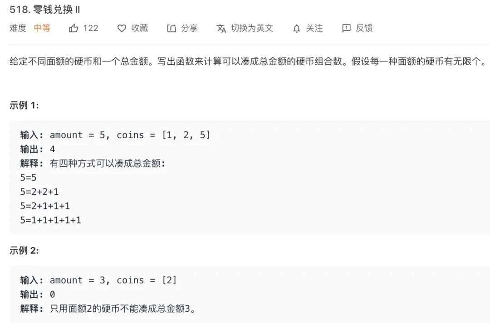

**我们可以把这个问题转化为背包问题的描述形式**：

有一个背包，最大容量为`amount`，有一系列物品`coins`，每个物品的重量为`coins[i]`，**每个物品的数量无限**。请问有多少种方法，能够把背包恰好装满？

这个问题和我们前面讲过的两个背包问题，有一个最大的区别就是，每个物品的数量是无限的，这也就是传说中的「**完全背包问题**」，没啥高大上的，无非就是状态转移方程有一点变化而已。

### 思路

**第一步要明确两点，「状态」和「选择」**。

这部分都是背包问题的老套路了，我还是啰嗦一下吧：

状态有两个，就是「背包的容量」和「可选择的物品」，选择就是「装进背包」或者「不装进背包」。

**第二步要明确`dp`数组的定义**。

首先看看刚才找到的「状态」，有两个，也就是说我们需要一个二维`dp`数组。

`dp[i][j]`的定义如下：

**若只使用前`i`个物品，当背包容量为`j`时，有`dp[i][j]`种方法可以装满背包。**

换句话说，翻译回我们题目的意思就是：

**若只使用`coins`中的前`i`个硬币的面值，若想凑出金额`j`，有`dp[i][j]`种凑法**。

经过以上的定义，可以得到：

base case 为`dp[0][..] = 0， dp[..][0] = 1`。因为如果不使用任何硬币面值，就无法凑出任何金额；如果凑出的目标金额为 0，那么对于每一枚面值的硬币只有一种可能就是不选这种凑法。

我们最终想得到的答案就是`dp[N][amount]`，其中`N`为`coins`数组的大小。

**第三步，根据「选择」，思考状态转移的逻辑**。

注意，我们这个问题的特殊点在于物品的数量是无限的，所以这里和之前写的背包问题文章有所不同。

**如果你不把这第`i`个物品装入背包**，也就是说你不使用`coins[i]`这个面值的硬币，那么凑出面额`j`的方法数`dp[i][j]`应该等于`dp[i-1][j]`，继承之前的结果。

**如果你把这第`i`个物品装入了背包**，也就是说你使用`coins[i]`这个面值的硬币，那么`dp[i][j]`应该等于`dp[i][j-coins[i-1]]`。

首先由于`i`是从 1 开始的，所以`coins`的索引是`i-1`时表示第`i`个硬币的面值。

`dp[i][j-coins[i-1]]`也不难理解，如果你决定使用这个面值的硬币，那么就应该关注如何凑出金额`j - coins[i-1]`。因为使用了这枚硬币，如果从 `coins[0,...i]` 中有 n 种方法可以凑成 `mount = w - coins[i - 1]` 并且 coins[i - 1] 这枚硬币数量无限制，那么在 `dp[i] [w - coins[i - 1]]` 基础上再 + coins[i - 1] 即可。那 `dp[i] [w]` 就应该是这两种情况的和

### 代码实现

```java
// 思路：对于 coins[] 数组，找出总共有多少个子数组的组合方式，使之子数组的和等于 amount
// ==> 背包容量为 amount，在 coins[0,...,i] 中选择若干个硬币，使得这些硬币的和恰好等于 amount
public int change(int amount, int[] coins) {
    // dp[i][w] 定义：在 coins[0,...,i] 中选择若干个硬币，使得这些硬币的和恰好等于 amount 的组合方式总数为 dp[i][w] 种
    // ==> 原问题转换为求解 dp[coins.length, amount]
    int N = coins.length;
    int W = amount;
    int[][] dp = new int[N + 1][W + 1]; // 背包容量可以从 0 ~ W 之间变化
    // base case：如果 amount = 0 ==> dp[i][0] = 1，都只能一个硬币都不取，总的方式数就是 1;
    // 如果一枚硬币都不取，什么金额都凑不出 ==> dp[0][w] = 0
    for (int i = 0; i <= N; i++) {
        dp[i][0] = 1;
    }
    // dp[0][j] 已经为 0 了
    //        for (int j = 0; j <= W; j++) {
    //            dp[0][j] = 0;
    //        }
    for (int i = 1; i <= N; i++) {
        for (int w = 1; w <= W; w++) {
            // 因为 i 属于 [1, N]，coins 属于 [0, N -1]，所以索引要向前移一位
            if (w - coins[i - 1] < 0) {
                // ①背包容量不够了，装不下更多的东西了
                dp[i][w] = dp[i - 1][w];
            } else if (w - coins[i - 1] >= 0) {
                // ②背包还能再放下 coins[i] 这枚硬币，有两种情况：
                // i)选择不放;
                // ii)选择再放一个硬币，dp[i][w] = dp[i][w - coins[i - 1]]：因为使用了这枚硬币，如果从 coins[0,...i] 中有 n 种方法可以凑成 mount = w - coins[i - 1]
                // 并且 coins[i - 1] 这枚硬币数量无限制，那么在 dp[i][w - coins[i - 1]] 基础上再 + coins[i - 1] 即可
                // 那 dp[i][w] 就应该是这两种情况的和
                dp[i][w] = dp[i][w - coins[i - 1]] + dp[i - 1][w];
            }
        }
    }
    return dp[N][W];
}
```

## 贪心算法

什么是贪心算法呢？贪心算法可以认为是动态规划算法的一个特例，相比动态规划，使用贪心算法需要满足更多的条件（贪心选择性质），但是效率比动态规划要高。

比如说一个算法问题使用暴力解法需要指数级时间，如果能使用动态规划消除重叠子问题，就可以降到多项式级别的时间，如果满足贪心选择性质，那么可以进一步降低时间复杂度，达到线性级别的。

什么是贪心选择性质呢，简单说就是：每一步都做出一个局部最优的选择，最终的结果就是全局最优。注意哦，这是一种特殊性质，其实只有一小部分问题拥有这个性质。

### 无重叠区间(区间调度，LeetCode[435])

#### 题目描述

给你很多形如`[start,end]`的闭区间，请你设计一个算法，**算出这些区间中最多有几个互不相交的区间**。

举个例子，`intvs=[[1,3],[2,4],[3,6]]`，这些区间最多有两个区间互不相交，即`[[1,3],[3,6]]`，你的算法应该返回 2。注意边界相同并不算相交。

这个问题在生活中的应用广泛，比如你今天有好几个活动，每个活动都可以用区间`[start,end]`表示开始和结束的时间，请问你**今天最多能参加几个活动呢？**

#### 思路

1. 从区间集合 intvs 中选择一个区间 x，这个 x 是在当前所有区间中**结束最早的**（end 最小）。
2. 把所有与 x 区间相交的区间从区间集合 intvs 中删除。
3. 重复步骤 1 和 2，直到 intvs 为空为止。之前选出的那些 x 就是最大不相交子集。

把这个思路实现成算法的话，可以按每个区间的`end`数值升序排序，因为这样处理之后实现步骤 1 和步骤 2 都方便很多:

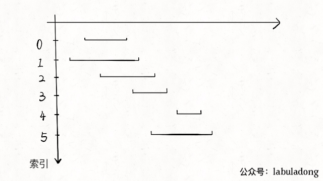

对于步骤 1，由于我们预先按照`end`排了序，所以选择 x 是很容易的。关键在于，如何去除与 x 相交的区间，选择下一轮循环的 x 呢？

**由于我们事先排了序**，不难发现所有与 x 相交的区间必然会与 x 的`end`相交；如果一个区间不想与 x 的`end`相交，它的`start`必须要大于（或等于）x 的`end`：

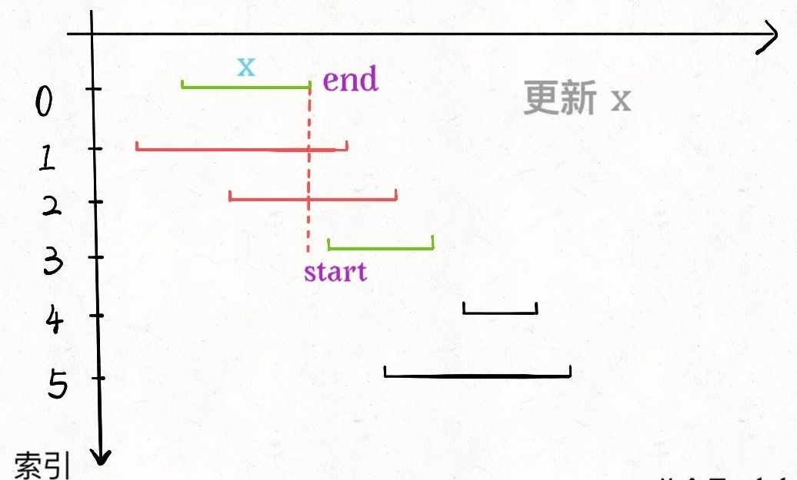

#### 代码实现

```java
// 思路：对二维数组的第 1 列，也就是每个子数组的 end 进行升序排序
// 遍历二维数组中的每一个数组，如果有数组的 start 索引大于等于前面数组的 end，则找到一个满足条件的数组
public int eraseOverlapIntervals(int[][] intervals) {
    if (intervals.length == 0) return 0;
    // 对每个子数组的 end 升序处理
    Arrays.sort(intervals, new Comparator<int[]>() {
        public int compare(int[] a, int[] b) {
            return a[1] - b[1]; // -1 表示升序
        }
    });
    // 即使二维数组中子数组全部重合，不重合数组个数就为 1
    int count = 1;
    // 得到排序后第一个子数组的末尾索引
    int x_end = intervals[0][1];
    // 遍历二维数组
    for (int[] interval : intervals) {
        // interval 就表示一个个的子数组
        int start = interval[0];
        if (start >= x_end) {
            count++;
            // 更新 x_end，再进行比较
            x_end = interval[1];
        }
    }
    return intervals.length - count;
}
```

### 用最少的箭头射爆气球(区间调度，LeetCode[452])

#### 题目描述

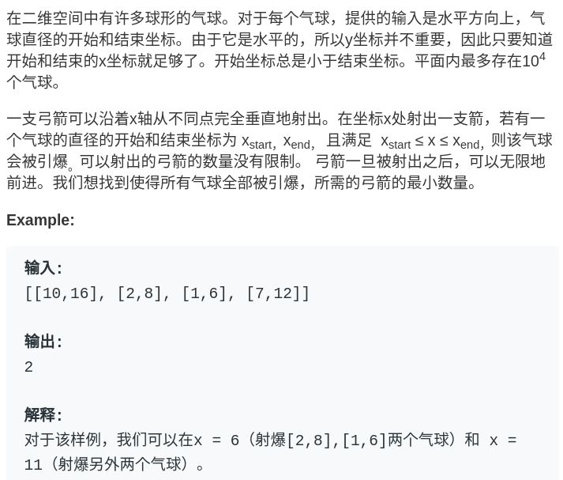

#### 思路

其实稍微思考一下，这个问题和区间调度算法一模一样！如果最多有`n`个不重叠的区间，那么就至少需要`n`个箭头穿透所有区间：

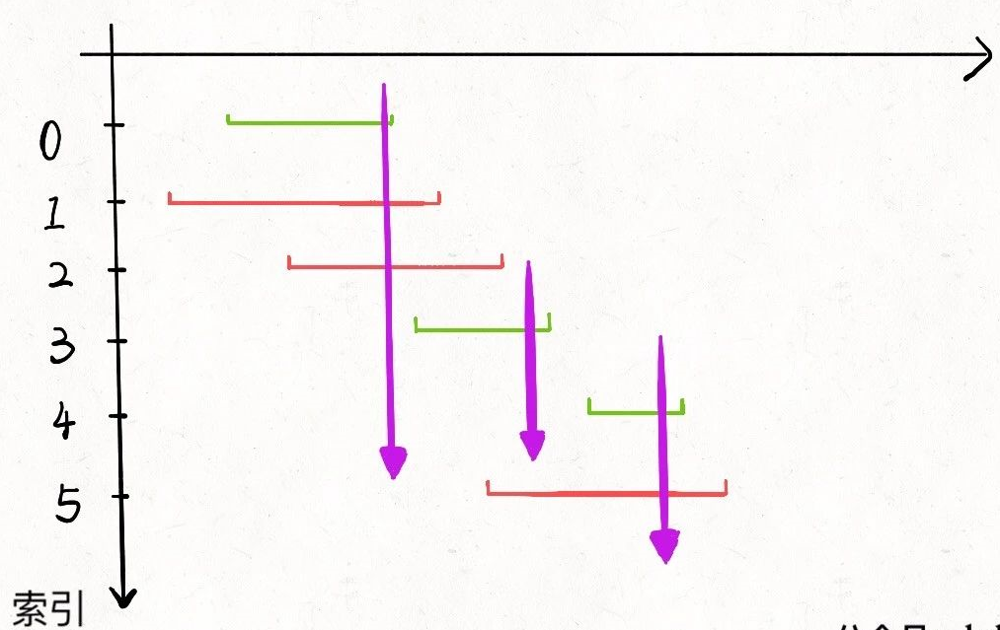

只是有一点不一样，在`intervalSchedule`算法中，如果两个区间的边界触碰，不算重叠；而按照这道题目的描述，箭头如果碰到气球的边界气球也会爆炸，所以说相当于区间的边界触碰也算重叠：


#### 代码实现

```java
// 思路：将装有气球起始和结束坐标的二维数组按照结束坐标做一个升序排序，获得第一个气球的末尾坐标
// 然后遍历二维数组，判断下一个气球的其实坐标是否大于第一个气球的末尾坐标，如果大于，计数器 +1
public int findMinArrowShots(int[][] points) {
    if (points.length == 0) return 0;
    // 对每个子数组的 end 升序处理
    // 注意compare 排序中默认升序
    // 返回 1 == true 代表降序，我想调整顺序
    // 返回 -1 代表升序
    Arrays.sort(points, new Comparator<int[]>() {
        public int compare(int[] point1, int[] point2) {
            if (point1[1] > point2[1]) {
                return 1; // 想要升序：如果 point1 第一列的值大于 point2 第一列的值，不符合升序，返回 1，调整两个数组位置
            } else if (point1[1] < point2[1]) {
                return -1; // 如果直接就是升序，就返回 -1 即可
            } else {
                return 0;
            }
        }
    });
    // 即使二维数组中子数组全部重合，不重合数组个数就为 1
    int count = 1;
    // 得到排序后第一个子数组的末尾索引
    int pos = points[0][1];
    // 遍历判断
    for (int[] balloon: points) {
        if (balloon[0] > pos) {
            pos = balloon[1];
            ++count;
        }
    }
    return count;
}
```

这么做的原因也不难理解，因为现在边界接触也算重叠，所以`start == x_end`时不能更新区间 x。

**对于区间问题的处理，一般来说第一步都是排序，相当于预处理降低后续操作难度。**

### 跳跃游戏 I(LeetCode[55])

#### 题目描述

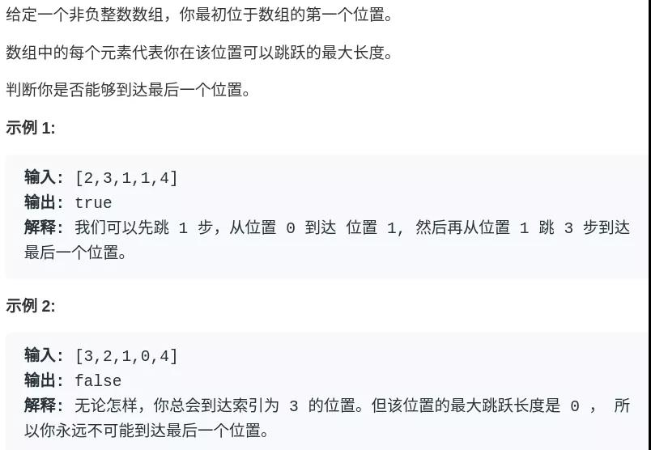

#### 思路

**有关动态规划的问题，大多是让你求最值的**，比如最长子序列，最小编辑距离，最长公共子串等等等。这就是规律，因为动态规划本身就是运筹学里的一种求最值的算法。

那么贪心算法作为特殊的动态规划也是一样，一般也是让你求个最值。这道题表面上不是求最值，但是可以改一改：

**请问通过题目中的跳跃规则，最多能跳多远**？如果能够越过最后一格，返回 true，否则返回 false。

#### 代码实现

```java
// 思路：判断是否能够到达最后一个下标 ==> 按照跳跃的规则，能跳的最远距离是多少？
// ==> 如果最远距离大于数组的长度，返回 true，否则 false
public boolean canJump(int[] nums) {
    int n = nums.length;
    // 初始化最远距离为 0
    int farthest = 0;
    // 因为最后只要 farthest >= n - 1 即可
    // 所以 i 取到 n - 2 的位置算出的 farthest 能跳到最后一格或者跳出去都满足条件
    for (int i = 0; i < n - 1; i++) {
        // 不断更新 farthest，每跳到一个新的位置，之前的 farthest 与当前的可以跳到的最远位置 i + nums[i] 进行比较
        // 两者取最优，就是最大的 farthest
        farthest = Math.max(farthest, i + nums[i]);
        // 如果最远距离就是 i 位置自己，那么就算 i + 1，自己也跳不过去，[0,2,3] 的情况
        if (farthest - i <= 0) return false;
    }
    // i 取到 n - 2 的位置算出的 farthest
    return farthest >= n - 1;
}
```

每一步都计算一下从当前位置最远能够跳到哪里，然后和一个全局最优的最远位置`farthest`做对比，通过每一步的最优解，更新全局最优解，这就是贪心。

### 跳跃游戏 II(LeetCode[45])

#### 题目描述

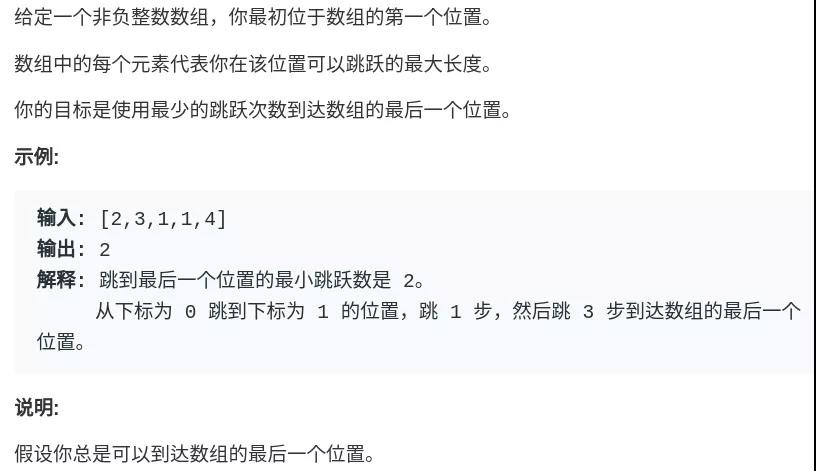

**现在的问题是，保证你一定可以跳到最后一格，请问你最少要跳多少次，才能跳过去？**

#### 思路1 动态规划

采用自顶向下的递归动态规划，可以这样定义一个`dp`函数：

```java
// 定义：从索引 p 跳到最后一格，至少需要 dp(nums, p) 步
int dp(vector<int>& nums, int p);
```

我们想求的结果就是`dp(nums, 0)`，**base case** 就是当`p`超过最后一格时，不需要跳跃：

```java
if (p >= nums.size() - 1) {
    return 0;
}
```

#### 代码实现1 动态规划

```java
// 现在是一定可以到达数组的最后一位，要求出到最后一位最小要跳的次数
// 动态规划
public int jump(int[] nums) {
    // 创建备忘录放每一个子问题的结果
    int n = nums.length;
    // 因为从 0 到 n - 1(末尾位置) 最多走 n - 1 步，初始化要一个不在选择范围的数
    int[] memo = new int[n];
    Arrays.fill(memo, n);
    return dp(memo, nums, 0);
}
// dp(nums, p)：表示从 p 位置开始跳到末尾最少用的步数为 dp(nums, p)
// 我们要求的就是 dp(nums, 0)：从 0 位置开始跳到末尾的最小步数
private int dp(int[] memo, int[] nums, int p) {
    int n = nums.length;
    // base case：如果 p 已经超过或等于最后一位的位置(n - 1)，需要 0 步
    if (p >= n - 1) return 0;
    // 如果备忘录里有结果，直接返回
    if (memo[p] != n) {
        return memo[p];
    }
    // 循环遍历递归
    // 在 p 位置可以走 steps 步
    int steps = nums[p];
    // 我选择可以走 1 ~ steps 步
    for (int i = 1; i <= steps; i++) {
        // 递归到子问题 dp(memo, nums, p + i)
        // 转换为从 p 跳到末尾 --> p + i 位置跳到末尾
        int subProblem = dp(memo, nums, p + i);
        // 找到所有可能 (p + 1 ~ steps) 中最小次数的结果存入 memo
        memo[p] = Math.min(memo[p], subProblem + 1); // +1 表示在 p 位置跳到 p + i 算一次
    }
    return memo[p];
}
```

该算法的时间复杂度是 递归深度 × 每次递归需要的时间复杂度，即 O(N^2)，在 LeetCode 上是无法通过所有用例的，会超时。

#### 思路2 贪心算法

**贪心算法比动态规划多了一个性质：贪心选择性质**。

刚才的动态规划思路，不是要穷举所有子问题，然后取其中最小的作为结果吗？

但是，真的需要「递归地」计算出每一个子问题的结果，然后求最值吗？**直观地想一想，似乎不需要递归，只需要判断哪一个选择最具有「潜力」即可**：

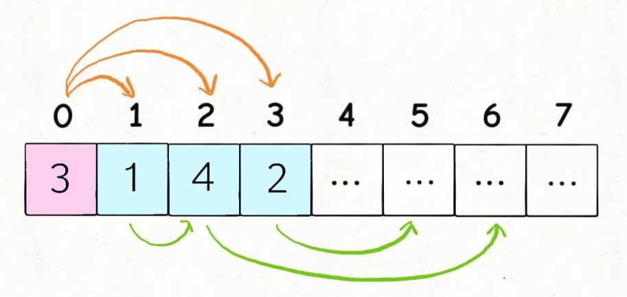

比如上图这种情况应该跳多少呢？

**显然应该跳 2 步调到索引 2，因为`nums[2]`的可跳跃区域涵盖了索引区间`[3..6]`，比其他的都大**。如果想求最少的跳跃次数，那么往索引 2 跳必然是最优的选择。

**这就是贪心选择性质，我们不需要「递归地」计算出所有选择的具体结果然后比较求最值，而只需要做出那个最有「潜力」，看起来最优的选择即可**。

```java
public int jump(int[] nums) {
    // 动态规划的时候是在 p 位置计算所有可能的子问题，在子问题中选择步数最小的
    // --> 贪心算法：如果在 p 位置，下一次可以选择跳的步数就是 p + 1 ~ nums[p]
    // --> 只要我找到 1 ~ nums[p] 中下一次能跳的最远的位置，比如说 [3, 1, 4, 2]，p = 0 的时候跳一次能跳到 p = 2 的位置就好了
    int n = nums.length;
    int farthest = 0, end = 0;
    int jumps = 0;
    // 遍历从 0 到 n - 2，也就是倒数第二个数为止
    // ①如果跳到最后 end = i = n - 2 --> 只要 jumps++ 就肯定能到 n - 1 的位置
    // ②如果跳到最后 end != n - 2 --> 在 n - 2 之前或之后都没关系，能保证 farthest >= n - 1 即可
    for (int i = 0; i < n - 1; i++) {
        // 每次都跳到所有选择中最远的地方
        farthest = Math.max(farthest, i + nums[i]);
        if (end == i) {
            jumps++;
            // end = farthest 可能已经大于等于 n - 1 了，if (end == i) 已经不满足条件
            // jumps 不会再加了
            end = farthest;
        }
    }
    return jumps;
}
```

结合刚才那个图，就知道这段短小精悍的代码在干什么了：

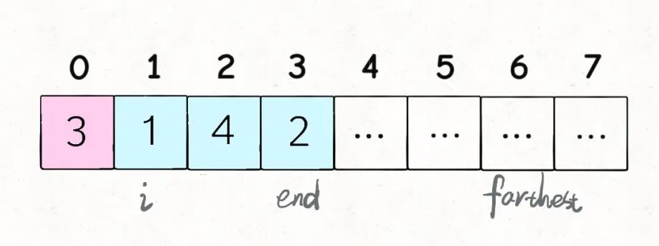

`i`和`end`标记了可以选择的跳跃步数，`farthest`标记了所有可选择跳跃步数`[i..end]`中能够跳到的最远距离，`jumps`记录了跳跃次数。

本算法的时间复杂度 O(N)，空间复杂度 O(1)。大不了就先用动态规划求解，如果动态规划都超时，说明该问题存在贪心选择性质无疑了。

# 2021.2.2记录

## 替换字符串空格(剑指Offer[05])

### 题目描述

```java
// 请实现一个函数，把字符串 s 中的每个空格替换成"%20"。
// 示例 1： 
//
// 输入：s = "We are happy."
//输出："We%20are%20happy."
```

### 思路

遍历字符串 s

### 代码实现

```java
// 思路：遍历字符串 s
public String replaceSpace(String s) {
    StringBuilder sb = new StringBuilder();
    for (char c : s.toCharArray()) {
        if (c == ' ') sb.append("%20");
        else sb.append(c);
    }
    return sb.toString();
}
```

## 从尾到头打印链表(剑指Offer[06])

### 题目描述

输入一个链表的头节点，从尾到头反过来返回每个节点的值（用数组返回）

### 思路

递归反转链表 + 打印

### 代码实现

```java
// 思路：反转整个链表，打印
public int[] reversePrint(ListNode head) {
    int length = 0;
    // 不能直接用 head，会破坏结构
    ListNode curNode = head;
    while (curNode != null) {
        length++;
        curNode = curNode.next;
    }
    int[] res = new int[length];
    // 调用反转链表的函数
    ListNode newHead = reverse(head);
    // 打印
    int i = 0;
    while (newHead != null) {
        res[i] = newHead.val;
        i++;
        newHead = newHead.next;
    }
    return res;
}
// 反转链表
private ListNode reverse(ListNode head) {
    // base case：当只有一个 head 时，返回 head
    if (head == null || head.next == null) {
        return head;
    }

    // 递归除了头结点 head 后面的节点
    ListNode last = reverse(head.next);

    // 更新节点信息
    head.next.next = head;
    head.next = null;

    return last;
}
```

# 2021.2.3.记录

## 正则表达式匹配(LeetCode[10])

### 题目描述

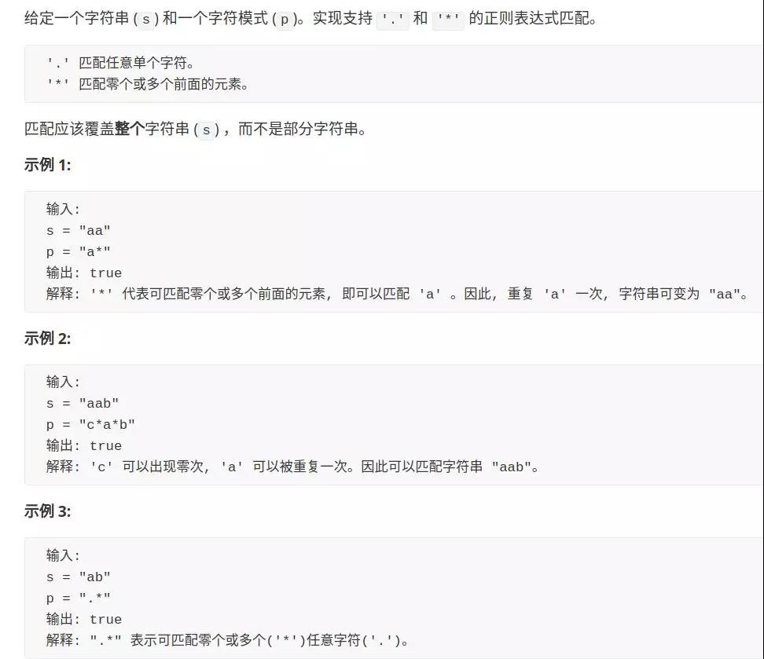

### 思路

**一、处理点号「.」通配符**

点号可以匹配任意一个字符，万金油嘛，其实是最简单的。

```java
// 判断第一个字符是否匹配 + 检测 '.' 符号
boolean first = (!p.isEmpty() && (p.charAt(0) == s.charAt(0) || p.charAt(0) == '.'));
```

**二、处理星号「\*」通配符**

星号通配符可以让前一个字符出现任意次数，包括零次。

星号前面的那个字符到底要出现几次呢？这需要计算机暴力穷举的，假设出现 N 次吧。前文多次强调过，写递归的技巧是管好当下，之后的事抛给递归。具体到这里，不管 N 是多少，当前的选择只有两个：出现 0 次、出现 1 次。所以可以这样处理：

```java
if (p.length() >= 2 && p.charAt(1) == '*') { // 递归的时候我们只考虑当下的字母，其他的给递归
    // ①假设 '*' 表示只重复 0 次前面的字母，让 s 和跳过 '*' 字符的 p 比较，此时也会重新比较 first
    return isMatch(s, p.substring(2)) ||
        // ②如果只考虑当下索引 i = 1 时，'*' 表示重复 1 次前面的字母，通过移动 s 来模拟 '*' 已经重复了前面的字母一次
        (first && isMatch(s.substring(1), p));
```

配合一个图示就能理解这个逻辑了。假设 pattern = "a*", text = "aa"，画个图：

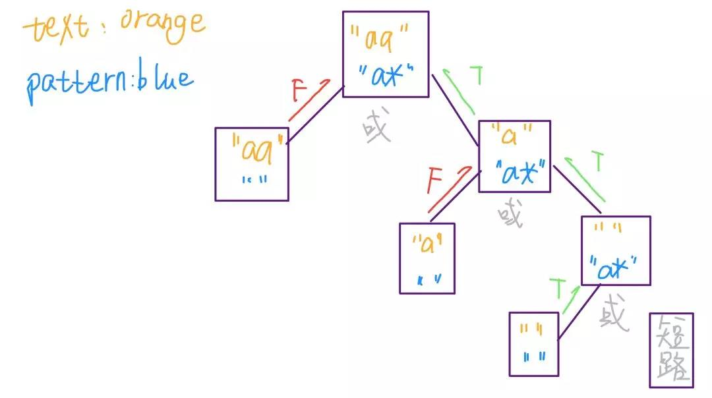

可以看到，我们是通过保留 pattern 中的「\*」，同时向后推移 text，来实现「*」让字符出现多次的功能。

### 代码实现

```java
// 给你一个字符串 s 和一个字符规律 p，请你来实现一个支持 '.' 和 '*' 的正则表达式匹配。
public boolean isMatch(String s, String p) {
    // 创建备忘录
    HashMap<String, Boolean> memo = new HashMap<>();
    int i = 0, j = 0;
    return dp(memo, s, p, i, j);
}
// dp 递归函数定义：返回两个字符串分别从索引 i 和索引 j 比较的结果(true or false)
private boolean dp(HashMap<String, Boolean> memo, String s, String p, int i, int j) {
    // 如果子问题答案备忘录里有，直接取出
    if (memo.containsKey(i + "&" + j)) return memo.get(i + "&" + j);
    boolean ans;
    // base case 1：因为用 i 和 j 记录子问题中比较到了哪个字符串
    // 所以当 j 已经比较到了 p 的末尾，如果 i 没到末尾，说明不一样长，返回 false
    if (j == p.length()) return i == s.length();
    // 判断第一个字符是否匹配 + 检测 '.' 符号
    boolean first = (i < s.length() && (p.charAt(j) == s.charAt(i)
                                        || p.charAt(j) == '.'));
    // 检测 '*'：因为 '*' 可以让字母出现 0 次和 N 次
    if (j <= p.length() - 2 && p.charAt(j + 1) == '*') { // 递归的时候我们只考虑当下的字母，其他的给递归
        // ①假设 '*' 表示重复 0 次前面的字母，让 s 和跳过 '*' 字符的 p 比较，此时也会重新比较 first
        ans = dp(memo, s, p, i, j + 2) ||
            // ②如果只考虑当下索引 i = 1 时，'*' 表示重复 1 次前面的字母，通过移动 s 来模拟 '*' 已经重复了前面的字母一次
            (first && dp(memo, s, p, i + 1, j));
    } else {
        // 如果 '.' 和 '*' 都检测了，剩下就直接正常比较即可
        ans = first && dp(memo, s, p, i + 1, j + 1);
    }
    memo.put(i + "&" + j, ans);
    return ans;
}

// 暴力递归
public boolean isMatch(String s, String p) {
    // base case 1：如果有一个字符串为空，另一个不为空则 false
    if (p.isEmpty()) return s.isEmpty();
    // 判断第一个字符是否匹配 + 检测 '.' 符号
    boolean first = (!p.isEmpty() && (p.charAt(0) == s.charAt(0)
                                      || p.charAt(0) == '.'));
    // 检测 '*'：因为 '*' 可以让字母出现 0 次和 N 次
    if (p.length() >= 2 && p.charAt(1) == '*') { // 递归的时候我们只考虑当下的字母，其他的给递归
        // ①假设 '*' 表示只重复 0 次前面的字母，让 s 和跳过 '*' 字符的 p 比较，此时也会重新比较 first
        return isMatch(s, p.substring(2)) ||
            // ②如果只考虑当下索引 i = 1 时，'*' 表示重复 1 次前面的字母，通过移动 s 来模拟 '*' 已经重复了前面的字母一次
            (first && isMatch(s.substring(1), p));
    } else {
        // 如果 '.' 和 '*' 都检测了，剩下就直接正常比较即可
        return first && isMatch(s.substring(1), p.substring(1));
    }
}
```

**你怎么知道它就存在「重叠子问题」呢？**这似乎不容易看出来呀。

解答这个问题，最直观的应该是随便假设一个输入，然后画递归树，肯定是可以发现相同节点的。这属于定量分析，其实不用这么麻烦，下面教你定性分析，一眼就能看出「重叠子问题」性质。

先拿最简单的斐波那契数列举例，我们抽象出递归算法的框架：

```
def fib(n):
    fib(n - 1) #1
    fib(n - 2) #2
```

看着这个框架，请问原问题 f(n) 如何触达子问题 f(n - 2) ？有两种路径，一是 f(n) -> #1 -> #1, 二是f(n) -> #2。前者经过两次递归，后者经过一次递归而已。两条不同的计算路径都到达了同一个问题，这就是「重叠子问题」，而且可以肯定的是，只要你发现一条重复路径，这样的重复路径一定存在千万条，意味着巨量子问题重叠。

同理，对于本问题，我们依然先抽出算法框架：

```
def dp(i, j):
    dp(i, j + 2)     #1
    dp(i + 1, j)     #2
    dp(i + 1, j + 1) #3
```

提出类似的问题，请问如何从原问题 dp(i, j) 触达子问题 dp(i + 2, j + 2) ？至少有两种路径，一是dp(i, j) -> #3 -> #3，二是 dp(i, j) -> #1 -> #2 -> #2。因此，本问题一定存在重叠子问题，一定需要动态规划的优化技巧来处理。

# 2021.2.4记录

## 青蛙跳台阶问题(剑指Offer[10])

### 题目描述

一只青蛙一次可以跳上1级台阶，也可以跳上2级台阶。求该青蛙跳上一个 n 级的台阶总共有多少种跳法。

### 思路

最后台阶 = n 的时候，子问题有两种策略：

+ 跳 1 级台阶，dp[n] = dp[n - 1]
+ 跳 2 级台阶，dp[n] = dp[n - 2]

所以 dp[n] = dp[n - 1] + dp[n - 2]

### 代码实现

```java
/* 青蛙跳台阶 */
public int numWays(int n) {
    if (n <= 0) return 1;
    // base case
    int[] dp = new int[n + 1];
    dp[0] = 1;
    dp[1] = 1;
    for (int i = 2; i < n + 1; i++) {
        dp[i] = dp[i - 1] + dp[i - 2];
        dp[i] %= 1000000007;
    }
    return dp[n];

    //        if (n == 0 || n == 1) return 1;
    //        return numWays(n - 1) + numWays(n - 2);
}
```

## 旋转数组的最小数字(剑指Offer[11])

### 题目描述

把一个数组最开始的若干个元素搬到数组的末尾，我们称之为数组的旋转。输入一个递增排序的数组的一个旋转，输出旋转数组的最小元素。

### 思路

先判断数组前面有几个递增的数字 ---> 返回的最小值就是 nums[count]

### 代码实现

```java
/* 旋转数组的最小值 --> 找数组的最小值 */
public int minArray(int[] numbers) {
    int count = 1;
    for (int i = 1; i < numbers.length; i++) {
        if (numbers[i] >= numbers[i - 1]) {
            count++;
        }
        else {
            break;
        }
    }
    if (count == numbers.length) {
        return numbers[0];
    } else {
        return numbers[count];
    }
}
```

## 二进制中 1 的个数(剑指Offer[15])

### 题目描述

请实现一个函数，输入一个整数（以二进制串形式），输出该数二进制表示中 1 的个数。例如，把 9 表示成二进制是 1001，有 2 位是 1。

### 思路

二进制数最右一位一直跟 1 进行 "&" 的操作，循环移位二进制数即可。

### 代码实现

```java
// you need to treat n as an unsigned value
public int hammingWeight(int n) {
    int count = 0;
    while (n != 0){
        // 判断 n 的最右一位二进制数是否为 1：n & 1;
        count = count + (n & 1);
        // 无符号右移一位 n
        n >>>= 1;
    }
    return count;
}
```

## 分割(LeetCode[416])

### 题目描述


### 思路


### 代码实现

```java
1
```

