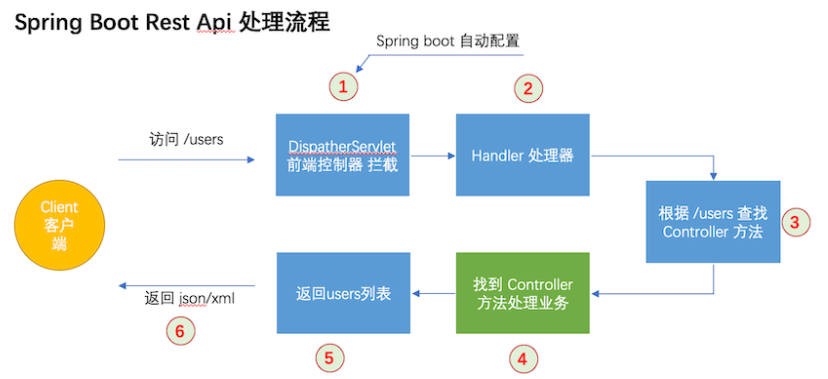

#  2020.12.19记录

## SpingBoot注解

### 1. @Conctroller 等

+ 在 Spring Boot 中，@Controller 注解是专门用于处理 Http 请求处理的，是以 MVC 为核心的设计思想的控制层。

+ @RestController 则是 @Controller 的衍生注解。

Spring Boot 本身是 Spring MVC 的简化版本。是在 Spring MVC 的基础上实现了自动配置，简化了开发人员开发过程。其中

+ Spring MVC 通过一个叫 **DispatcherServlet** 前端控制器来拦截请求的。
+ Sping Boot 中使用自动配置把 **DispatcherServlet** 前端控制器自动配置到框架中。



1. **DispatcherServlet** 前端控制器拦截请求 “/users”
2. **servlet** 觉得使用那个 **handler** 处理
3. Spring 检测那个控制器匹配 **/user**，Spring 从 @RequestMapping 中查找出需要的信息
4. Spring 找到正确的 Controller 方法后，开始执行 Controller 方法
5. 返回 users 对象列表
6. 根据与客户端交互需要返回 Json 或 Xml 格式

---

# 2020.12.21记录

### @RequestBody注解

==作用：==将 HTTP 请求正文插入方法中，使用何时的 HttpMessageConverter 将请求体写入某个对象。

```java
1)该注解用于读取 Request 请求的 body 部分数据，使用系统默认配置的 HttpMessageConverter 进行解析到要	 返回的对象上；
2)再把 HttpMessageConverter 返回的对象数据绑定到 controller 中方法的参数上。
```

## 