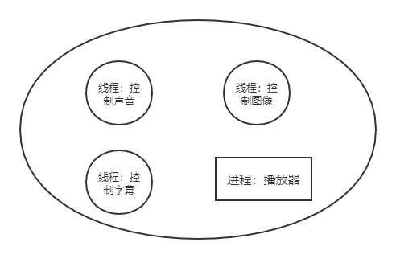
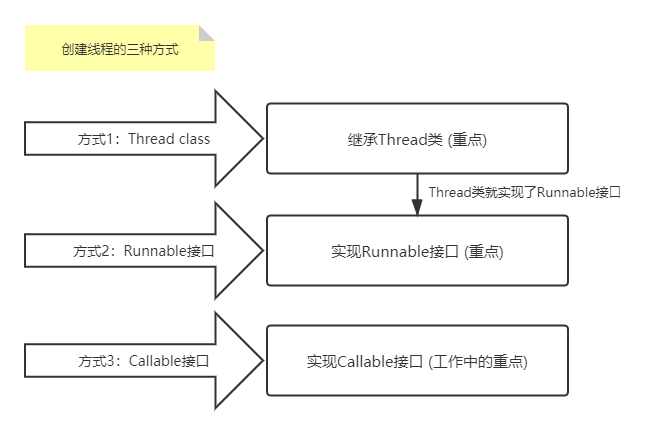

# 多线程学习笔记 Java.Thread

## 2020.12.22记录

## 线程、进程、多线程

**多任务：**比如边吃饭边玩手机，虽然看起来是多个任务同时在做，其实本质上我们的大脑在同一时刻依旧只做了一件事情。

**多线程：**比如说单车道的马路，容易造成道路阻塞，效率低 ---> 多车道，提高效率。两个人同时游戏。

## 程序、进程(Process)、线程(Thread)

在操作系统中运行的程序就是进程，比如QQ、播放器、游戏和 IDEA 等等。。

而一个进程中可以有多个线程，如视频中同时听到的声音、图像、弹幕等等。。



+ 程序：是指令和数据的有序集合，其本身没有任何运行的含义，是一个静态的概念。
+ 进程：是执行程序的一次执行过程，它是一个动态的概念。是资源分配的单位。
+ 线程：通常一个进程之中包含若干个线程，当然一个进程中至少有一个线程；不然没有存在的意义。线程是 CPU 调度和执行的单位。==真正执行的是线程！！！==

**注意：**很多多线程是模拟出来的，真正的多线程是指有多个 CPU，即多核，如服务器。如果是模拟出来的线程，在同一个时间点，CPU 只能执行一个代码，因为切换的速度很快，所以就有同时执行的错觉。

核心概念：

+ 线程就是独立的执行路径，比如有一个 main 线程，还有一个 GC(垃圾回收线程，JVM 提供的，守护线程)，main 线程结束了，GC 也就结束了；
+ 在程序运行时，即使没有自己创建线程，后台也会有多个线程，如主线程和 gc 线程；
+ main() 线程是主线程(用户线程)，为系统的入口，用于执行整个程序，自己写的线程也在 main() 线程里；
+ 在一个线程中，如果开辟了多个线程，线程的运行由调度器安排调度，调度器是与操作系统密切相关的，先后顺序是不能人为的干预的；
+ 对应同一份资源，会存在资源抢夺的问题，需要加入并发的控制；
+ 线程会带来额外的开销，如 CPU 调度时间，并发控制开销等；
+ 每个线程都在自己的工作内存交互，内存控制不当会造成数据不一致。

## 线程创建



1. 继承 Thread 类，重写 run() 方法，调用 start 开启线程

```java
public class TestThread1 extends Thread {
    @Override
    public void run() {
        // run 方法线程体
        for (int i; i < 20; i++) {
            System.out.println(i);
        }
    }
    
    public static void main(String[] args) {
        // main 线程，主线程
        
        // 创建一个线程对象，调用start方法开启线程
        TestThread1 testThread1 = new TestThread1();
        // 调用start方法开启线程
        testThread1,start();
        for (int i; i < 20; i++) {
            System.out.println("主线程" + i);
        }
    }
}
```

注意：线程开启不一定立即执行，由 CPU 进行调度