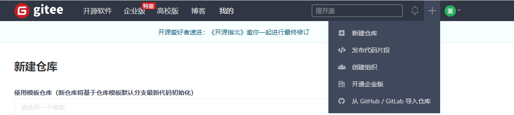
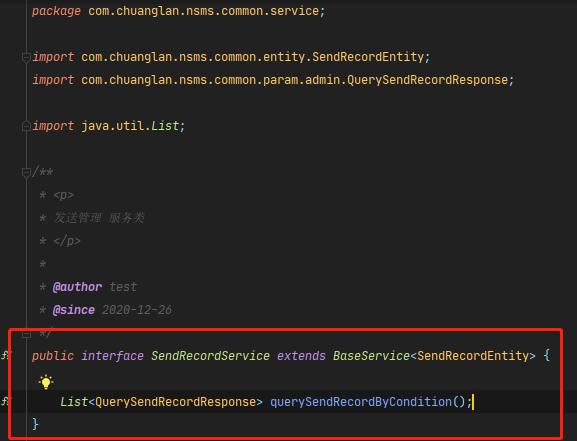
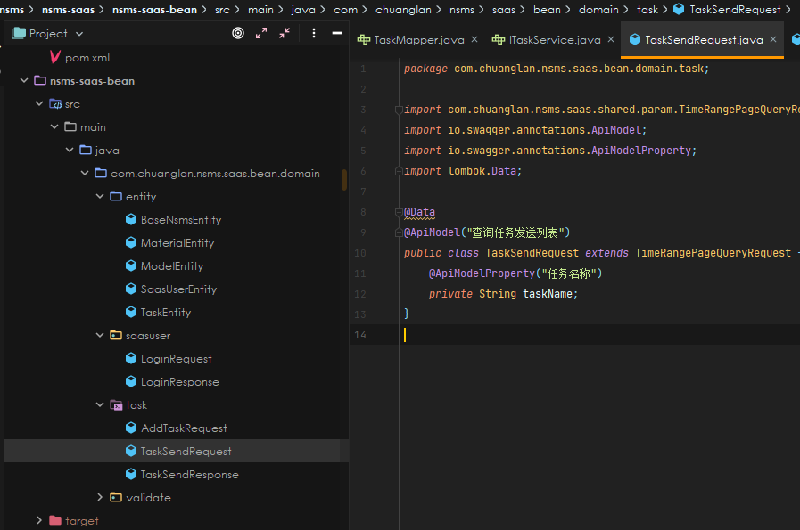
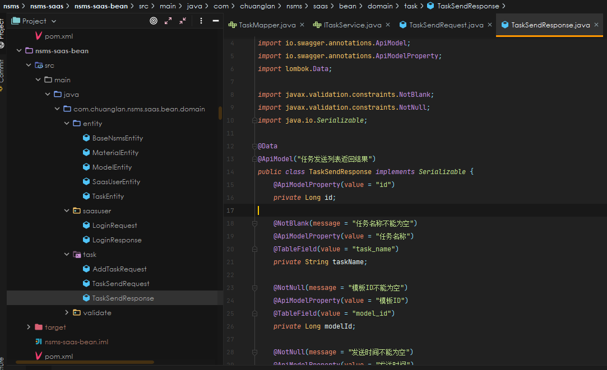

# 2020.12.15 记录

## Git项目的搭建

### 常用命令及文件状态

+ 新建本地仓库：初始化命令  **git init**
+ 克隆远程仓库：克隆命令  **git clone + URL**

> 查看文件状态

```bash
#查看指定文件状态
git status [filename]

#查看所有文件状态
git status

#添加所有文件到暂存区
git add .

#提交暂存区中的所有文件到本地仓库，-m表示提交的信息
git commit -m "消息内容"
exam： git commit -m "new file hello.txt"
```

+ 注：平时编写要提交的文件时，均放在.git文件夹所在的工作目录下，如下图所示


<center>git工作目录<center>


> 忽略文件

有时候我们不想把某些文件纳入版本控制中，比如数据库文件、临时文件、设计文件等

在IDEA的主目录下建立".gitignore"文件，此文件有如下规则：

1. 忽略文件中空行或以井号(#)开始的行会被忽略。
2. 可以使用 Linux 通配符。例如：星号(*)表示任意多个字符，问号(?)代表一个字符，方括号([abc])代表可选字符范围，大括号({string1,string2,...})代表可选的字符串等。
3. 如果名称的最前面有一个感叹号(!)，表示例外规则，将不被忽略。
4. 如果名称的最前面有一个路径分隔符(/)，表示要忽略的文件在此目录下，而子目录中的文件不忽略。
5. 如果名称的最后面有一个路径分隔符(/)，表示要忽略的是此目录下该名称的子目录，而非文件(默认文件或目录都忽略)。

```bash
#为注释
*.txt		#忽略所有 .txt 结尾的文件，这样上传的话不会被选中！
！lib.txt    #除了 lib.txt 文件外其他的文件都忽略
/temP        #仅忽略项目根目录下的 TODO 文件，不包括其它目录 temp
build/       #忽略 build/ 目录下的所有文件
doc/*.txt    #会忽略 doc/notes.txt 但不包括 doc/server/arch.txt
```

### 使用码云

>国内一般使用gitee

1. 注册登录码云，完善个人信息


2. 设置本机绑定SSH公钥，实现免密码登录！(码云是远程仓库，我们平时工作在本地仓库)

```bash
# 进入 C:\users\Administrator\.ssh 目录
# 生成公钥
在.ssh 目录下打开git Bash 输入命令ssh-keygen -t rsa
```


3. 将公钥复制到码云账户中即可！
4. 使用码云创建一个自己的仓库。



5. 克隆到本地

### IDEA中集成Git

1. 新建项目，绑定Git。
   + 将我们远程的git文件目录拷贝到项目中即可！

2. 修改文件，使用IDEA操作git。
3. 上传到远程仓库。

# 2020.12.22记录

## SpringBoot 中 Model、Dao、Service 和 Controller 层的理解

一般基于 SpringBoot 的项目基本可以分为以下几个层次：

+ Dao 层(Mapper 层)
+ Service 层(业务层)
+ Model(entity 层)
+ Controller(控制层)

各层的作用：

> Dao 层

即数据持久层，对数据做持久化处理。也被称为 mapper 层。Dao 层的作用为==访问数据库，向数据库发送 sql 语句，完成对数据的增删改查任务。==

> Service 层

业务层，Service 层的作为为完成设计任务。存放业务逻辑处理，不直接对数据库进行操作，有接口和接口实现类，提供 Controller 层调用的方法。调用 Dao 层接口，接收 Dao 层返回的数据，完成项目的基本功能设计。(也就是说对于项目的功能需求是在这里完成的)

> Model 层

即数据库实体层，也被称为 entity 层、popj 层。这里存放的实体类，属性值和数据库中的属性值保持一致。实现 set 和 get 方法。

> Controller 层

控制器层，Controller 层的功能为请求和相应控制。==Controller 层负责前后端交互，接收前端的请求，调用 Service 层，接收 Service 层返回的数据，最后返回具体的页面和数据到客户端。==

对于一个 Web 项目，从发起请求到给与响应的流程是这样的：


# 2020.12.24记录

## SpringBoot 项目学习

### Spring 相关注解

1. @Controller：标识为一个控制器，Spring 会自动实例化该类
2. @RestController：返回格式就都是 `text/json`
3. @RequestMapping：URL 映射
4. ResponseBody：将返回结果自动转换成 json 串

### Application 类解析(启动类)

```java
import org.springframework.boot.SpringApplication;
import org.springframework.boot.autoconfigure.SpringBootApplication;
 
@SpringBootApplication
public class Application {
 
    public static void main(String[] args) throws Exception {
        SpringApplication.run(Application.class, args); // 这个方法的作用是加载Application这个类
    }
}
```

这个类的唯一特殊的地方是一个注解@SpringBootApplication，所以 Spring boot 的运行跟这个注解有着诸多的联系。作用为：

+ 标志该类为一个配置类。
+ 指定扫描的包，便于Spring IoC容器对其进行实例和生命周期的管理。
+ 自动配置，通过引入的jar包，猜测用户的意图进行自动化配置。

### SpringBoot 访问数据库操作

方式①：JdbcTemplate

## 安装 MySQL 5.7 步骤及注意事项

> ①官网下载 MySQL

​		https://dev.mysql.com/downloads/mysql/5.6.html

> ②解压到需要安装的文件夹下面，创建 my-default.ini 文件

```mysql
[mysql]

# 设置mysql客户端默认字符集

default-character-set=utf8 

[mysqld]

#设置3306端口

port = 3306 

# 设置mysql的安装目录

basedir=C:\Users\ChuangLan\Desktop\MySQL\mysql-5.7.32-winx64

# 设置mysql数据库的数据的存放目录

datadir=C:\Users\ChuangLan\Desktop\MySQL\mysql-5.7.32-winx64\data

# 允许最大连接数

max_connections=200

# 服务端使用的字符集默认为8比特编码的latin1字符集

character-set-server=utf8

# 创建新表时将使用的默认存储引擎

default-storage-engine=INNODB

```

>③在Windos环境变量path中添加了mysql5.7\bin目录后，使用管理员命令行，安装 mysql

```mysql
mysqld install
```

> ④此时安装文件夹下面还没有 data 文件夹，需要用以下命令生成：

```mysql
mysqld  --initialize-insecure （不设置root密码，建议使用）
```

> ⑤启动 MySQL 服务

```mysql
net start mysql
```

## Navicat 连接 MySQL

1. 打开Navicat客户端,选择菜单 文件-->新建连接-->MySQL 如下图所示：


2. 在新建连接弹框中输入链接名（随意取,方便连接多个数据库区分连接））,其它默认即可，可以点击 连接测试按钮 检查连接是否正常。如下图所示


3. 连接成功后点击确定即可进入Mysql数据库，在里面可进行创建数据库、创建表、查询等一系列数据库操作


---

# 2020.12.25记录

## 5G消息平台项目整体流程图、


# 2020.12.28记录

## GitLab 项目管理

### 操作流程：

1. 登录到 GitLab


里面包括项目 URL 和项目分支。

2. 在本地使用 Git 将项目克隆到本地，使用 IDEA 打开，选择需要的分支进行Checkout


3. 在 IDEA 中，点击 File --> Project Structure --> "+": Import Model 找到刚克隆的项目 --> 选择相应文件夹设置为 Source 文件夹


---

# 2020.12.30记录

IDEA 中报**“Could not autowire. No beans of 'SubmitRecordAdminService' type found.”**错误，因为在SubmitRecordAdminService 接口的实现类中没有加上 **@Service** 注解。

# 2021.1.4记录

## 处理上行消息更新数据库字段问题

### 1.项目接收上行消息操作的数据在哪里获取？

```java
// 读取通道中的上行消息数据
@Override
protected void channelRead0(ChannelHandlerContext ctx, FullHttpRequest request) {
    HttpHeaders headers = request.headers();
    String content = request.content().toString(CharsetUtil.UTF_8);
    // 可以在日志中进行查看
    log.info("{},ctx:{}", content, ctx);
    ctx.writeAndFlush(handleHttpRequest(request, content, headers)).addListener(ChannelFutureListener.CLOSE);
}
```

### 2.将缓存中的数据更新到本地数据库时，已读状态、已撤回状态更新在哪个字段中？


发送下行消息的时候。当在一定时间范围内收到上行通知时，就表明下行消息已经成功地发送到手机上，即可以完成计费的操作，并更新 `发送状态` 字段由 `已发送` ---> `发送成功`，否则更新字段由 `已发送` ---> `发送失败`。

### 3.上行消息怎么查看，解析？

安装可以连接服务器的软件，并获取相应的日志，查看日志即可获取上行消息的内容。

1. 安装软件 MobaXterm


2. 登录服务器


### 4.handleChatBotCallBackMsg() 方法中是根据 send_record 表相关字段为条件，查询出需要更新的字段，作为 response 返回？


**重写handleChatBotCallBackMsg函数_根据条件查询需要更新字段**


### 5.handleResult()函数是更新数据操作?


### 6.项目各个模块的含义？

+ boss 端中各个包的含义？


+ business 包中各个子包的含义？


+ common模块的作用？


#### Linux 相关指令

+ 返回根目录

```linux
# cd /home
```

+ 展示目录下的文件夹

```Linux
# ll
```


+ 进入某个文件夹

```Linux
# cd logs
```


+ 查看日志信息

```Linux
# tail -f nsms-boss-info.log
```


# 2020.1.8记录

## 接口开发流程(单日发送量查询接口)

### 1.明确需要处理哪张表，然后编写 MySQL 语句处理数据

比如单日发送量查询接口需要处理 send_record 表格


编写 MySQL 查询语句：


这个语句需要先在 Navicat 软件上运行通过后再复制到项目代码中


运行结果：


### 2.定义一个实体作为数据的返回类型，并为这个查询语句声明一个函数名称


其中数据返回的实体类 QuerySendRecordResponse 定义如下：


### 3.定义查询单日发送总量的 Service 接口



### 4.编写单日发送总量 Service 接口的实现类


==以上的过程均在 DAO(数据持久层，Dao 层的作用为访问数据库，向数据库发送 sql 语句，完成对数据的增删改查任务。)中，在 5G 项目中 Dao 层体现为 nams-common 端。==

### 5.Admin 端创建对应的 Service 接口调用 nams-common 端的 Service

#### 编写 SendRecordAdminService 接口


#### 编写 SendRecordAdminService 接口的实现类


这里实际调用的方法是：在 nsms-common 端中写的 SendRecordService 的实现类 SendRecordServiceImpl 中的方法 querySendRecordByCondition()，而SendRecordServiceImpl 中的方法 querySendRecordByCondition()返回的即是 MySQL 语句查询后的结果。


### 6.编写 Admin 端的 Controller


# 2021.1.9记录

## 解决 GitHub 上无法更新 Commit 小绿点的问题

1. 在自己的项目中运行 Git Bash 
2. 查看日志

```git
git log
```


查看邮箱消息是不是自己 github 上配置的

3. 重新配置邮箱和用户名

```git
git config --global user.email 'xxxxxx@qq.com'
git config --global user.name 'blueone'
```

4. 如果想回复之前没有显示成功的小绿点，可以在 Github 的设置中把之前错误提交的邮箱地址添加进去，刷新网址即可。


## Git 中如何撤销 Commit 到未提交的状态

+ 把最后的commit切回 Changes to be committed状态，使用命令

```git
git reset --soft HEAD^
注意：Windows系统需要在^符号后面两边加上引号，如：

git reset --soft HEAD"^"
```

+ 把最后的commit切回Changes not staged for commit状态，使用命令

```java
git reset HEAD^
```

+ 把Changes to be committed状态切回Changes not staged for commit状态，使用命令

```java
git reset HEAD <file>...          # 单个文件
git reset HEAD -- .               # 所有Changes to be committed的									  文件
```

# 2021.1.12记录

## 如何删除 GitHub 上的文件(夹)

要知道在baidugithub上只能删除仓库,却无法删zhi除文件夹或文件, 所以只dao能通过命令来解决：

1. 首先进入main文件夹下, Git Bash Here
2. $ git pull origin mian将远程仓库里面的项目拉下来，$ dir  查看有哪些文件夹
3. 此时$ git rm -r --cached LeetCodeTemp 删除target文件(夹)。


4. $ git commit -m '删除了target'  提交,添加操作说明，如图。
5. 最后$ git push -u origin master 将本次更改更新到github项目上去，删除完毕。

# 2021.2.17记录

## 如何根据项目需求设计相应的数据库表

### 案例：5G消息提交管理模块的数据库表设计

其中提交管理模块的设计图如下：


如何设计如下数据库表？


# 2021.2.19记录

## SAAS平台任务列表(分页查询发送内容)接口开发流程

### 产品设计图


### 接口开发流程

**1、设计数据库表**


**2、构建数据库表的实体类**


**3、SpringBoot 框架数据持久层中创建 Mapper 文件**


**4、根据产品图创建查询请求的实体类**



就是我们根据任务名称这个条件，查出数据库中所有是这个名称的结果。

**5、根据产品图创建查询结果的实体类**



就是我们查询到的结果

**6、新建模块接口**


定义接口需要实现的方法：queryTaskList(PageQueryRequest request)

**7、编写模块接口的实现类**


真正去实现接口中定义的方法

**8、编写前端控制器**


**9、运行项目，在 Swagger 页面进行调试**


### 注意事项

SpringBoot 项目中使用任何的工具框架，比如说 MyBatisPlus、Swagger 框架，都需要在对应的子项目中添加配置文件才能使用！！


# 2021.3.1记录

## IDEA 中无法提交到 GitHub 中的解决方法

### 方法1

1、看看你的git配置

> git config --global -l 

2、取消代理：

> **git config --global --unset http.proxy** 
>
> **git config --global --unset https.proxy** 

### 方法2

探索过程：我严重怀疑GitHub的所有节点和dns都被抢走，或者被屏蔽，禁用了，也就是我们所说的，这个网站成为了“外网”，那外国的网站，就需要用VPN虚拟模拟，才能够进行正常的访问，但是我今天尝试了很多VPN软件，包括SSR/SS 飞机的方法都无效，我就感觉是我的DNS出了问题，是不是我的DNS无法获取到正确的IP地址？然后导致无法访问呢？
分析过程：然后，我就对我的DNS做了分析，发现我无论改成什么DNS还是没有用，经过我查阅外网无法访问的历史，我发现现在的“墙”技术并不是很高级，而“劫持DNS”让你无法获取到正确的IP地址才是一直在进步，那为什么墙的技术无法再深入的升级强化呢？因为对方的地区显示的就是外国的，你很难去分辨，虽然现在的卫星定位技术已经可以做到了，但并不是所有的网站都有如此强势的实力，所以当人家的地区是外国地区的时候，你就不能不让人家访问，这就是所谓的墙（检测你的地区、国家，是否符合！），**所以墙这个东西，我们可以用“代理”的方法来破解，或者说用VPN直接虚假模拟一下，就可以破解了。**现在多数都用VPN，而据我所知VPN的流量其实并不是它们开放的流量，使用的还是你自己家的流量，它们的软件只是给你伪装了一下地区，你的IP地址的国家，就是一个伪装，发送假信息的过程，它们只是利用什么流量的剩余，来卖给你，赚钱而已。因为你不懂这个技术呀，所以人家坑你，很正常。
再一个就说到了重点：我们的劫持DNS，DNS污染，不让你获取到正确的IP地址，这种手段的意思就是无论你是哪个国家的，如果你没有我们国家开放的DNS，我们就不会让你获取到正确的IP地址，或者说没有我们国家的网络，软件，浏览器，很多因素，就无法让你获取到正确的IP地址，而现在的网站，每一个模块，甚至图片都有可能有它独立的IP地址，我们HitGub这个网站就是本身的访问地址，并不能让你获取到真正的IP地址，导致你在进入主页的时候，就被劝退了！说白了就是：你输入的网址是错误的，怎么可能访问进去呢？
**所以我们就可以用 添加host的方式，让系统记录下来这些正确的IP地址，然后让其发生这种情况的时候，系统自动的去访问这些正确的IP地址即可，就可以解决这种现状！**

解决方案：
Cd到文件位置：C:\Windows\System32\drivers\etc\hosts
输入以下内容：

```c++
日期：2021/1/28 搜查到新的地址和IP 已经实时更新！
#GitHub Start
140.82.114.4 github.com
140.82.113.4 gist.github.com
185.199.108.153 assets-cdn.github.com
199.232.96.133 raw.githubusercontent.com
199.232.96.133 gist.githubusercontent.com
199.232.96.133 cloud.githubusercontent.com
199.232.96.133 camo.githubusercontent.com
199.232.96.133 avatars.githubusercontent.com 
199.232.96.133 avatars0.githubusercontent.com
199.232.96.133 avatars1.githubusercontent.com
199.232.96.133 avatars2.githubusercontent.com
199.232.96.133 avatars3.githubusercontent.com
199.232.96.133 avatars4.githubusercontent.com
199.232.96.133 avatars5.githubusercontent.com
199.232.96.133 avatars6.githubusercontent.com
199.232.96.133 avatars7.githubusercontent.com
199.232.96.133 avatars8.githubusercontent.com
#GitHub End
```

