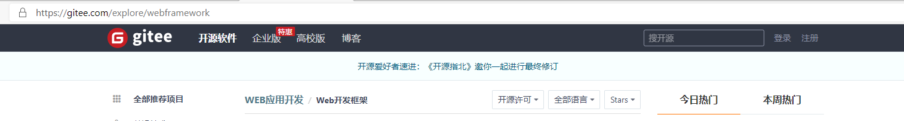
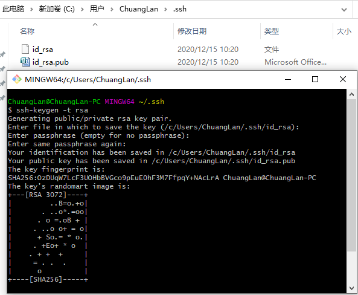

@[TOC](目录)

# 2020.12.14记录

## Linux系统是如何收发网络包的？

### 网络模型

为了解决多个终端设备通过网络互相通信的问题，国际标准化组织制定了开放式互联网通信参考模型(*Open System Interconnection Reference Model*)，即 OSI 网络模型。该模型有7层：

+ 应用层：负责给应用程序提供统一的接口；
+ 表示层：负责把一个系统发送的数据转化成另一个系统能识别的格式；
+ 会话层：负责建立、管理和终止表示层实体之间的通信会话；
+ 传输层：负责端到端的数据传输；
+ 网络层：负责数据的路由、转发和分片；
+ 数据链路层：负责数据的封帧和差错检测以及 MAC(Media Access Control Address，也称局域网地址、以太网地址或物理地址，用来确认网络设备位置的位址) 寻址；
+ 物理层：负责在物理网络中传输数据帧。

但是 OSI 模型只是概念理论上的分层，没有具体的实现方案。实际应用中采用的是四层模型，即 TCP/IP 网络模型(Transmission Control Protocol/Internet Protocol，传输控制协议/网络协议，指能够在多个不同网络间实现信息传输的协议簇，不仅仅包含TCP协议和IP协议)。Linux 系统正是按照这套网络模型实现网络协议栈的。

TCP/IP 网络模型有四层：

+ 应用层：负责向用户提供一组应用程序，比如 HTTP、DNS、FTP 等；
+ 传输层：负责端到端的通信，比如 TCP、UDP 等；
+ 网络层：负责网络包的封装、分片、理由、转发、比如IP、ICMP等；
+ 网络接口层：负责网络包在物理网络层中的传输，比如网络包的封帧、MAC 寻址、差错检测、网卡传输网络帧等。

OSI 模型和 TCP/IP 模型的对比：


<center>OSI与TCP模型对比图</center>

七层和四层负载均衡，是用 OSI 网路模型来表述的，七层对应的应用层，四层对应的传输层。

-------

### 网络协议栈

**我们可以吧自己的身体比作应用层中的数据，打底衣服比作传输层中的 TCP 头，外套比作网络层中的 IP 头，帽子和鞋子分别比作网络接口层的帧头和帧尾。**

在冬天这个季节，当我们要从家里出去玩的时候，自然要先穿个打底衣服，再套上保暖外套，最后穿上帽子和鞋子才出门，这个过程就好像我们把 TCP 协议通信的网络包发出去的时候，会把应用层的数据按照网络协议栈层层封装和处理。如下图所示：


<center>应用层数据在每一层的封装格式</center>

其中：

+ 传输层：给应用层数据前面加了 TCP 头；
+ 网络层： 给 TCP 数据前面加了 IP 头；
+ 网络接口层：给 IP 数据包前后分别增加了帧头和帧尾。

这些新增和头部和尾部是按照特定的协议格式填充，这每一层都增加了各自的协议头，那自然网络包的大小就增大了，但物理链路并不能传输任意大小的数据包，所以在以太网中，规定了最大传输单元（MTU）是 `1500` 字节，也就是规定了单次传输的最大 IP 包大小。

当网络包超过 MTU 的大小，就会在网络层分片，以确保分片后的 IP 包不会超过 MTU 的大小；如果 MTU 越小，需要分的包就越多，那么网络吞吐能力就越差，相反 MTU 越大，分包数量越小，网络吞吐能力越好。

Linux 网络协议栈如图所示：


<center>Linux 网络协议栈</center>

其中：

+ 应用程序需要通过系统调用，来跟 Socket 层进行数据交互；
+ Socket 层下面是传输层、网络层和网络接口层；
+ 最下面一层是网络驱动程序和硬件网卡设备。

--------

### Linux 接收网络包的流程

网卡是计算机里专门负责接收和发送网络包的硬件，当网卡接收到一个网络包后，会通过 DMA 技术，将网络包放入到 Ring Buffer 环形缓冲区，该缓冲区在内核内存中的网卡驱动里。

在接收到网络包之后，怎么告诉操作系统这个网络包已经到达了呢？

最简单的一种方式是触发中断，每当网卡收到一个网络包，就会触发一个中断告诉操作系统。但是，在高性能的网络场景下，网络包的数量非常大，因此这样会频繁的触发中断。这样会导致 CPU 频繁的停下手里的事，去处理这些网络包，也就是处理中断，处理完毕后才会去继续做其他事情，导致其他任务可能无法继续前进，从而影响整体效率。

所以为了解决频繁中断带来的性能开销，Linux 内核引入了  **NAPI 机制**，他是混合中断和轮询的方式接收网络包。核心是：**不采用中断的方式读取数据，而是首先采用中断唤醒数据接收的服务程序，然后用 Poll 的方法来轮询数据。**

比如，当有网络包到达时，网卡发起硬件中断，于是会执行网卡硬件中断处理函数，中断处理函数处理完需要**暂时屏蔽中断**，然后唤醒软中断来轮询处理数据，直到没有新数据时才恢复中断，这样一次中断处理多个网络包。即可以降低网卡中断带来的性能开销。

软中断处理网络包时，它会从 Ring Buffer 中拷贝数据到内核 structsk_buff 缓冲区中，从而可以作为一个网络包交给网络协议栈进行逐层处理。

+ 首先，会先进入到往网络接口层，在这一层会检查报文的合法性，如果不合法则丢弃，合法则会找到该网络包的上层协议的类型，比如是 IPv4，还是 IPv6，接着再去掉帧头和帧尾，然后交给网络层；
+ 到了网络层，取出 IP 包，判断网络包下一步的走向，比如时交给上层处理还是转发出去。当确认这个网络包要发给本机之后，就会从 IP 头里看看上一层协议的类型，时 TCP 还是 UDP， 接着去掉 IP 头，交给传输层；
+ 传输层去除 TCP 头或 UDP 头，根据四元组[源 IP、源端口、 目的 IP、目的端口] 作为标识，找出对应的Socket，并把数据拷贝到 Socket 的接收缓冲区。
+ 最后，应用层程序调用 Socket 接口，从内核的 Socket 接收缓冲区读取到新到来的数据到应用层。

至此，一个网络包的接受过程就结束了，如下图：


<center>网络包接收发送过程图<center>

### Linux 发送网络包的过程

如图右半部分，发送与接收流程相反。

+ 首先，应用程序会调用 Socket 发送数据包的接口，由于这个是系统调用，所以会从用户态陷入到内核态中的 Socket 层，Socket 层会将应用层数据拷贝到 Socket 发送缓冲区中。
+ 接下来，网络协议栈从 Socket 发送缓冲区中取出数据包，并按照 TCP/IP 协议栈从上到下逐层处理。如果使用的是 TCP 传输协议发送数据，那么会在传输层增加 TCP 包头，然后交给网络层，网络层会给数据包增加 IP 包，然后通过查询路由表确认下一跳的 IP，并按照 MTU 大小进行分片。
+ 分片后的网络包，就会被送到网络接口层，在这里会通过 ARP 协议获得下一跳的 MAC 地址，然后增加帧头和帧尾，放到发包队列中。
+ 这一些准备好后，会触发软中断告诉网卡驱动程序，这里有新的网络包需要发送，最后驱动程序通过 DMA，从发包队列中读取网络包，将其放入到硬件网卡的队列中，随后物理网卡再将它发送出去。

### 总结

当应用程序通过 Socket 接口发送数据包，数据包会被网络协议栈从上到下进行逐层处理后，才会被送到网卡队列中，随后由网卡将网络包发送出去。

而在接收网络包时，同样也要先经过网络协议栈从下到上的逐层处理，最后才会被送到应用程序。

-----

## LRU 缓存淘汰算法

Java 中的内置类型 LinkedHashMap 可以直接实现。LinkedHashMap 继承于HashMap，HashMap 是无序的，当我们希望有顺序地去存储 key-value 时，就需要使用 LinkedHashMap 了。**借助链表的有序性使得链表元素维持插入顺序，同时借助哈希映射的快速访问能力使得我们可以以O(1)的时间复杂度访问链表的任意元素。**

### 概念&原理

LRU(Least Recently Used) 淘汰算法：最近使用过的数据是有用的，很久没有使用过的数据是没用的。比如手机中的后台运行。

LinkedHashMap(哈希链表) 底层原理是用 HashMap + DoubleList(双向链表) 实现的。其中 HashMap 中存放的 key 是双向链表中的key，val 存放的是双向链表的节点 Node ，虽然在 HashMap 中键值对的排序是无序的，但是在双向链表中是有序的，通过 HashMap 将键(key)进行映射，get方法返回的是双向链表中的键值对，即是排序好的。

**链表：** 

+ 一种物理存储单元上非连续、非顺序的存储结构，数据元素的逻辑顺序是通过链表中的指针连接次序实现的。
+ 每一个链表包括多个节点，节点包括两个部分，一个是数据域（存储节点含有的信息），一个是引用域（存储下一个节点或上一个节点的地址信息）。

**链表特点：**

+ 获取数据麻烦，需要遍历，比数组慢；
+ 方便插入和删除。

**链表实现原理：**

+ 创建一个节点类，包括两个部分。一个是数据域，一个引用域；
+ 创建链表类，包含三个属性：头结点、尾节点和大小；方法包含添加、删除和插入等等方法。

### 注意事项

**1. 为什么要用双向链表？**

因为在添加和删除节点的操作中不仅需要得到该节点本身的指针，也需要操作其前驱节点的指针，只有双向链表可以直接支持查找前驱，保证操作的时间复杂度为O(1)。

**2. 为什么 HashMap 中存有 key 还要在 Node 中存 key 和 val ？**

当缓存容量已满的时候，不仅要删除最后一个 Node 节点，还要把 HashMap 中映射到该节点的 key 同时删除，而这个 key 只能由 Node 获得，因此只存储 val 的话就无法知道对应的 key 是什么，就无法删除 map 中的 key，造成错误。

最后应提供 get() 和 put() 方法来获取和添加所需的键值对。其中 put 方法的逻辑如下：

```flow
st=>start: 开始
op1=>operation: put(key, val)
cond1=>condition: key是否存在?
op2=>operation: 修改key对应的val并将key提升为最近使用
op3=>operation: 需要新插入key
cond2=>condition: 容量是否已满、
op4=>operation: 淘汰最久未使用的key
op5=>operation: 插入key和val为最近使用的数据
e=>end: 结束

st->op1->cond1
cond1(yes)->op2
cond1(no)->op3->cond2
cond2(yes)->op4->op5->e
cond2(no)->op5

```

-----

# 2020.12.15 记录

## Git项目的搭建

### 常用命令及文件状态

+ 新建本地仓库：初始化命令  **git init**
+ 克隆远程仓库：克隆命令  **git clone + URL**

> 查看文件状态

```bash
#查看指定文件状态
git status [filename]

#查看所有文件状态
git status

#添加所有文件到暂存区
git add .

#提交暂存区中的所有文件到本地仓库，-m表示提交的信息
git commit -m "消息内容"
exam： git commit -m "new file hello.txt"
```

+ 注：平时编写要提交的文件时，均放在.git文件夹所在的工作目录下，如下图所示


<center>git工作目录<center>

> 忽略文件

有时候我们不想把某些文件纳入版本控制中，比如数据库文件、临时文件、设计文件等

在IDEA的主目录下建立".gitignore"文件，此文件有如下规则：

1. 忽略文件中空行或以井号(#)开始的行会被忽略。
2. 可以使用 Linux 通配符。例如：星号(*)表示任意多个字符，问号(?)代表一个字符，方括号([abc])代表可选字符范围，大括号({string1,string2,...})代表可选的字符串等。
3. 如果名称的最前面有一个感叹号(!)，表示例外规则，将不被忽略。
4. 如果名称的最前面有一个路径分隔符(/)，表示要忽略的文件在此目录下，而子目录中的文件不忽略。
5. 如果名称的最后面有一个路径分隔符(/)，表示要忽略的是此目录下该名称的子目录，而非文件(默认文件或目录都忽略)。

```bash
#为注释
*.txt		#忽略所有 .txt 结尾的文件，这样上传的话不会被选中！
！lib.txt    #除了 lib.txt 文件外其他的文件都忽略
/temP        #仅忽略项目根目录下的 TODO 文件，不包括其它目录 temp
build/       #忽略 build/ 目录下的所有文件
doc/*.txt    #会忽略 doc/notes.txt 但不包括 doc/server/arch.txt
```

### 使用码云

>国内一般使用gitee

1. 注册登录码云，完善个人信息



2. 设置本机绑定SSH公钥，实现免密码登录！(码云是远程仓库，我们平时工作在本地仓库)

```bash
# 进入 C:\users\Administrator\.ssh 目录
# 生成公钥
在.ssh 目录下打开git Bash 输入命令ssh-keygen -t rsa
```




3. 将公钥复制到码云账户中即可！
4. 使用码云创建一个自己的仓库。


5. 克隆到本地

### IDEA中集成Git

1. 新建项目，绑定Git。
   + 将我们远程的git文件目录拷贝到项目中即可！

2. 修改文件，使用IDEA操作git。
3. 上传到远程仓库。

# 2020.12.17记录

## LFU淘汰算法的实现

### 需求分析

1. 调用 **get(key)** 方法时，要返回 key 对应的 val
2. 只要用 get 或者 put 方法访问一次某个 key 时，该 key 的 freq 要加 1
3. 如果在容量满了的时候插入，则需要将 freq 最小的 key 删除，如果最小的 freq 对应多个 key，则要删除其中最旧的那个key

### 思路分析

1. 使用一个 HashMap 存储 key 和 val 的映射，就可以完成快速计算 get(key)

```java
HashMap<Integer, integer> keyToVal;
```

2. 使用一个 HashMap 存储 key 到 freq 映射，就可以快速操作 key 对应的 freq

```java
HashMap<Integer, integer> keyToFreq;
```

3. 需要 freq 到 key 的映射
   + 将 freq 最小的 key 删除，这就需要快速得到当前所有 key 最小的 freq 是多少。要求时间复杂度为 O(1) 的话，肯定不能用遍历的方法，所以就用一个变量 minFreq 来记录当前最小的 freq。
   + 在实际中，一个频率 freq 可能对应多个 key，所以 **freq 与 key 是一对多的关系**，即一个 freq 对应一个 key 的列表。
   + 再者，频率 freq 对应 key 的列表应该是有时序的，存放 key 的列表中 key 的排列顺序应当是按照存放时间先后进行放置的，这样我们删除最旧的 key 时，只需要找到存放 key 的列表中的头元素就好。
   + 希望能快速删除 key 列表中的任何一个 key，因为如果频次为 freq 的某个 key 被访问，则它的频次就从 freq 变成  freq +1，就应该从 freq 对应的 key 的列表中将 key 删除，加到 freq +1 对应的 key 的列表中。

```java
HashMap<Integer, LinkedHashSet<Integer>> freqToKeys;
```

因为普通的 LinkedList 不能快速的访问链表中的某一个节点，所以就无法快速删除 freq 对应 key 列表中的任意一个key。而 LinkedHashSet 是链表和哈希集合的结合，同时兼顾了链表不能快速访问链表节点，但是插入元素具有时序；哈希集合中元素无序，但是可以快速访问的特点。所以它俩结合的 LinkedHashSet 既可以在 O(1) 时间内访问或删除其中的元素，又可以保持插入顺序。

### 代码框架

1. 初始化三个列表：keyToVal、keyToFreq、freqToKeys，并设置 minFreq 和 容量 cap；
2. 创建 get() 方法，快速获取 key 对应的 val， 并使得该 key 对应的 freq +1；
   + 先判断 keyToVal 表中是否含有 key，没有返回 -1，有就返回对应的值
3. 创建 put() 方法， put()方法的逻辑如下：

```flow
st=>start: 开始
op1=>operation: put(key, val)
cond1=>condition: key是否存在?
op2=>operation: 修改key对应的val并将其对应的freq加1
op3=>operation: 需要新插入key
cond2=>condition: 容量是否已满、
op4=>operation: 淘汰freq最小的key，若minFreq
对应多个key，删除最旧的key
op5=>operation: 插入key和val并设置其freq为1
e=>end: 结束

st->op1->cond1
cond1(yes)->op2
cond1(no)->op3->cond2
cond2(yes)->op4->op5->e
cond2(no)->op5
```

### 核心逻辑

1. 编写移除最小 freq 对应 key 的函数：removeMinFreqKey()
   + 先找到 minFreq 对应的 key 的列表，淘汰最旧的 key
   + 更新 FK 和 KV 和 KF 列表

2. 编写增加 freq 的函数：increaseFreq()
   + 找到当前 key 对应的 freq
   + 更新 KF 表，将 key 对应的 freq 加 1 
   + 更新 KF 表，将原 key 从原 freq 对应的 key 的列表中删除；再添加至 freq + 1 对应的 key 的列表中
   + 判断如果被移除的 freq 对应的 key 的列表空了，则删除 freq 和其对应的 key 列表；在此基础上，如果 freq == minFreq，则使得 minFreq++

### 注：

1. put 与 putIfAbsent 的区别：
   + put在放入数据时，如果放入数据的key已经存在与Map中，最后放入的数据会覆盖之前存在的数据；
   + putIfAbsent在放入数据时，如果存在重复的key，那么putIfAbsent不会放入值。

2. HashMap 中 remove 方法：用于删除 HashMap 中指定键 key 对应的键值对 (key-value)
3. LinkedHashSet中先放入的元素会放在第一位，可用迭代器进行迭代。iterator().next() 返回迭代器经过的值 val。

---

## 二叉树算法

### 设计总路线：明确一个节点要做的事，剩下的事情抛给递归框架

```java
void traverse(TreeNode root) {
    // root 需要做什么
    ***
    // 其他的不用 root 操心，抛给递归
    traverse(root.left);
    traverse(root.right);
}
```

比如：让二叉树中各节点 val 加 1，判断两个二叉树是否相等

### 二叉搜索树(Binary Search Tree, BST)

**定义：**一个二叉树中，任意节点的值要大于等于左子树所有节点的值，且要小于等于右子树的所有节点的值。


### 判断一个二叉搜索树是否合法

#### 思想：

把一棵二叉树分成三个部分，左子树、右子树以及对应的根节点。代码中包含约束，找出树中最小节点和最大节点，左边子树中始终满足约束：

+ 最小节点的值<左孩子节点的值＜子树对应根节点的值

右边子树中始终满足约束：

+ 子树对应根节点的值<左孩子节点的值<最大节点的值

---

# 2020.12.18记录

## HTTP/HTTPS常见面试题


### HTTP基本概念

> 问题1：HTTP 是什么？描述一下

​	   **回答：**HTTP 是超文本传输协议， 也就是 HyperText Transfer Protocol。

> 问题2：能否详细解释「超文本传输协议」？(「：alt + 41400，」：alt + 41401）

​	   **回答：** 他可以拆解成三个部分


1. 「协议」
   + 「协」：代表必须要有**两个以上的参与者**。
   + 「议」：代表参与者需要遵守一种**行为约定和规范**。

  所以 HTTP 相当于一个在计算机世界里的**协议**。他使用计算机语言确立一种计算机之间交流通信的规范(**两个以上的         参与者**)，以及相关的各种控制和错误处理方式(**行为约定和规范**)。

2. 「传输」：把一堆东西从 A 点搬到 B 点，或从 B 点搬到 A 点。

  首先，HTTP 协议是一个**双向协议**。

  **Example：**我们在上网冲浪时，浏览器是请求方 A ，百度网站就是应答方 B。双方约定用 HTTP 协议来通信，于是浏览器把请求数据发送给网站，网站再把一些数据返回给浏览器，最后由浏览器渲染在屏幕，就可以看到图片、视频了。

  其次，数据虽然在 A 和 B 之间传输，但允许中间有**中转和接力**。

  **Example：**第一排的同学想穿递纸条给最后一排的同学，那么传递的过程中就需要经过好多个同学（中间人），这样的传输方式就从「A < --- > B」，变成了「A <-> N <-> M <-> B」。

  所以，HTTP 是一个在计算机世界里专门用来在**两点之间传输数据**的约定和规范。

3. 「超文本」：HTTP传输的内容是超文本。

  它是**超越了普通文本的文本**，是文字、图片、视频的混合体，最关键**有超链接**，能从一个超文本跳转到另一个超文本。

  综上，**HTTP 是一个在计算机世界里转本在「两点」之间「传输」文字、图片、视频等「超文本」数据的「约定和规范」**。

> 问题3：那「HTTP 是用于互联网服务器传输超文本到本地浏览器的协议」，这种说法对吗？

​       **回答：** 不正确。因为也可以是「服务器< -- >服务器」，所以采用**两点之间**的描述更准确。

> 问题4：HTTP 常见状态码有哪些？

​       **回答：**


* **1xx：**属于提示信息，是协议处理的中间状态，实际用的比较少。
* **2xx：**表示成功处理了客户的请求，我们最愿意看到的状态。

 「**200 OK**」最常见的成功状态码，表示一切正常。如果是非 **HEAD** 请求(常见的有 Get 和 Post 请求)，通常在响应头后都会有 body 数据。

 「**204 No Content**」与 200 OK 基本相同，但是响应头后面没有 body 数据。

 「**206 Partial Content**」应用于 HTTP 分块下载或断电重传，表示响应返回的 body 数据并不是资源的全部。

+ **3xx：**表示客户端请求的资源发生了变动，需要客户端用新的 URL 重新发送请求获取资源，也就是**重定向**。

 「**301 Moved Permanently**」表示永久重定向，请求的资源已经不在了，需要用新的 URL 再次访问。

 「**302 Found**」表示临时重定向，说明请求资源还在，但暂时需要另一个 URL 来访问。

 「**304 Not Modified**」不具有跳转的意义，资源未修改，重定向已存在的缓冲文件，也称缓存重定向，用于缓存控制。

+ **4xx：**客户端发送**报文有误**，服务器无法处理。

 「**400 Bad Request**」客户端请求的报文有错误，但只是个笼统的错误。

 「**403 Forbidden**」客户端禁止访问资源，并不是客户端的请求出错。

 「**404 Not Found**」请求的资源在服务器上未找到或不存在，所以无法提供给客户端。

+ **5xx：**表示客户端请求的报文正确，但是**服务器处理时内部发生了错误**，属于服务端的错误码。

 「**500 Internal Server Error**」服务器发生了错误，是个笼统通用的错误码，服务器发生了什么错误，我们并不知道。

 「**501 Not Implemented**」表示客户端请求的功能还不支持，类似“即将开业，敬请期待”的意思。

 「**502 Bad Gateway**」服务器作为网关或代理时返回的错误码，表示服务器自身工作正常，访问后端服务器发生了错误

 「**503 Service Unavailable**」表示服务器当前很忙，暂时无法响应服务器，类似“网络服务正忙，请稍后重试”的意思。

> 问题5：HTTP 常见字段有哪些？

​       **回答：**

+ **Host：**客户端发送请求，指定服务器的域名。有了 HOST 字段，就可以将请求发往「同一台」服务器上的不同网站


+ **Content-Length：**服务器返回数据时会有该字段，表示本次回应的数据长度，比如返回 1000 个字节。
+ **Connection：**用于客户端要求服务器使用 TCP 持久连接，以便其他请求复用。

   HTTP/1.1 版本的默认连接都是持久连接，但为了兼容老版本的 HTTP，需要指定`Connection` 首部字段的值为 `Keep-Alive`。一个可以复用的 TCP 连接就建立了，直到客户端或服务器主动关闭连接。但是，这不是标准字段。

```json
Connection: keep-alive
```

+ **Content-Type：**用于服务器回应时，告诉客户端，本次数据是什么格式。

```json
Content-Type: text/html; charset=utf-8
```

  上面的类型表明，发送的是网页，而且编码是UTF-8。

  客户端请求的时候，可以使用 `Accept` 字段声明自己可以接受哪些数据格式。

```json
Accept: */*
```

 上面代码中，客户端声明自己可以接受任何格式的数据。

+ **Content-Encoding：** 数据的压缩方法。表示服务器返回的数据使用了什么压缩格式
+ **Accept-Encoding：**说明客户端在请求时可以接受哪些压缩方法。


### GET 和 POST

> 问题6：说一下 GET 和 POST 的区别？

​       **回答：** **Get** 方法表示**从服务器获取资源**，这个资源可以是静态的文本、页面、图片视频等。

​       **Example：**打开微信公众号文章，浏览器就会发送 GET 请求给服务器，服务器就会返回文章的所有文字及资源。


​       而 **POST** 方法则是相反操作，它向 **URI** 指定的资源提交数据，数据就放在报文的 body 里。

​       **Example：**在微信公众号文章底部留言，点击「提交」，浏览器就会执行一次 POST 请求，把你的留言文字放进了报文 body 里，然后拼接好 POST 请求头，通过 TCP 协议发送给服务器。


> 问题7：GET 和 POST 方法都是安全和幂等的吗？

​      **安全和幂等：** 

+  在 HTTP 协议里，所谓的「安全」是指请求方法不会「破坏」服务器上的资源。
+ 所谓的「幂等」，意思是多次执行相同的操作，结果都是「相同」的。

​      **回答：** 

+ **GET 方法是安全且幂等的**，因为它是「只读」操作，无论操作多少次，服务器上的数据都是安全的，且每次的结果都是相同的；
+ **POST** 因为是「新增或提交数据」的操作，会修改服务器上的资源，所以是不安全的，且多次提交数据就会创建多个资源，所以是**不幂等**的。

### HTTP特性

> 问题8：你知道的 HTTP（1.1） 的优点有哪些，怎么体现的？

**回答：**HTTP 最凸出的优点是「**简单、灵活和易于扩展、应用广泛和跨平台**」。

1. 简单

   HTTP 基本的报文格式就是 `header + body`，头部信息也是 `key-value` 简单文本的形式，**易于理解**，降低了学习和使用的门槛。

2. 灵活和易于扩展

   HTTP协议里的各类请求方法、URI/URL、状态码、头字段等每个组成要求都没有被固定死，都允许开发人员**自定义和扩充**。

   同时 HTTP 由于是工作在应用层（ `OSI` 第七层），则它**下层可以随意变化**。

3. 应用广泛和跨平台

   互联网发展至今，HTTP 的应用范围非常的广泛，从台式机的浏览器到手机上的各种 APP，从看新闻、刷贴吧到购物、理财、吃鸡，HTTP 的应用**片地开花**，同时天然具有**跨平台**的优越性。

   

> 问题9：那它的缺点呢？

**回答：**HTTP 协议里有优缺点一体的**双刃剑**，分别是「无状态、明文传输」，同时还有一大缺点「不安全」。

1. **无状态**的双刃剑

   无状态的**好处**，因为服务器不会去记忆 HTTP 的状态，所以不需要额外的资源来记录状态信息，这能减轻服务器的负担，能够把更多的 CPU 和内存用来对外提供服务。

   无状态的**坏处**，既然服务器没有记忆能力，它在完成有关联性的操作时会非常麻烦。

   **Example：**例如登录->添加购物车->下单->结算->支付，这系列操作都要知道用户的身份才行。但服务器不知道这些请求是有关联的，每次都要问一遍身份信息。这样每操作一次，都要验证信息，这样的购物体验还能愉快吗？别问，问就是**酸爽**！

   **解决方案：** **Cookie** 技术。**Cookie** 通过在请求和响应报文中写入 Cookie 信息来控制客户端的状态。相当于，**在客户端第一次请求后，服务器会下发一个装有客户信息的「小贴纸」，后续客户端请求服务器的时候，带上「小贴纸」，服务器就能认得了了**


2. 明文传输的双刃剑

   明文意味着在传输过程中的信息，是可方便阅读的，通过浏览器的 F12 控制台或 Wireshark 抓包都可以直接肉眼查看，为我们调试工作带了极大的便利性。

   但是这正是这样，HTTP 的所有信息都暴露在了光天化日下，相当于**信息裸奔**。在传输的漫长的过程中，信息的内容都毫无隐私可言，很容易就能被窃取，如果里面有你的账号密码信息，那**你号没了**。

3. 不安全

+ 通信使用明文（不加密），内容可能会被窃听。比如，**账号信息容易泄漏，那你号没了。**

+ 不验证通信方的身份，因此有可能遭遇伪装。比如，**访问假的淘宝、拼多多，那你钱没了。**

+ 无法证明报文的完整性，所以有可能已遭篡改。比如，**网页上植入垃圾广告，视觉污染，眼没了**
  

> 问题9：那你说下 HTTP/1.1 的性能如何？

**回答：**HTTP 协议是基于 **TCP/IP**，并且使用了「**请求 - 应答**」的通信模式，所以性能的关键就在这**两点**里。

1. 长连接

   早期 HTTP/1.0 性能上的一个很大的问题，那就是每发起一个请求，都要新建一次 TCP 连接（三次握手），而且是串行请求，做了无畏的 TCP 连接建立和断开，增加了通信开销。为了解决上述 TCP 连接问题，HTTP/1.1 提出了**长连接**的通信方式，也叫持久连接。这种方式的好处在于**减少了 TCP 连接的重复建立和断开所造成的额外开销**。

   持久连接的特点是，只要任意一端没有明确提出断开连接，则保持 TCP 连接状态。

   

2. 管道网络传输

   HTTP/1.1 采用了长连接的方式，这使得管道（pipeline）网络传输成为了可能。即可在同一个 TCP 连接里面，客户端可以发起多个请求，只要第一个请求发出去了，不必等其回来，就可以发第二个请求出去，可以**减少整体的响应时间。**(以前在同一个TCP连接里面，先发送 A 请求，然后等待服务器做出回应，收到后再发出 B 请求。)


但是服务器还是按照**顺序**，先回应 A 请求，完成后再回应 B 请求。要是 前面的回应特别慢，后面就会有许多请求排队等着。这称为「队头堵塞」。

因为当顺序发送的请求序列中的一个请求因为某种原因被阻塞时，在后面排队的所有请求也一同被阻塞了，会招致客户端一直请求不到数据，这也就是「**队头阻塞**」。**好比上班的路上塞车**。


总之 HTTP/1.1 的性能一般般，后续的 HTTP/2 和 HTTP/3 就是在优化 HTTP 的性能。


### HTTP 与 HTTPS

> 问题10：HTTP 与 HTTPS 有哪些区别？

1. HTTP 是超文本传输协议，信息是明文传输，存在安全风险的问题。HTTPS 则解决 HTTP 不安全的缺陷，在 TCP 和 HTTP 网络层之间加入了 SSL/TLS 安全协议，使得报文能够加密传输。
2. HTTP 连接建立相对简单， TCP 三次握手之后便可进行 HTTP 的报文传输。而 HTTPS 在 TCP 三次握手之后，还需进行 SSL/TLS 的握手过程，才可进入加密报文传输。
3. HTTP 的端口号是 80，HTTPS 的端口号是 443。
4. HTTPS 协议需要向 CA（证书权威机构）申请数字证书，来保证服务器的身份是可信的。


> 问题11：HTTPS 解决了 HTTP 的哪些问题？

HTTP 由于是明文传输，所以安全上存在以下三个风险：

+ **窃听风险**，比如通信链路上可以获取通信内容，用户号容易没。
+ **篡改风险**，比如强制入垃圾广告，视觉污染，用户眼容易瞎。
+ **冒充风险**，比如冒充淘宝网站，用户钱容易没。

HTTP**S** 在 HTTP 与 TCP 层之间加入了 `SSL/TLS` 协议。


可以很好的解决了上述的风险：

+ **信息加密**：交互信息无法被窃取，但你的号会因为「自身忘记」账号而没。
+ **校验机制**：无法篡改通信内容，篡改了就不能正常显示，但百度「竞价排名」依然可以搜索垃圾广告。
+ **身份证书**：证明淘宝是真的淘宝网，但你的钱还是会因为「剁手」而没。

 

> 问题12：HTTPS 是如何解决上面的三个风险的？

+ **混合加密**的方式实现信息的**机密性**，解决了窃听的风险。
+ **摘要算法**的方式来实现**完整性**，它能够为数据生成独一无二的「指纹」，指纹用于校验数据的完整性，解决了篡改的风险。
+ 将服务器公钥放入到**数字证书**中，解决了冒充的风险。

1. 混合加密

   通过**混合加密**的方式可以保证信息的**机密性**，解决了窃听的风险。


​	HTTPS 采用的是**对称加密**和**非对称加密**结合的「混合加密」方式：

+ 在通信建立前采用**非对称加密**的方式交换「会话秘钥」，后续就不再使用非对称加密。

+ 在通信过程中全部使用**对称加密**的「会话秘钥」的方式加密明文数据。

  

  采用「混合加密」的方式的原因：

+ **对称加密**只使用一个密钥，运算速度快，密钥必须保密，无法做到安全的密钥交换。

+ **非对称加密**使用两个密钥：公钥和私钥，公钥可以任意分发而私钥保密，解决了密钥交换问题但速度慢。

  

2. 摘要算法

   **摘要算法**用来实现**完整性**，能够为数据生成独一无二的「指纹」，用于校验数据的完整性，解决了篡改的风险。


客户端在发送明文之前会通过摘要算法算出明文的「指纹」，发送的时候把「指纹 + 明文」一同加密成密文后，发送给服务器，服务器解密后，用相同的摘要算法算出发送过来的明文，通过比较客户端携带的「指纹」和当前算出的「指纹」做比较，若「指纹」相同，说明数据是完整的。


3. 数字证书

   客户端先向服务器端索要公钥，然后用公钥加密信息，服务器收到密文后，用自己的私钥解密。这就存在些问题，如何保证公钥不被篡改和信任度？

   所以这里就需要借助第三方权威机构 `CA` （数字证书认证机构），将**服务器公钥放在数字证书**（由数字证书认证机构颁发）中，只要证书是可信的，公钥就是可信的。


通过数字证书的方式保证服务器公钥的身份，解决冒充的风险。


## 在BST(二叉搜索树)中查找一个数是否存在

这个问题中如果直接套用根节点判断

```java
if (root.val == target) return true;

return isInBST(root.left, target)
    || isInBST(root.right, target);
```

这样没有考虑到 BST 这个“左小右大”的特性，所以算法可以改进，针对 BST，有以下框架：

```java
void BST(TreeNode root, int target) {
    if (root.val == target) 
        // 找到目标，做点什么
    if (root.val < target)
        return BST(root.right. target);
    if (root.val > target)
        return BST(root.left, target);
}
```


## 在 BST 中插入一个数

对数据结合的操作无非就是**遍历 + 访问**。

+ 遍历就是”找“。
+ 访问就是”改“。

具体到插入一个数，就是先找到插入位置，然后进行插入操作。

上述总结的框架就是”找“的问题，在这个框架上加入”改“的操作即可。**一旦涉及”改“，函数就要返回 `TreeNode`类型，并且对递归调用的返回值进行接收。定义 insertIntoBST() 函数

```java
// 分两种情况进行递归调用
// ① root 的 val 小，则新的 val 应插入到右子树中
if (root.val < val)
	root.right = insertIntoBST(root.right, val);
// ② root 的 val da，则新的 val 应插入到左子树中
if (root.val > val)
    root.left =  insertIntoBST(root.left, val);
return root;
```

----


#  2020.12.19记录

## SpingBoot注解

### 1. @Conctroller 等

+ 在 Spring Boot 中，@Controller 注解是专门用于处理 Http 请求处理的，是以 MVC 为核心的设计思想的控制层。

+ @RestController 则是 @Controller 的衍生注解。

Spring Boot 本身是 Spring MVC 的简化版本。是在 Spring MVC 的基础上实现了自动配置，简化了开发人员开发过程。其中

+ Spring MVC 通过一个叫 **DispatcherServlet** 前端控制器来拦截请求的。
+ Sping Boot 中使用自动配置把 **DispatcherServlet** 前端控制器自动配置到框架中。


1. **DispatcherServlet** 前端控制器拦截请求 “/users”
2. **servlet** 觉得使用那个 **handler** 处理
3. Spring 检测那个控制器匹配 **/user**，Spring 从 @RequestMapping 中查找出需要的信息
4. Spring 找到正确的 Controller 方法后，开始执行 Controller 方法
5. 返回 users 对象列表
6. 根据与客户端交互需要返回 Json 或 Xml 格式